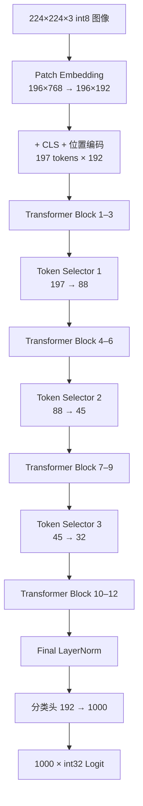

# HeatViT

**Hardware-Efficient Adaptive Token Pruning for Vision Transformers —— FPGA 定点推理引擎**


> ✅ **状态**：Vivado XSim 端到端**逐位仿真通过**——18 个检查点与 1000 个 Logit 与纯整数 Python 黄金模型逐字节一致（零容差）；真实 DeiT-T 权重下纯 PTQ 量化精度 **76.34% Top-1**（5k val）。结论边界：不含时序、功耗与上板验证。

## 简介

HeatViT 在 Vision Transformer 推理过程中动态剪除不重要的 Token。本项目以**纯可综合 SystemVerilog** 在 `xc7k325tfbg900-3` 上实现了 HeatViT-T（DeiT-T）的完整单图推理数据通路：

- `224×224×3` signed int8 输入 → Patch 嵌入（196 patch，16×16）→ CLS + 位置编码（197 tokens × 192 维）
- 12 个 DeiT-T Transformer Block（Pre-LN，3 head × 64 维，FFN 隐藏维 768）
- 3 个动态 Token Selector（位于 Block 4/7/10 之前）：**197 → 88 → 45 → 32**
- Final LayerNorm → 分类头（192 → 1000）→ 1000 个 signed int32 Logit + 尺度指数

## 核心特性

- **描述符驱动、单执行器**：整个网络 = 198 条 320-bit 描述符 + 统一 Tensor Executor；控制流复杂度全部前移到编译期（Python 生成器），硬件只剩调度与校验
- **全定点数值**：8-bit 权重/激活、Q8.16 非线性中间值、Q0.16 概率、6-bit signed scale 指数；无浮点运算、无手工生成 Vivado IP（DSP48E1 / BRAM 由 RTL 模板推断）
- **动态 Token 剪枝**：确定性 Softmax + 0.5 阈值（含等号）；被剪 Token 压缩为单个 Package Token（keep-score 加权平均，零分母回退算术平均）
- **逐位验证口径**：Python 黄金模型在量化后只用整数运算（NumPy 显式 int 类型），与 RTL 逐字节比对——不是「误差小于阈值」
- **协议安全**：64-bit ready/valid 外存接口、地址守卫预检、错误码 1–7 与警告位 0–2 全覆盖、watchdog 防挂死

## 推理数据流



每个 Transformer Block 采用 Pre-LN：`Y = X + MSA(LN(X))`，`Z = Y + FFN(LN(Y))`。

## 仓库结构

```text
HeatViT/
├─ rtl/                        # 可综合 SystemVerilog（31 模块 + 顶层封装）
│  ├─ include/heatvit_pkg.sv   # 公共类型、320-bit 描述符、定点函数
│  ├─ common/                  # GELU/Softmax/PLAN Sigmoid/LayerNorm/除法/isqrt
│  ├─ memory/                  # 外存主接口、地址守卫、Tile Buffer
│  ├─ compute/                 # MAC Bank、统一 GEMM、Tensor Executor、布局/矢量引擎
│  ├─ selector/                # Token 分类、Head 融合、压缩与 Package
│  ├─ top/                     # 描述符 ROM、调度器、heatvit_top
│  └─ generated/               # 198 条描述符 ROM 初始化（由工具生成）
├─ config/heatvit_t.json       # 固定模型与量化配置
├─ sim/                        # 自检式 Testbench、行为存储、单元向量
│  └─ generated/               # 各 TB 配置（由工具生成）
├─ verification/               # 纯整数 Python 黄金模型 + 112 项单元测试
├─ tools/                      # 描述符 / .mem 向量生成器（固定种子、可复现）
├─ scripts/                    # 预检、XSim 运行、全套回归、Vivado 同步脚本
├─ HeatViT.srcs/ + HeatViT.xpr # Vivado 工程（Top 名 heatvit）
├─ docs/heatvit.md             # 唯一权威记录文档（规格/实施记录/验证指南/结果）
└─ build/                      # 生成产物：向量、报告、日志（不入库）
```

## 快速开始

**前置条件**：Windows PowerShell、Vivado 2023.2（XSim）、Python 3.12–3.14、NumPy 2.5.2。

```powershell
# 1. 环境变量（本机路径，换机复现时按需修改）
$env:HEATVIT_VIVADO_BIN = 'D:\vivado\vivado2023.2\Vivado\2023.2\bin'
$env:HEATVIT_PYTHON = 'D:\HeatViT\HeatViT\.venv\Scripts\python.exe'

# 2. Python 环境
python -m venv .venv
.\.venv\Scripts\python -m pip install -r verification\requirements.txt   # numpy==2.5.2

# 3. 生成描述符与端到端向量（固定种子，同一命令跑两遍产物 SHA-256 一致）
.\.venv\Scripts\python tools\generate_descriptors.py --config config\heatvit_t.json
.\.venv\Scripts\python tools\generate_e2e_vectors.py --seed 20260815 --output build\vectors\e2e

# 4. Python 黄金模型单元测试
powershell -NoProfile -ExecutionPolicy Bypass -File scripts\run_python_tests.ps1 -Pattern 'test_*.py'

# 5. 全套回归（foundation/gemm/transformer/selector + e2e 两轮 + 错误矩阵）
powershell -NoProfile -ExecutionPolicy Bypass -File scripts\run_regression.ps1 -Suite all
```

> 只有显式加 `-RegenerateVectors` 才会重新生成端到端向量，防止失败重跑时误换期望值。
> 全套回归预计时长：端到端两轮各约 35–40 分钟（实测 183.3M / 207.7M 周期），其余套件分钟级到二十余分钟。成功输出 `TEST_PASS <Top>`。

## 验证结果（实测摘要）

| 项目 | 结果 |
| --- | --- |
| 18 个检查点 + 1000 个 Logit | 与整数黄金模型**逐字节一致**（零容差） |
| 端到端 · 无回压 | PASS · 183,286,499 周期 |
| 端到端 · 伪随机回压（STALL_MASK=3） | PASS · 207,707,228 周期 |
| 错误码 1–7 / 警告位 0–2 | 10 个注入案例全部命中一次并通过 |
| Watchdog | 850,000,000 周期（≈4× 实测最坏情况） |
| Vivado IP 审计 | `NO_MANUAL_VIVADO_IP_REQUIRED`（0 个手工 IP） |

机器可读结果见 `build/reports/e2e_summary.json` 与 `build/reports/regression_summary.txt`（生成产物，不入库）。

## P2：真实 DeiT-T 权重与量化精度（2026-08-23）

| 项目 | 结果 |
| --- | --- |
| float 基线（本地 DeiT-T checkpoint，全量 val 50k） | **72.13%** Top-1 |
| int8 PTQ 基线（每张量 2 的幂静态尺度，MSE 校准） | **0.82%** Top-1（5k val） |
| **I-ViT ShiftGELU 融合后（纯 PTQ）** | **76.34%** Top-1（5k val，float 同子集 80.22%，差距 −3.9pp） |
| 真实权重端到端 XSim | 18 检查点 + 1000 Logit **逐位一致（TEST_PASS）** |
| Selector 训练 | 机制与导出验证完成 |

I-ViT 融合消融（`tools/p2/p2_ivit.py`；ImageNet val 前 3k/5k 张，float 同子集 80.37% / 80.22%）：

| 配置 | 3k Top-1 | 5k Top-1 |
| --- | ---: | ---: |
| 契约基线 | 1.37% | — |
| + ShiftGELU（斜率 1/2） | 73.73% | 74.04% |
| + ShiftGELU（斜率 11/16 ≈ ln2 细化） | 76.40% | 76.06% |
| **ShiftGELU-ln2 + Shiftmax + I-LayerNorm** | **76.20%** | **76.34%** |
| + 每通道权重 | 73.83% | 74.18% |
| 仅 Shiftmax / 仅放宽 LN 输入尺度 | 1.1–1.3% / 1.37% | 中性 / 零效应 |

**关键结论**：精度提升几乎全部来自 **ShiftGELU**——原契约 GELU 的 `δ1=0.5` 正则化近似对冻结的官方 DeiT-T 权重构成系统性 ~25% 增益失真（`GELU_aprx(x→∞)=0.75x`），该失真在合成权重逐位自洽验证下不可见；论文的 71.9% 是在训练中带着近似学到的。Shiftmax 与 I-LayerNorm 精度中性。RTL 已同步：`heatvit_gelu` 重写为 shift-exp 核（ln2 斜率）+ **40 级除法流水线（吞吐 1 lane/拍，时延 41 拍）**，e2e 周期 225.3M/249.7M → **183.3M/207.7M**（旧契约基线 +4.4%）。详见 `docs/heatvit.md` 第二部分 §13.6–§13.9。

## 范围与非目标

当前范围：XSim 仿真逐位验证 + 真实权重的 PTQ 精度评估。明确排除：

- ❌ 训练、微调、蒸馏或量化感知训练（QAT）
- ❌ 时序收敛、功耗、FPS 与上板验证；板级 DDR/MIG/PCIe/AXI 集成与主机软件
- ❌ HeatViT-S / HeatViT-B / LV-ViT 变体
- ❌ JPEG/PNG 解码、图像缩放与浮点预处理

## 文档

- 📖 [`docs/heatvit.md`](docs/heatvit.md) —— 项目**唯一权威记录文档**：设计规格（定点数值契约、描述符调度、Token/Package 状态契约）、实施记录、仿真与验证指南、内存与权重格式、端到端结果、RTL 代码设计逐模块说明
- 📄 论文 PDF：仓库根目录 `HeatViT：Hardware-Efficient Adaptive Token Pruning for Vision Transformers.pdf`
- 🔗 论文 arXiv：[2211.08110](https://arxiv.org/abs/2211.08110)

## 许可证

暂未指定。引用论文、PLAN Sigmoid 分段近似（[MDPI Sensors 20(11):3168](https://www.mdpi.com/1424-8220/20/11/3168)）等外部依据的版权归原作者所有。
