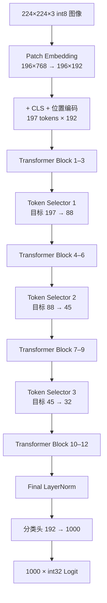

# HeatViT

**Hardware-Efficient Adaptive Token Pruning for Vision Transformers —— FPGA 定点推理引擎**


> **当前状态（2026-08-31）**
>
> - ✅ **仿真闭环**：XSim 端到端逐位通过——18 个检查点与 1000 个 Logit 与纯整数 Python 黄金模型零容差一致；QAT 权重 6 轮回归全部 PASS
> - ✅ **全量精度复核**：已部署 P4-2A λ=5 权重在 ImageNet val 50k 位精确评估为：未剪枝 **67.48%**，剪枝 **60.53%@102.2/50.6/42.4**（剪枝代价 −6.95pp）；前 5k 的 76.02% / 72.70%@93/44/37 仅保留为训练探索口径
> - ✅ **可综合性**：Vivado 综合通过（0 黑盒、0 锁存器），LUT 从 902,658（442.9%）降至 **126,459（62.05%）**
> - ✅ **P7-1 bbuf→BRAM（2026-08-28）**：vector/layout 两引擎寄存器数组 → 11 个字节写使能 SDP RAM + 流入式解包；**全量综合 LUT 918,145 → 238,271（450.5% → 116.9%）**；全量逐位回归全绿
> - ✅ **P7-2 同类数组推广（2026-08-28）**：selector 侧七模块（head_fuse/reduce_mean/selector_softmax/finalize/packager/compactor/feature_concat）寄存器数组 → SDP RAM/串行化，OOC 124,626 → 15,408 LUT（−87.6%）；**全量综合 LUT 126,459 = 62.05%，首次跨过 100% 可布线性门槛**；全量逐位回归（e2e 两轮 + 错误矩阵）全绿
> - ✅ **P7-4 实现与 50 MHz 时序收敛（2026-08-29）**：LN/softmax 流水化 + GEMM 写回关键路径寄存器化后 place+route 0 未布线；100 MHz 实测不收敛（place 后 WNS −7.2 ns）按计划回退，**50 MHz signoff WNS +0.323 / TNS 0 / WHS +0.073**（setup+hold 双达标）；路由后 LUT 118,453（58.12%）、DSP 65、BRAM 37
> - ✅ **P7-5 GEMM 引擎与全片 100 MHz 时序收敛（2026-08-30）**：重定标函数四位宽证明收窄（34/40/64/55 位锥，tb_requant_diag 33.5M 样本 0 误差）+ 守卫四相流水 + S_CHECK 决策寄存（GEMM OOC 门 WNS −4.185 → **+0.659 ns**）；全片五轮清零违例家族（residual 两级窄化、LN 仿射/方差多级拆、executor 三相决策、srow 一热写使能、score_q16 收窄），**100 MHz signoff WNS +0.234 / TNS 0 / WHS +0.018**（`All user specified timing constraints are met.`）；路由后 **LUT 85,959（42.18%）**、FF 48,617、DSP 65、BRAM 35
> - ⏳ **下一步**：全量 QAT 长训练并重新做 50k 位精确评估；板级引脚约束与上板验证；P7③ MAC DSP 化仅在板级资源/时序需要时启用

## 简介

HeatViT 在 Vision Transformer 推理过程中动态剪除不重要的 Token。本项目以**纯可综合 SystemVerilog** 在 `xc7k325tfbg900-3` 上实现了 HeatViT-T（DeiT-T）的完整单图推理数据通路：

- `224×224×3` signed int8 输入 → Patch 嵌入（196 patch，16×16）→ CLS + 位置编码（197 tokens × 192 维）
- 12 个 DeiT-T Transformer Block（Pre-LN，3 head × 64 维，FFN 隐藏维 768）
- 3 个动态 Token Selector（位于 Block 4/7/10 之前），目标 Token 预算：
  **197 → 88 → 45 → 32**（当前部署权重 50k 实测均值为 102.2/50.6/42.4）
- Final LayerNorm → 分类头（192 → 1000）→ 1000 个 signed int32 Logit + 尺度指数

## 推理数据流



每个 Transformer Block 采用 Pre-LN：`Y = X + MSA(LN(X))`，`Z = Y + FFN(LN(Y))`。

## 核心特性

- **描述符驱动、单执行器**：整个网络 = 198 条 320-bit 描述符 + 统一 Tensor Executor；控制流复杂度全部前移到编译期（Python 生成器），硬件只剩调度与校验
- **全定点数值**：8-bit 权重/激活、Q8.16 非线性中间值、Q0.16 概率、6-bit signed scale 指数；无浮点运算、无手工生成 Vivado IP（DSP48E1 / BRAM 由 RTL 模板推断）
- **动态 Token 剪枝**：确定性 Softmax + 0.5 阈值（含等号）；被剪 Token 压缩为单个 Package Token（keep-score 加权平均，零分母回退算术平均）
- **逐位验证口径**：Python 黄金模型在量化后只用整数运算（NumPy 显式 int 类型），与 RTL 逐字节比对——不是「误差小于阈值」
- **协议安全**：64-bit ready/valid 外存接口、地址守卫预检、错误码 1–7 与警告位 0–2 全覆盖、watchdog 防挂死

## 项目进度

| 阶段 | 内容 | 状态 | 关键结果 |
| --- | --- | :-: | --- |
| P1 | RTL 实现（31 模块）：定点基础 → 存储/统一 GEMM → Transformer 数据通路 → Token Selector → 调度与端到端集成 | ✅ | XSim 端到端逐位通过 |
| P2 | 真实 DeiT-T 权重 PTQ + Selector 监督训练（I-ViT 融合） | ✅ | PTQ **76.34%@5k** |
| P3 | 量化感知训练（QAT：部署契约 + fake-quant） | ✅ | 未剪枝 **77.86%@5k**（+1.80pp） |
| P4 | 剪枝微调（STE 阈值/Package + 保持率正则） | ✅ | 剪枝 **72.70%@5k**，Token 93/44/37（探索口径） |
| P5 | QAT 权重导出回 RTL + XSim 逐位回归 | ✅ | 6 轮全部 TEST_PASS |
| P5-1 | 已部署 P4-2A 权重全量 50k 位精确复核 | ✅ | 未剪枝 **67.48%**；剪枝 **60.53%@102.2/50.6/42.4** |
| P6 | Vivado 综合与资源统计（100 MHz） | ✅ | 可综合性通过；LUT 4.4× 超标 |
| P7 | 资源优化（P7-1/P7-2）→ 50 MHz（P7-4）→ **100 MHz 收敛（P7-5）** | ✅ | LUT 62.05% → **42.18%**；WNS +0.234 ns@100 MHz |

## 验证结果（实测摘要）

| 项目 | 结果 |
| --- | --- |
| 18 个检查点 + 1000 个 Logit | 与整数黄金模型**逐字节一致**（零容差） |
| 端到端 · 无回压（P7-5 RTL） | PASS · 213,760,350 周期 |
| 端到端 · 伪随机回压 STALL_MASK=3（P7-5 RTL） | PASS · 237,834,977 周期 |
| QAT 权重端到端（P5）· 6 轮 | img0..2 × 无回压/回压全部 **TEST_PASS**（代表周期 230.8M / 226.4M） |
| 错误码 1–7 / 警告位 0–2 | 10 个注入案例全部命中一次并通过 |
| Watchdog | 850,000,000 周期（≈3.6× 实测最坏情况） |
| Vivado IP 审计 | `NO_MANUAL_VIVADO_IP_REQUIRED`（0 个手工 IP） |

机器可读结果见 `build/reports/e2e_summary.json` 与 `build/reports/regression_summary.txt`（生成产物，不入库）。

## 精度结果（位精确；5k 探索 + 50k 终局复核）

| 版本 | 口径 | 剪枝 | Top-1 | Token 计数（目标 88/45/32） |
| --- | --- | :-: | ---: | --- |
| 本地 DeiT-T 浮点基线 | 全量 50k / 前 5k | ✗ | 72.13% / 80.22% | 197/197/197 |
| 部署契约 PTQ（I-ViT ShiftGELU 融合） | 前 5k | ✗ | 76.34% | — |
| 部署契约 PTQ | 前 5k | ✗ | 76.06% | — |
| **QAT（128k×10）** | 前 5k | ✗ | **77.86%** | — |
| PTQ 主干 + 冻结选择器 | 前 5k | ✓ | 59.12% | 80.0/42.0/34.1 |
| QAT 主干 + 冻结选择器 | 前 5k | ✓ | 68.20% | 87.4/44.0/35.9 |
| P4-1 微调（λ=0） | 前 5k | ✓ | 74.00% | 99.1/57.6/46.6 |
| P4-2A λ=5（已导出回 RTL） | 前 5k | ✗ / ✓ | 76.02% / **72.70%** | **93.0/44.3/37.1**（剪枝） |
| P4-2B 选择器重训 | 前 5k | ✓ | 67.76% | 95.5/43.8/31.7 |
| **P4-2A λ=5（已部署）** | **全量 50k** | ✗ | **67.48%** | 197/197/197 |
| **P4-2A λ=5（已部署）** | **全量 50k** | ✓ | **60.53%** | **102.2/50.6/42.4** |

- **量化主线**：PTQ 76.06% → QAT 77.86%（+1.80pp），距浮点基线（同 5k 子集 80.22%）−2.36pp；尺度表全程冻结 PTQ 校准表。I-ViT 融合使纯 PTQ 从 0.82% 提升至 76.34%，增益几乎全部来自 ShiftGELU。
- **剪枝主线**：前 5k 上 P4-2A 的剪枝代价为 −3.32pp（76.02% → 72.70%）；全量 50k 实测为 **−6.95pp**（67.48% → 60.53%）。全量 Token 均值 102.2/50.6/42.4，分别高于目标 14.2/5.6/10.4，说明前 5k 同时高估精度并低估保留率。
- 论文 HeatViT-T 为浮点 **71.9%**（全量 val，端到端训练）；当前已部署全量剪枝结果低 11.37pp。下一轮精度工作应以全量 QAT 长训练为主，并始终用 50k 位精确评估验收（docs §14.15）。

## 资源占用（xc7k325tfbg900-3）

| 资源 | P6 | P7-1 | P7-2 | P7-4（路由后） | **P7-5（路由后）** | 可用 | P7-5 占用率 |
| --- | ---: | ---: | ---: | ---: | ---: | ---: | ---: |
| Slice LUTs | 918,145 | 238,271 | 126,459 | 118,453 | **85,959** | 203,800 | **42.18%** ✅ |
| Slice Registers | 229,155 | 125,273 | 47,550 | 46,834 | 48,617 | 407,600 | 11.93% |
| Block RAM Tile | 12 | 26 | 37 | 37 | 35 | 445 | 7.9% |
| DSP48E1 | 112 | 88 | 81 | 65 | 65 | 840 | 7.7% |
| F7 / F8 Muxes | 140,822 / 64,434 | 22,973 / 7,860 | 8,360 / 2,032 | 8,155 / 2,575 | 8,443 / 2,807 | — | — |

> P6–P7-2 为综合级数字；P7-4/P7-5 为 place+route 后数字（DSP 65 系 P7-4
> LN/softmax 流水化后综合减少；P7-5 的窄化重写再省 ~27% LUT）。

**演进**：P6 首综合 LUT 超容量 4.4 倍（超标集中在动态字节寻址寄存器数组被
综合成的 mux 网络）→ **P7-1**（vector/layout 两引擎 bbuf → 11 个字节写使能
SDP RAM + 流入式解包，397K/311K → 20K/4K）→ **P7-2**（selector 侧七模块
同类推广，OOC 124,626 → 15,408 LUT）→ **P7-4**（实现与 50 MHz 时序收敛：
LN/softmax 流水化 + GEMM 写回 staging RAM 写端口寄存器化后 place+route
0 未布线；100 MHz 实测 place 后 WNS −7.2 ns、route 拥塞，按计划回退，
50 MHz signoff **WNS +0.323 ns / TNS 0 / WHS +0.073 ns**，setup+hold
双达标）→ **P7-5**（100 MHz 收敛：GEMM 引擎重定标四位宽证明收窄 + 守卫
四相流水 + S_CHECK 决策寄存，OOC 门 WNS −4.185 → +0.659 ns；全片五轮清零
residual/LN/executor/score_q16/srow 等违例家族，**100 MHz signoff
WNS +0.234 ns / TNS 0 / WHS +0.018 ns**，`All user specified timing
constraints are met.`）。全程位精确口径不变：每步改动后全量逐位回归
（含 e2e 两轮 + 错误矩阵）全绿；全量多核综合（-Jobs 24）0 黑盒、0 锁存器。
P7③ MAC DSP 化仍为可选裕量优化（docs §15）。

## 仓库结构

```text
HeatViT/
├─ rtl/                        # 可综合 SystemVerilog（31 模块 + 顶层封装）
│  ├─ include/heatvit_pkg.sv   # 公共类型、320-bit 描述符、定点函数
│  ├─ common/                  # GELU/Softmax/PLAN Sigmoid/LayerNorm/除法/isqrt
│  ├─ memory/                  # 外存主接口、地址守卫、Tile Buffer
│  ├─ compute/                 # MAC Bank、统一 GEMM、Tensor Executor、布局/矢量引擎
│  ├─ selector/                # Token 分类、Head 融合、压缩与 Package
│  ├─ top/                     # 描述符 ROM、调度器、heatvit_top
│  └─ generated/               # 198 条描述符 ROM 初始化（由工具生成）
├─ config/heatvit_t.json       # 固定模型与量化配置
├─ xdc/heatvit.xdc             # 时序/IO 约束（100 MHz；非时钟 IO false path，见注释）
├─ sim/                        # 自检式 Testbench、行为存储、单元向量
├─ verification/               # 纯整数 Python 黄金模型 + 单元测试（含 QAT 测试）
├─ tools/                      # 描述符/向量生成器 + PTQ 量化与 QAT 工具链（固定种子、可复现）
├─ scripts/                    # 预检、XSim 运行、全套回归、Vivado 综合脚本
├─ HeatViT.srcs/ + HeatViT.xpr # Vivado 工程（Top 名 heatvit）
├─ docs/heatvit.md             # 唯一权威记录文档（规格/实施记录/验证指南/结果）
└─ build/                      # 生成产物：向量、报告、日志（不入库）
```

## 快速开始

**前置条件**：Windows PowerShell、Vivado 2023.2（XSim）、Python 3.12–3.14、NumPy 2.5.2。

```powershell
# 1. 环境变量（本机路径，换机复现时按需修改）
$env:HEATVIT_VIVADO_BIN = 'D:\vivado\vivado2023.2\Vivado\2023.2\bin'
$env:HEATVIT_PYTHON = 'D:\HeatViT\HeatViT\.venv\Scripts\python.exe'

# 2. Python 环境
python -m venv .venv
.\.venv\Scripts\python -m pip install -r verification\requirements.txt   # numpy==2.5.2

# 3. 生成描述符与端到端向量（固定种子，同一命令跑两遍产物 SHA-256 一致）
.\.venv\Scripts\python tools\generate_descriptors.py --config config\heatvit_t.json
.\.venv\Scripts\python tools\generate_e2e_vectors.py --seed 20260815 --output build\vectors\e2e

# 4. Python 黄金模型单元测试
powershell -NoProfile -ExecutionPolicy Bypass -File scripts\run_python_tests.ps1 -Pattern 'test_*.py'

# 5. 全套回归（foundation/gemm/transformer/selector + e2e 两轮 + 错误矩阵）
powershell -NoProfile -ExecutionPolicy Bypass -File scripts\run_regression.ps1 -Suite all

# 6. Vivado 综合与实现（100 MHz 时序收敛：WNS +0.234 ns；路由后 LUT 42.18%）
powershell -NoProfile -ExecutionPolicy Bypass -File scripts\run_vivado_synth.ps1 -Jobs 24
powershell -NoProfile -ExecutionPolicy Bypass -File scripts\run_vivado_impl.ps1 -Jobs 24
.\.venv\Scripts\python tools\p6\p6_summary.py
```

> 只有显式加 `-RegenerateVectors` 才会重新生成端到端向量，防止失败重跑时误换期望值。全套回归预计时长：端到端两轮各约 35–40 分钟，其余套件分钟级到二十余分钟；成功输出 `TEST_PASS <Top>`。QAT 训练/评估/导出命令见 docs 第二部分 §14 与第三部分 §9。

## 范围与非目标

- ✅ **已覆盖**：XSim 逐位仿真验证；真实权重 PTQ / QAT / 剪枝精度评估；P4-2A 已部署权重全量 50k 位精确复核（未剪枝 67.48%，剪枝 60.53%）；QAT 权重导出与硬件逐位回归（P5）；Vivado 综合与资源统计（P6）；P7-1 / P7-2 资源优化（bbuf→SDP RAM 全量推广，LUT 450.5% → 62.05%）；P7-4 实现与 50 MHz 时序收敛（place+route 0 未布线，WNS +0.323 ns）；P7-5 GEMM 引擎与全片 100 MHz 时序收敛（WNS +0.234 / TNS 0 / WHS +0.018，LUT 42.18%）
- ⏳ **待办**：全量 QAT 长训练与 50k 复评；板级引脚约束与上板验证（板级 DDR/MIG/PCIe/AXI 集成与主机软件）；P7③ MAC DSP 化为按需裕量优化
- ❌ **排除**：功耗、FPS 与上板验证；板级 DDR/MIG/PCIe/AXI 集成与主机软件；HeatViT-S / HeatViT-B / LV-ViT 变体；JPEG/PNG 解码、图像缩放与浮点预处理

## 文档

- 📖 [`docs/heatvit.md`](docs/heatvit.md) —— 项目**唯一权威记录文档**：设计规格、实施记录、仿真与验证指南、内存与权重格式、RTL 逐模块设计说明；PTQ / QAT / P5 导出与全量 50k 精度复核见第二部分 §13–§14（P5 见 §14.14，50k 见 §14.15），P6 综合与资源统计、P7-1 / P7-2 资源优化、P7-4 实现与 50 MHz 时序收敛、P7-5 100 MHz 收敛见 §15
- 📄 论文 PDF：仓库根目录 `HeatViT：Hardware-Efficient Adaptive Token Pruning for Vision Transformers.pdf`
- 🔗 论文 arXiv：[2211.08110](https://arxiv.org/abs/2211.08110)

## 许可证

[MIT](LICENSE) © 2026 YOUXINYANG。引用论文、PLAN Sigmoid 分段近似（[MDPI Sensors 20(11):3168](https://www.mdpi.com/1424-8220/20/11/3168)）等外部依据的版权归原作者所有。
