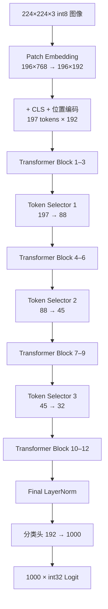

# HeatViT

**Hardware-Efficient Adaptive Token Pruning for Vision Transformers —— FPGA 定点推理引擎**


> ✅ **状态**：Vivado XSim 端到端**逐位仿真通过**——18 个检查点与 1000 个 Logit 与纯整数 Python 黄金模型逐字节一致（零容差）；真实 DeiT-T 权重下纯 PTQ 量化精度 **76.34% Top-1**（5k val）。结论边界：不含时序、功耗与上板验证。
>
> 🚧 **P3 QAT + P4 剪枝微调**：可微 fake-quant 训练路径 + 位精确验证管线（20 项测试全绿）。未剪枝 **76.06% → 77.86%（+1.80pp，5k val）**，距浮点基线 −2.36pp；剪枝 59.12%（PTQ）→ 68.20%（QAT 主干）→ **72.70%@93/44/37（P4-2A λ=5，计数近目标，当前诚实最优）**；D3 裁定冻结表全程；选择器重训（B）排序增益未兑现。阶段小结与精度总览见 [`docs/heatvit.md`](docs/heatvit.md) 第二部分 §14.13。
>
> 🎉 **P5 导出与逐位回归（2026-08-27）**：P4-2A λ=5 权重已导出回 RTL 并通过 XSim 端到端逐位回归（img0..2 × 无回压/回压共 6 轮）。期间定位并修复 `heatvit_layernorm` 连续赋值陈旧尺度敏感度缺陷（QAT 数据流暴露的潜伏 bug，见 docs §14.14）；同缺陷类别的 `heatvit_gemm_engine` 一并加固。训练侧精度收益已在硬件上闭环。

## 简介

HeatViT 在 Vision Transformer 推理过程中动态剪除不重要的 Token。本项目以**纯可综合 SystemVerilog** 在 `xc7k325tfbg900-3` 上实现了 HeatViT-T（DeiT-T）的完整单图推理数据通路：

- `224×224×3` signed int8 输入 → Patch 嵌入（196 patch，16×16）→ CLS + 位置编码（197 tokens × 192 维）
- 12 个 DeiT-T Transformer Block（Pre-LN，3 head × 64 维，FFN 隐藏维 768）
- 3 个动态 Token Selector（位于 Block 4/7/10 之前）：**197 → 88 → 45 → 32**
- Final LayerNorm → 分类头（192 → 1000）→ 1000 个 signed int32 Logit + 尺度指数

## 核心特性

- **描述符驱动、单执行器**：整个网络 = 198 条 320-bit 描述符 + 统一 Tensor Executor；控制流复杂度全部前移到编译期（Python 生成器），硬件只剩调度与校验
- **全定点数值**：8-bit 权重/激活、Q8.16 非线性中间值、Q0.16 概率、6-bit signed scale 指数；无浮点运算、无手工生成 Vivado IP（DSP48E1 / BRAM 由 RTL 模板推断）
- **动态 Token 剪枝**：确定性 Softmax + 0.5 阈值（含等号）；被剪 Token 压缩为单个 Package Token（keep-score 加权平均，零分母回退算术平均）
- **逐位验证口径**：Python 黄金模型在量化后只用整数运算（NumPy 显式 int 类型），与 RTL 逐字节比对——不是「误差小于阈值」
- **协议安全**：64-bit ready/valid 外存接口、地址守卫预检、错误码 1–7 与警告位 0–2 全覆盖、watchdog 防挂死

## 推理数据流



每个 Transformer Block 采用 Pre-LN：`Y = X + MSA(LN(X))`，`Z = Y + FFN(LN(Y))`。

## 仓库结构

```text
HeatViT/
├─ rtl/                        # 可综合 SystemVerilog（31 模块 + 顶层封装）
│  ├─ include/heatvit_pkg.sv   # 公共类型、320-bit 描述符、定点函数
│  ├─ common/                  # GELU/Softmax/PLAN Sigmoid/LayerNorm/除法/isqrt
│  ├─ memory/                  # 外存主接口、地址守卫、Tile Buffer
│  ├─ compute/                 # MAC Bank、统一 GEMM、Tensor Executor、布局/矢量引擎
│  ├─ selector/                # Token 分类、Head 融合、压缩与 Package
│  ├─ top/                     # 描述符 ROM、调度器、heatvit_top
│  └─ generated/               # 198 条描述符 ROM 初始化（由工具生成）
├─ config/heatvit_t.json       # 固定模型与量化配置
├─ sim/                        # 自检式 Testbench、行为存储、单元向量
│  └─ generated/               # 各 TB 配置（由工具生成）
├─ verification/               # 纯整数 Python 黄金模型 + 单元测试（含 P3 QAT 测试）
├─ tools/                      # 描述符 / .mem 向量生成器 + P2 量化与 P3 QAT 工具链（固定种子、可复现）
├─ scripts/                    # 预检、XSim 运行、全套回归、Vivado 同步脚本
├─ HeatViT.srcs/ + HeatViT.xpr # Vivado 工程（Top 名 heatvit）
├─ docs/heatvit.md             # 唯一权威记录文档（规格/实施记录/验证指南/结果）
└─ build/                      # 生成产物：向量、报告、日志（不入库）
```

## 快速开始

**前置条件**：Windows PowerShell、Vivado 2023.2（XSim）、Python 3.12–3.14、NumPy 2.5.2。

```powershell
# 1. 环境变量（本机路径，换机复现时按需修改）
$env:HEATVIT_VIVADO_BIN = 'D:\vivado\vivado2023.2\Vivado\2023.2\bin'
$env:HEATVIT_PYTHON = 'D:\HeatViT\HeatViT\.venv\Scripts\python.exe'

# 2. Python 环境
python -m venv .venv
.\.venv\Scripts\python -m pip install -r verification\requirements.txt   # numpy==2.5.2

# 3. 生成描述符与端到端向量（固定种子，同一命令跑两遍产物 SHA-256 一致）
.\.venv\Scripts\python tools\generate_descriptors.py --config config\heatvit_t.json
.\.venv\Scripts\python tools\generate_e2e_vectors.py --seed 20260815 --output build\vectors\e2e

# 4. Python 黄金模型单元测试
powershell -NoProfile -ExecutionPolicy Bypass -File scripts\run_python_tests.ps1 -Pattern 'test_*.py'

# 5. 全套回归（foundation/gemm/transformer/selector + e2e 两轮 + 错误矩阵）
powershell -NoProfile -ExecutionPolicy Bypass -File scripts\run_regression.ps1 -Suite all
```

> 只有显式加 `-RegenerateVectors` 才会重新生成端到端向量，防止失败重跑时误换期望值。
> 全套回归预计时长：端到端两轮各约 35–40 分钟（实测 183.3M / 207.7M 周期），其余套件分钟级到二十余分钟。成功输出 `TEST_PASS <Top>`。

## 验证结果（实测摘要）

| 项目 | 结果 |
| --- | --- |
| 18 个检查点 + 1000 个 Logit | 与整数黄金模型**逐字节一致**（零容差） |
| 端到端 · 无回压 | PASS · 183,286,499 周期 |
| 端到端 · 伪随机回压（STALL_MASK=3） | PASS · 207,707,228 周期 |
| 错误码 1–7 / 警告位 0–2 | 10 个注入案例全部命中一次并通过 |
| Watchdog | 850,000,000 周期（≈4× 实测最坏情况） |
| Vivado IP 审计 | `NO_MANUAL_VIVADO_IP_REQUIRED`（0 个手工 IP） |

机器可读结果见 `build/reports/e2e_summary.json` 与 `build/reports/regression_summary.txt`（生成产物，不入库）。

## P2：真实 DeiT-T 权重与量化精度（2026-08-23）

| 项目 | 结果 |
| --- | --- |
| float 基线（本地 DeiT-T checkpoint，全量 val 50k） | **72.13%** Top-1 |
| int8 PTQ 基线（每张量 2 的幂静态尺度，MSE 校准） | **0.82%** Top-1（5k val） |
| **I-ViT ShiftGELU 融合后（纯 PTQ）** | **76.34%** Top-1（5k val，float 同子集 80.22%，差距 −3.9pp） |
| 真实权重端到端 XSim | 18 检查点 + 1000 Logit **逐位一致（TEST_PASS）** |
| Selector 训练 | 机制与导出验证完成 |

I-ViT 融合消融（`tools/p2/p2_ivit.py`；ImageNet val 前 3k/5k 张，float 同子集 80.37% / 80.22%）：

| 配置 | 3k Top-1 | 5k Top-1 |
| --- | ---: | ---: |
| 契约基线 | 1.37% | — |
| + ShiftGELU（斜率 1/2） | 73.73% | 74.04% |
| + ShiftGELU（斜率 11/16 ≈ ln2 细化） | 76.40% | 76.06% |
| **ShiftGELU-ln2 + Shiftmax + I-LayerNorm** | **76.20%** | **76.34%** |
| + 每通道权重 | 73.83% | 74.18% |
| 仅 Shiftmax / 仅放宽 LN 输入尺度 | 1.1–1.3% / 1.37% | 中性 / 零效应 |

**关键结论**：精度提升几乎全部来自 **ShiftGELU**——原契约 GELU 的 `δ1=0.5` 正则化近似对冻结的官方 DeiT-T 权重构成系统性 ~25% 增益失真（`GELU_aprx(x→∞)=0.75x`），该失真在合成权重逐位自洽验证下不可见；论文的 71.9% 是在训练中带着近似学到的。Shiftmax 与 I-LayerNorm 精度中性。RTL 已同步：`heatvit_gelu` 重写为 shift-exp 核（ln2 斜率）+ **40 级除法流水线（吞吐 1 lane/拍，时延 41 拍）**，e2e 周期 225.3M/249.7M → **183.3M/207.7M**（旧契约基线 +4.4%）。详见 `docs/heatvit.md` 第二部分 §13.6–§13.9。

## P3：量化感知训练（QAT，2026-08-24 起）

目标：在**部署契约**（legacy 尺度表 + contract softmax/LN + ShiftGELU-ln2，PTQ **76.06%** @5k）下把精度向浮点基线 **80.22%**（同子集）收敛，差距 −4.2pp。训练产出仍是 HeatViT 布局 float 权重，评估与导出全部复用 P2 位精确管线，验收口径不变。

- **双路径架构**：训练路径 = 浮点解析非线性 + RTL 契约边界 fake-quant（STE）；验证路径 = 同一批 float 权重经 `p2_sim_ivit` 位精确整数模拟器评估，最终 `p2_export_weights` → XSim 逐位回归。
- **已确认决策**：两段式剪枝（P1–P3 关、P4 开微调）；权重尺度冻结 PTQ 校准表 + 训练后激活重校准；子集 128k 打通 → 全量 1.28M × 30–90 epochs；CE 起步，KD/LSQ 作 P4 消融；Selector 冻结起步、P4 重训。
- **交付（P0/P1）**：`tools/p2/qat_fakeq.py`（STE fake-quant 原语 + RTL ShiftGELU 忠实浮点镜像）、`tools/p2/qat_model.py`（`QatDeiT` 可微前向 + `exact_forward` 位精确钩子）、`tools/p2/qat_data.py`（train loader + heatvit→timm 逆映射）、`tools/p2/p2_qat.py`（train/eval/recalib）、`verification/tests/test_qat.py`（**16 项测试全绿**：GELU 镜像 2e-5 级偏差、位精确管线逐位一致、结构/梯度/真实 checkpoint 烟雾）。
- **冒烟（P1）**：4096 图 / 32 步 / batch 128 / fp32 / workers=4——loss 2.46→2.28，位精确 eval 82.81%@128（管线验收口径，非精度结论），checkpoint 保存正常。
- **快速验证（Q1，2026-08-24）**：32k 子集 × 5 epochs / batch 128 / fp32 / lr 5e-5 cosine，**~40 分钟**（1.5–2.0 s/step，梯度检查点后 batch 128 峰值 1.94 GiB，8 GiB 显存余量充足）。位精确 5k val：**76.06% → 77.44%（+1.38pp）**，与浮点基线 80.22% 的差距 −4.16pp → −2.78pp；前 1000 val 84.70% → 85.30%。训练后激活重校准复评 76.76%，低于冻结 PTQ 表（短时 QAT 权重已适配原尺度）。基线锚点 `p2_out/qat/init.pt` 由 `tools/p2/qat_make_init.py` 生成（5k 复现 76.06%，口径闭环）。产物：`p2_out/qat/quick32k/{checkpoint,best}.pt`、`scale_table_after.json`、`*.log`。
- **第二档分段训练（Q2，2026-08-25）**：`--init-checkpoint p2_out/qat/quick32k/best.pt`（新增：只继承权重、全新 AdamW + cosine，与 `--resume` 崩溃恢复语义区分）→ 128k 子集 × 10 epochs，~4.5 小时（1.36–1.62 s/step）。位精确 5k val：**77.44% → 77.86%（累计 76.06% → +1.80pp）**，差距 −2.78pp → **−2.36pp**；前 1000 val 85.30% → 86.10%（e10 余弦末端低 lr 巩固最优）。重校准 32 尺度变化后 73.16%（−4.70pp）——训练越深、换尺度惩罚越大，D3 已裁定弃用（见 Q4）。产物：`p2_out/qat/short128k/{checkpoint,best}.pt`、`scale_table_after.json`、`*.log`。
- **D3 裁定（Q4，2026-08-25）**：新增 `tools/p2/qat_recalib_probe.py`（子集尺度表消融 + 位精确 5k 评估）。消融定位毒性：LN 输入（残差流）尺度变化 −3.60pp、±2 大跳 −2.76pp，**非 LN 张量变化反而 +0.34pp**；「完整重校准 + 32k×2 短微调」救回至 75.88%，仍低于冻结表对照 77.20%。**裁定：弃用训练后完整重校准，全量训练全程冻结 PTQ 尺度表**；可选终局仅换非 LN 尺度（eval 验证 ≥ +0.1pp 才用，不追加微调）。附带调度教训：终局小集 + 全新高 lr 周期补训 −0.66pp，全量训练应用单一低 lr 长程调度（详见 docs §14.9）。产物：`p2_out/qat/d3_{probe,ft_frozen,ft_recalib,ft_nonln,evals}.log`、`scale_table_nonln.json`。
- **P4 起点：QAT 主干 + 冻结 Selector 剪枝评估（Q3，2026-08-25）**：新增 `tools/p2/qat_prune_eval.py`（与 QAT 评估同契约：`p2_sim_ivit.forward_image_cfg` + 部署契约 `NonlinConfig()`，prune=True），选择器冻结为 P2-C 监督式最终版 `selectors_sup4.pt`（冒烟 init@1k=69.50% 与 §13.10 基线逐位吻合）。5k val 剪枝 Top-1：**59.12%（PTQ）→ 67.98%（Q1）→ 68.20%（Q2）**——QAT 使剪枝代价从 −16.9pp 收窄到 −9.7pp，Q2 下计数 87.4/44.0/35.9 几乎命中目标 88/45/32。结论：量化适应与剪枝容忍同步改善；P4 顺序建议「冻结选择器 STE 微调 → 选择器重训 → 联合微调」（详见 docs §14.8）。产物：`p2_out/qat/prune_*5k.log`。
- **P4-1：冻结 Selector + STE 阈值/Package 剪枝微调（Q5，2026-08-25）**：新增 `tools/p2/qat_selector.py`（`QatSelector` 浮点镜像：去量化冻结 int8 选择器 + 契约点 fake-quant + 忠实二次近似 softmax/PLAN sigmoid 镜像 + 0.5 硬阈值 + Package 加权平均）、`qat_model.py` prune 前向、`p2_qat.py --selectors/--eval-prune`（19 项测试全绿；测试阶段修复 glob 语义、Q0.16 整数界、softmax 镜像三处缺陷）。16k×3 微调（~2.7h，逐图 ~25s/step）：剪枝 5k **68.20% → 74.00%（+5.80pp）**、剪枝代价 −9.66 → −2.14pp；但未剪枝 77.86% → 76.14%（−1.72pp）且保持率上浮至 99.1/57.6/46.6（目标 88/45/32）——纯 CE 下主干学会「让 token 显得可保留」，需保持率正则（详见 docs §14.10）。产物：`p2_out/qat/p4_prune16k/{checkpoint,best}.pt`、`prune_p4_5k.log`。
- **P4-2A：保持率正则（Q6，2026-08-26）**：新增 `--rate-weight/--rate-targets`（STE 软计数 + λ·Σ((count/197−target/197)²)，20 项测试全绿）。λ=0/1/5 三档（均 Q2 干净起步 16k×3）：剪枝 5k **74.00%/73.94%/72.70%**，计数 **99/58/47 → 97/51/42 → 93/44/37**，未剪枝 76.14%/76.30%/76.02%。结论：率正则有效（λ=5 时 stage2/3 基本命中目标），冻结选择器在目标计数附近的精度上限 ≈72.5%；剩余缺口只能靠排序质量 → 方向 B（详见 docs §14.11）。产物：`p2_out/qat/p4a_rate16k/`、`p4a_rate5_16k/`、`prune_p4a*_5k.log`。
- **P4-2B：选择器在 QAT 主干上重训（Q7，2026-08-26）**：数据收集脚本新增 `--backbone-checkpoint`（QAT floats 主干 + `heatvit_to_timm_state` 浮点镜像教师）。QAT 特征 + 镜像教师监督重训（8192 图数据 + 阈值补偿校准环，补偿-计数单调映射：更负→更少，每 0.01 ≈3–7 token）：重训 H（−0.035/0/0.008）5k 剪枝 **67.76%@95.5/43.8/31.7**，与冻结 sup4（68.20%@87.4/44.0/35.9）持平——**本配方下 B ≤ A（72.70%@λ=5），排序增益未兑现**；让主干适应选择器比让选择器适应主干更有效。后续选项：教师 A/B（官方浮点教师标签）、全量 QAT 长训练、主干+选择器联合微调（详见 docs §14.12）。产物：`selectors_qat_{a..h}.pt`、`p2_out/qat_b_sup_data*.pt`、`p2_out/qat/p4b_*.log`。

**P3/P4 精度总览（前 5k val，位精确；标注口径者除外）**：

| 版本 | 剪枝 | Top-1 | 计数（目标 88/45/32） |
| --- | :-: | ---: | --- |
| 论文 HeatViT-T（浮点 · 全量 val） | ✓ | 71.9% | 88/45/32 |
| 本地 DeiT-T 浮点基线（全量 50k / 前 5k） | ✗ | 72.13% / 80.22% | 197/197/197 |
| 部署契约 PTQ | ✗ | 76.06% | — |
| **Q2 QAT（128k×10）** | ✗ | **77.86%** | — |
| PTQ 主干 + 冻结选择器 | ✓ | 59.12% | 80.0/42.0/34.1 |
| Q2 主干 + 冻结选择器 | ✓ | 68.20% | 87.4/44.0/35.9 |
| P4-1 微调（λ=0） | ✓ | 74.00% | 99.1/57.6/46.6 |
| **P4-2A λ=5（当前诚实最优）** | ✓ | **72.70%** | **93.0/44.3/37.1** |
| P4-2B 重训 H | ✓ | 67.76% | 95.5/43.8/31.7 |

## P5：P4-2A 权重导出与 XSim 逐位回归（2026-08-27）

把 P4-2A λ=5（**72.70%@93/44/37**）导出回 RTL 并通过端到端逐位回归，闭合「训练精度收益 → 硬件」回路：

- **导出**：`p2_export_weights.py --checkpoint p2_out/qat/p4a_rate5_16k/best.pt --selectors p2_out/selectors_sup4.pt --write-rom`（QAT checkpoint 的 `floats` 键直接替换官方 DeiT-T 权重；尺度表 = 冻结 PTQ 表 + sup4 的 s{i}_* 条目）。三张 val 图逐图动态计数 197→136/156/142→83/58/45→70/44/29，均落在硬件动态 N 合法域；`p5_crosscheck.py` 黄金模型与部署模拟器逐字节一致。
- **首轮失败与根因**：img0 在 block_12 检查点停住（CLS 行 6 字节 ±1 LSB，final_ln/logits 放大漂移）。逐级对拍定位到 LN2 输出：`heatvit_layernorm` 连续赋值 `assign square_in_w = square_q32_of(in_x)` 中函数把模块寄存器 `x_scale_r` 当自由变量读取，连续赋值只对函数参数 `in_x` 建立敏感度——LN 输入尺度跨调用变化（−3→−2）且首元素值恰好不变时，平方和沿用旧尺度（亏损恰 3×2^27），LN2 输出在舍入边界翻 ±1 并被 FC1/FC2 放大为 6 字节错配。P2-D 逐位通过纯属数据巧合，QAT 权重改变数据流后暴露。修复：尺度改为函数显式参数；`heatvit_gemm_engine.fill_dest` 的同类自由变量缺陷一并加固。
- **验证**：6 轮 e2e（img0..2 × STALL_MASK=0/3）全部 TEST_PASS（代表周期：img0 无回压 230.8M、img2 回压 226.4M）；回归套件新增 `tb_ln_p5_stale`（尺度切换陈旧值复现测试）。详见 docs §14.14。

运行（torch venv）：

```powershell
# P0 单元测试
.\.venv-torch\Scripts\python -m unittest verification.tests.test_qat

# 基线锚点（官方权重原样 -> init.pt）+ 复现 PTQ 基线 76.06%@5k
.\.venv-torch\Scripts\python tools\p2\qat_make_init.py --out p2_out\qat\init.pt
.\.venv-torch\Scripts\python tools\p2\p2_qat.py eval --checkpoint p2_out\qat\init.pt --images 5000

# 快速验证训练（32k x 5, ~40 分钟）+ 5k 位精确评估
.\.venv-torch\Scripts\python tools\p2\p2_qat.py train --max-images 32768 --epochs 5 --batch 128 --lr 5e-5 --min-lr 1e-6 --warmup-epochs 0.2 --workers 4 --out-dir p2_out\qat\quick32k
.\.venv-torch\Scripts\python tools\p2\p2_qat.py eval --checkpoint p2_out\qat\quick32k\best.pt --images 5000

# 训练后重校准（QAT 后冻结表更优：完整重校准已裁定弃用，见 docs §14.9）
.\.venv-torch\Scripts\python tools\p2\p2_qat.py recalib --checkpoint p2_out\qat\quick32k\best.pt --out p2_out\qat\quick32k\scale_table_after.json
```

## 范围与非目标

当前范围：XSim 仿真逐位验证 + 真实权重的 PTQ 精度评估 + **QAT（进行中，P3）**。明确排除：

- ❌ 常规训练、微调、蒸馏
- ❌ 时序收敛、功耗、FPS 与上板验证；板级 DDR/MIG/PCIe/AXI 集成与主机软件
- ❌ HeatViT-S / HeatViT-B / LV-ViT 变体
- ❌ JPEG/PNG 解码、图像缩放与浮点预处理

## 文档

- 📖 [`docs/heatvit.md`](docs/heatvit.md) —— 项目**唯一权威记录文档**：设计规格（定点数值契约、描述符调度、Token/Package 状态契约）、实施记录、仿真与验证指南、内存与权重格式、端到端结果、RTL 代码设计逐模块说明，以及 PTQ 与 QAT 实施记录（第二部分 §13–§14）
- 📄 论文 PDF：仓库根目录 `HeatViT：Hardware-Efficient Adaptive Token Pruning for Vision Transformers.pdf`
- 🔗 论文 arXiv：[2211.08110](https://arxiv.org/abs/2211.08110)

## 许可证

暂未指定。引用论文、PLAN Sigmoid 分段近似（[MDPI Sensors 20(11):3168](https://www.mdpi.com/1424-8220/20/11/3168)）等外部依据的版权归原作者所有。
