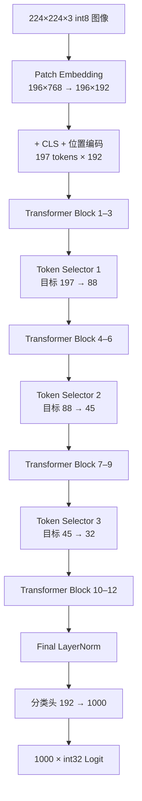

# HeatViT

**Hardware-Efficient Adaptive Token Pruning for Vision Transformers —— FPGA 定点推理引擎**


> **当前状态（2026-08-31）**
>
> - ✅ **仿真闭环**：XSim 端到端逐位通过——18 个检查点与 1000 个 Logit 与纯整数 Python 黄金模型零容差一致；QAT 权重 6 轮回归全部 PASS
> - ✅ **全量精度主线（2026-09-03）**：A-2 全量 QAT 未剪枝 5k **79.68%**（距浮点 −0.54pp）；部署权重 B-2 剪枝 5k **73.52%**（修复后口径）。旧 50k 数字（67.48% / 60.53%）因 hw_w2 缺陷作废，重测进行中
> - ✅ **可综合性**：Vivado 综合通过（0 黑盒、0 锁存器），LUT 从 902,658（442.9%）降至 **126,459（62.05%）**
> - ✅ **P7-1 bbuf→BRAM（2026-08-28）**：vector/layout 两引擎寄存器数组 → 11 个字节写使能 SDP RAM + 流入式解包；**全量综合 LUT 918,145 → 238,271（450.5% → 116.9%）**；全量逐位回归全绿
> - ✅ **P7-2 同类数组推广（2026-08-28）**：selector 侧七模块（head_fuse/reduce_mean/selector_softmax/finalize/packager/compactor/feature_concat）寄存器数组 → SDP RAM/串行化，OOC 124,626 → 15,408 LUT（−87.6%）；**全量综合 LUT 126,459 = 62.05%，首次跨过 100% 可布线性门槛**；全量逐位回归（e2e 两轮 + 错误矩阵）全绿
> - ✅ **P7-4 实现与 50 MHz 时序收敛（2026-08-29）**：LN/softmax 流水化 + GEMM 写回关键路径寄存器化后 place+route 0 未布线；100 MHz 实测不收敛（place 后 WNS −7.2 ns）按计划回退，**50 MHz signoff WNS +0.323 / TNS 0 / WHS +0.073**（setup+hold 双达标）；路由后 LUT 118,453（58.12%）、DSP 65、BRAM 37
> - ✅ **P7-5 GEMM 引擎与全片 100 MHz 时序收敛（2026-08-30）**：重定标函数四位宽证明收窄（34/40/64/55 位锥，tb_requant_diag 33.5M 样本 0 误差）+ 守卫四相流水 + S_CHECK 决策寄存（GEMM OOC 门 WNS −4.185 → **+0.659 ns**）；全片五轮清零违例家族（residual 两级窄化、LN 仿射/方差多级拆、executor 三相决策、srow 一热写使能、score_q16 收窄），**100 MHz signoff WNS +0.234 / TNS 0 / WHS +0.018**（`All user specified timing constraints are met.`）；路由后 **LUT 85,959（42.18%）**、FF 48,617、DSP 65、BRAM 35
> - ✅ **P8-0 性能口径汇总（2026-09-01）**：`tools/p8/perf_summary.py` 一页报告——**0.468 FPS @100 MHz**（2.14 s/图，无回压；回压轮 0.420 FPS）；理论 MAC 未剪枝 **1.26 G** / 本向量（197/100/55/28）**0.60 G**（剪枝省 52.6%）；峰值算力 19.2 GMAC/s
> - ✅ **P8-1 微架构剖析（2026-09-01）**：e2e TB 逐描述符周期监视器 + MAC/带宽统计（RTL 零改动）——GEMM 描述符占 96.8% 周期；**全片 MAC 利用率 1.51%**（GEMM 内部 1.55%）；FFN 占 GEMM 耗时 59%；有效带宽 14.21 MB/s、零 stall；剪枝省 51.6% 周期
> - ✅ **A-2 全量 QAT（2026-09-02）**：lr 2e-5 + tf32 + batch 256 + 5k spot 选优（T3.1），未剪枝 5k **79.68%**（较 Q2 +1.82pp，距浮点同子集 −0.54pp）
> - ✅ **B-1/B-2 部署换代（2026-09-03）**：λ=5 剪枝微调，修复后口径剪枝 5k **73.40% / 73.52%**，B-2（A-2 主干）为当前部署权重，6 轮 XSim 逐位回归全绿（周期 220–280M，全面低于 B-1）
> - ✅ **hw_w2 双重转置缺陷修复（2026-09-03）**：`p2_sim` 选择器 head 融合对已转置存储的 hw_w2 再转一次（自 P2-C 潜伏）；已修复（daba669），**旧剪枝口径精度数字全部作废待重测**（docs §14.16）
> - ⏳ **下一步**：B-2 剪枝 50k 与 A-2 未剪枝 50k 验收、旧基线修复后重测；教师 A/B 或选择器重训冲排序质量；板级引脚约束与上板验证；P7③ MAC DSP 化仅在板级资源/时序需要时启用

## 简介

HeatViT 在 Vision Transformer 推理过程中动态剪除不重要的 Token。本项目以**纯可综合 SystemVerilog** 在 `xc7k325tfbg900-3` 上实现了 HeatViT-T（DeiT-T）的完整单图推理数据通路：

- `224×224×3` signed int8 输入 → Patch 嵌入（196 patch，16×16）→ CLS + 位置编码（197 tokens × 192 维）
- 12 个 DeiT-T Transformer Block（Pre-LN，3 head × 64 维，FFN 隐藏维 768）
- 3 个动态 Token Selector（位于 Block 4/7/10 之前），目标 Token 预算：
  **197 → 88 → 45 → 32**（部署权重实测均值以修复后口径重测为准，见精度结果）
- Final LayerNorm → 分类头（192 → 1000）→ 1000 个 signed int32 Logit + 尺度指数

## 推理数据流



每个 Transformer Block 采用 Pre-LN：`Y = X + MSA(LN(X))`，`Z = Y + FFN(LN(Y))`。

## 核心特性

- **描述符驱动、单执行器**：整个网络 = 198 条 320-bit 描述符 + 统一 Tensor Executor；控制流复杂度全部前移到编译期（Python 生成器），硬件只剩调度与校验
- **全定点数值**：8-bit 权重/激活、Q8.16 非线性中间值、Q0.16 概率、6-bit signed scale 指数；无浮点运算、无手工生成 Vivado IP（DSP48E1 / BRAM 由 RTL 模板推断）
- **动态 Token 剪枝**：确定性 Softmax + 0.5 阈值（含等号）；被剪 Token 压缩为单个 Package Token（keep-score 加权平均，零分母回退算术平均）
- **逐位验证口径**：Python 黄金模型在量化后只用整数运算（NumPy 显式 int 类型），与 RTL 逐字节比对——不是「误差小于阈值」
- **协议安全**：64-bit ready/valid 外存接口、地址守卫预检、错误码 1–7 与警告位 0–2 全覆盖、watchdog 防挂死

## 项目进度

| 阶段 | 内容 | 状态 | 关键结果 |
| --- | --- | :-: | --- |
| P1 | RTL 实现（31 模块）：定点基础 → 存储/统一 GEMM → Transformer 数据通路 → Token Selector → 调度与端到端集成 | ✅ | XSim 端到端逐位通过 |
| P2 | 真实 DeiT-T 权重 PTQ + Selector 监督训练（I-ViT 融合） | ✅ | PTQ **76.34%@5k** |
| P3 | 量化感知训练（QAT：部署契约 + fake-quant） | ✅ | 未剪枝 **79.68%@5k**（A-2 全量 20ep，+1.82pp） |
| P4 | 剪枝微调（STE 阈值/Package + 保持率正则） | ✅ | 剪枝 **73.52%@5k**（B-2）；冻结选择器排序质量为瓶颈 |
| P5 | QAT 权重导出回 RTL + XSim 逐位回归 | ✅ | P4-2A / B-1 / B-2 三次 6 轮全部 TEST_PASS |
| P5-1 | 已部署权重全量 50k 位精确复核 | ⏳ | 旧口径（60.53%）作废；修复后重测进行中 |
| P6 | Vivado 综合与资源统计（100 MHz） | ✅ | 可综合性通过；LUT 4.4× 超标 |
| P7 | 资源优化（P7-1/P7-2）→ 50 MHz（P7-4）→ **100 MHz 收敛（P7-5）** | ✅ | LUT 62.05% → **42.18%**；WNS +0.234 ns@100 MHz |
| P8 | RTL 性能剖析（P8-0 汇总 / P8-1 微架构剖析） | ✅ | **0.468 FPS@100 MHz**；MAC 利用率 1.51%；剪枝省 51.6% 周期 |

## 验证结果

| 项目 | 结果 |
| --- | --- |
| 18 个检查点 + 1000 个 Logit | 与整数黄金模型**逐字节一致**（零容差） |
| 端到端 · 无回压（P7-5 RTL） | PASS · 213,760,350 周期 |
| 端到端 · 伪随机回压 STALL_MASK=3（P7-5 RTL） | PASS · 237,834,977 周期 |
| QAT 权重端到端（P5）· 6 轮 | P4-2A 权重 img0..2 × 无回压/回压全部 **TEST_PASS**（代表周期 230.8M / 226.4M） |
| QAT 权重端到端（P5-B1）· 6 轮 | B-1 权重 **TEST_PASS**（周期 273.7M / 304.5M / 241.9M / 269.1M / 233.6M / 259.8M） |
| QAT 权重端到端（P5-B2）· 6 轮 | B-2 权重 **TEST_PASS**（周期 251.7M / 280.0M / 240.2M / 267.2M / 220.3M / 245.1M） |
| 错误码 1–7 / 警告位 0–2 | 10 个注入案例全部命中一次并通过 |
| Watchdog | 850,000,000 周期（≈3.6× 实测最坏情况） |
| Vivado IP 审计 | `NO_MANUAL_VIVADO_IP_REQUIRED`（0 个手工 IP） |

机器可读结果见 `build/reports/e2e_summary.json` 与 `build/reports/regression_summary.txt`（生成产物，不入库）。

## 精度结果

| 版本 | 口径 | 剪枝 | Top-1 | Token 计数（目标 88/45/32） |
| --- | --- | :-: | ---: | --- |
| 本地 DeiT-T 浮点基线 | 全量 50k / 前 5k | ✗ | 72.13% / 80.22% | 197/197/197 |
| 部署契约 PTQ（I-ViT ShiftGELU 融合） | 前 5k | ✗ | 76.34% | — |
| 部署契约 PTQ | 前 5k | ✗ | 76.06% | — |
| **QAT（128k×10）** | 前 5k | ✗ | **77.86%** | — |
| PTQ 主干 + 冻结选择器 | 前 5k | ✓ | 59.12% | 80.0/42.0/34.1 |
| QAT 主干 + 冻结选择器 | 前 5k | ✓ | 68.20% | 87.4/44.0/35.9 |
| P4-1 微调（λ=0） | 前 5k | ✓ | 74.00% | 99.1/57.6/46.6 |
| P4-2A λ=5（已导出回 RTL） | 前 5k | ✗ / ✓ | 76.02% / **72.70%** | **93.0/44.3/37.1**（剪枝） |
| P4-2B 选择器重训 | 前 5k | ✓ | 67.76% | 95.5/43.8/31.7 |
| **A-2 QAT（全量 20ep，tf32）** | 前 5k | ✗ | **79.68%** | — |
| **B-1 λ=5（修复后口径）** | 前 5k | ✓ | **73.40%** | **92.0/42.6/35.6** |
| **B-2 λ=5（A-2 主干，修复后口径，当前部署）** | 前 5k | ✓ | **73.52%** | 待回传 |
| P4-2A λ=5（已部署，旧口径） | 全量 50k | ✗ | 67.48% | 197/197/197 |
| P4-2A λ=5（已部署，旧口径） | 全量 50k | ✓ | 60.53% | 102.2/50.6/42.4 |

> **口径更正（2026-09-03）**：表中 59.12% / 68.20% / 74.00% / 72.70% /
> 67.76% 及 50k 的 67.48% / 60.53% 系 hw_w2 双重转置缺陷语义下测得
> （docs §14.16），**已作废**；修复后口径以 B-1/B-2 行为准，其余旧行
> 待重测后更正。未剪枝行不受影响；B-2 计数与 50k 数字待回传。

- **量化主线**：PTQ 76.06% → Q2 QAT 77.86% → **A-2 全量 QAT 79.68%**（累计 +3.62pp，距浮点同子集基线 80.22% 仅 −0.54pp）；尺度表全程冻结 PTQ 校准表。A-2 三修正：峰值 lr 5e-5→2e-5、tf32 张量核、`--spot-every 5` 按 5k 位精确抽查选 best（T3.1）。
- **剪枝主线（修复后口径）**：B-1（Q2 主干）73.40%@92.0/42.6/35.6 → **B-2（A-2 主干）73.52%**（计数待回传）。主干 +1.82pp 仅传导 +0.12pp——瓶颈在冻结 sup4 的排序质量（docs §14.11）；旧口径数字因 hw_w2 缺陷作废（docs §14.16）。
- 论文 HeatViT-T 为浮点 **71.9%**（全量 val，端到端训练）。当前部署 B-2 的全量 50k 与计数待回传；后续精度工作方向：教师 A/B 蒸馏或选择器在 A-2 主干上重训（冲排序质量），并以 50k 位精确评估验收（docs §14.15）。

## 资源占用（基于 Xilinx FPGA xc7k325tfbg900-3）

| 资源 | P6 | P7-1 | P7-2 | P7-4 | **P7-5** | 可用 | P7-5 占用率 |
| --- | ---: | ---: | ---: | ---: | ---: | ---: | ---: |
| Slice LUTs | 918,145 | 238,271 | 126,459 | 118,453 | **85,959** | 203,800 | **42.18%** ✅ |
| Slice Registers | 229,155 | 125,273 | 47,550 | 46,834 | 48,617 | 407,600 | 11.93% |
| Block RAM Tile | 12 | 26 | 37 | 37 | 35 | 445 | 7.9% |
| DSP48E1 | 112 | 88 | 81 | 65 | 65 | 840 | 7.7% |
| F7 / F8 Muxes | 140,822 / 64,434 | 22,973 / 7,860 | 8,360 / 2,032 | 8,155 / 2,575 | 8,443 / 2,807 | — | — |

> P6–P7-2 为综合级数字；P7-4/P7-5 为 place+route 后数字（DSP 65 系 P7-4
> LN/softmax 流水化后综合减少；P7-5 的窄化重写再省 ~27% LUT）。

## 性能剖析

| 指标 | 值 | 口径 |
| --- | --- | --- |
| 吞吐 @100 MHz | **0.468 FPS**（2.14 s/图）/ 0.420 FPS（回压） | e2e 实测周期换算 |
| 全片 MAC 利用率 | **1.51%**（GEMM 内部 1.55%） | RTL `mac_active` 计数器 vs 192 MAC/拍峰值 |
| 周期去向 | GEMM 描述符 96.8%（FFN 59% · QKV 21% · 注意力 12% · 投影 7%） | 逐描述符监视器 |
| 有效带宽 | 14.21 MB/s（0.134 B/拍，零 stall） | 顶层外存接口统计 |
| 剪枝收益 | 周期 −51.6%、理论 MAC −52.6%（1.26 G → 0.60 G） | 197-token 全量换算 vs 实测 |

> 结论：单执行器架构面积高效（LUT 42.18%），代价是吞吐受限——GEMM
> 引擎约 95% 周期花在 tile 装载/控制而非累加。详见 docs §16 与
> `build/reports/perf_profile.txt` / `perf_summary.txt`。

## 仓库结构

```text
HeatViT/
├─ rtl/                        # 可综合 SystemVerilog（31 模块 + 顶层封装）
│  ├─ include/heatvit_pkg.sv   # 公共类型、320-bit 描述符、定点函数
│  ├─ common/                  # GELU/Softmax/PLAN Sigmoid/LayerNorm/除法/isqrt
│  ├─ memory/                  # 外存主接口、地址守卫、Tile Buffer
│  ├─ compute/                 # MAC Bank、统一 GEMM、Tensor Executor、布局/矢量引擎
│  ├─ selector/                # Token 分类、Head 融合、压缩与 Package
│  ├─ top/                     # 描述符 ROM、调度器、heatvit_top
│  └─ generated/               # 198 条描述符 ROM 初始化（由工具生成）
├─ config/heatvit_t.json       # 固定模型与量化配置
├─ xdc/heatvit.xdc             # 时序/IO 约束（100 MHz；非时钟 IO false path，见注释）
├─ sim/                        # 自检式 Testbench、行为存储、单元向量
├─ verification/               # 纯整数 Python 黄金模型 + 单元测试（含 QAT 测试）
├─ tools/                      # 描述符/向量生成器 + PTQ 量化与 QAT 工具链（固定种子、可复现）
├─ scripts/                    # 预检、XSim 运行、全套回归、Vivado 综合脚本
├─ HeatViT.srcs/ + HeatViT.xpr # Vivado 工程（Top 名 heatvit）
├─ docs/heatvit.md             # 唯一权威记录文档（规格/实施记录/验证指南/结果）
└─ build/                      # 生成产物：向量、报告、日志（不入库）
```

## RTL 设计层次（简图）

```text
heatvit                              # Vivado 工程顶层封装；纯端口转发
└── heatvit_top                      # 系统协议顶层：start/busy/done、错误/警告与中止控制
    ├── heatvit_scheduler             # 逐条调度固定操作描述符，维护 Token/Package 状态
    │   └── heatvit_descriptor_rom    # 预生成的固定描述符只读存储器
    │
    └── heatvit_tensor_executor       # 解析 opcode 并向对应计算子引擎分发操作
        ├── heatvit_mem_master        # Executor 的外部存储 burst 访问主机
        ├── heatvit_addr_guard ×4     # 源/辅助/目标地址的区域越界预检查
        │
        ├── heatvit_gemm_engine       # 统一矩阵乘：Patch、QKV、Attention、FFN、分类头
        │   ├── heatvit_mem_master    # GEMM 专用外存访问主机
        │   ├── heatvit_addr_guard ×4 # GEMM 输入、权重、Bias、输出的地址检查
        │   ├── heatvit_tile_buffer   # 矩阵分块缓存
        │   │   └── heatvit_sdp_ram   # 可综合简单双端口 RAM
        │   ├── heatvit_mac_bank ×8   # 8×8 int8 乘加累积阵列
        │   ├── heatvit_gelu          # FFN 使用的定点 ShiftGELU 激活
        │   ├── heatvit_plan_sigmoid  # 分段线性定点 Sigmoid 后处理
        │   └── heatvit_sdp_ram       # GEMM 写回暂存 RAM
        │
        ├── heatvit_layout_engine     # 转置、重排等 Tensor 布局变换
        │   └── heatvit_residual      # 残差加法与定点重定标
        │
        ├── heatvit_vector_engine     # LayerNorm、Softmax、Residual 等向量算子
        │   ├── heatvit_layernorm     # 两遍定点 LayerNorm
        │   │   └── heatvit_isqrt     # LayerNorm 标准差所需的整数平方根
        │   ├── heatvit_softmax_attention # Attention 矩阵行 Softmax
        │   │   └── heatvit_softmax_core  # Softmax 的指数与归一化核心
        │   ├── heatvit_residual      # 向量路径中的残差加法
        │   └── heatvit_sdp_ram ×5    # 向量运算中间结果缓存
        │
        ├── heatvit_reduce_mean       # Selector 的 Token/Head 特征均值规约
        ├── heatvit_feature_concat    # 拼接局部和全局 Selector 特征
        ├── heatvit_head_fuse         # 融合三个 Attention Head 的 Token 分数
        ├── heatvit_selector_softmax  # 计算 Keep/Prune 二分类概率
        │   └── heatvit_softmax_selector # Selector 专用短行 Softmax
        │       └── heatvit_softmax_core  # 共享 Softmax 基础核心
        ├── heatvit_selector_finalize # 剪枝决策、压缩与 Package Token 编排
        │   ├── heatvit_token_compactor # 稳定压缩保留 Token
        │   ├── heatvit_token_packager  # 将剪除 Token 加权合成为 Package Token
        │   └── heatvit_sdp_ram         # Selector 分数与中间 Token 缓存
        │
        └── heatvit_div_arbiter       # 共享除法资源的请求仲裁
            └── heatvit_udiv          # 可综合无符号整数除法器
```

## 快速开始

**前置条件**：Windows PowerShell、Vivado 2023.2（XSim）、Python 3.12–3.14、NumPy 2.5.2。

```powershell
# 1. 环境变量（本机路径，换机复现时按需修改）
$env:HEATVIT_VIVADO_BIN = 'D:\vivado\vivado2023.2\Vivado\2023.2\bin'
$env:HEATVIT_PYTHON = 'D:\HeatViT\HeatViT\.venv\Scripts\python.exe'

# 2. Python 环境
python -m venv .venv
.\.venv\Scripts\python -m pip install -r verification\requirements.txt   # numpy==2.5.2

# 3. 生成描述符与端到端向量（固定种子，同一命令跑两遍产物 SHA-256 一致）
.\.venv\Scripts\python tools\generate_descriptors.py --config config\heatvit_t.json
.\.venv\Scripts\python tools\generate_e2e_vectors.py --seed 20260815 --output build\vectors\e2e

# 4. Python 黄金模型单元测试
powershell -NoProfile -ExecutionPolicy Bypass -File scripts\run_python_tests.ps1 -Pattern 'test_*.py'

# 5. 全套回归（foundation/gemm/transformer/selector + e2e 两轮 + 错误矩阵）
powershell -NoProfile -ExecutionPolicy Bypass -File scripts\run_regression.ps1 -Suite all

# 6. Vivado 综合与实现（100 MHz 时序收敛：WNS +0.234 ns；路由后 LUT 42.18%）
powershell -NoProfile -ExecutionPolicy Bypass -File scripts\run_vivado_synth.ps1 -Jobs 24
powershell -NoProfile -ExecutionPolicy Bypass -File scripts\run_vivado_impl.ps1 -Jobs 24
.\.venv\Scripts\python tools\p6\p6_summary.py

# 7. 性能剖析（P8：一页汇总 + 带监视器的 e2e 剖析）
.\.venv\Scripts\python tools\p8\perf_summary.py
powershell -NoProfile -ExecutionPolicy Bypass -File scripts\run_xsim.ps1 -Top tb_heatvit_e2e -PlusArgs '+VECTOR_DIR=build/vectors/e2e +STALL_MASK=0'
.\.venv\Scripts\python tools\p8\perf_parse_log.py
```

> 只有显式加 `-RegenerateVectors` 才会重新生成端到端向量，防止失败重跑时误换期望值。全套回归预计时长：端到端两轮各约 35–40 分钟，其余套件分钟级到二十余分钟；成功输出 `TEST_PASS <Top>`。QAT 训练/评估/导出命令见 docs 第二部分 §14 与第三部分 §9。

## 文档

- 📖 [`docs/heatvit.md`](docs/heatvit.md) —— 项目**唯一权威记录文档**：设计规格、实施记录、仿真与验证指南、内存与权重格式、RTL 逐模块设计说明；PTQ / QAT / P5 导出与全量 50k 精度复核见第二部分 §13–§14（P5 见 §14.14，50k 见 §14.15），P6 综合与资源统计、P7-1 / P7-2 资源优化、P7-4 实现与 50 MHz 时序收敛、P7-5 100 MHz 收敛见 §15，P8 性能剖析见 §16
- 📄 论文 PDF：仓库根目录 `HeatViT：Hardware-Efficient Adaptive Token Pruning for Vision Transformers.pdf`
- 🔗 论文 arXiv：[2211.08110](https://arxiv.org/abs/2211.08110)

## 许可证

[MIT](LICENSE) © 2026 YOUXINYANG。引用论文、PLAN Sigmoid 分段近似（[MDPI Sensors 20(11):3168](https://www.mdpi.com/1424-8220/20/11/3168)）等外部依据的版权归原作者所有。
