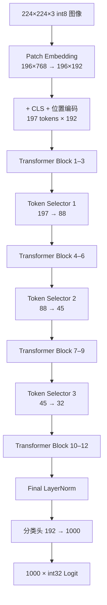

# HeatViT

**Hardware-Efficient Adaptive Token Pruning for Vision Transformers —— FPGA 定点推理引擎**


> **当前状态（2026-08-28）**
>
> - ✅ **仿真闭环**：XSim 端到端逐位通过——18 个检查点与 1000 个 Logit 与纯整数 Python 黄金模型零容差一致；QAT 权重 6 轮回归全部 PASS
> - ✅ **精度闭环**：PTQ 76.06% → QAT **77.86%**（未剪枝）；剪枝 **72.70%@93/44/37**（P4-2A λ=5，当前最优），已导出回 RTL
> - ✅ **可综合性**：Vivado 综合通过（0 黑盒、0 锁存器），但 LUT **902,658（442.9%）** 超 `xc7k325t` 容量 4.4 倍，实现待优化后重跑
> - ⏳ **下一步（P7）**：资源优化（bbuf→BRAM、MAC bank DSP 化）→ 实现与 100 MHz 时序收敛

## 简介

HeatViT 在 Vision Transformer 推理过程中动态剪除不重要的 Token。本项目以**纯可综合 SystemVerilog** 在 `xc7k325tfbg900-3` 上实现了 HeatViT-T（DeiT-T）的完整单图推理数据通路：

- `224×224×3` signed int8 输入 → Patch 嵌入（196 patch，16×16）→ CLS + 位置编码（197 tokens × 192 维）
- 12 个 DeiT-T Transformer Block（Pre-LN，3 head × 64 维，FFN 隐藏维 768）
- 3 个动态 Token Selector（位于 Block 4/7/10 之前）：**197 → 88 → 45 → 32**
- Final LayerNorm → 分类头（192 → 1000）→ 1000 个 signed int32 Logit + 尺度指数

## 推理数据流



每个 Transformer Block 采用 Pre-LN：`Y = X + MSA(LN(X))`，`Z = Y + FFN(LN(Y))`。

## 核心特性

- **描述符驱动、单执行器**：整个网络 = 198 条 320-bit 描述符 + 统一 Tensor Executor；控制流复杂度全部前移到编译期（Python 生成器），硬件只剩调度与校验
- **全定点数值**：8-bit 权重/激活、Q8.16 非线性中间值、Q0.16 概率、6-bit signed scale 指数；无浮点运算、无手工生成 Vivado IP（DSP48E1 / BRAM 由 RTL 模板推断）
- **动态 Token 剪枝**：确定性 Softmax + 0.5 阈值（含等号）；被剪 Token 压缩为单个 Package Token（keep-score 加权平均，零分母回退算术平均）
- **逐位验证口径**：Python 黄金模型在量化后只用整数运算（NumPy 显式 int 类型），与 RTL 逐字节比对——不是「误差小于阈值」
- **协议安全**：64-bit ready/valid 外存接口、地址守卫预检、错误码 1–7 与警告位 0–2 全覆盖、watchdog 防挂死

## 项目进度

| 阶段 | 内容 | 状态 | 关键结果 |
| --- | --- | :-: | --- |
| P1 | RTL 实现（31 模块）：定点基础 → 存储/统一 GEMM → Transformer 数据通路 → Token Selector → 调度与端到端集成 | ✅ | XSim 端到端逐位通过 |
| P2 | 真实 DeiT-T 权重 PTQ + Selector 监督训练（I-ViT 融合） | ✅ | PTQ **76.34%@5k** |
| P3 | 量化感知训练（QAT：部署契约 + fake-quant） | ✅ | 未剪枝 **77.86%@5k**（+1.80pp） |
| P4 | 剪枝微调（STE 阈值/Package + 保持率正则） | ✅ | 剪枝 **72.70%@93/44/37** |
| P5 | QAT 权重导出回 RTL + XSim 逐位回归 | ✅ | 6 轮全部 TEST_PASS |
| P6 | Vivado 综合与资源统计（100 MHz） | ✅ | 可综合性通过；LUT 4.4× 超标 |
| P7 | 资源优化 → 实现 + 100 MHz 时序收敛 | ⏳ | 已规划，见 docs §15 |

## 验证结果（实测摘要）

| 项目 | 结果 |
| --- | --- |
| 18 个检查点 + 1000 个 Logit | 与整数黄金模型**逐字节一致**（零容差） |
| 端到端 · 无回压 | PASS · 183,286,499 周期 |
| 端到端 · 伪随机回压（STALL_MASK=3） | PASS · 207,707,228 周期 |
| QAT 权重端到端（P5）· 6 轮 | img0..2 × 无回压/回压全部 **TEST_PASS**（代表周期 230.8M / 226.4M） |
| 错误码 1–7 / 警告位 0–2 | 10 个注入案例全部命中一次并通过 |
| Watchdog | 850,000,000 周期（≈4× 实测最坏情况） |
| Vivado IP 审计 | `NO_MANUAL_VIVADO_IP_REQUIRED`（0 个手工 IP） |

机器可读结果见 `build/reports/e2e_summary.json` 与 `build/reports/regression_summary.txt`（生成产物，不入库）。

## 精度结果（前 5k val，位精确）

| 版本 | 剪枝 | Top-1 | Token 计数（目标 88/45/32） |
| --- | :-: | ---: | --- |
| 本地 DeiT-T 浮点基线（全量 50k / 前 5k） | ✗ | 72.13% / 80.22% | 197/197/197 |
| 部署契约 PTQ（I-ViT ShiftGELU 融合） | ✗ | 76.34% | — |
| 部署契约 PTQ | ✗ | 76.06% | — |
| **QAT（128k×10）** | ✗ | **77.86%** | — |
| PTQ 主干 + 冻结选择器 | ✓ | 59.12% | 80.0/42.0/34.1 |
| QAT 主干 + 冻结选择器 | ✓ | 68.20% | 87.4/44.0/35.9 |
| P4-1 微调（λ=0） | ✓ | 74.00% | 99.1/57.6/46.6 |
| **P4-2A λ=5（已导出回 RTL）** | ✓ | **72.70%** | **93.0/44.3/37.1** |
| P4-2B 选择器重训 | ✓ | 67.76% | 95.5/43.8/31.7 |

- **量化主线**：PTQ 76.06% → QAT 77.86%（+1.80pp），距浮点基线（同 5k 子集 80.22%）−2.36pp；尺度表全程冻结 PTQ 校准表。I-ViT 融合使纯 PTQ 从 0.82% 提升至 76.34%，增益几乎全部来自 ShiftGELU。
- **剪枝主线**：剪枝代价从 −16.9pp（PTQ）收窄至 **−5.2pp**（P4-2A，计数近目标）；λ=5 为当前诚实最优并已导出回 RTL 通过逐位回归（P5）。
- 论文 HeatViT-T 为浮点 **71.9%**（全量 val，端到端训练）。后续精度提升方向：全量 QAT 长训练、教师蒸馏、联合微调（docs §14.13）。

## P6 资源占用（xc7k325tfbg900-3，opt_design 后）

| 资源 | 已用 | 可用 | 占用率 |
| --- | ---: | ---: | ---: |
| Slice LUTs | 902,658 | 203,800 | **442.9%** |
| Slice Registers | 229,147 | 407,600 | 56.2% |
| Block RAM Tile | 12 | 445 | 2.7% |
| DSP48E1 | 112 | 840 | 13.3% |
| Bonded IOB | 477 | 500 | 95.4% |

**结论**：可综合性 ✅（0 黑盒、0 锁存器、DSP/BRAM 正常推断、描述符 ROM 初始化成功，综合 5h47m）；但 LUT 超容量 4.4 倍，实现（place）暂无法进行。超标 77% 集中在 vector/layout 两引擎的动态字节寻址 `bbuf` 寄存器数组——被综合成巨型 mux 网络；FF/BRAM/DSP 均富余。**P7 优化计划**：bbuf → 字节写使能 SDP RAM（BRAM）、MAC bank 乘法 DSP 化，预计 LUT 降至 ~140–190K（器件 15–20%）；达标后重跑实现与 100 MHz 时序（docs §15）。

## 仓库结构

```text
HeatViT/
├─ rtl/                        # 可综合 SystemVerilog（31 模块 + 顶层封装）
│  ├─ include/heatvit_pkg.sv   # 公共类型、320-bit 描述符、定点函数
│  ├─ common/                  # GELU/Softmax/PLAN Sigmoid/LayerNorm/除法/isqrt
│  ├─ memory/                  # 外存主接口、地址守卫、Tile Buffer
│  ├─ compute/                 # MAC Bank、统一 GEMM、Tensor Executor、布局/矢量引擎
│  ├─ selector/                # Token 分类、Head 融合、压缩与 Package
│  ├─ top/                     # 描述符 ROM、调度器、heatvit_top
│  └─ generated/               # 198 条描述符 ROM 初始化（由工具生成）
├─ config/heatvit_t.json       # 固定模型与量化配置
├─ xdc/heatvit.xdc             # 时序/IO 约束（100 MHz）
├─ sim/                        # 自检式 Testbench、行为存储、单元向量
├─ verification/               # 纯整数 Python 黄金模型 + 单元测试（含 QAT 测试）
├─ tools/                      # 描述符/向量生成器 + PTQ 量化与 QAT 工具链（固定种子、可复现）
├─ scripts/                    # 预检、XSim 运行、全套回归、Vivado 综合脚本
├─ HeatViT.srcs/ + HeatViT.xpr # Vivado 工程（Top 名 heatvit）
├─ docs/heatvit.md             # 唯一权威记录文档（规格/实施记录/验证指南/结果）
└─ build/                      # 生成产物：向量、报告、日志（不入库）
```

## 快速开始

**前置条件**：Windows PowerShell、Vivado 2023.2（XSim）、Python 3.12–3.14、NumPy 2.5.2。

```powershell
# 1. 环境变量（本机路径，换机复现时按需修改）
$env:HEATVIT_VIVADO_BIN = 'D:\vivado\vivado2023.2\Vivado\2023.2\bin'
$env:HEATVIT_PYTHON = 'D:\HeatViT\HeatViT\.venv\Scripts\python.exe'

# 2. Python 环境
python -m venv .venv
.\.venv\Scripts\python -m pip install -r verification\requirements.txt   # numpy==2.5.2

# 3. 生成描述符与端到端向量（固定种子，同一命令跑两遍产物 SHA-256 一致）
.\.venv\Scripts\python tools\generate_descriptors.py --config config\heatvit_t.json
.\.venv\Scripts\python tools\generate_e2e_vectors.py --seed 20260815 --output build\vectors\e2e

# 4. Python 黄金模型单元测试
powershell -NoProfile -ExecutionPolicy Bypass -File scripts\run_python_tests.ps1 -Pattern 'test_*.py'

# 5. 全套回归（foundation/gemm/transformer/selector + e2e 两轮 + 错误矩阵）
powershell -NoProfile -ExecutionPolicy Bypass -File scripts\run_regression.ps1 -Suite all

# 6. Vivado 综合与资源统计（实现待 P7 资源优化达标后运行）
powershell -NoProfile -ExecutionPolicy Bypass -File scripts\run_vivado_synth.ps1 -Jobs 24
.\.venv\Scripts\python tools\p6\p6_summary.py
```

> 只有显式加 `-RegenerateVectors` 才会重新生成端到端向量，防止失败重跑时误换期望值。全套回归预计时长：端到端两轮各约 35–40 分钟，其余套件分钟级到二十余分钟；成功输出 `TEST_PASS <Top>`。QAT 训练/评估/导出命令见 docs 第二部分 §14 与第三部分 §9。

## 范围与非目标

- ✅ **已覆盖**：XSim 逐位仿真验证；真实权重 PTQ / QAT / 剪枝精度评估；QAT 权重导出与硬件逐位回归（P5）；Vivado 综合与资源统计（P6）
- ⏳ **待办**：P7 资源优化 → 实现与 100 MHz 时序收敛
- ❌ **排除**：功耗、FPS 与上板验证；板级 DDR/MIG/PCIe/AXI 集成与主机软件；HeatViT-S / HeatViT-B / LV-ViT 变体；JPEG/PNG 解码、图像缩放与浮点预处理

## 文档

- 📖 [`docs/heatvit.md`](docs/heatvit.md) —— 项目**唯一权威记录文档**：设计规格、实施记录、仿真与验证指南、内存与权重格式、RTL 逐模块设计说明；PTQ / QAT / P5 导出见第二部分 §13–§14（P5 见 §14.14），P6 综合与资源统计见 §15
- 📄 论文 PDF：仓库根目录 `HeatViT：Hardware-Efficient Adaptive Token Pruning for Vision Transformers.pdf`
- 🔗 论文 arXiv：[2211.08110](https://arxiv.org/abs/2211.08110)

## 许可证

[MIT](LICENSE) © 2026 YOUXINYANG。引用论文、PLAN Sigmoid 分段近似（[MDPI Sensors 20(11):3168](https://www.mdpi.com/1424-8220/20/11/3168)）等外部依据的版权归原作者所有。
