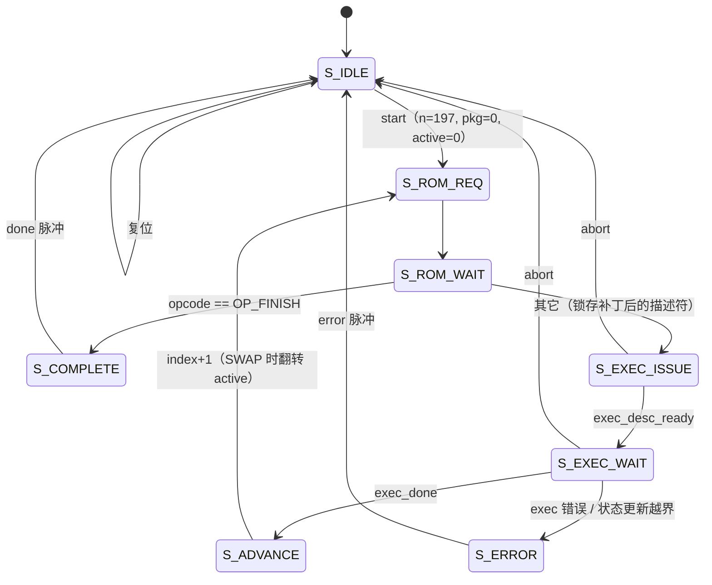
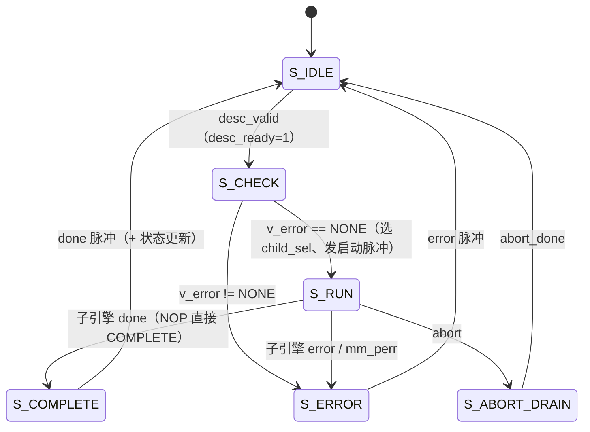
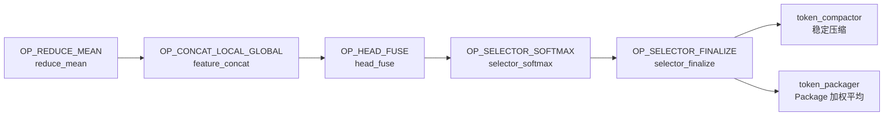

# HeatViT：面向 FPGA 的硬件高效 Vision Transformer 定点推理引擎

> **文档定位：** 本文档是 HeatViT 项目的**唯一记录文档**。设计规格、实施
> 计划与实施记录、仿真与验证指南、内存与权重格式、端到端验证结果均整合于
> 此；其它分阶段文档已移除。任何文档冲突均以本文与当前代码为准。

## 摘要

HeatViT（*Hardware-Efficient Adaptive Token Pruning for Vision
Transformers*）提出在 Vision Transformer 推理过程中动态剪除不重要的
Token，从而在几乎不损失精度的前提下大幅降低计算量。本项目在
`xc7k325tfbg900-3` Vivado 工程中以纯可综合 SystemVerilog 实现了其
T 型配置的完整单图推理数据通路：`224×224×3` int8 输入经 Patch 嵌入、
12 个 DeiT-T Transformer Block 与 3 个动态 Token Selector（Token 数
197→88→45→32），最终经 Final LayerNorm 与分类头输出 1000 类 Logit。
全部数值采用定点整数实现（8-bit 权重/激活、Q8.16 非线性中间值、
Q0.16 概率），由 198 条 320-bit 描述符驱动统一的调度器与 GEMM 引擎。
验证以 Vivado XSim 仿真逐位对照纯整数 Python 黄金模型完成：18 个
检查点与 1000 个 Logit 在无回压与伪随机回压两轮下全部逐位一致，
错误码 1–7 与警告位 0–2 全覆盖，`run_regression.ps1 -Suite all`
退出码为 0。此处 RTL 功能结论严格限定为「仿真逐位通过」；真实权重精度、
综合/时序与板级结论分别按后续独立验收口径陈述。

P2 以真实 DeiT-T 权重完成 PTQ 精度评估：部署契约（ShiftGELU-ln2 +
contract softmax/LN）**76.40%@3k / 76.06%@5k**（浮点同子集
80.37% / 80.22%）。P3 量化感知训练（QAT）与 P4 剪枝微调基本完成
（§14.13 小结）：前 5k 探索口径下，未剪枝 **76.06% → 77.86%**，
P4-2A 率正则 λ=5 达到剪枝 **72.70%@93/44/37**；D3 裁定弃用训练后
重校准，选择器重训（B）排序增益未兑现。**P5 已把 P4-2A 权重导出回
RTL 并通过 XSim 端到端逐位回归**（修复一处 LN 陈旧尺度缺陷，§14.14）。
2026-08-31 对该已部署权重完成 ImageNet val 全量 50k 位精确复核（§14.15）：
未剪枝 **67.48%**，剪枝 **60.53%@102.2/50.6/42.4**，剪枝代价
**−6.95pp**。结果证明前 5k 同时高估精度并低估 Token 保留率；后续精度
提升以全量 QAT 长训练为首选，并以 50k 位精确评估作为终局验收口径。

P6（§15）完成 Vivado 综合与资源统计：RTL 可综合性验证通过（0 黑盒、0 锁存器、
DSP/BRAM 正常推断），但综合级 LUT 918,145（450.5%）约为 `xc7k325tfbg900-3`
容量的 4.4 倍，实现未能进行；超标集中在动态字节寻址寄存器数组被综合成的
mux 网络。**P7-1 / P7-2 资源优化已完成**：vector/layout 两引擎与 selector
侧七模块的寄存器数组全部重构为字节写使能 SDP RAM / 串行化访问，全量逐位
回归（e2e 两轮 + 错误矩阵）全绿，全量多核综合 LUT **918,145 → 126,459
（62.05%）**，首次跨过 100% 可布线性门槛。**P7-4 实现与 50 MHz 时序收敛
已完成**：LayerNorm/softmax 流水化与 GEMM 写回 staging RAM 写端口寄存器化
（全量逐位回归全绿）后 place+route 0 未布线；100 MHz 实测不收敛（place 后
WNS = −7.2 ns、route 拥塞，残余集中在 GEMM 写回 128 位重定标锥）按计划
回退，50 MHz signoff **WNS = +0.323 ns、TNS = 0、WHS = +0.073 ns**
（`All user specified timing constraints are met.`），路由后资源
LUT 118,453（58.12%）、FF 46,834、DSP 65、BRAM 37。**P7-5 全片 100 MHz
时序收敛已完成（2026-08-30）**：GEMM 引擎重定标函数四位宽证明收窄（OOC 门
WNS −4.185 → +0.659 ns）后全片五轮清零 residual/LayerNorm/executor/score_q16
/srow 等违例家族，**100 MHz signoff WNS = +0.234 ns、TNS = 0、WHS = +0.018 ns**
（setup+hold 双达标），路由后 LUT 85,959（42.18%）；全量逐位回归全绿。
P7③ MAC DSP 化与板级验证为后续可选工作。

**关键词：** Vision Transformer；动态 Token 剪枝；定点量化；FPGA；
SystemVerilog；描述符调度；逐位仿真验证

## 目录

- **摘要与导读**（本节）
- **第一部分 设计规格**：目标与依据、模型数据流、顶层架构、描述符调度、
  定点数值契约、GEMM 引擎、非线性单元、Token Selector、错误与警告、
  黄金模型、验收标准
- **第二部分 实施计划与实施记录**：五个 RTL 阶段的执行蓝图、任务清单与
  as-built 实施记录（含接口裁定、踩坑与验收证据），以及 P2 真实权重
  精度验证（§13）、P3 量化感知训练 QAT / P4 剪枝微调、P5 权重导出
  逐位回归与全量 50k 精度复核（§14，P5 见 §14.14，50k 见 §14.15）、
  P6 Vivado 综合与资源统计（§15）
- **第三部分 仿真与验证指南**：环境准备、向量生成、回归套件、日志与
  失败定位、预计时长
- **第四部分 内存与权重格式**：四区域映射、逐张量布局、尺度表、`.mem`
  编码与权重替换契约
- **第五部分 端到端验证结果**：周期数与 watchdog、错误/警告矩阵、哈希、
  结论边界
- **第六部分 总体验收清单与历史文档索引**
- **第七部分 RTL 代码设计（as-built）**：模块层次与文件清单、公共包与数值契约、
  顶层与调度、Tensor Executor、计算引擎、存储子系统、非线性与归一化、
  Token Selector 的逐模块代码设计（引用关键代码并注释）与全系统设计要点总结

## 快速导读

- **只想了解「做了什么、结果如何」**：读摘要与第五部分（端到端验证结果）。
- **想理解「系统怎么工作」**：读第一部分的 §5 模型数据流（一张图看懂
  推理链路）、§8 描述符调度与 §12 Token Selector。
- **想复现仿真**：读第三部分，按命令逐步执行即可。
- **想替换权重或改模型**：读第四部分的权重替换契约，改完必须重生成
  描述符与黄金检查点并重跑全回归。
- **想追溯某个设计决策或踩坑**：读第二部分对应阶段的「实施记录」小节
  ——它是 as-built 记录，与计划不一致时以实施记录为准。
- **想了解真实权重精度、QAT 训练与硬件导出**：读第二部分的 §13（P2
  精度验证）与 §14（P3 QAT / P4 剪枝微调 / P5 导出与逐位回归，
  §14.14；全量 50k 精度复核，§14.15）。
- **想了解 Vivado 综合与资源统计（P6）**：读第二部分的 §15。
- **想读懂 RTL 代码本身**：读第七部分（RTL 代码设计）——逐模块的设计说明、
  状态机与关键代码引用，与第一部分规格、第二部分实施记录互为补充。

## 术语速览（通俗版）

| 术语 | 通俗解释 |
| --- | --- |
| Token | 送入 Transformer 的最小信息单元；本项目 = 1 个 CLS 标记 + 196 个图像块（Patch） |
| Token 剪枝 | 推理到一半时，把「不重要」的 Token 丢弃、把被丢弃信息压缩成一个 Package Token，后续层只算剩下的——省时间省算力 |
| 定点数 | 用整数表示小数：比如 Q8.16 就是「把小数点固定在第 16 位之后」，运算全程无浮点，适合 FPGA |
| 描述符 | 一条 320-bit 的「指令」，告诉执行器这一次算什么、数据在哪、用什么尺度；整个网络 = 198 条这样的指令 |
| 黄金模型 | 用 Python 写的、与 RTL 逐位一致的整数参考实现；仿真结果和它逐字节比对 |
| 逐位一致 | 每个字节都完全相等，不是「误差小于某阈值」——这是本项目最强的验收口径 |
| 回压（backpressure） | 存储接口可以随时说「忙」，设计必须停下来等——用它模拟真实存储的随机延迟 |
| watchdog | 看门狗：如果仿真超过预定的最大周期数还没结束，就判定为挂死并报错 |


# 第一部分：HeatViT-T 纯 FPGA SystemVerilog 推理设计规格

## 1. 目标

在现有 Vivado 工程中实现可综合的 SystemVerilog RTL，复现 HeatViT-T 的完整单图推理数据通路。设计目标器件保持为工程实际配置的 `xc7k325tfbg900-3`，但本阶段只以 Vivado XSim 仿真作为验收手段。

本规格覆盖：

- 8-bit 输入图像到 1000 类 Logit 的完整推理。
- Patch Embedding、位置编码和 CLS Token。
- 12 个 DeiT-T Transformer Block。
- Block 4、7、10 前的三个 HeatViT Token Selector。
- 动态 Token 压缩和单个 Package Token。
- 完全位于 FPGA RTL 中的 LayerNorm。
- 8-bit 权重/激活、定点非线性近似和统一 GEMM 引擎。
- 整数黄金模型、模块级仿真和完整尺寸端到端逐位回归。

## 2. 非目标

- 不实现模型训练、微调或蒸馏（P3 修正：量化感知训练 QAT 已纳入范围并
  实施中，见第二部分 §14）。
- 初始范围不复现 ImageNet Top-1，也不声称随机测试权重具有分类意义；
  P2/P3/P4 已将真实 DeiT-T 权重的 PTQ/QAT/剪枝评估纳入范围，且于
  2026-08-31 完成当前部署权重全量 50k 位精确复核（§14.15）。
- 不集成板级 DDR、MIG、PCIe、AXI、摄像头、显示、串口或主机软件。
- 不执行上板、功耗测试或实测吞吐验证（P7 修正：时序收敛已纳入范围，
  50 MHz signoff 达标于 P7-4，**100 MHz signoff 达标于 P7-5**，见 §15）。
- 不支持 HeatViT-S、HeatViT-B 或 LV-ViT 变体。
- 不实现 JPEG/PNG 解码、图像缩放和浮点均值方差预处理。

## 3. 依据和明确偏差

主要依据：

- 本项目中的 `HeatViT：Hardware-Efficient Adaptive Token Pruning for Vision Transformers.pdf`。
- <https://arxiv.org/abs/2211.08110>
- PLAN Sigmoid 分段式：<https://www.mdpi.com/1424-8220/20/11/3168>
- XC7K325T 资源表：<https://docs.amd.com/api/khub/documents/2LByHkO~nSZXcei2D55fTg/content>

论文没有公开完整 RTL、逐层 Q 格式、Token Selector 权重、Head 权重分支隐藏维度或端到端检查点。本设计据此采用以下明确约定：

- 论文把 LayerNorm 放在 ZCU102 ARM 上；本设计使用定点 RTL LayerNorm。
- 训练期 Gumbel-Softmax 不进入推理 RTL；推理使用确定性 Softmax 和 `0.5` 阈值。
- Selector Head 权重分支默认采用 `3 -> 3 -> 3`，尺寸仍由描述符表达。
- Token Package 采用论文公式 (10) 的加权平均；分母为零时采用算术平均回退。
- Attention Softmax 与 Selector 二分类 Softmax 均使用 `delta2=1.0`，从而保留 `0.5` 判决含义与 1.0 的概率质量。
  （P2 修正：attention 原为 `delta2=0.5`，会把注意力概率整体减半；改为
  `1.0` 后 UQ0.8 仍不溢出，概率和恢复为 1。）
- 使用确定性合成权重和输入完成数值验证，不使用训练 checkpoint。
- 使用通用行为级外部存储接口，不复现 ZCU102 的 CPU/DDR 子系统。

## 4. 固定模型配置

| 项目 | 值 |
| --- | --- |
| Batch | 1 |
| 输入 | 预处理并量化后的 `224 x 224 x 3` signed int8 |
| Patch | `16 x 16` |
| Patch 数 | 196 |
| 初始 Token 数 | 197（196 Patch + 1 CLS） |
| Embedding 维度 | 192 |
| Attention Head | 3 |
| 每个 Head 维度 | 64 |
| Transformer Block | 12 |
| FFN 隐藏维度 | 768 |
| 分类数 | 1000 |
| Selector 位置 | Block 4、7、10 之前 |

不实现 distillation token 或 distillation head。

### 4.1 数据与权重布局

- 输入图像采用 NHWC 行优先布局；同一像素的 R、G、B 三个 signed int8 按地址递增排列。
- Patch Token 按图像从上到下、从左到右的光栅顺序编号。每个 Patch 内按行、列、通道顺序展平，形成长度 768 的向量。
- Token 序列索引 0 固定为 CLS；位置编码索引 1 至 196 对应上述 Patch 光栅顺序。
- GEMM 统一解释为 `A[M][K] * B[K][N]`，A、B 和结果均为行优先布局；Bias 按 N 维连续存放。
- Q/K/V 权重存成一个 `[192][576]` 行优先矩阵，输出列顺序固定为 Q、K、V，各占连续 192 列。
- Patch Embedding 权重由卷积形式转换为 `[768][192]`；K 维顺序必须与 Patch 展平顺序一致。
- CLS、位置编码、Gamma、Beta、普通权重和 Bias 各自在生成器给出的 8-byte 对齐偏移处存放。
- 64-bit 存储数据采用小端字节序：最低地址字节位于 `mem_*_data[7:0]`。最终 Logit 以 class 0 至 class 999 顺序存放，每项为小端 signed int32。

## 5. 模型数据流

```text
224 x 224 x 3 int8 image
        |
Patch partition: 196 x 768
        |
Patch embedding GEMM: 768 -> 192
        |
prepend CLS + add position embedding
        |
Transformer Block 1..3
        |
Token Selector 1
        |
Transformer Block 4..6
        |
Token Selector 2
        |
Transformer Block 7..9
        |
Token Selector 3
        |
Transformer Block 10..12
        |
Final LayerNorm
        |
CLS classification GEMM: 192 -> 1000
        |
1000 signed int32 logits + scale exponent
```

每个 Transformer Block 使用 Pre-LN：

```text
Y = X + MSA(LayerNorm(X))
Z = Y + FFN(LayerNorm(Y))
```

MSA 顺序为 Q/K/V 投影、三个 Head 的 `Q*K^T`、缩放、Softmax、`Attention*V`、Head 拼接和输出投影。`sqrt(64)=8`，Attention 缩放可用精确的三位右移结合尺度指数完成。

## 6. 顶层架构

`heatvit_top` 包含：

- 顶层控制和状态寄存器。
- 操作描述符 ROM 与动态调度器。
- 地址生成和通用外部存储主接口。
- 输入、权重和输出 Tile Ping-Pong Buffer。
- 三 Bank 统一 GEMM 引擎。
- 重定标、残差、非线性、LayerNorm、倒数和整数平方根单元。
- Token Classifier、Token Compactor 和 Token Packager。
- 当前 Token 数寄存器及 Activation Ping-Pong 基地址。

大张量保存在抽象外部存储中，片上缓冲仅保存当前 Tile 和局部归约状态。Q、K、V、Attention Score、FFN 中间激活和残差源均使用描述符指定的 Scratch 区域。

## 7. 顶层接口

控制接口：

- `clk`、在 `posedge clk` 采样的同步低有效复位 `rst_n`。
- 单周期 `start`。
- 32-bit byte address：`input_base`、`weight_base`、`scratch_base`、`output_base`。
- 32-bit 区域容量：`input_bytes`、`weight_bytes`、`scratch_bytes`、`output_bytes`。
- `busy`、单周期成功脉冲 `done`。
- `error_valid`、`error_code[7:0]`。
- 锁存到下一次复位或启动的 `warning_flags[7:0]`。
- 最终 Logit 的 signed `output_scale_exp[5:0]`。

`start` 仅允许在 `busy=0` 时拉高。合法启动沿锁存全部基地址和容量、清除旧错误与警告并置 `busy`；`busy=1` 时再次拉高 `start` 属于致命协议错误。`done` 只在成功完成时拉高一个周期。

外部存储接口使用 64-bit 数据宽度：

- 命令通道：`mem_cmd_valid/ready`、`mem_cmd_write`、`mem_cmd_addr[31:0]`、`mem_cmd_len[15:0]`。
- 写通道：`mem_w_valid/ready`、`mem_w_data[63:0]`、`mem_w_strb[7:0]`、`mem_w_last`。
- 读通道：`mem_r_valid/ready`、`mem_r_data[63:0]`、`mem_r_last`。

`mem_cmd_len` 表示 64-bit beat 数且不得为零。命令地址和四个区域基地址必须 8-byte 对齐；向量生成器把每个 Tensor 占用空间向上填充到 8-byte 边界。最后一个写 Beat 只通过 `mem_w_strb` 使能有效字节，读出的填充字节不得参与计算。地址生成器在发出命令前，用锁存的区域容量检查完整 Burst 的首尾地址和 32-bit 加法溢出。Testbench 行为存储模型负责 `.mem` 初始化、命令响应、独立边界复查和可配置 backpressure。

## 8. 描述符调度

描述符为固定 320-bit SystemVerilog packed struct，字段如下；保留位必须写零，非零时视为非法描述符：

| 字段 | 位宽 | 含义 |
| --- | ---: | --- |
| `opcode` | 8 | 算子枚举 |
| `flags` | 24 | 转置、Bias、残差、动态 M、地址区域、写回和 Post-op 控制 |
| `m/n/k` | 各 16 | 静态矩阵维度；动态 M 置位时 `m` 由当前 Token 数覆盖 |
| `heads` | 4 | Head 数，普通 GEMM 为 0，Attention/Selector 为 3 |
| `src0/src1/bias/aux/dst_offset` | 各 32 | 相对于 flags 所选区域基地址的 byte offset |
| `src0/src1/aux/dst_scale_exp` | 各 6 signed | Tensor 尺度；Bias 尺度固定由 GEMM 两输入尺度之和导出 |
| `next_index` | 16 | 成功后的下一描述符索引 |
| `param0/param1` | 各 16 | Opcode 专用的维度、阈值或常量表索引 |
| `reserved` | 4 | 固定为零，使总宽度为 320 bit |

`flags` 的固定编码为：bit 0 右矩阵转置，bit 1 启用 Bias，bit 2 启用 Aux/残差，bit 3 使用动态 M，bit 4 完成后交换 Activation 区，bit 5 Head 模式，bit 6 Head 拼接，bit 7 输出 int32，bits 10:8 为 Post-op 枚举，bit 11 表示 src0 来自 Input 区（否则为 Scratch 区，即激活张量），bit 12 表示 src1 来自 Scratch 区（否则为 Weight 区），bit 13 表示 Bias 来自 Scratch 区（否则为 Weight 区），bit 14 表示 Aux 来自 Weight 区（否则为 Scratch 区），bit 15 表示 dst 为 Output 区（否则为 Scratch 区），bits 16、17 分别启用 Token 和 Channel 尾块掩码，bit 18 表示 src0 按 unsigned 解释（仅用于 UQ0.8 Attention 与 signed int8 V 相乘），bits 19、20 分别把 N、K 覆盖为当前 Token 数，bits 23:21 保留为零。Post-op 枚举只允许 none、requant、GELU、Attention Softmax、Selector Softmax、PLAN 和 LayerNorm。

固定模型顺序存放在描述符 ROM 中。flag 3 置位时，`param0[1:0]` 固定选择动态 M：`2'b00` 表示当前 Token 数 N，`2'b01` 表示候选数 C=N-1，`2'b10/11` 非法；bits 19/20 置位时分别把 descriptor N/K 覆盖为当前 Token 数。Reduction opcode 另用 `param0[3:2]` 选择候选轴或 64 通道轴。普通 MSA/FFN 使用动态 M；QKᵀ 使用动态 M/N；Attention×V 使用动态 M/K；Selector MLP/Softmax 使用动态候选 M。Selector 完成后更新 Token 数；每个算子完成后按描述符交换 Activation Ping-Pong 基地址。

非法 Opcode、零维度、超出模型上限的维度或越界地址必须在发出存储命令前被拒绝。

## 9. 定点数值契约

### 9.1 普通 Tensor

- 权重和普通激活均为 signed int8，范围 `[-128, 127]`。
- 每个 Tensor 携带 6-bit signed `scale_exp`，范围 `[-32, 31]`。
- 数值解释为 `real = integer * 2^scale_exp`。
- Bias 为 signed int32，尺度等于对应 GEMM 累加尺度。
- 常规 GEMM 为 signed `int8 * int8 -> int32 accumulator`；唯一例外是 Attention×V，其 UQ0.8 左操作数按 unsigned、V 按 signed int8 解释，结果仍累加到 signed int32。
- 最终 1000 个 Logit 保留为 signed int32，并输出共同的 `scale_exp`。

### 9.2 重定标

若累加尺度为 `s_acc`，目标尺度为 `s_out`，则对整数累加值执行 `2^(s_acc-s_out)` 的移位。

- 右移采用最近舍入，正负中点均远离零。
- 一般整数除法也采用最近舍入、中点远离零：底层无符号除法器返回向下取整商和余数，调用方在 `2*remainder >= denominator` 时将商的绝对值加一，再恢复符号。
- 普通 Tensor 的尺度对齐左移在 signed 128-bit 扩展位宽中完成，足以覆盖 48-bit 输入与完整 `scale_exp` 差值；之后再按目标位宽饱和。
- 窄化统一饱和，禁止二进制回绕。
- 禁止依赖 SystemVerilog 隐式 signedness、隐式位宽扩展或隐式截断。

残差相加前先对齐尺度，在 int32 中求和后再重定标为 int8。

### 9.3 概率和中间值

- Attention Softmax 输出为 8-bit unsigned UQ0.8；`delta2=1.0` 时最大合法值不超过 255/256（饱和到 255）。
- Selector Score 和 Head Weight 使用 17-bit unsigned Q0.16，`1.0` 编码为 `65536`。
- 非线性输入和主要中间值使用 signed 24-bit Q8.16。
- 平方、方差、倒数和 Package 累加允许扩展到 32 或 48 bit。
- Q0.16 Selector Score、Head Weight 和 fused score 在外部 Scratch 中各占一个 little-endian unsigned 32-bit word，bits 16:0 有效且 bits 31:17 必须为零；Q8.16 Scratch 值各占一个 little-endian signed 32-bit word，bits 31:24 必须是 bit 23 的符号扩展。

### 9.4 定点格式与位宽总表

| 格式 | 位宽 | 有符号 | 编码 | 范围 |
| --- | ---: | --- | --- | --- |
| int8 | 8 | 是 | 整数 | `[-128, 127]` |
| Q8.16 | 24 | 是 | `real = int * 2^-16` | `[-128.0, 128.0 - 2^-16]` |
| Q0.16 | 17 | 否 | `1.0 = 65536` | `[0, 65536]` |
| UQ0.8 | 8 | 否 | `real = int * 2^-8` | `[0, 255]` |
| Q0.32 倒数 | 33 | 否 | `1.0 = 2^32` | `[0, 2^32]` |
| Q16.32 epsilon | 64 | 否 | `10^-6 = 4295` | 仅常量 |
| scale exponent | 6 | 是 | `real = int * 2^exp` | `[-32, 31]` |
| GEMM 累加器 | 32 | 是 | 整数 | `[-2^31, 2^31 - 1]` |
| 描述符 | 320 | — | packed struct | 见 §8 |

概率与中间值：Attention 概率为 UQ0.8；Selector Score 与 Head Weight 为
17-bit Q0.16；非线性主中间值为 signed 24-bit Q8.16。

### 9.5 批准常量总表

GELU（I-ViT ShiftGELU，ln2 斜率细化；Q8.16）：

| 常量 | 值 |
| --- | ---: |
| `GELU_SLOPE_NUM_Q16` | 11 |
| `GELU_SLOPE_SHIFT` | 4 |
| `GELU_SLOPE_ROUND_ADD` | 15 |
| `GELU_EXP_NEG_Q_MAX` | 16 |
| `GELU_EXP_POS_Q_MAX` | 7 |

（2026-08-23 P2+ 契约变更：原 erf 多项式常量 `GELU_A_Q16=-18927`、
`GELU_B_Q16=-115933`、`GELU_DELTA_Q16=32768`、`INV_SQRT2_Q16=46341` 退役，
见第二部分 §13.8。）

指数近似（Q8.16）：

| 常量 | 值 |
| --- | ---: |
| `EXP_LN2_Q16` | 45426 |
| `EXP_QUAD_Q16` | 23495 |
| `EXP_OFFSET_Q16` | 88670 |
| `EXP_CONST_Q16` | 22544 |
| `LN2_DIV_MAGIC` | 94548（`ceil(2^32 / 45426)`，仅内部实现用） |

Softmax delta2（Q8.16）：`SOFTMAX_DELTA_Q16_ATTENTION = 65536`（1.0，P2 修正，原 32768）、
`SOFTMAX_DELTA_Q16_SELECTOR = 65536`（1.0）。LayerNorm：
`LN_EPS_Q32 = 4295`（Q16.32 的 `10^-6`）。

PLAN Sigmoid（Q8.16 输入，Q0.16 输出）：

| 阈值 | 值 | 系数 | 值 |
| --- | ---: | --- | ---: |
| 1.0 | 65536 | 1/2 | 32768 |
| 2.375 | 155648 | 5/8 | 40960 |
| 5.0 | 327680 | 27/32 | 55296 |

### 9.6 舍入与饱和伪代码

最近舍入右移（中点远离零）：

```text
round_shift_away(value, shift):
    if shift == 0: return value
    magnitude = abs(value)
    rounded   = (magnitude + (1 << (shift - 1))) >> shift
    return -rounded if value < 0 else rounded
```

负数先取扩展位宽下的幅值，加半 LSB 后逻辑右移，再恢复符号；`shift=0`
直接返回原值。

最近舍入整数除法：

```text
quotient, remainder = floor_div(|numerator|, |denominator|)
if 2 * remainder >= denominator: quotient += 1
result = sign(numerator) * quotient
```

尺度对齐：

```text
scale_to_exp(value, src_exp, dst_exp):
    diff = dst_exp - src_exp
    if diff > 0:  return round_shift_away(value, diff)   # 缩小
    if diff == 0: return value
    shifted = value << (-diff)                           # 放大
    if (shifted >> (-diff)) != value: saturate to S128_MIN/MAX
    return shifted
```

饱和范围：

| 目标 | 下限 | 上限 |
| --- | ---: | ---: |
| int8 | -128 | 127 |
| signed 24-bit Q8.16 | -8388608 | 8388607 |
| Selector Q0.16 | 0 | 65536 |
| Attention UQ0.8 | 0 | 255 |
| int32 | -2147483648 | 2147483647 |

所有窄化必须饱和，禁止二进制回绕；禁止依赖隐式 signedness、隐式位宽
扩展或隐式截断。

### 9.7 各数值单元序列

GELU（I-ViT ShiftGELU，ln2 斜率；Q8.16）：

```text
i_p     = x + (x >> 1) + (x >> 3) + (x >> 4)      # 1.702x，(1.1011)b
i_p2    = i_p + (i_p >> 1) - (i_p >> 4)           # × log2(e)，(1.0111)b
q       = |i_p2| >> 16
r       = |i_p2| & 0xFFFF
frac    = (r * 11 + 15) >> 4                      # 2^x 线性近似，斜率 11/16 ≈ ln2
e       = i_p2 < 0 ? ((65536 - frac) >> q,  q <= 16，否则 0)
                   : (min((65536 + frac) << q, 2^23 - 1), q <= 7，否则 2^23 - 1)
sig     = ((e << 16) + ((65536 + e) >> 1)) // (65536 + e)   # 40/24-bit 整数除法
y       = round_shift_away(x * sig, 16)
y       = sat_signed_24(y)
```

`e` 是 `e^{1.702x}` 的 Q16 定点值（移位型指数：整数部分为 2 的幂移位，
分数部分线性近似，斜率 11/16 ≈ ln2 以细化论文原版斜率 1/2 的近似误差）；
`sig` 是 sigmoid 的 Q0.16 值（一次整数除法，最近舍入）。最后结果饱和到
signed 24-bit Q8.16。负半轴 `x·σ(1.702x)` 在 `x≈-0.75` 处有轻微凹陷
（最小值 ≈ -0.16，与真实 GELU 的 -0.17 一致量级），单调性断言仅覆盖
`x >= 0`。

PLAN Sigmoid（对 `abs_x`，Q8.16）：

```text
abs_x >= 327680            : y_abs = 65536
155648 <= abs_x < 327680   : y_abs = (abs_x >> 5) + 55296
65536  <= abs_x < 155648   : y_abs = (abs_x >> 3) + 40960
abs_x < 65536              : y_abs = (abs_x >> 2) + 32768
x < 0                      : y = 65536 - y_abs
```

Softmax（每行先减最大值，`x_tilde = x - row_max`）：

```text
z          = floor(-x_tilde / 45426)
p          = x_tilde + z * 45426
square_q16 = round_shift_away((p + 88670)^2, 16)
exp_q16    = round_shift_away(23495 * square_q16, 16) + 22544
E_i        = exp_q16 >> z
S          = sum(E_i)
recip_q32  = round((1 << 32) / S)
ratio_q16  = round_shift_away(E_i * recip_q32, 16)
scaled_q16 = round_shift_away(ratio_q16 * delta2_q16, 16)
```

Selector 将 `scaled_q16` 饱和为 17-bit Q0.16；Attention 再最近舍入右移
8 位并饱和为 UQ0.8。`z` 的常数除法在 RTL 中用
`q0 = (|x_tilde| * 94548) >> 32` 加一步 `(q0+1)*45426 <= |x_tilde|`
校正实现，与 `floor` 精确一致。

LayerNorm（D=192，输入尺度 `x_scale ∈ [-32, 0]`，带 `_q32` 后缀的整数
均为 32 个小数位）：

```text
x_q32        = x_int << (x_scale + 32)
square_q32   = round_shift_away(x_int^2, -(2*x_scale + 32))
mean_q32     = round(sum_x_q32 / 192)
e2_q32       = round(sum_square_q32 / 192)
mean_sq_q32  = round_shift_away(mean_q32^2, 32)
variance_q32 = max(0, e2_q32 - mean_sq_q32)
std_q16      = floor_sqrt(variance_q32 + 4295)
inv_std_q32  = round((1 << 48) / std_q16)
norm_q16     = sat_q8_16(round_shift_away((x_q32 - mean_q32) * inv_std_q32, 48))
```

Gamma/Beta 在共同指数对齐后精确求和、单次最近舍入、饱和到 int8：

```text
common = min(gamma_scale - 16, beta_scale)
sum_w  = (norm_q16 * gamma) << (gamma_scale - 16 - common)
       + beta << (beta_scale - common)
out    = sat_s8(scale_to_exp(sum_w, common, out_scale))
```

其余基础单元：`heatvit_requant`（48-bit 值按 `scale_to_exp` 重定标后
饱和 int8，输出饱和标志）；`heatvit_residual`（两尺度残差对齐到共同
指数、int32 求和、重定标回 int8）；`heatvit_udiv`（64-bit 无符号恢复
除法，每周期一位商，返回 floor 商与余数；除零置 `divide_by_zero` 且保持
上次结果）；`heatvit_isqrt`（48-bit 恢复平方根，返回 floor 根与余数，
不额外舍入）；`heatvit_div_arbiter`（固定优先级 0 > 1 > 2 的三客户端
仲裁，内部持有唯一 `heatvit_udiv`）。

### 9.8 异常行为

| 情形 | 行为 |
| --- | --- |
| `busy=1` 时收到 `start` | 报错并忽略新请求 |
| Softmax `row_len=0` 或超过 197 | 致命错误 |
| LayerNorm 输入尺度超出 `[-32,0]` | 致命错误 2 |
| Softmax 行和为零 | 置 `error_zero_sum`（正常输入不可达） |
| LayerNorm `e2_q32 - mean_sq_q32 < 0` | 方差钳零并置 `warn_negative_variance`，锁存到下次启动/复位 |
| 除法除零 | 置 `divide_by_zero`，商/余数保持上次值 |

警告不停止推理；致命错误立即停止且不产生 `done`。

## 10. 统一 GEMM 引擎

默认参数：

- `TH=3`
- `TI=8`
- `TO=8`
- 三个 Bank，每个 Bank 为 `8 x 8` MAC，共 192 条 int8 乘法通道。

Attention 模式下一 Bank 对应一个 Head。普通 GEMM 模式下三个 Bank 处理不同输出 Tile。K 维度跨周期归约。动态 Token 数或矩阵边界不是 8 的倍数时，尾块 Valid Mask 必须阻止无效输入参与累加或写回。

引擎支持：

- 普通和转置右矩阵。
- Bias 加法。
- Head 分组结果保留。
- Head 拼接或普通 Tile 写回。
- 可选重定标和激活派发。

Patch Embedding、Q/K/V、Attention、Projection、FFN、Selector MLP 和分类头全部复用该引擎。

## 11. 非线性和归一化

### 11.1 GELU

使用 I-ViT ShiftGELU（ln2 斜率细化）。Q8.16 常量固定为：

| 常量 | 值 |
| --- | ---: |
| `GELU_SLOPE_NUM_Q16` | 11 |
| `GELU_SLOPE_SHIFT` | 4 |
| `GELU_SLOPE_ROUND_ADD` | 15 |
| `GELU_EXP_NEG_Q_MAX` | 16 |
| `GELU_EXP_POS_Q_MAX` | 7 |

所有乘法后按第 9 节规则舍入和饱和。

对 Q8.16 输入 `x`，整数执行顺序固定为：

```text
i_p   = x + (x >> 1) + (x >> 3) + (x >> 4)        # 1.702x
i_p2  = i_p + (i_p >> 1) - (i_p >> 4)             # × log2(e)
q     = |i_p2| >> 16,  r = |i_p2| & 0xFFFF
frac  = (r * 11 + 15) >> 4
e     = i_p2 < 0 ? ((65536 - frac) >> q  [q <= 16] 否则 0)
                 : (min((65536 + frac) << q, 2^23 - 1) [q <= 7] 否则 2^23 - 1)
sig   = ((e << 16) + ((65536 + e) >> 1)) // (65536 + e)
gelu  = round_shift_away(x * sig, 16)
```

最后结果饱和到 signed 24-bit Q8.16。GELU 单元内的一次 40/24-bit 除法以
40 级 radix-2 恢复除法**流水线**实现（每级 1 bit、吞吐 1 lane/拍、时延
41 拍，结果与串行除法逐位相同）；executor 的共享三客户端除法器
（LN/Softmax 通道）不参与。

### 11.2 Softmax 和指数

每行先减去最大值。使用 HeatViT 公式 (13)、(14) 的范围缩减：

```text
x_tilde = x - row_max
z = floor(-x_tilde / ln(2))
p = x_tilde + z*ln(2)
exp(x_tilde) = exp_poly(p) >> z
exp_poly(p) = 0.3585*(p + 1.353)^2 + 0.344
```

Q8.16 常量：

| 常量 | Q8.16 整数 |
| --- | ---: |
| `ln(2)` | 45426 |
| `0.3585` | 23495 |
| `1.353` | 88670 |
| `0.344` | 22544 |
| Attention `delta2=1.0`（P2 修正，原 0.5） | 65536 |
| Selector `delta2=1.0` | 65536 |

令 Q8.16 指数整数为 `E_i`、整数行和为 `S`。行和只计算一次 33-bit Q0.32 倒数，逐元素按下式计算：

```text
recip_q32  = round((1<<32) / S)
ratio_q16  = round((E_i * recip_q32) / (1<<16))
scaled_q16 = round((ratio_q16 * delta2_q16) / (1<<16))
```

Selector 直接把 `scaled_q16` 饱和为 17-bit Q0.16；Attention 再将其最近舍入右移 8 bit 并饱和为 UQ0.8。每个 `round` 均使用第 9 节规则。减最大值保证至少一项为正，因此正常 Softmax 行和不能为零；若内部错误导致行和为零，必须报致命错误。

### 11.3 PLAN Sigmoid

输入为 Q8.16，先取绝对值：

```text
abs(x) >= 5.0      : y = 1.0
2.375 <= abs(x)<5  : y = abs(x)/32 + 27/32
1.0 <= abs(x)<2.375: y = abs(x)/8  + 5/8
0 <= abs(x)<1.0    : y = abs(x)/4  + 1/2
x < 0              : y = 1.0 - y
```

阈值 `1.0`、`2.375`、`5.0` 的 Q8.16 编码分别为 `65536`、`155648`、`327680`。输出为 17-bit Q0.16。

### 11.4 LayerNorm

LayerNorm 输入 scale exponent 的合法范围为 `[-32,0]`；超出范围在发出存储命令前报致命错误 2。对每个 Token 的 192 个通道执行两遍处理，所有带 `_q32` 后缀的整数均表示 32 个小数位：

1. `x_q32 = x_int << (input_scale_exp+32)`；缓存 Token，并累加 signed `sum_x_q32`。
2. `square_q32 = round(x_int^2 * 2^(2*input_scale_exp+32))`，累加 unsigned `sum_square_q32`。
3. `mean_q32=round(sum_x_q32/192)`，`e2_q32=round(sum_square_q32/192)`，`mean_square_q32=round(mean_q32^2/(1<<32))`。
4. `variance_q32=e2_q32-mean_square_q32`；若为负则钳位为零并置警告位。
5. 加入 Q16.32 的 `epsilon=10^-6`，整数编码为 `4295`；`std_q16=floor_sqrt(variance_q32+4295)`。
6. 只计算一次 `inv_std_q32=round((1<<48)/std_q16)`，随后 `norm_q16=round(((x_q32-mean_q32)*inv_std_q32)/(1<<48))` 并饱和到 signed 24-bit Q8.16。
7. 第二遍将 Q8.16 `norm_q16` 与 int8 Gamma 相乘、对齐并加 int8 Beta，最后重定标到输出 int8。

共享恢复除法器的 numerator/denominator/quotient 均为 64-bit unsigned；LayerNorm、Softmax、Selector Reduction/Head Fuse 和 Package Token 通过仲裁器复用该单元。整数平方根返回向下取整根和余数，不再额外舍入。

## 12. Token Selector

### 12.1 Token 分类

CLS Token 永久旁路。其他所有输入 Token 都是分类候选；这包括上一 Selector 产生的 Package Token。对候选 Token：

1. 将 192 维拆成三个 64 维 Head 子向量。
2. 每个 Head 独立执行 `Linear(64,32) + GELU`，产生局部特征。
3. 沿 Token 维求局部特征均值，产生 32 维全局特征并广播。
4. 拼接局部和全局特征为 64 维。
5. 每个 Head 独立执行 `Linear(64,32) -> GELU -> Linear(32,16) -> GELU -> Linear(16,2) -> Softmax`；二分类输出列 0 固定为 Drop，列 1 固定为 Keep。
6. 对每个 Token 的三个 64 维 Head 子向量分别求均值，形成三维统计量。
7. Head 权重分支执行 `Linear(3,3) -> GELU -> Linear(3,3) -> PLAN Sigmoid`。
8. 使用 Head 权重对三个二分类 Score 做加权平均。

Head 权重和为零时改用三个 Head 的等权平均，并置 `WARN_HEAD_DEN_ZERO`。

`keep_score >= 0.5` 时保留，低于 `0.5` 时剪除。恰好等于阈值时保留。

### 12.2 Token Packaging

- 保留的普通 Token 维持原相对顺序。
- 上一阶段的 Package Token 必须重新并入本阶段 Package 累加器，不允许 Package Token 数量增长。
- 被剪普通 Token 和输入 Package Token 使用各自 Keep Score 作为权重。
- Package Token 为加权特征和除以权重和。
- 权重和为零时改用参与 Packaging 的 Token 算术平均，并置 `WARN_PACKAGE_DEN_ZERO`。
- 没有任何 Token 进入 Packaging 时不产生 Package Token。
- 输出顺序固定为 `CLS -> kept normal tokens -> optional single package token`。
- 即使所有普通 Token 被剪，输出仍包含 CLS 和一个 Package Token，因此合法 Token 数范围为 `[2,197]`；无剪枝时可为 197。

Selector 结束后更新 `current_token_count`，并将紧凑的稠密 Token 矩阵写入下一 Activation 区域。

### 12.3 Token/Package 状态契约

本小节锁定动态 Token/Package 状态的精确语义。RTL 权威实现为
`rtl/selector/heatvit_selector_finalize.sv` 与
`rtl/compute/heatvit_tensor_executor.sv`；Python 黄金为
`verification/heatvit_ref/selector.py` 的 `finalize_tokens`/`token_selector`。

**状态表示：**

- `current_token_count`（N）：当前激活区中的合法 Token 数，范围 2..197。
  CLS 恒为 index 0，N 至少为 2（CLS + 至少一个候选）。
- `current_package_present`：上一阶段是否产出 Package Token。为 1 时，
  输入 Package 固定是**最后一个候选**（index `N-1`）。
- 候选数 `C = N - 1`：无 Package 时普通候选为输入行 1..N-1；有 Package
  时普通候选为输入行 1..N-2，行 N-1 是 Package。
- 每个候选有一个 Q0.16 fused keep score（0..65536，1.0 = 65536）。
  **阈值含等号**：`score >= 32768` 保留，否则剪除。

**唯一更新者与原子性：**

- **只有 `OP_SELECTOR_FINALIZE` 可以更新 Token/Package 状态**。Executor 的
  `state_update_valid` 仅在该子单元完成时与 `done` 同拍脉冲一拍，同时
  更新 `next_token_count`/`next_package_present`；其余 opcode 一律
  `state_update_valid = 0`（阶段 5 曾修复两者差一拍导致 Scheduler 采样
  不到的问题，见阶段 5 实施记录）。
- 状态更新是原子的：扫描全部候选、完成 Package 除法并写回之后才产生。
- 输出顺序固定：CLS、按输入顺序的 kept normal、至多一个末尾 Package。
- Token 数必须非增：`next_token_count = 1 + kept_normal_count +
  package_will_exist <= N`；合法范围 2..197。

**状态转移表**（记输入 `(N, P)`，`k` 为 kept normal 数，`q` 为是否产出
新 Package）：

| 输入 | 候选分类 | 输出 |
| --- | --- | --- |
| (N, 0) | 全部保留（score ≥ 32768） | `N' = N`，`P' = 0`（无参与者） |
| (N, 0) | 至少一个被剪 | `N' = 1 + k + 1`，`P' = 1` |
| (N, 1) | 全部 normal 保留 | `N' = 1 + k + 1`，`P' = 1`（输入 Package 必参与累加） |
| (N, 1) | 混合剪枝 | `N' = 1 + k + 1`，`P' = 1` |
| (N, 0/1) | 无任何参与者且无输入 Package | `N' = 1 + k`，`P' = 0` |

关键不变量：

1. 输入 Package（`P = 1` 时的最后一个候选）**即使 score ≥ 32768 也绝不作为
   normal token 输出**，只能进入 Package 累加。
2. 新 Package 存在当且仅当参与者集合非空（被剪 normal ∪ 输入 Package）。
3. 每次输出至多一个 Package，且位于末尾。
4. CLS 逐字节复制到输出行 0；kept normal 保持相对输入顺序。

**Package 数值语义：**

- 参与者 = 被剪 normal（score < 32768）+ 输入 Package（若存在，无条件）。
- 加权分子（每通道）：`wnum[d] = Σ score_t * feature_t[d]`（48-bit signed）；
  分母 `den = Σ score_t`。
- `den != 0`：`package[d] = sat8(round(wnum[d] / den))`，最近舍入、中点远离零。
- `den == 0`（所有参与者 score 全零）：回退为未加权均值
  `package[d] = sat8(round(Σ feature_t[d] / participants))`，并置
  `WARN_PACKAGE_DEN_ZERO`。

**Warning 位的产生与锁存：**

| Bit | 含义 | 产生 | 清除/锁存 |
| --- | --- | --- | --- |
| 0 | `WARN_HEAD_DEN_ZERO` | `OP_HEAD_FUSE` 分母为零回退时脉冲 | 单拍脉冲；顶层锁存至下一 start/reset |
| 1 | `WARN_PACKAGE_DEN_ZERO` | `OP_SELECTOR_FINALIZE` 包分母为零回退时脉冲 | 同上 |
| 2 | `WARN_LN_NEGATIVE_VARIANCE` | `OP_LAYERNORM` 方差为负钳零时脉冲 | 同上 |

`heatvit_top` 负责把 warning bits 0..2 锁存到下一 start 或 reset
（`warning_flags` 输出）。

**验证锚点：** Python `verification/tests/test_selector.py`（阈值含等号、
输入 Package 永不成为 normal、六种边界案例、连续三 Finalize）；RTL
`tb_selector_finalize`（六个确定性案例 + 连续三阶段链式 Finalize）与
`tb_token_selector`（N=197 全尺寸混合剪枝）；向量
`tools/generate_selector_vectors.py --suite unit`（六案例）与
`--suite full --case mixed`。

## 13. 错误和警告

致命错误码：

| Code | 含义 |
| ---: | --- |
| 1 | 非法描述符 Opcode |
| 2 | 非法维度、Head、flag、保留位或算子专用 scale 配置 |
| 3 | 外部存储地址未对齐或越界 |
| 4 | Token 数超出 `[2,197]` |
| 5 | 外部存储握手/长度协议错误 |
| 6 | 正常 Softmax 行和为零 |
| 7 | `busy=1` 时收到新的 `start` |

致命错误发生时立即禁止新命令并置 `error_valid`，且不产生 `done`。若已有外存 Burst 完成命令握手，读 Burst 必须接收并丢弃至 `last`，写 Burst 必须用零 strobe 补齐剩余 Beat；`busy` 在该协议排空完成后清零。没有已接受 Burst 时 `busy` 在下一拍清零。

警告位：

| Bit | 含义 |
| ---: | --- |
| 0 | Head 权重分母为零，已使用等权平均 |
| 1 | Package 权重分母为零，已使用算术平均 |
| 2 | LayerNorm 负方差已钳位为零 |

警告不停止推理，并一直锁存到下一次复位或启动。

## 14. 黄金模型和测试向量

Python 黄金模型实现与 RTL 相同的整数位宽、signedness、尺度指数、舍入、饱和、近似系数、阈值和回退行为。量化以后不再用浮点运算生成预期结果。

生成器使用固定随机种子并输出：

- 输入图像、权重、Bias、位置编码、CLS 和量化参数 `.mem`。
- 描述符 ROM 初始化内容。
- 各算术单元和计算模块的输入/预期输出。
- Patch Embedding、每个 Block、每个 Selector、Final LayerNorm 和最终 Logit 的检查点。
- 预期 Token 数、Package 是否存在、错误码和警告位。

完整端到端向量的 Selector 参数必须让三个 Selector 都产生至少一个保留普通 Token和至少一个被剪普通 Token，以验证真实动态路径。

## 15. 仿真验证

主仿真器为 Vivado XSim，Testbench 使用自检式 SystemVerilog，不使用 UVM。

### 15.1 算术单元

覆盖：

- int8 最小/最大值、零和符号组合。
- 左右移、半 LSB 舍入、正负中点、饱和和溢出。
- 除法、平方根、GELU 分段边界、Softmax 极值、PLAN 各阈值和 LayerNorm 零方差。
- 固定种子的随机回归。

### 15.2 计算模块

覆盖：

- GEMM 普通/转置、Bias、Head 模式和普通模式。
- M/N/K 不是 8 的倍数时的尾块掩码。
- 可配置存储 backpressure。
- Residual、LayerNorm、MHSA、FFN 和 Patch Embedding。
- Selector 全保留、全剪、混合剪、零 Head 分母、零 Package 分母和输入 Package 合并。

### 15.3 完整 Block

使用完整 HeatViT-T 尺寸验证：`N<=197`、`D=192`、`FFN=768`、三个 64 维 Head。至少包含一个 `N=197` 的无剪枝 Block 和一个非 8 倍数 Token 数的 Block。

### 15.4 完整端到端回归

至少一组完整 `224 x 224 x 3` 输入经过 12 个 Block 和三个 Selector。以下结果必须逐位一致：

- Patch Embedding 输出。
- 每个 Transformer Block 输出。
- 每个 Selector 输出 Token、Token 数和 Package Token。
- Final LayerNorm 输出。
- 1000 个 signed int32 Logit 及其尺度指数。

Testbench 还必须断言：

- 复位释放后没有未知 `X/Z` 传播到有效数据或控制信号。
- Ready/Valid backpressure 时数据和控制保持稳定。
- 不发生 Buffer 或行为存储越界。
- Token 数始终在合法范围。
- Watchdog 限定的最大周期数内结束。

## 16. Vivado IP 策略

当前设计不需要用户手动生成任何 Vivado IP 核。

- 不使用 Floating-Point Operator。
- 不使用 Divider Generator。
- 不使用 Block Memory Generator。
- 不使用 AXI、MIG 或 Clocking Wizard。
- DSP48E1 由乘法和累加代码推断。
- BRAM 由同步数组模板推断。
- 外部存储仅由 Testbench 行为模型提供。

如果范围改为上板验证，MIG、时钟和板级主机接口需要单独设计，并在生成前向用户列出具体 IP 名称、版本、参数和连接方式。

## 17. 验收标准

设计完成的必要条件：

1. 所有设计文件均为可综合 SystemVerilog；仿真专用构造只存在于 Testbench 和行为存储模型。
2. Vivado XSim 能完成编译、展开和所有分层测试。
3. 所有算术、计算模块和完整 Block 测试通过逐位比较。
4. 至少一个完整 HeatViT-T 端到端向量通过所有检查点和最终 Logit 比较。
5. 三个 Selector 在端到端向量中均实际改变 Token 数。
6. 仿真无未解释断言、未知值、越界或超时。
7. 不要求任何手工生成的 Vivado IP。

本阶段不以综合资源报告、时序报告、FPS、功耗或 ImageNet 准确率作为验收条件。

# 第二部分：HeatViT-T FPGA 定点推理实施计划与实施记录

> 本部分是**历史记录**：五个阶段的执行蓝图、任务清单（含当年按 TDD
> 执行时的检查框）与各阶段的 as-built 实施记录。所有阶段均已完成；计划
> 与实施记录不一致时，以实施记录与当前代码为准。任务清单中出现的文件
> 路径按当时计划记载，现行文档结构以本文各章为准。

## 1. 目标与范围

**Goal:** 在现有 `xc7k325tfbg900-3` Vivado 工程中，以 SystemVerilog 实现 HeatViT-T / DeiT-T 的完整定点推理，并用 Vivado XSim 对一张完整 `224 x 224` 图像进行逐位端到端验证。

模型固定为：`224 x 224 x 3` 输入、`16 x 16` patch、197 个初始 Token、嵌入维度 192、3 个 head（每 head 64 维）、12 个 Transformer block、FFN 维度 768、1000 类。Selector 位于 block 4、7、10 之前；CLS 永久保留，最多额外生成一个 Package Token。

本计划只覆盖 XSim 仿真验证；不覆盖上板、MIG/AXI 集成、时序收敛、功耗、FPS 或 ImageNet 准确率验收。

## 2. 总体架构

实现分为五个可独立验收的阶段：工程与定点基础、统一 GEMM 与存储通路、Transformer 数据通路、动态 Token Selector、描述符调度与端到端集成。所有阶段共享 320-bit 描述符、signed binary scale exponent、行为级 64-bit 外部存储模型和 Python 整数黄金模型。

**Tech Stack:** SystemVerilog 2012、Vivado/XSim 2023.2、PowerShell 7 或 Windows PowerShell 5.1、Python 3.12–3.14、NumPy 2.5.2、`.mem` 测试向量。

高层算子不复制计算核，而是向 `heatvit_tensor_executor` 提交 320-bit 描述符。Executor 解码 GEMM、LayerNorm、Residual、Softmax 和布局转换，持有唯一 GEMM、唯一共享 divider 及必要的矢量/布局引擎；阶段 5 的 Scheduler 串行提交 198 条固定描述符，并在三个 Selector Finalize 后原子更新 Token/Package 状态。

## 3. 全局工程约束

- 目标 Part 必须保持 `xc7k325tfbg900-3`，仿真器必须为 Vivado XSim 2023.2。
- 固定模型为 HeatViT-T / DeiT-T：输入 `224 x 224 x 3`、Patch `16 x 16`、197 初始 Token、D=192、3 Head、Head Dim=64、12 Block、FFN=768、1000 类。
- Selector 固定放在 Block 4、7、10 之前；CLS 永久保留，输出至多包含一个 Package Token。
- 普通激活和权重为 signed int8；常规 GEMM 为 signed int8 × signed int8 → signed int32；Attention×V 为 unsigned UQ0.8 × signed int8 → signed int32；最终 Logit 为 signed int32。
- `scale_exp` 统一为 signed 6-bit；缩放统一采用 signed binary scale exponent。右移、除法均为 nearest、ties-away-from-zero；所有窄化必须饱和，禁止隐式截断。
- 一般整数除法由 floor quotient/remainder 生成最近舍入商；当 `2*remainder >= denominator` 时商的绝对值加一，signed 结果随后恢复符号。
- 所有缩放、最近舍入中点远离零、饱和、非线性常量、阈值和回退行为必须与批准规格逐位一致。
- LayerNorm、GELU、Softmax、PLAN Sigmoid、除法和平方根均使用可综合的纯整数 RTL，不调用浮点或 Divider IP。
- Attention 概率为 UQ0.8；Selector 概率/Head Weight 为 17-bit Q0.16；主要非线性内部值为 signed Q8.16。
- 外部存储接口为 64-bit ready/valid 行为接口；所有区域和命令地址 8-byte 对齐，尾拍使用 `mem_w_strb[7:0]`。
- 只做 Vivado XSim 仿真验证；不做上板、MIG/AXI 集成、时序收敛、功耗、FPS 或 ImageNet 准确率验收。
- 当前不需要手动生成任何 Vivado IP；DSP48E1 和 BRAM 只允许从 RTL 模板推断。
- 测试采用自检式 SystemVerilog，不引入 UVM；成功时唯一输出 `TEST_PASS <top>`，失败时 `$fatal` 且退出码非零。
- Python 黄金模型在量化边界以后只能执行整数运算，不得创建 float/complex Tensor；NumPy 只使用显式 `int8/int32/int64/uint8/uint32/uint64`，禁止 PyTorch 或其他数值框架。
- 完整端到端测试必须让三个 Selector 均同时保留和剪除至少一个普通 Token，并比较所有规定检查点。
- 后续阶段只能消费前一阶段已稳定的接口和数值定义；任何接口或数值定义变动，必须同时更新本计划与受影响回归。
- 规范来源：本文第一部分设计规格（源自已归档的历史规格文档，内容已完整并入第一部分）。

## 4. 执行前置条件

实施环境（本机实际配置，已完成）：

```powershell
$env:HEATVIT_VIVADO_BIN = 'D:\vivado\vivado2023.2\Vivado\2023.2\bin'
$env:HEATVIT_PYTHON = 'D:\HeatViT\HeatViT\.venv\Scripts\python.exe'
Test-Path "$env:HEATVIT_VIVADO_BIN\xvlog.bat"
Test-Path $env:HEATVIT_PYTHON
& $env:HEATVIT_PYTHON -c "import sys; assert (3,12) <= sys.version_info[:2] <= (3,14)"
```

两条 `Test-Path` 都必须返回 `True` 且 Python 版本断言退出 0。路径为实施时
使用的本机真实路径，换机复现时按需修改；不能用其他仿真器悄然替代 XSim。
NumPy 锁定 2.5.2；NumPy 只允许以显式 integer dtype 加速黄金模型，不得
产生浮点 Tensor。

版本依据：[NumPy 官方发布列表](https://numpy.org/news/) 与 [NumPy 2.5.0 官方兼容说明](https://numpy.org/doc/stable/release/2.5.0-notes.html)；2.5 系列支持 Python 3.12–3.14，本计划锁定当前补丁版 2.5.2。

当前目录没有 `.git`。实施任务不得自行执行 `git init`。每个任务调用 `scripts/task_checkpoint.ps1`：若用户之后提供 Git 仓库则创建提交，否则把已通过的测试命令和任务名追加到 `build/task-checkpoints.log`。

## 5. 文件结构总览

```text
config/
  heatvit_t.json                 固定模型与量化配置
rtl/
  include/heatvit_pkg.sv         公共类型、常量、描述符和定点函数
  common/                        数值、FIFO、RAM、除法和平方根单元
  memory/                        外存主接口与 Tile Buffer
  compute/                       MAC Bank、GEMM、张量 Executor、布局和残差
  selector/                      分类、Head 融合、压缩和 Package
  top/                           描述符 ROM、调度器和 heatvit_top
HeatViT.srcs/sources_1/new/
  heatvit.sv                     保持原工程 Top 名的薄封装
verification/heatvit_ref/        纯整数 Python 黄金模型
verification/tests/              Python 单元测试
tools/                           描述符和 `.mem` 向量生成器
sim/common/                      TB 公共包与行为存储
sim/tb/                          自检式 SystemVerilog Testbench
sim/vectors/                     小型受控单元向量
build/                           生成的完整向量、日志和 XSim 产物
scripts/                         预检、XSim、回归和 Vivado 同步脚本
docs/heatvit.md                   唯一记录文档（本文件）
```

## 6. 共享契约

`rtl/include/heatvit_pkg.sv` 是唯一公共类型和数值契约来源，必须锁定：

- 320-bit `heatvit_desc_t` 描述符及 `$bits(...) == 320` 检查。
- 固定 opcode：`OP_NOP` 至 `OP_FINISH`，以及 post-op、error（1–7）和 warning（0–2）编码。
- `round_shift_away_s128`、`scale_to_exp_s128`、`sat_s8`、`sat_s32` 等统一定点函数。
- `FLAG_SRC0_UNSIGNED` 仅用于 Attention UQ0.8 × signed int8 V；`FLAG_DYNAMIC_N/K` 用于动态维度。
- 带值 plusarg（如 `+CASE=ordinary`、`+STALL_MASK=3`）由 `run_xsim.ps1` 作为带引号的单个参数转发给 XSim，规避 Vivado `.bat` 启动链在 `=` 处拆词的问题；Testbench 用 `$value$plusargs` 读取。

### 6.1 公共类型与描述符

```systemverilog
typedef logic signed [7:0]  heatvit_s8_t;
typedef logic signed [23:0] heatvit_q8_16_t;
typedef logic signed [31:0] heatvit_s32_t;
typedef logic signed [47:0] heatvit_s48_t;
typedef logic signed [127:0] heatvit_s128_t;
typedef logic signed [5:0]  heatvit_scale_t;
typedef logic        [16:0] heatvit_uq0_16_t;

typedef struct packed {
  logic [7:0] opcode;
  logic [23:0] flags;
  logic [15:0] m;
  logic [15:0] n;
  logic [15:0] k;
  logic [3:0] heads;
  logic [31:0] src0_offset;
  logic [31:0] src1_offset;
  logic [31:0] bias_offset;
  logic [31:0] aux_offset;
  logic [31:0] dst_offset;
  heatvit_scale_t src0_scale_exp;
  heatvit_scale_t src1_scale_exp;
  heatvit_scale_t aux_scale_exp;
  heatvit_scale_t dst_scale_exp;
  logic [15:0] next_index;
  logic [15:0] param0;
  logic [15:0] param1;
  logic [3:0] reserved;
} heatvit_desc_t;
```

### 6.2 Opcode 编码

```systemverilog
typedef enum logic [7:0] {
  OP_NOP                 = 8'd0,
  OP_PATCHIFY            = 8'd1,
  OP_COPY_ADD_POS        = 8'd2,
  OP_GEMM                = 8'd3,
  OP_LAYERNORM           = 8'd4,
  OP_RESIDUAL            = 8'd5,
  OP_QKV_UNPACK          = 8'd6,
  OP_HEAD_CONCAT         = 8'd7,
  OP_ATTN_SOFTMAX        = 8'd8,
  OP_SELECTOR_SOFTMAX    = 8'd9,
  OP_REDUCE_MEAN         = 8'd10,
  OP_CONCAT_LOCAL_GLOBAL = 8'd11,
  OP_HEAD_FUSE           = 8'd12,
  OP_SELECTOR_FINALIZE   = 8'd13,
  OP_FINISH              = 8'd14
} heatvit_opcode_e;
```

### 6.3 Post-op、flag、错误与警告编码

```systemverilog
typedef enum logic [2:0] {
  POST_NONE             = 3'd0,
  POST_REQUANT          = 3'd1,
  POST_GELU             = 3'd2,
  POST_ATTN_SOFTMAX     = 3'd3,
  POST_SELECTOR_SOFTMAX = 3'd4,
  POST_PLAN             = 3'd5,
  POST_LAYERNORM        = 3'd6
} heatvit_postop_e;

localparam int FLAG_RHS_TRANSPOSE = 0;
localparam int FLAG_BIAS_ENABLE = 1;
localparam int FLAG_AUX_ENABLE = 2;
localparam int FLAG_DYNAMIC_M = 3;
localparam int FLAG_SWAP_ACTIVATION = 4;
localparam int FLAG_HEAD_MODE = 5;
localparam int FLAG_HEAD_CONCAT = 6;
localparam int FLAG_OUTPUT_INT32 = 7;
localparam int FLAG_SRC0_INPUT = 11;
localparam int FLAG_SRC1_SCRATCH = 12;
localparam int FLAG_BIAS_SCRATCH = 13;
localparam int FLAG_AUX_WEIGHT = 14;
localparam int FLAG_DST_OUTPUT = 15;
localparam int FLAG_TOKEN_TAIL = 16;
localparam int FLAG_CHANNEL_TAIL = 17;
localparam int FLAG_SRC0_UNSIGNED = 18;
localparam int FLAG_DYNAMIC_N = 19;
localparam int FLAG_DYNAMIC_K = 20;

localparam logic [1:0] DYN_M_CURRENT = 2'b00;
localparam logic [1:0] DYN_M_CANDIDATES = 2'b01;
localparam logic [1:0] REDUCE_AXIS_CANDIDATES = 2'b00;
localparam logic [1:0] REDUCE_AXIS_HEAD_LANES = 2'b01;

typedef enum logic [7:0] {
  ERR_NONE = 8'd0, ERR_OPCODE = 8'd1, ERR_DIMENSION = 8'd2,
  ERR_ADDRESS = 8'd3, ERR_TOKEN_COUNT = 8'd4, ERR_MEMORY_PROTOCOL = 8'd5,
  ERR_SOFTMAX_ZERO_SUM = 8'd6, ERR_BUSY_START = 8'd7
} heatvit_error_e;

localparam int WARN_HEAD_DEN_ZERO = 0;
localparam int WARN_PACKAGE_DEN_ZERO = 1;
localparam int WARN_LN_NEGATIVE_VARIANCE = 2;
```

并用 `$bits(heatvit_desc_t) == 320` 进行 elaboration-time 检查。数值函数名称固定为：

```systemverilog
function automatic logic signed [127:0] round_shift_away_s128(
  input logic signed [127:0] value,
  input logic [6:0] shift
);
function automatic logic signed [47:0] round_shift_away_s48(
  input logic signed [47:0] value,
  input logic [5:0] shift
);
function automatic logic signed [127:0] scale_to_exp_s128(
  input logic signed [127:0] value,
  input heatvit_scale_t src_exp,
  input heatvit_scale_t dst_exp
);
function automatic logic signed [7:0] sat_s8(input logic signed [127:0] value);
function automatic logic signed [31:0] sat_s32(input logic signed [127:0] value);
```

## 7. 阶段顺序与验收门

| 顺序 | 阶段 | 独立交付物 | 进入下一阶段的必要条件 |
| ---: | --- | --- | --- |
| 1 | 定点基础 | 可复用定点单元、Python 整数基准、XSim 基础设施 | Python 与全部数值 RTL 单元测试通过 |
| 2 | 存储与统一 GEMM | 64-bit 存储通路、Tile Buffer、3×8×8 GEMM | GEMM 普通/转置/尾块/回压逐位通过 |
| 3 | Transformer 数据通路 | Patch Embed、MHSA、FFN、完整 Pre-LN Block | N=197 与非 8 倍数 N 的完整 Block 通过 |
| 4 | 动态 Token Selector | 分类、Head 权重、稳定压缩、单 Package Selector | 全保留、全剪、混合剪与两种回退通过 |
| 5 | 调度与端到端集成 | 描述符调度、12 Block、3 Selector、最终 Logit | 完整尺寸端到端所有检查点逐位通过 |

阶段必须按表中顺序执行。后续阶段可以读取前一阶段稳定接口，但不得在未更新对应计划和回归的情况下改变其端口或数值定义。

## 8. 阶段 1：定点基础

> **状态：已完成（2026-08-19）。** 任务 1–8 全部落盘 checkpoint，
> `scripts/run_regression.ps1 -Suite foundation` 返回 0。设计决策、实施中
> 发现并修复的问题与验收证据见本节末尾「阶段 1 完成状态与实施记录」。

**Goal:** 建立可重复执行的 XSim/Python 测试环境，并实现 HeatViT-T 后续模块共用的逐位确定定点、非线性、除法、平方根、Softmax 和 LayerNorm 基础单元。

**Architecture:** SystemVerilog package 固定所有类型、常量、320-bit 描述符和错误码；标量数值单元使用显式位宽与 start/busy/done 接口。Python/NumPy 实现同一整数算法并生成 `.mem`，SystemVerilog Testbench 对边界向量和固定种子向量逐项比较。

**Tech Stack:** SystemVerilog 2012、Vivado XSim 2023.2、PowerShell、Python 3.12–3.14、NumPy 2.5.2。

本阶段锁定的公共接口 `heatvit_pkg.sv` 契约见第 6 节。

### 文件映射

| 文件 | 单一职责 |
| --- | --- |
| `config/heatvit_t.json` | 固定模型、Q 格式、常量和测试种子 |
| `rtl/include/heatvit_pkg.sv` | 类型、枚举、描述符、定点纯函数 |
| `rtl/common/heatvit_requant.sv` | 48-bit 输入到 int8/int32 的显式重定标 |
| `rtl/common/heatvit_residual.sv` | 两尺度残差对齐、求和与 int8 写回 |
| `rtl/common/heatvit_udiv.sv` | 64-bit 无符号恢复除法 |
| `rtl/common/heatvit_div_arbiter.sv` | Softmax、LayerNorm、Package 共用除法器的三客户端仲裁 |
| `rtl/common/heatvit_isqrt.sv` | 无符号整数平方根 |
| `rtl/common/heatvit_gelu.sv` | I-ViT ShiftGELU 整数 GELU（shift-exp 核 + 局部除法器） |
| `rtl/common/heatvit_plan_sigmoid.sv` | PLAN 分段 Sigmoid |
| `rtl/common/heatvit_softmax_core.sv` | 行缓存、最大值、指数和归一化 |
| `rtl/common/heatvit_softmax_attention.sv` | `delta2=1.0`（P2 修正，原 0.5）、UQ0.8 输出封装 |
| `rtl/common/heatvit_softmax_selector.sv` | `delta2=1.0`、Q0.16 输出封装 |
| `rtl/common/heatvit_layernorm.sv` | D=192 两遍定点 LayerNorm |
| `verification/heatvit_ref/fixed.py` | Python 位宽、舍入、饱和和打包基准 |
| `verification/heatvit_ref/nonlinear.py` | Python GELU、PLAN、Softmax、LayerNorm 基准 |
| `verification/requirements.txt` | 锁定黄金模型加速依赖 NumPy 2.5.2 |
| `verification/tests/` | Python 单元测试 |
| `tools/generate_unit_vectors.py` | 生成确定性 `.mem` 和 JSON manifest |
| `sim/common/tb_pkg.sv` | TB 断言、文件和 ready/valid 辅助任务 |
| `sim/tb/tb_*.sv` | 各数值单元自检 Testbench |
| `scripts/run_xsim.ps1` | 按 package-first 顺序编译、展开和运行一个 TB |
| `scripts/run_python_tests.ps1` | 使用指定 Python 运行 unittest |
| `scripts/task_checkpoint.ps1` | Git 存在时提交，否则写本地检查点日志 |
| `scripts/run_regression.ps1` | 阶段回归门（foundation 套件）与失败传播 |
| `verification/tests/test_config_contract.py` | 配置/package/契约文档一致性测试 |
| 本文第一部分 §9 | 阶段 1 数值契约权威内容（原独立文件已并入本文） |

### Task 1: 建立配置、编译脚本和公共 package

**Files:**
- Create: `config/heatvit_t.json`
- Create: `verification/requirements.txt`
- Create: `rtl/include/heatvit_pkg.sv`
- Create: `sim/common/tb_pkg.sv`
- Create: `sim/tb/tb_pkg_smoke.sv`
- Create: `scripts/run_xsim.ps1`
- Create: `scripts/run_python_tests.ps1`
- Create: `scripts/task_checkpoint.ps1`

**Interfaces:**
- Consumes: `$env:HEATVIT_VIVADO_BIN`、`$env:HEATVIT_PYTHON`。
- Produces: 上述锁定 typedef/function、`run_xsim.ps1 -Top <name> [-PlusArgs <string>]`、`run_python_tests.ps1 -Pattern <file>`。

- [x] **Step 1: 写 package 编译契约测试**

```systemverilog
module tb_pkg_smoke;
  import heatvit_pkg::*;
  heatvit_desc_t desc;
  initial begin
    if ($bits(desc) != 320) $fatal(1, "descriptor width=%0d", $bits(desc));
    if (GELU_SLOPE_NUM_Q16 != 11) $fatal(1, "GELU_SLOPE_NUM_Q16");
    if (GELU_SLOPE_SHIFT != 4) $fatal(1, "GELU_SLOPE_SHIFT");
    if (GELU_SLOPE_ROUND_ADD != 15) $fatal(1, "GELU_SLOPE_ROUND_ADD");
    if (GELU_EXP_NEG_Q_MAX != 16) $fatal(1, "GELU_EXP_NEG_Q_MAX");
    if (GELU_EXP_POS_Q_MAX != 7) $fatal(1, "GELU_EXP_POS_Q_MAX");
    if (LN_EPS_Q32 != 48'd4295) $fatal(1, "LN_EPS_Q32");
    $display("TEST_PASS tb_pkg_smoke");
    $finish;
  end
endmodule
```

（2026-08-23 P2+：GELU 常量断言随 ShiftGELU 契约更新，见 §9.5/§13.8。）

- [x] **Step 2: 直接编译并确认测试因 package 缺失而失败**

Run:

```powershell
& "$env:HEATVIT_VIVADO_BIN\xvlog.bat" -sv sim/tb/tb_pkg_smoke.sv
```

Expected: 非零退出码，日志包含无法找到 `heatvit_pkg`。

- [x] **Step 3: 实现配置与 package**

`config/heatvit_t.json` 固定写入以下键值：

```json
{
  "seed": 20260815,
  "image": [224, 224, 3],
  "patch": 16,
  "tokens": 197,
  "embed_dim": 192,
  "heads": 3,
  "head_dim": 64,
  "blocks": 12,
  "ffn_dim": 768,
  "classes": 1000,
  "selector_before_blocks": [4, 7, 10],
  "gemm_tile": {"heads": 3, "input": 8, "output": 8},
  "gelu_q16": {"slope_num": 11, "slope_shift": 4, "slope_round": 15,
               "exp_neg_q_max": 16, "exp_pos_q_max": 7},
  "exp_q16": {"ln2": 45426, "quad": 23495, "offset": 88670, "constant": 22544},
  "softmax_delta_q16": {"attention": 32768, "selector": 65536},
  "layernorm_epsilon_q32": 4295,
  "synthetic_scale_exp": {
    "input": -7,
    "activation": -7,
    "weight": -7,
    "cls_position_beta": -7,
    "gamma": -6,
    "q8_16": -16,
    "attention_uq0_8": -8,
    "selector_q0_16": -16,
    "logit": -14
  }
}
```

在 package 中实现锁定 struct、常量、错误码 1 至 7、警告位 0 至 2、Post-op 枚举，以及正负对称的舍入函数。flags bit 18 固定命名为 `FLAG_SRC0_UNSIGNED`，只允许 UQ0.8 Attention×signed int8 V 使用；bits 19/20 分别命名为 `FLAG_DYNAMIC_N/K`，bits 23:21 保留为零。对负数先取 129-bit magnitude，加入 `1 << (shift-1)` 后右移，再恢复符号；`shift=0` 直接返回输入。

`verification/requirements.txt` 的完整内容固定为：

```text
numpy==2.5.2
```

- [x] **Step 4: 实现可重复运行脚本**

`run_xsim.ps1` 必须接收 `-Top` 和可选字符串 `-PlusArgs`，按 `rtl/include`、其他 `rtl`、`HeatViT.srcs/sources_1/new`、`sim/common`、存在时的 `sim/generated`、目标 TB 的顺序收集绝对 `.sv` 路径，为每个 Top 建立独立 `build/xsim/<top>` 日志目录，但从仓库根目录调用工具以保持 `.mem` 相对路径稳定，并依次执行：

```powershell
& "$VivadoBin\xvlog.bat" -sv @Sources
& "$VivadoBin\xelab.bat" $Top -s "${Top}_snapshot" -timescale 1ns/1ps
$RunArgs = @("${Top}_snapshot", '-runall', '-onerror', 'quit', '-onfinish', 'quit')
foreach ($Arg in ($PlusArgs -split ' ')) {
  if ($Arg) {
    $RunArgs += '-testplusarg'
    $RunArgs += ('"' + $Arg.TrimStart('+') + '"')
  }
}
& "$VivadoBin\xsim.bat" @RunArgs
```

Plusarg 转换遵循 [AMD XSim 2023.2 `-testplusarg` 选项](https://docs.amd.com/r/2023.2-English/ug900-vivado-logic-simulation/xsim-Executable-Options)。带值 plusarg（如 `+CASE=ordinary`）必须整体加引号：Vivado 的 `.bat` 启动链会在 `=` 处拆词（2026-08-20 实测修复）。任一 `$LASTEXITCODE` 非零立即退出。`task_checkpoint.ps1` 接收 `-Message`、`-Paths`、`-TestCommand`；有 `.git` 时执行 `git add -- <paths>` 和 `git commit -m <message>`，否则创建 `build` 并向 `build/task-checkpoints.log` 追加三个字段。

脚本启动时必须验证 `xvlog.bat/xelab.bat/xsim.bat` 均存在；若 `$env:XILINX_VIVADO` 未定义，则把它设置为 `Split-Path $env:HEATVIT_VIVADO_BIN -Parent`。`run_python_tests.ps1` 同样先验证解释器路径与 NumPy 版本，再从仓库根目录调用 `-m unittest discover -s verification/tests -p <Pattern>`。

- [x] **Step 5: 安装并核对锁定的 Python 依赖**

Run:

```powershell
& $env:HEATVIT_PYTHON -m pip install -r verification/requirements.txt
& $env:HEATVIT_PYTHON -c "import numpy as np; assert np.__version__ == '2.5.2'"
```

Expected: 两条命令退出码均为 0。依赖下载需要在执行阶段按环境权限流程取得网络批准。

- [x] **Step 6: 运行 package smoke test**

Run:

```powershell
powershell -NoProfile -ExecutionPolicy Bypass -File scripts/run_xsim.ps1 -Top tb_pkg_smoke
```

Expected: 退出码 0，stdout 唯一成功标记为 `TEST_PASS tb_pkg_smoke`。

- [x] **Step 7: Commit/checkpoint**

```powershell
powershell -NoProfile -ExecutionPolicy Bypass -File scripts/task_checkpoint.ps1 -Message 'build: establish HeatViT simulation foundation' -Paths config/heatvit_t.json,verification/requirements.txt,rtl/include/heatvit_pkg.sv,sim/common/tb_pkg.sv,sim/tb/tb_pkg_smoke.sv,scripts/run_xsim.ps1,scripts/run_python_tests.ps1,scripts/task_checkpoint.ps1 -TestCommand 'scripts/run_xsim.ps1 -Top tb_pkg_smoke'
```

### Task 2: 实现 Python 定点基准和向量文件协议

**Files:**
- Create: `verification/heatvit_ref/__init__.py`
- Create: `verification/heatvit_ref/fixed.py`
- Create: `verification/tests/__init__.py`
- Create: `verification/tests/test_fixed.py`
- Create: `tools/generate_unit_vectors.py`
- Create: `sim/vectors/fixed/manifest.json`
- Create: `sim/vectors/fixed/requant.mem`

**Interfaces:**
- Consumes: `config/heatvit_t.json`。
- Produces: `round_shift_away(value: int, shift: int) -> int`、`sat_signed(value: int, bits: int) -> int`、`requant(value, src_exp, dst_exp, bits) -> int`、小端 `.mem`/manifest 格式。

- [x] **Step 1: 写失败的 Python 边界测试**

```python
import unittest
from verification.heatvit_ref.fixed import round_shift_away, sat_signed, requant

class FixedTest(unittest.TestCase):
    def test_ties_away_from_zero(self):
        self.assertEqual(round_shift_away(1, 1), 1)
        self.assertEqual(round_shift_away(-1, 1), -1)
        self.assertEqual(round_shift_away(3, 1), 2)
        self.assertEqual(round_shift_away(-3, 1), -2)

    def test_saturation(self):
        self.assertEqual(sat_signed(128, 8), 127)
        self.assertEqual(sat_signed(-129, 8), -128)

    def test_scale_conversion(self):
        self.assertEqual(requant(255, -8, -7, 8), 127)
        self.assertEqual(requant(-255, -8, -7, 8), -128)
```

- [x] **Step 2: 运行测试并确认导入失败**

Run:

```powershell
powershell -NoProfile -ExecutionPolicy Bypass -File scripts/run_python_tests.ps1 -Pattern test_fixed.py
```

Expected: FAIL，错误为 `No module named 'verification.heatvit_ref.fixed'`。

- [x] **Step 3: 实现纯整数函数**

标量核心实现必须等价于：

```python
def round_shift_away(value: int, shift: int) -> int:
    if shift < 0:
        return value << (-shift)
    if shift == 0:
        return value
    magnitude = abs(value)
    rounded = (magnitude + (1 << (shift - 1))) >> shift
    return -rounded if value < 0 else rounded

def sat_signed(value: int, bits: int) -> int:
    lower = -(1 << (bits - 1))
    upper = (1 << (bits - 1)) - 1
    return min(upper, max(lower, value))

def requant(value: int, src_exp: int, dst_exp: int, bits: int) -> int:
    shift = dst_exp - src_exp
    shifted = round_shift_away(value, shift) if shift >= 0 else value << (-shift)
    return sat_signed(shifted, bits)
```

拒绝 Python `float` 输入；`.mem` 每行保存一个无前缀十六进制字，manifest 保存 seed、位宽、记录数和 SHA-256。

- [x] **Step 4: 生成并验证确定性向量**

Run:

```powershell
& $env:HEATVIT_PYTHON tools/generate_unit_vectors.py --suite fixed --seed 20260815 --output sim/vectors/fixed
& $env:HEATVIT_PYTHON -m unittest verification.tests.test_fixed -v
```

Expected: 两次运行生成相同 SHA-256，三个测试均 `ok`。

- [x] **Step 5: Commit/checkpoint**

```powershell
powershell -NoProfile -ExecutionPolicy Bypass -File scripts/task_checkpoint.ps1 -Message 'test: add integer fixed-point reference' -Paths verification/heatvit_ref/__init__.py,verification/heatvit_ref/fixed.py,verification/tests/__init__.py,verification/tests/test_fixed.py,tools/generate_unit_vectors.py,sim/vectors/fixed -TestCommand 'python -m unittest verification.tests.test_fixed -v'
```

### Task 3: 实现重定标和残差单元

**Files:**
- Create: `rtl/common/heatvit_requant.sv`
- Create: `rtl/common/heatvit_residual.sv`
- Create: `sim/tb/tb_requant_residual.sv`
- Modify: `tools/generate_unit_vectors.py`

**Interfaces:**
- Consumes: `round_shift_away_s128`、`sat_s8`、fixed suite vectors。
- Produces: 组合 `heatvit_requant` 和一拍 ready/valid `heatvit_residual`。

- [x] **Step 1: 写失败的 RTL 测试**

测试依次驱动 `(value,src_exp,dst_exp)` 为 `(1,0,1)`、`(-1,0,1)`、`(3,0,1)`、`(-3,0,1)`、`(1024,0,0)`，预期 int8 为 `1,-1,2,-2,127`。残差驱动 `main=64@-7`、`aux=64@-8`、`out=-7`，预期 `96`；再驱动正负饱和案例。

```systemverilog
check_requant(48'sd1,   6'sd0, 6'sd1,   8'sd1);
check_requant(-48'sd1,  6'sd0, 6'sd1,  -8'sd1);
check_requant(48'sd3,   6'sd0, 6'sd1,   8'sd2);
check_requant(-48'sd3,  6'sd0, 6'sd1,  -8'sd2);
check_residual(8'sd64, -6'sd7, 8'sd64, -6'sd8, -6'sd7, 8'sd96);
```

- [x] **Step 2: 编译并确认模块缺失**

Run: `powershell -NoProfile -ExecutionPolicy Bypass -File scripts/run_xsim.ps1 -Top tb_requant_residual`

Expected: FAIL，缺失 `heatvit_requant` 或 `heatvit_residual`。

- [x] **Step 3: 实现显式扩位、舍入和饱和**

`heatvit_requant` 端口固定为 `in_value[47:0]`、`src_scale_exp[5:0]`、`dst_scale_exp[5:0]`、`out_value[7:0]`、`saturated`，内部先符号扩展到 signed 128-bit。`heatvit_residual` 使用 `s_valid/s_ready` 和 `m_valid/m_ready`，把两个 int8 扩成 signed 128-bit 并对齐到较细尺度，在 128-bit 求和，再重定标到目标尺度；完整 exponent 差值不得在对齐前截断。stall 时所有 m 端口保持稳定。

```systemverilog
common_exp = (main_scale_exp < aux_scale_exp) ? main_scale_exp : aux_scale_exp;
main_wide = $signed(main_value) <<< (main_scale_exp - common_exp);
aux_wide  = $signed(aux_value)  <<< (aux_scale_exp  - common_exp);
sum_wide  = main_wide + aux_wide;
scaled     = scale_to_exp_s128(sum_wide, common_exp, out_scale_exp);
next_value = sat_s8(scaled);
```

- [x] **Step 4: 运行边界与随机向量测试**

Run:

```powershell
& $env:HEATVIT_PYTHON tools/generate_unit_vectors.py --suite requant --seed 20260815 --output sim/vectors/requant
powershell -NoProfile -ExecutionPolicy Bypass -File scripts/run_xsim.ps1 -Top tb_requant_residual
```

Expected: `TEST_PASS tb_requant_residual`，至少比较 1024 个固定种子案例并覆盖正负中点及两端饱和。

- [x] **Step 5: Commit/checkpoint**

```powershell
powershell -NoProfile -ExecutionPolicy Bypass -File scripts/task_checkpoint.ps1 -Message 'feat: add exact requant and residual units' -Paths rtl/common/heatvit_requant.sv,rtl/common/heatvit_residual.sv,sim/tb/tb_requant_residual.sv,tools/generate_unit_vectors.py -TestCommand 'scripts/run_xsim.ps1 -Top tb_requant_residual'
```

### Task 4: 实现恢复除法和整数平方根

**Files:**
- Create: `rtl/common/heatvit_udiv.sv`
- Create: `rtl/common/heatvit_div_arbiter.sv`
- Create: `rtl/common/heatvit_isqrt.sv`
- Create: `sim/tb/tb_udiv_isqrt.sv`
- Modify: `verification/heatvit_ref/fixed.py`
- Modify: `verification/tests/test_fixed.py`
- Modify: `tools/generate_unit_vectors.py`

**Interfaces:**
- Consumes: unsigned integers，调用方保证 start 只在 busy=0 时有效；三个 divider 客户端使用 `req_valid/req_ready/num/den` 与 `rsp_valid/quot/rem/div_zero`。
- Produces: `heatvit_udiv #(NUM_W=64,DEN_W=64,QUOT_W=64)`、`heatvit_isqrt #(RAD_W=48)` 的 start/busy/done 接口，以及固定优先级 0→1→2 的 `heatvit_div_arbiter`。

- [x] **Step 1: 写除法/平方根失败测试**

Python 断言 `udiv(10,3)==(3,1)`、`isqrt(0)==(0,0)`、`isqrt(15)==(3,6)`、`isqrt(16)==(4,0)`。RTL 对同一组案例逐周期等待 `done`，并断言除零时 `divide_by_zero=1`、其他结果不更新为商。三个 arbiter 客户端同周期发请求时必须依次收到 0、1、2 三个响应，且响应只返回原请求客户端。

- [x] **Step 2: 运行并确认函数或模块不存在**

Run:

```powershell
& $env:HEATVIT_PYTHON -m unittest verification.tests.test_fixed -v
powershell -NoProfile -ExecutionPolicy Bypass -File scripts/run_xsim.ps1 -Top tb_udiv_isqrt
```

Expected: 两项均 FAIL，分别报告缺失函数和模块。

- [x] **Step 3: 实现逐位恢复算法**

除法每周期处理一个商位，保持 `(remainder << 1) | numerator_msb`，大于等于 denominator 时相减并置商位。平方根每周期处理 radicand 的两位，试除数为 `(root << 2) | 1`。复位清零 busy/done；done 只脉冲一拍；start while busy 由单元 assertion 报错。仲裁器在接受请求时锁存 grant，直至 divider done 才向对应客户端发一个 `rsp_valid`，期间不切换 grant。

```systemverilog
shifted_rem = {remainder[62:0], numerator_shift[63]};
numerator_shift <= {numerator_shift[62:0], 1'b0};
if (shifted_rem >= denominator_reg) begin
  remainder <= shifted_rem - denominator_reg;
  quotient_shift <= {quotient_shift[62:0], 1'b1};
end else begin
  remainder <= shifted_rem;
  quotient_shift <= {quotient_shift[62:0], 1'b0};
end
```

- [x] **Step 4: 运行穷举小位宽、64-bit 除法和 48-bit 平方根随机测试**

Run:

```powershell
& $env:HEATVIT_PYTHON tools/generate_unit_vectors.py --suite divsqrt --seed 20260815 --output sim/vectors/divsqrt
powershell -NoProfile -ExecutionPolicy Bypass -File scripts/run_xsim.ps1 -Top tb_udiv_isqrt
```

Expected: `TEST_PASS tb_udiv_isqrt`；8-bit 输入穷举、1024 个 64-bit 除法、1024 个 48-bit 平方根案例以及除零均通过；平方根始终满足 `root^2 <= radicand < (root+1)^2`。

- [x] **Step 5: Commit/checkpoint**

```powershell
powershell -NoProfile -ExecutionPolicy Bypass -File scripts/task_checkpoint.ps1 -Message 'feat: add restoring divider and integer square root' -Paths rtl/common/heatvit_udiv.sv,rtl/common/heatvit_div_arbiter.sv,rtl/common/heatvit_isqrt.sv,sim/tb/tb_udiv_isqrt.sv,verification/heatvit_ref/fixed.py,verification/tests/test_fixed.py,tools/generate_unit_vectors.py -TestCommand 'scripts/run_xsim.ps1 -Top tb_udiv_isqrt'
```

### Task 5: 实现 GELU 和 PLAN Sigmoid

**Files:**
- Create: `rtl/common/heatvit_gelu.sv`
- Create: `rtl/common/heatvit_plan_sigmoid.sv`
- Create: `verification/heatvit_ref/nonlinear.py`
- Create: `verification/tests/test_nonlinear.py`
- Create: `sim/tb/tb_gelu_plan.sv`
- Modify: `tools/generate_unit_vectors.py`

**Interfaces:**
- Consumes: signed 24-bit Q8.16 scalar。
- Produces: start/busy/done GELU Q8.16 和 PLAN unsigned Q0.16。

- [x] **Step 1: 写公式边界测试**

PLAN 必测输入编码 `-327680,-155648,-65536,0,65536,155648,327680`，并检查 `sigmoid(-x)=65536-sigmoid(x)`。GELU 必测 `x=0` 输出 0、`x=±32768` 及 Q8.16 最小/最大安全输入，预期由 Python 整数函数给出。

- [x] **Step 2: 运行并确认失败**

Run: `& $env:HEATVIT_PYTHON -m unittest verification.tests.test_nonlinear -v`

Expected: FAIL，缺失 `verification.heatvit_ref.nonlinear`。

- [x] **Step 3: 按批准系数实现整数流水**

GELU 固定使用 `a=-18927`、`b=-115933`、`delta1=32768`、`inv_sqrt2=46341`，并严格按下列整数顺序执行：

```text
u_q16       = round_shift_away(x_q16 * 46341, 16)
clip_q16    = min(abs(u_q16), 115933)
t_q16       = clip_q16 - 115933
t2_q16      = round_shift_away(t_q16 * t_q16, 16)
poly_q16    = round_shift_away(-18927 * t2_q16, 16) + 65536
erf_mag_q16 = round_shift_away(32768 * poly_q16, 16)
l_erf_q16   = sign(u_q16) * erf_mag_q16
y_q16       = round_shift_away(x_q16 * (65536 + l_erf_q16), 17)
```

`sign(0)=0`，最终饱和到 signed 24-bit。PLAN 四段精确使用移位 `/4`、`/8`、`/32` 和常数 `1/2`、`5/8`、`27/32`，负输入最后执行 `65536-y_abs`。

- [x] **Step 4: 生成向量并运行 Python/RTL 对照**

Run:

```powershell
& $env:HEATVIT_PYTHON tools/generate_unit_vectors.py --suite nonlinear --seed 20260815 --output sim/vectors/nonlinear
& $env:HEATVIT_PYTHON -m unittest verification.tests.test_nonlinear -v
powershell -NoProfile -ExecutionPolicy Bypass -File scripts/run_xsim.ps1 -Top tb_gelu_plan
```

Expected: unittest 全部 `ok`，XSim 输出 `TEST_PASS tb_gelu_plan`；每个分段阈值的 `-1/0/+1 LSB` 均被覆盖。

- [x] **Step 5: Commit/checkpoint**

```powershell
powershell -NoProfile -ExecutionPolicy Bypass -File scripts/task_checkpoint.ps1 -Message 'feat: add fixed-point GELU and PLAN sigmoid' -Paths rtl/common/heatvit_gelu.sv,rtl/common/heatvit_plan_sigmoid.sv,verification/heatvit_ref/nonlinear.py,verification/tests/test_nonlinear.py,sim/tb/tb_gelu_plan.sv,tools/generate_unit_vectors.py -TestCommand 'scripts/run_xsim.ps1 -Top tb_gelu_plan'
```

### Task 6: 实现两种 Softmax

**Files:**
- Create: `rtl/common/heatvit_softmax_core.sv`
- Create: `rtl/common/heatvit_softmax_attention.sv`
- Create: `rtl/common/heatvit_softmax_selector.sv`
- Create: `sim/tb/tb_softmax.sv`
- Modify: `verification/heatvit_ref/nonlinear.py`
- Modify: `verification/tests/test_nonlinear.py`
- Modify: `tools/generate_unit_vectors.py`

**Interfaces:**
- Consumes: `start`、`row_len[7:0]`、Q8.16 `s_data` ready/valid 行流，以及外部共享 divider 的 client request/response 端口。
- Produces: Attention UQ0.8 或 Selector Q0.16 的 `m_data/m_last` ready/valid 流、`done`、`error_zero_sum`；模块内部不得实例化第二个 divider。

- [x] **Step 1: 写行级失败测试**

覆盖长度 1、2、3、197；全相等值、一个明显最大值、Q8.16 负极值和输出回压。Selector 长度 2 且输入相等时两个输出必须都是 `32768`；Attention `delta2=1.0` 的单元素行输出必须是 UQ0.8 的 `255`（P2 修正：原 `delta2=0.5` 时为 `128`）。

- [x] **Step 2: 运行并确认 Softmax 模块缺失**

Run: `powershell -NoProfile -ExecutionPolicy Bypass -File scripts/run_xsim.ps1 -Top tb_softmax`

Expected: FAIL，日志报告缺失 `heatvit_softmax_attention` 或 `heatvit_softmax_selector`。

- [x] **Step 3: 实现三遍行处理**

第一遍缓存最多 197 个 Q8.16 元素并求最大值；第二遍计算：

```text
x_tilde = x - row_max
z = floor((-x_tilde) / 45426)
p = x_tilde + z * 45426
exp_q16 = round_q16(23495 * square_q16(p + 88670)) + 22544
scaled_exp = exp_q16 >> z
```

累加整数行和 `S` 后只向共享 divider client 发一次 `(1<<32)/S` 请求，用 quotient/remainder 生成 33-bit `recip_q32`。第三遍逐元素严格执行 `ratio_q16=round(E_i*recip_q32/2^16)`、`scaled_q16=round(ratio_q16*delta2_q16/2^16)`。Selector wrapper 保持 17-bit Q0.16，Attention wrapper 再最近舍入右移 8 bit 到 UQ0.8。standalone TB 把该 client 端口连接到一个 64-bit `heatvit_udiv`。stall 时输出保持稳定，`row_len=0` 在命令入口直接 `$fatal`，内部行和为零置 `error_zero_sum`。

- [x] **Step 4: 运行确定性与回压回归**

Run:

```powershell
& $env:HEATVIT_PYTHON tools/generate_unit_vectors.py --suite softmax --seed 20260815 --output sim/vectors/softmax
& $env:HEATVIT_PYTHON -m unittest verification.tests.test_nonlinear -v
powershell -NoProfile -ExecutionPolicy Bypass -File scripts/run_xsim.ps1 -Top tb_softmax
```

Expected: `TEST_PASS tb_softmax`，逐项匹配至少 256 行，其中包含长度 197 和随机 backpressure。

- [x] **Step 5: Commit/checkpoint**

```powershell
powershell -NoProfile -ExecutionPolicy Bypass -File scripts/task_checkpoint.ps1 -Message 'feat: add attention and selector softmax' -Paths rtl/common/heatvit_softmax_core.sv,rtl/common/heatvit_softmax_attention.sv,rtl/common/heatvit_softmax_selector.sv,sim/tb/tb_softmax.sv,verification/heatvit_ref/nonlinear.py,verification/tests/test_nonlinear.py,tools/generate_unit_vectors.py -TestCommand 'scripts/run_xsim.ps1 -Top tb_softmax'
```

### Task 7: 实现纯 RTL LayerNorm

**Files:**
- Create: `rtl/common/heatvit_layernorm.sv`
- Create: `sim/tb/tb_layernorm.sv`
- Modify: `verification/heatvit_ref/nonlinear.py`
- Modify: `verification/tests/test_nonlinear.py`
- Modify: `tools/generate_unit_vectors.py`

**Interfaces:**
- Consumes: 配置握手 `cfg_valid/cfg_ready`（四个 scale exponent），随后恰好 192 组 `x/gamma/beta` int8 流，以及外部共享 divider 的 client request/response 端口。
- Produces: 恰好 192 个 int8 输出流、`done`、`warn_negative_variance`；模块内部实例化一个 `heatvit_isqrt`，但不得实例化 divider。

- [x] **Step 1: 写零方差和非对称向量测试**

零向量配 `gamma=64`、`beta=0` 必须输出全零；常量非零向量必须产生零归一化项；递增/递减/正负混合三组输入由 Python 给出逐元素预期。额外构造一个因定点舍入导致 `E[x^2]-mean^2=-1` 的内部案例，预期方差钳零且警告置位。

- [x] **Step 2: 运行并确认模块缺失**

Run: `powershell -NoProfile -ExecutionPolicy Bypass -File scripts/run_xsim.ps1 -Top tb_layernorm`

Expected: FAIL，缺失 `heatvit_layernorm`。

- [x] **Step 3: 实现两遍 FSM**

状态顺序固定为 `IDLE -> LOAD_ACCUM -> MEAN -> VARIANCE -> SQRT -> RECIP -> NORMALIZE -> DRAIN -> DONE`。只接受 input scale `[-32,0]`。LOAD 阶段按批准公式构造/累加带 32 个小数位的 `sum_x_q32` 与 `sum_square_q32`；mean 和 E[x²] 都从 64-bit divider quotient/remainder 按统一规则舍入；`mean_square_q32=round(mean_q32^2/2^32)`；负方差钳零；加入 `4295`；48-bit isqrt 产生 floor `std_q16`；divider 只计算一次 `inv_std_q32=round(2^48/std_q16)`；NORMALIZE 用 `round((x_q32-mean_q32)*inv_std_q32/2^48)` 得到并饱和为 signed 24-bit Q8.16，再执行 gamma/beta、舍入和 int8 饱和。

```text
x_q32            = x_int << (input_scale_exp + 32)
square_q32       = round(x_int*x_int * 2^(2*input_scale_exp + 32))
mean_q32         = round(sum_x_q32 / 192)
e2_q32           = round(sum_square_q32 / 192)
variance_q32     = max(0, e2_q32 - round(mean_q32*mean_q32 / 2^32))
std_q16          = floor_sqrt(variance_q32 + 4295)
inv_std_q32      = round(2^48 / std_q16)
normalized_q16   = sat_q8_16(round((x_q32-mean_q32)*inv_std_q32 / 2^48))
```

- [x] **Step 4: 运行完整通道和回压测试**

Run:

```powershell
& $env:HEATVIT_PYTHON tools/generate_unit_vectors.py --suite layernorm --seed 20260815 --output sim/vectors/layernorm
& $env:HEATVIT_PYTHON -m unittest verification.tests.test_nonlinear -v
powershell -NoProfile -ExecutionPolicy Bypass -File scripts/run_xsim.ps1 -Top tb_layernorm
```

Expected: `TEST_PASS tb_layernorm`，至少 64 个完整 192 通道 Token 逐位匹配，包含连续 50% 随机输出 stall。

- [x] **Step 5: Commit/checkpoint**

```powershell
powershell -NoProfile -ExecutionPolicy Bypass -File scripts/task_checkpoint.ps1 -Message 'feat: add pure RTL layer normalization' -Paths rtl/common/heatvit_layernorm.sv,sim/tb/tb_layernorm.sv,verification/heatvit_ref/nonlinear.py,verification/tests/test_nonlinear.py,tools/generate_unit_vectors.py -TestCommand 'scripts/run_xsim.ps1 -Top tb_layernorm'
```

### Task 8: 建立阶段 1 回归门

**Files:**
- Create: `scripts/run_regression.ps1`
- Create: `verification/tests/test_config_contract.py`
- Create: 本文第一部分 §9 定点数值契约小节（原 `docs/verification/fixed-point-contract.md` 已并入本文）

**Interfaces:**
- Consumes: 阶段 1 的全部 Python/RTL 测试。
- Produces: `run_regression.ps1 -Suite foundation` 和非零失败传播。

- [x] **Step 1: 写配置一致性失败测试**

`test_config_contract.py` 读取 JSON 与 `heatvit_pkg.sv`，用正则提取所有批准常量并逐项断言；还断言 descriptor 字段宽度之和为 320。先故意只列出测试，再运行以确认缺失数值契约文档内容的文档检查失败。

- [x] **Step 2: 实现回归清单和数值契约文档**

`run_regression.ps1 -Suite foundation` 按顺序运行：Python fixed/nonlinear/config、`tb_pkg_smoke`、`tb_requant_residual`、`tb_udiv_isqrt`、`tb_gelu_plan`、`tb_softmax`、`tb_layernorm`。任何子命令非零立即返回同一非零码。文档逐项列出 Q 格式、所有常量、舍入伪代码、饱和范围和异常行为。

```powershell
$FoundationTops = @('tb_pkg_smoke','tb_requant_residual','tb_udiv_isqrt','tb_gelu_plan','tb_softmax','tb_layernorm')
& $env:HEATVIT_PYTHON -m unittest verification.tests.test_fixed verification.tests.test_nonlinear verification.tests.test_config_contract -v
if ($LASTEXITCODE -ne 0) { exit $LASTEXITCODE }
foreach ($Top in $FoundationTops) {
  & powershell -NoProfile -ExecutionPolicy Bypass -File scripts/run_xsim.ps1 -Top $Top
  if ($LASTEXITCODE -ne 0) { exit $LASTEXITCODE }
}
```

- [x] **Step 3: 运行阶段回归两次以检查确定性**

Run:

```powershell
powershell -NoProfile -ExecutionPolicy Bypass -File scripts/run_regression.ps1 -Suite foundation
powershell -NoProfile -ExecutionPolicy Bypass -File scripts/run_regression.ps1 -Suite foundation
```

Expected: 两次退出码均为 0，所有 Testbench 输出对应 `TEST_PASS`，两次生成 manifest 的 SHA-256 相同。

- [x] **Step 4: Commit/checkpoint**

```powershell
powershell -NoProfile -ExecutionPolicy Bypass -File scripts/task_checkpoint.ps1 -Message 'test: gate fixed-point foundation regression' -Paths scripts/run_regression.ps1,verification/tests/test_config_contract.py,docs/heatvit.md -TestCommand 'scripts/run_regression.ps1 -Suite foundation'
```

### 阶段 1 完成状态与实施记录

**完成状态（2026-08-19）：** 任务 1–8 全部完成并写入
`build/task-checkpoints.log`；`scripts/run_regression.ps1 -Suite foundation`
退出码为 0。每次回归先以种子 `20260815` 重生成 6 个向量套件，再运行
32 个 Python 测试（fixed 5、nonlinear 24、config 3）与 6 个自检 TB
（tb_pkg_smoke、tb_requant_residual、tb_udiv_isqrt、tb_gelu_plan、
tb_softmax、tb_layernorm），连续两次运行的所有 manifest SHA-256 完全一致，
验证确定性；所有 Python 与 RTL 结果逐位一致，无 `X/Z` 泄漏，失败以非零
退出码传播。向量规模：requant 1037、divsqrt 1031+1036、nonlinear 1061、
softmax 273 行（25552 元素）、layernorm 71 token。

**实施中锁定的设计决策**（计划未逐位指定、已固化在本文第一部分 §9）：

- LayerNorm gamma/beta：共同指数对齐后精确求和、单次最近舍入、饱和 int8；
  `common = min(gamma_scale-16, beta_scale)`，再按 `scale_to_exp` 重定标到
  `dst_scale_exp`。
- GELU 定点序列最后一轮 17 位舍入使其**不是奇对称**：`gelu(1)=1`、
  `gelu(-1)=0`，测试按双侧精确值锚定。
- PLAN Sigmoid 四段使用正数截断移位 `/4 /8 /32`（不是 round-away）；
  GELU/Softmax/LayerNorm 的右移一律使用 round-away。
- Softmax 的 `z = floor(-x_tilde/45426)` 在 RTL 中用
  `ceil(2^32/45426)=94548` 乘法加一步校正实现，与 floor 除法精确一致。
- package 增加 `round_shift_away_s48`；Python 增加 `round_div`；
  `.mem` 首行保存记录数、数据字为无前缀小端十六进制，manifest 记录
  seed、位宽、记录数与 SHA-256。
- `run_xsim.ps1` 对带值 plusarg 整体加引号转发，规避 Vivado `.bat`
  启动链在 `=` 处拆词的问题。

**实施中发现并修复的问题**：

- package 负数舍入：幅值必须在符号扩展后的位宽内计算
  `magnitude = 129'd0 - {1'b1, value}`，否则负中点舍入错误。
- 本版 XSim `$readmemh` 没有返回签名：记录数放入 `.mem` 首行
  （`vec[0][15:0]`）。
- 寄存器输出检查需在时钟沿/任务调用后加 `#1`，规避仿真竞争；
  `wait(done)` 事件驱动远快于逐拍轮询。
- 批量 XSim 下 `$fatal` 可能仍返回 0：`run_xsim.ps1` 扫描
  `Fatal:|ERROR:|Error:` 并强制返回 1。
- 除法器 `divide_by_zero` 必须在 `start` 沿锁存，`done` 只在 RUN 状态置位。
- Softmax 范围缩减：`z=16` 时 4-bit 移位量 `z[3:0]` 截断为 0，导致
  `exp>>z` 退化为 `exp>>0`、行和多出 46566；改为 5-bit `z[4:0]`。
- 向量生成器曾用 `range(192)` 作为 int8 输入，128–191 回绕成负数而 Python
  期望未回绕；改用 `[-128,63]`，且 Python 参考显式拒绝超 int8 范围输入。
- LayerNorm 负方差可由定点舍入真实触发：95 个 127 + 97 个 90、
  `x_scale=-23` 使 `E[x²]-mean²=-1`，用于验证方差钳零与警告锁存。
- SystemVerilog/XSim 语法约束：参数化模块的 `import` 必须在 `#()` 前；
  不允许对括号表达式或函数调用结果做位选（先存中间变量）；模块级 function
  引用的变量必须先声明。
- stall 期间 ready/valid 输出保持稳定。
- descriptor 宽度、常量和配置文件通过自动一致性检查。
- 未实例化任何 Xilinx IP 原语或生成文件。

## 9. 阶段 2：存储与统一 GEMM

**Goal:** 实现带严格边界检查的 64-bit 行为存储通路、可推断片上缓冲和 `TH=3, TI=8, TO=8` 的统一 int8 GEMM 引擎。

**Architecture:** 一个 GEMM 命令独占存储客户端，依次搬入 A Tile、最多三个 B Tile 和 Bias，再让三个 8×8 Bank 跨 K 周期累加，最后按描述符写回 int8 或 int32。普通模式下 Bank 对应三个相邻 N Tile；Head 模式下 Bank 0/1/2 固定对应 Attention Head 0/1/2。

**Tech Stack:** SystemVerilog 2012、Vivado XSim 2023.2、Python 3.12–3.14、NumPy 2.5.2、64-bit ready/valid 行为存储。

### 阶段约束

- 必须复用阶段 1 的 `heatvit_pkg.sv`、舍入、饱和和测试脚本，不复制数值逻辑。
- GEMM 固定解释为行优先 `A[M][K] * B[K][N]`，Bias 按 N 连续；右矩阵转置由 descriptor flag 0 控制。
- 每个 Bank 每个 K 周期计算 8 个 M 行与 8 个 N 列的外积，共 64 个 int8 乘法；三个 Bank 共 192 个乘法。
- 常规 int8×int8 乘积显式扩展后累加到 signed int32；flag 18 置位时 src0 为 unsigned UQ0.8、src1 仍为 signed int8，乘积按 unsigned×signed 扩展到 signed 17-bit。K 尾部不读取或累加无效元素。
- M/N 尾块必须用 valid mask 屏蔽计算与写回；不得依赖填充数据恰好为零。
- 外存数据为 64-bit 小端；命令地址 8-byte 对齐；最后写 Beat 使用 `mem_w_strb[7:0]`。
- 存储模型必须支持确定性伪随机 read、write、command backpressure 和协议错误注入。
- 累加尺度固定为 `src0_scale_exp + src1_scale_exp`，Bias 与该尺度同源；写回按 flag 7 选择：int32 直接饱和，int8 先经 `scale_to_exp` 重定标到 `dst_scale_exp` 再饱和。
- `FLAG_SRC0_UNSIGNED`（flag 18）仅在 flag 5（Head 模式）置位且 `heads==3` 时合法；Head 模式要求 `n_per_head = n_eff / heads` 整除。任何违规必须在发出首个 memory 命令前返回错误码 2。
- 本阶段只要求仿真，不以资源利用率或 Fmax 为验收标准；不得实例化 BMG、AXI 或 MIG。

### 文件映射

| 文件 | 单一职责 |
| --- | --- |
| `rtl/common/heatvit_sdp_ram.sv` | 同步读、字节写使能、可推断 BRAM 模板 |
| `rtl/common/heatvit_rv_fifo.sv` | 小深度 ready/valid 解耦 FIFO |
| `rtl/memory/heatvit_addr_guard.sv` | 区域对齐、Burst 范围和 32-bit 溢出检查 |
| `rtl/memory/heatvit_mem_master.sv` | 单 outstanding 读写 Burst 协议引擎 |
| `rtl/memory/heatvit_tile_buffer.sv` | A/B/Bias/输出双缓冲封装 |
| `rtl/compute/heatvit_mac_bank.sv` | 单个 8×8 外积累加 Bank |
| `rtl/compute/heatvit_gemm_engine.sv` | 描述符驱动 Tile 循环、三 Bank 调度和写回 |
| `sim/common/behavioral_memory.sv` | `.mem` 初始化/运行时按段重载、存储、回压、协议断言与 TB 回读 |
| `verification/heatvit_ref/gemm.py` | 纯整数矩阵乘法和写回基准 |
| `verification/tests/test_gemm.py` | 黄金 GEMM 单元测试 |
| `tools/generate_gemm_vectors.py` | 小矩阵和完整尺寸 Tile 向量生成器 |
| `sim/generated/gemm_cases.sv` | 生成器产出的场景常量包（构建产物，禁止手改） |
| `sim/tb/tb_memory_path.sv` | 地址与 Burst 协议测试 |
| `sim/tb/tb_mem_master.sv` | 存储主机请求、abort 与 strobe 测试 |
| `sim/tb/tb_mac_bank.sv` | Bank 逐周期测试 |
| `sim/tb/tb_gemm_engine.sv` | GEMM 模式、尾块和回压测试 |

### 锁定存储客户端接口

`heatvit_mem_master` 的外侧端口与设计规格完全一致：

```systemverilog
output logic        mem_cmd_valid;
input  logic        mem_cmd_ready;
output logic        mem_cmd_write;
output logic [31:0] mem_cmd_addr;
output logic [15:0] mem_cmd_len;
output logic        mem_w_valid;
input  logic        mem_w_ready;
output logic [63:0] mem_w_data;
output logic [7:0]  mem_w_strb;
output logic        mem_w_last;
input  logic        mem_r_valid;
output logic        mem_r_ready;
input  logic [63:0] mem_r_data;
input  logic        mem_r_last;
```

内侧请求固定为单 outstanding：`req_valid/req_ready`、`req_write`、`req_addr[31:0]`、`req_bytes[31:0]`；写流和读流均为 64-bit ready/valid/last/strb。`req_bytes` 可非 8 倍数，主接口换算为向上取整 Beat 数。

### Task 1: 实现行为存储和地址守卫

**Files:**
- Create: `rtl/memory/heatvit_addr_guard.sv`
- Create: `sim/common/behavioral_memory.sv`
- Create: `sim/tb/tb_memory_path.sv`

**Interfaces:**
- Consumes: 四个锁存 base/bytes、命令地址和 Beat 数。
- Produces: `addr_ok`、`addr_error_code`，以及锁定外存协议的仿真模型。

- [x] **Step 1: 写失败的边界与协议测试**

测试区域设为 base `0x1000`、bytes `0x100`。必须接受 `[0x1000,1 beat]` 和 `[0x10f8,1 beat]`，拒绝未对齐 `0x1001`、零 Beat、`[0x10f8,2 beats]` 及 `0xfffffff8,2 beats` 溢出。行为存储必须在 `mem_w_last` 早到/晚到、读长度不匹配和越界时 `$fatal`。

- [x] **Step 2: 运行并确认 DUT 缺失**

Run: `powershell -NoProfile -ExecutionPolicy Bypass -File scripts/run_xsim.ps1 -Top tb_memory_path`

Expected: FAIL，缺失 `heatvit_addr_guard`。

- [x] **Step 3: 实现无回绕范围判断和小端存储模型**

范围判断使用 33-bit：

```systemverilog
first_ext = {1'b0, cmd_addr};
size_ext  = {14'd0, cmd_len, 3'b000};
last_ext  = first_ext + size_ext - 1'b1;
addr_ok   = (cmd_len != 0) && (cmd_addr[2:0] == 0) &&
            !last_ext[32] && (first_ext >= {1'b0, region_base}) &&
            (last_ext < ({1'b0, region_base} + {1'b0, region_bytes}));
```

行为存储用 byte 数组，`data[8*i +: 8]` 对应 `memory[address+i]`；只在 `strb[i]` 为 1 时写入。LFSR seed 固定由 TB 参数传入，stall 决策不能调用非确定性的 `$urandom`。

- [x] **Step 4: 运行无回压和 50% 回压两轮测试**

Run:

```powershell
powershell -NoProfile -ExecutionPolicy Bypass -File scripts/run_xsim.ps1 -Top tb_memory_path -PlusArgs '+STALL_MASK=0'
powershell -NoProfile -ExecutionPolicy Bypass -File scripts/run_xsim.ps1 -Top tb_memory_path -PlusArgs '+STALL_MASK=3'
```

Expected: 两轮均输出 `TEST_PASS tb_memory_path`。

- [x] **Step 5: Commit/checkpoint**

```powershell
powershell -NoProfile -ExecutionPolicy Bypass -File scripts/task_checkpoint.ps1 -Message 'test: define external memory protocol and bounds' -Paths rtl/memory/heatvit_addr_guard.sv,sim/common/behavioral_memory.sv,sim/tb/tb_memory_path.sv -TestCommand 'scripts/run_xsim.ps1 -Top tb_memory_path'
```

### Task 2: 实现存储主机、FIFO 和可推断 RAM

**Files:**
- Create: `rtl/common/heatvit_sdp_ram.sv`
- Create: `rtl/common/heatvit_rv_fifo.sv`
- Create: `rtl/memory/heatvit_mem_master.sv`
- Create: `sim/tb/tb_mem_master.sv`

**Interfaces:**
- Consumes: 锁定内侧请求与外侧内存接口。
- Produces: 一次只接受一个请求的 read/write 搬运器；`done`、`protocol_error` 或 `abort_done` 单周期脉冲。

- [x] **Step 1: 写请求稳定性和尾拍失败测试**

依次发送 1、7、8、9、31 bytes 的读写；检查命令 Beat 数为 `1,1,1,2,4`，尾拍 strobe 分别为 `01,7f,ff,01,7f`。command ready、write ready、read valid 分别 stall 3 至 11 周期，TB 断言 stalled valid payload 不变。另在 command handshake 前和 Burst 中途各拉高一次 `abort`：前者不得发命令，后者必须合法排空已接受 Burst、屏蔽本地读输出并产生 `abort_done`，且不得启动下一请求。

- [x] **Step 2: 运行并确认模块缺失**

Run: `powershell -NoProfile -ExecutionPolicy Bypass -File scripts/run_xsim.ps1 -Top tb_mem_master`

Expected: FAIL，缺失 `heatvit_mem_master`。

- [x] **Step 3: 实现单请求 FSM 与存储模板**

FSM 固定为 `IDLE -> COMMAND -> DATA -> COMPLETE`，并含 `DRAIN_ABORT`。写命令只在 command handshake 后接受写数据；读命令只在 command handshake 后拉高 `mem_r_ready`。abort 在 COMMAND handshake 前取消 valid 并直接 abort_done；handshake 后进入 DRAIN_ABORT：读 Burst 继续拉高 ready 并丢弃至 last，写 Burst 对剩余 Beat 主动发送 `data=0,strb=0` 且在规定 Beat 产生 last，因 strobe 全零不得修改存储。两种路径都不再向本地 client 交付数据或请求新数据。最后 Beat 的正常 strobe 由 `req_bytes[2:0]` 生成，余数为零时必须是 `8'hff`。单请求最大为 `65535*8=524280` bytes；更大 Tensor 必须由调用方拆成多个请求，超限请求直接返回 protocol_error 且不发命令。`heatvit_sdp_ram` 使用单 always_ff、同步读、逐 byte 写使能；`heatvit_rv_fifo` 深度参数只允许 2 的幂并跟踪读写指针与计数。

```systemverilog
case (state)
  IDLE:     if (req_valid && req_ready) state <= COMMAND;
  COMMAND:  if (mem_cmd_valid && mem_cmd_ready) state <= DATA;
  DATA:     if (beat_handshake && expected_last && observed_last) state <= COMPLETE;
  COMPLETE: begin done <= 1'b1; state <= IDLE; end
  DRAIN_ABORT: if (external_last_handshake) begin abort_done <= 1'b1; state <= IDLE; end
  default:  state <= IDLE;
endcase
last_strb = (req_bytes[2:0] == 3'd0) ? 8'hff : ((9'h001 << req_bytes[2:0]) - 1'b1);
```

- [x] **Step 4: 运行协议与 RAM read-after-write 测试**

Run: `powershell -NoProfile -ExecutionPolicy Bypass -File scripts/run_xsim.ps1 -Top tb_mem_master`

Expected: `TEST_PASS tb_mem_master`，覆盖全部五种长度、三条 stall 路径、两种 abort 时点和 early/late last 错误注入。

- [x] **Step 5: Commit/checkpoint**

```powershell
powershell -NoProfile -ExecutionPolicy Bypass -File scripts/task_checkpoint.ps1 -Message 'feat: add burst memory master and inferred buffers' -Paths rtl/common/heatvit_sdp_ram.sv,rtl/common/heatvit_rv_fifo.sv,rtl/memory/heatvit_mem_master.sv,sim/tb/tb_mem_master.sv -TestCommand 'scripts/run_xsim.ps1 -Top tb_mem_master'
```

### Task 3: 实现 8×8 MAC Bank

**Files:**
- Create: `rtl/compute/heatvit_mac_bank.sv`
- Create: `sim/tb/tb_mac_bank.sv`
- Create: `tools/generate_gemm_vectors.py`

**Interfaces:**
- Consumes: 每个 K 周期 8 个 A byte、8 个 B signed int8、`a_unsigned`、8-bit row mask、8-bit column mask、`clear_accum`、`accum_valid`。
- Produces: 64 个 signed int32 accumulator 和 `accum_done`。

- [x] **Step 1: 写外积和 mask 失败测试**

第一周期 A 为 `[1,2,3,4,5,6,7,8]`、B 为 `[1,-1,2,-2,3,-3,4,-4]`；第二周期 A 全 1、B 全 2。检查每个 `(row,col)` 等于两次乘积之和。再令 row mask=`8'h0f`、column mask=`8'h03`，断言其余 56 个 accumulator 保持零。

- [x] **Step 2: 运行并确认 Bank 缺失**

Run: `powershell -NoProfile -ExecutionPolicy Bypass -File scripts/run_xsim.ps1 -Top tb_mac_bank`

Expected: FAIL，缺失 `heatvit_mac_bank`。

- [x] **Step 3: 实现 64 路显式 signed MAC**

对每个有效 `(r,c)` 执行：

```systemverilog
logic signed [15:0] product;
product = $signed(a_lane[r]) * $signed(b_lane[c]);
accum[r][c] <= $signed(accum[r][c]) + {{16{product[15]}}, product};
```

`a_unsigned=0` 时使用上面的 signed×signed 乘法；`a_unsigned=1` 时先把 A 零扩展到 9-bit、B 符号扩展到 9-bit，再生成 signed 18-bit 乘积。`clear_accum` 的优先级高于 `accum_valid`；无效 row/column 永远不改变 accumulator；复位与 clear 后全部 64 项为零。B 必须始终按 signed 解释。

- [x] **Step 4: 运行边界和 K=768 累加测试**

Run: `powershell -NoProfile -ExecutionPolicy Bypass -File scripts/run_xsim.ps1 -Top tb_mac_bank`

Expected: `TEST_PASS tb_mac_bank`；包括 `-128*-128`、`127*127`、unsigned `128 * -128` 和 K=768 最大安全累加，逐项匹配 Python。

- [x] **Step 5: Commit/checkpoint**

```powershell
powershell -NoProfile -ExecutionPolicy Bypass -File scripts/task_checkpoint.ps1 -Message 'feat: add 8 by 8 signed MAC bank' -Paths rtl/compute/heatvit_mac_bank.sv,sim/tb/tb_mac_bank.sv,tools/generate_gemm_vectors.py -TestCommand 'scripts/run_xsim.ps1 -Top tb_mac_bank'
```

### Task 4: 实现 Python GEMM 基准和矩阵布局测试

**Files:**
- Create: `verification/heatvit_ref/gemm.py`
- Create: `verification/tests/test_gemm.py`
- Modify: `tools/generate_gemm_vectors.py`
- Create: `sim/vectors/gemm/manifest.json`

**Interfaces:**
- Consumes: `fixed.requant`、行优先 int8 A/B、int32 Bias 和 descriptor 标志。
- Produces: `gemm(a, b, bias, transpose_b) -> list[list[int]]`、`gemm_writeback(accum, src_exp, dst_exp, output_bits) -> list[list[int]]` 和打包后的内存映像。

- [x] **Step 1: 写布局和转置失败测试**

```python
def test_row_major_and_transpose(self):
    a = [[1, 2, 3], [-1, 0, 1]]
    b = [[1, 2], [3, 4], [5, 6]]
    self.assertEqual(gemm(a, b, [7, -7], False), [[29, 21], [11, -3]])
    bt = [[1, 3, 5], [2, 4, 6]]
    self.assertEqual(gemm(a, bt, [7, -7], True), [[29, 21], [11, -3]])
```

- [x] **Step 2: 运行并确认导入失败**

Run: `& $env:HEATVIT_PYTHON -m unittest verification.tests.test_gemm -v`

Expected: FAIL，缺失 `verification.heatvit_ref.gemm`。

- [x] **Step 3: 实现精确循环与内存打包**

标量参考固定循环顺序为 M、N、K；完整尺寸路径把 A/B 显式转换为 NumPy `int64` 后调用矩阵乘法，并在加入 Bias 前断言结果处于 int32 范围。每个乘积保持 signed 16-bit 数值语义，Bias 在 K 归约后加入。`gemm_writeback(accum, src_exp, dst_exp, output_bits)` 的 `src_exp` 即累加尺度 `src0_scale_exp + src1_scale_exp`；根据 flag 7 选择小端 int32 直接饱和，或调用 int8 requant 重定标到 `dst_scale_exp`。转置只改变 B 视图/地址公式，不改数值布局。测试必须证明标量路径和 NumPy 路径逐项相等。

```python
import numpy as np

def gemm(a, b, bias, transpose_b):
    a64 = np.asarray(a, dtype=np.int64)
    b64 = np.asarray(b, dtype=np.int64)
    rhs = b64.T if transpose_b else b64
    accum = a64 @ rhs
    if bias is not None:
        accum = accum + np.asarray(bias, dtype=np.int64)[None, :]
    if np.any(accum < -(1 << 31)) or np.any(accum > (1 << 31) - 1):
        raise OverflowError("GEMM accumulator exceeds int32")
    return accum.astype(np.int32).tolist()
```

- [x] **Step 4: 运行 Python 测试并生成六组矩阵**

生成维度 `(1,1,1)`、`(7,9,5)`、`(8,24,8)`、`(9,25,17)`、`(197,192,192)`、`(8,8,64)`，后两组分别覆盖普通模式和 Head 模式。

Run:

```powershell
& $env:HEATVIT_PYTHON -m unittest verification.tests.test_gemm -v
& $env:HEATVIT_PYTHON tools/generate_gemm_vectors.py --seed 20260815 --output sim/vectors/gemm
```

Expected: unittest `ok`，manifest 中六组 SHA-256 均存在且重跑不变。

- [x] **Step 5: Commit/checkpoint**

```powershell
powershell -NoProfile -ExecutionPolicy Bypass -File scripts/task_checkpoint.ps1 -Message 'test: add row-major integer GEMM reference' -Paths verification/heatvit_ref/gemm.py,verification/tests/test_gemm.py,tools/generate_gemm_vectors.py,sim/vectors/gemm -TestCommand 'python -m unittest verification.tests.test_gemm -v'
```

### Task 5: 实现 Tile Buffer 和普通 GEMM 调度

**Files:**
- Create: `rtl/memory/heatvit_tile_buffer.sv`
- Create: `rtl/compute/heatvit_gemm_engine.sv`
- Create: `sim/tb/tb_gemm_engine.sv`

**Interfaces:**
- Consumes: `cmd_valid/cmd_ready`、完整 `heatvit_desc_t`、四个 region base/bytes、锁定存储客户端接口。
- Produces: `busy`、单周期 `done`、`error_valid/error_code`，以及 descriptor 指定的 dst Tensor。

- [x] **Step 1: 写普通模式失败测试**

从行为存储加载 `(M,N,K)=(7,9,5)` 和 `(9,25,17)`，分别测试无 Bias/int8 写回与 Bias/int32 写回。TB 在 done 后逐 byte 比较 dst 区，并断言所有 padding byte 保持初始值 `8'ha5`。

- [x] **Step 2: 运行并确认 GEMM engine 缺失**

Run: `powershell -NoProfile -ExecutionPolicy Bypass -File scripts/run_xsim.ps1 -Top tb_gemm_engine -PlusArgs '+CASE=ordinary'`

Expected: FAIL，缺失 `heatvit_gemm_engine`。

- [x] **Step 3: 实现普通三 Bank Tile 循环**

外层顺序固定为 `m_tile += 8`、`n_group += 24`、`k += 1`。每个 K 周期向三个 Bank 广播 8 个 A 行值，分别提供 B 的 `[n_group+0..7]`、`[+8..15]`、`[+16..23]`。加载下一 Tile 与当前计算允许 ping-pong，但第一版只需保证协议正确；不得引入第二套计算路径。Bias 加入 accumulator 后再按 descriptor 尺度重定标。

```text
for m0 in range(0, M, 8):
  for n0 in range(0, N, 24):
    clear all three banks
    for k0 in range(0, K):
      A_lanes = A[m0:m0+8, k0]
      bank0_B = B[k0, n0+0:n0+8]
      bank1_B = B[k0, n0+8:n0+16]
      bank2_B = B[k0, n0+16:n0+24]
      accumulate outer products under row/column masks
    add Bias, requantize, and write only valid rows/columns
```

- [x] **Step 4: 运行普通模式和尾块测试**

Run:

```powershell
powershell -NoProfile -ExecutionPolicy Bypass -File scripts/run_xsim.ps1 -Top tb_gemm_engine -PlusArgs '+CASE=ordinary'
powershell -NoProfile -ExecutionPolicy Bypass -File scripts/run_xsim.ps1 -Top tb_gemm_engine -PlusArgs '+CASE=tail'
```

Expected: 两轮 `TEST_PASS tb_gemm_engine`；行为存储地址 trace 不包含任何超出 A/B/Bias/dst 声明范围的访问。

- [x] **Step 5: Commit/checkpoint**

```powershell
powershell -NoProfile -ExecutionPolicy Bypass -File scripts/task_checkpoint.ps1 -Message 'feat: add descriptor-driven tiled GEMM' -Paths rtl/memory/heatvit_tile_buffer.sv,rtl/compute/heatvit_gemm_engine.sv,sim/tb/tb_gemm_engine.sv -TestCommand 'scripts/run_xsim.ps1 -Top tb_gemm_engine -PlusArgs +CASE=ordinary'
```

### Task 6: 增加转置、Head 模式和全链路回压

**Files:**
- Modify: `rtl/compute/heatvit_gemm_engine.sv`
- Modify: `sim/tb/tb_gemm_engine.sv`
- Modify: `verification/tests/test_gemm.py`
- Modify: `scripts/run_regression.ps1`

**Interfaces:**
- Consumes: descriptor flag 0、flag 5、flag 18 和 `heads=3`。
- Produces: 转置 B 地址生成、Bank-to-Head 固定映射、unsigned-src0 模式、`run_regression.ps1 -Suite gemm`。

- [x] **Step 1: 写转置与 Head 模式失败测试**

转置案例使用 `(M,N,K)=(8,8,64)` 且存储 B 为 `[N][K]`。Head 案例为三个互不相同的 8×8×64 矩阵，Bank 0/1/2 预期输出设置不同哨兵值，确保交换 Bank 会失败。unsigned-src0 案例必须含 A=`8'h80` 和 B=`-128`，预期乘积为 `-16384` 而不是 `+16384`。非法 `heads=2` 或在非 Attention×V opcode 上置 flag 18，必须在发出首个 memory command 前返回 error code 2。

- [x] **Step 2: 运行并确认现有 engine 不支持这些标志**

Run:

```powershell
powershell -NoProfile -ExecutionPolicy Bypass -File scripts/run_xsim.ps1 -Top tb_gemm_engine -PlusArgs '+CASE=transpose'
powershell -NoProfile -ExecutionPolicy Bypass -File scripts/run_xsim.ps1 -Top tb_gemm_engine -PlusArgs '+CASE=head'
```

Expected: 至少一轮逐位比较失败；非法配置不得被误判为成功。

- [x] **Step 3: 实现转置地址和 Head 隔离**

普通 B 地址为 `base + (k_index*N + n_index)`；转置 B 地址为 `base + (n_index*K + k_index)`。Head 模式把每个 Bank 的 B 基址增加 `head * K * N_per_head`，禁止跨 Head 拼接 accumulator。flag 18 原样送到全部 MAC Bank，并由 opcode 合法性检查限制为 Attention×V。所有 address multiply-add 使用 64-bit 中间值，再由 address guard 检查 32-bit 范围。

```systemverilog
normal_b_offset    = (64'(k_index) * n_eff) + n_index;
transpose_b_offset = (64'(n_index) * k_eff) + k_index;
head_b_offset      = (64'(head_index) * k_eff * n_per_head) +
                     (rhs_transpose ? transpose_b_offset : normal_b_offset);
a_unsigned = desc.flags[FLAG_SRC0_UNSIGNED];
```

其中 `n_per_head = n_eff / heads`；Head 模式要求 `n_eff` 能被 `heads` 整除，否则在发出首个 memory 命令前返回错误码 2。

- [x] **Step 4: 运行随机回压和阶段回归**

`-Suite gemm` 先运行 Python `test_fixed` 与 `test_gemm` 并重生成 `sim/vectors/gemm`，再依次运行 memory path、mem master、MAC Bank、GEMM ordinary/tail/transpose/head，最后以 `STALL_MASK=3` 重跑 GEMM；`run_regression.ps1` 的 `-Suite` 校验集同时扩展 `foundation` 与 `gemm`。

Run:

```powershell
powershell -NoProfile -ExecutionPolicy Bypass -File scripts/run_regression.ps1 -Suite gemm
```

Expected: 退出码 0；所有案例逐位一致；三 Bank 的 `mac_active_cycles` 均大于零。

- [x] **Step 5: Commit/checkpoint**

```powershell
powershell -NoProfile -ExecutionPolicy Bypass -File scripts/task_checkpoint.ps1 -Message 'feat: complete transpose and head GEMM modes' -Paths rtl/compute/heatvit_gemm_engine.sv,sim/tb/tb_gemm_engine.sv,verification/tests/test_gemm.py,scripts/run_regression.ps1 -TestCommand 'scripts/run_regression.ps1 -Suite gemm'
```

### 阶段 2 完成条件

- `scripts/run_regression.ps1 -Suite foundation` 仍通过。
- `scripts/run_regression.ps1 -Suite gemm` 退出码为 0。
- 普通、转置、Bias、int8/int32 写回、三 Head、M/N/K 尾块和随机回压逐位匹配。
- 所有外存访问通过 RTL 与行为存储两层边界检查。
- RTL 中不存在 `xpm_*`、`blk_mem_gen`、`axis_*`、`floating_point` 或 `div_gen` 实例。

以上条件已全部满足；接口裁定、实现过程与逐项验证见「阶段 2 实施记录」。

### 阶段 2 实施记录（已完成，2026-08-20）

本小节是阶段 2 的 as-built 说明：记录最终交付、计划中未写死处的接口裁定、
按 TDD 执行的过程与踩过的坑，以及逐条验收结果。原 Task 1–6 计划保持不变，
供追溯用；两者不一致时以本小节与当前代码为准。

#### 交付与状态

- 新增 RTL：`heatvit_sdp_ram`、`heatvit_rv_fifo`、`heatvit_addr_guard`、
  `heatvit_mem_master`、`heatvit_tile_buffer`、`heatvit_mac_bank`、
  `heatvit_gemm_engine`。
- 新增仿真/验证：`behavioral_memory`（扩展运行时按段重载与 TB 回读）、
  `tb_memory_path`、`tb_mem_master`、`tb_mac_bank`、`tb_gemm_engine`、
  `verification/heatvit_ref/gemm.py`、`verification/tests/test_gemm.py`、
  `tools/generate_gemm_vectors.py`；构建产物 `sim/generated/gemm_cases.sv`
  与 `sim/vectors/gemm/**`。
- Task 1–6 均已按 TDD 完成并写入 `build/task-checkpoints.log`。

#### 接口裁定（计划未写死、实现时确定的语义）

1. `heatvit_mem_master` 内侧写流带逐拍 `req_w_strb`：master 透传 strobe、
   由 beat 计数生成 `mem_w_last`，并校验客户端 `req_w_last` 的早到/晚到；
   `req_bytes` 单位是字节，`mem_cmd_len = ceil(req_bytes/8)`，0 或
   `> 65535*8` 直接 `protocol_error` 且不发命令。读方向同时校验外部
   `mem_r_last` 框架错误。FSM 固定为 IDLE→COMMAND→DATA→COMPLETE 加
   DRAIN_ABORT；abort 在 COMMAND 握手前不发命令，握手后合法排空。
2. `heatvit_mac_bank` 的 `accum_done` 定义为 clear 后一拍脉冲（“清零完成、
   可开始新轮”）；`a_unsigned=1` 时 9-bit 零扩展 A × 9-bit 符号扩展 B，
   得到 signed 18-bit 乘积后再累加。
3. `behavioral_memory`：`stall_mask` bit0=command、bit1=read、bit2=write；
   `load_valid/load_ready/load_seg/load_bytes/load_file` 支持运行时按段重载
   `.mem`；`dbg_*` 是寄存一拍的回读；`obs_cmd_*` 输出命令接受观察脉冲。
   模型自身独立复查对齐、边界、长度，违规 `$fatal`。
4. `heatvit_tile_buffer` 填充口为字节粒度：`fill_bank` 0–2=A0..A2、
   3–5=B0..B2、6=Bias、7=广播 A；A/B 用同步读 SDP RAM，Bias 用组合读
   寄存器阵列并把整列导出，供写回逐字节并行组合。
5. Head 模式裁定（计划只给出 B 的 head 偏移公式）：A/B/dst 均按 head 分块
   `A[head][M][K]`、`B[head][K][n_per_head]`、dst `[head][M][n_per_head]`，
   Bank 0/1/2 固定对应 Head 0/1/2，每个 head 内按 8 列分块循环；普通模式
   A 广播到三个 Bank。该布局与阶段 3 的 QKV/Context 布局一致。
6. `heatvit_gemm_engine` 状态机为 IDLE→CHECK→(LOAD_SETUP/REQ/RECV/SCAT，
   依次搬 A/B/Bias)→COMPUTE_PRE/WARM/ACC→WB_NEXT/REQ/BEAT→DONE。所有读
   窗口先 8 字节对齐并夹到区域末尾，再逐字节散射；写回按对齐窗口 + 逐字节
   strobe，padding 不触碰。SRAM 采用转置 `[k][8]` 布局（`A[r][k]→SRAM[k*8+r]`、
   普通 B `B[k][n0+c]→SRAM[k*8+c]`、转置 B `B[n0+c][k]→SRAM[k*8+c]`），
   同步读需两拍预热（COMPUTE_WARM）。校验顺序为 opcode→reserved→维度→
   heads/flag18→整除→K 上限→四张量表全量 guard 预检，违规在首个 memory
   命令前报 error 1/2/3；运行期 guard 失败报 3，mem master 协议错误报 5。
7. 数值：累加尺度固定为 `src0_scale_exp + src1_scale_exp`；int8 写回执行
   `round_shift_away_s128(acc+bias, dst_scale-(src0+src1))` 再 `sat_s8`，
   int32 写回直接 `sat_s32(acc+bias)`。v1 未做 A/B ping-pong（计划允许），
   写回由三 Bank accumulator 组合计算，不引入第二套计算路径。
8. engine 只校验并消费 flag 0/1/5/7/11/12/13/15/18 且 `reserved==0`；
   动态 M/N/K、Swap、Post-op、Aux、Token/Channel 尾块标志属于 executor
   职责，本阶段收到时被忽略。

#### 实现过程与关键坑

每个任务照 TDD 执行：先写失败测试并跑红确认，再实现到全绿，最后
`task_checkpoint.ps1` 落盘。以下是在过程中实际踩到、对后续阶段有复用
价值的坑：

1. 33-bit 范围检查可直接按文档伪代码实现：32-bit 首地址加拍数×8
   （最大 <2^19）在 33-bit 中间值内不会溢出，无需更宽算术。
2. ready/valid 握手必须用“寄存”信号判断。组合 gated ready 与等待方
   寄存器有一拍错位，会造成一拍双握手或丢拍；engine 的 `req_r_ready`
   由 FSM 显式管理——latch 沿清零、进入 RECV 沿置一，否则 SCAT→RECV
   转换沿会提前放走下一拍。
3. `req_bytes` 是字节而非拍数；engine 曾误传拍数导致 `mem_cmd_len`
   缩为 1/8（修复为乘 8）。
4. 16-bit 无符号减法下溢：`n_eff-n0-8*b` 回绕使 `b_cols` 错判为 8，
   改写成 `n_eff >= n0+8*b+8` 形式比较。
5. SDP RAM 同步读有两拍延迟：计算前加一拍 COMPUTE_WARM 预热，K 循环
   才与数据对齐。
6. SDP RAM 的 strobe lane 固定是“目的 lane”；转置散射不能拿 strobe 选
   “来源 beat lane”。tile buffer 因此改为字节粒度 fill 端口（地址定
   目的 lane、数据取 beat 对应 lane）。
7. 时间 0 的 X 传播：组合 dbg 读会在 0 时刻对 X 地址求值触发 `$fatal`，
   无复位的 tile buffer 会在首个时钟沿写 X。dbg 改寄存一拍、fill 用
   `rst_n` 门控、`mem_byte` 对 X 直接返回 0。
8. 卡死定位手段：TB 看门狗打印 engine/behavioral memory/mem master 三者
   的 state 与计数器，配合状态级 `$display` 时间戳二分。

#### 验收结果

- `scripts/run_regression.ps1 -Suite foundation`：32 Python + 6 自检 TB，
  退出码 0。
- `scripts/run_regression.ps1 -Suite gemm`：15 Python（`test_fixed`+
  `test_gemm`）+ `tb_memory_path`/`tb_mem_master`/`tb_mac_bank` +
  GEMM ordinary/tail/transpose/head 各两轮（无回压与 `STALL_MASK=3`），
  退出码 0。
- 额外用例 `mini/full/large/unsigned` 与非法配置
  `err_heads/err_flag18/err_reserved/err_opcode` 全部通过；三 Bank 的
  `mac_active_cycles` 均大于零；memory trace 无越区访问。
- 向量以种子 `20260815` 两遍生成，manifest SHA-256 完全一致。
- RTL 中不存在 `xpm_*`、`blk_mem_gen`、`axis_*`、`floating_point` 或
  `div_gen` 实例（唯一的 `AXIS` 命中是阶段 1 已存在的 localparam 名称）。

落盘的六个 checkpoint：

| 消息 | 验证命令 |
| --- | --- |
| test: define external memory protocol and bounds | `run_xsim.ps1 -Top tb_memory_path` |
| feat: add burst memory master and inferred buffers | `run_xsim.ps1 -Top tb_mem_master` |
| feat: add 8 by 8 signed MAC bank | `run_xsim.ps1 -Top tb_mac_bank` |
| test: add row-major integer GEMM reference | `python -m unittest verification.tests.test_gemm -v` |
| feat: add descriptor-driven tiled GEMM | `run_xsim.ps1 -Top tb_gemm_engine -PlusArgs +CASE=ordinary` |
| feat: complete transpose and head GEMM modes | `run_regression.ps1 -Suite gemm` |

## 10. 阶段 3：Transformer 数据通路

**Goal:** 在单一 GEMM 引擎上完成 Patch Embedding、CLS/位置编码、MHSA、FFN 和完整 Pre-LN Transformer Block，并对 HeatViT-T 实际维度逐位验证。

**Architecture:** 高层算子不复制计算核，而是向 `heatvit_tensor_executor` 提交 320-bit 描述符。Executor 解码 GEMM、LayerNorm、Residual、Softmax 和布局转换，持有唯一 GEMM、唯一共享 divider 及必要矢量/布局引擎；组件 Testbench 读取短描述符序列来验证 Patch、MHSA、FFN 和 Block。

**Tech Stack:** SystemVerilog 2012、Vivado XSim 2023.2、Python 3.12–3.14、NumPy 2.5.2、阶段 1 数值单元、阶段 2 GEMM/行为存储。

### 阶段约束

- 固定维度为 D=192、3 Head、Head Dim=64、FFN=768；动态 N 范围为 2 至 197。
- Block 固定采用 `Y=X+MSA(LN(X))`、`Z=Y+FFN(LN(Y))` 的 Pre-LN 顺序。
- Q/K/V 使用一个 `[192][576]` 行优先权重，列顺序为 Q、K、V；布局引擎输出 `[kind][head][token][64]`。
- Attention Score 存为 little-endian signed int32；其 scale exponent 必须包含 `1/sqrt(64)=1/8` 的 `-3` 指数调整。
- Attention 概率存为 UQ0.8 byte；Attention×V 必须置 descriptor flag 18，按 unsigned×signed 计算。
- Context 临时布局为 `[head][token][64]`；Head concat 后恢复 `[token][192]`。
- 所有中间 Tensor 位于 Scratch 区，并由 8-byte 对齐 allocator 分配；不得用固定数组容纳完整 N×N×3 Score。
- 每个组件测试必须同时比较结果、写入范围、输出尺度和 memory command trace。
- 不实例化第二个 GEMM 或第二个 divider；不使用任何 Vivado IP。

### 文件映射

| 文件 | 单一职责 |
| --- | --- |
| `verification/heatvit_ref/memory.py` | 8-byte 对齐 Tensor arena 和小端读写 |
| `verification/heatvit_ref/layout.py` | NHWC Patchify、CLS/位置、QKV unpack、Head concat |
| `verification/heatvit_ref/descriptor.py` | 320-bit descriptor 字段与 packed bit-order pack/unpack |
| `verification/heatvit_ref/transformer.py` | 整数 Patch/MHSA/FFN/Block 黄金运算 |
| `verification/heatvit_ref/op_sequence.py` | 生成组件级 320-bit descriptor 序列 |
| `verification/tests/test_layout.py` | 布局与 arena 单元测试 |
| `verification/tests/test_transformer.py` | Transformer 黄金模型测试 |
| `rtl/compute/heatvit_layout_engine.sv` | Patchify、Add Pos、QKV unpack 和 Head concat |
| `rtl/compute/heatvit_vector_engine.sv` | Memory-streaming requant、Residual、GELU 和 LayerNorm 适配 |
| `rtl/compute/heatvit_tensor_executor.sv` | 单描述符解码、子单元仲裁和错误传播 |
| `tools/generate_transformer_vectors.py` | 组件权重、输入、descriptor 和检查点生成 |
| `sim/tb/tb_patch_embedding.sv` | 完整 196 Patch 测试 |
| `sim/tb/tb_mhsa.sv` | 三 Head Attention 测试 |
| `sim/tb/tb_ffn.sv` | 192→768→192 测试 |
| `sim/tb/tb_transformer_block.sv` | 完整 Pre-LN Block 测试 |

### 锁定 Tensor Executor 接口

```systemverilog
module heatvit_tensor_executor (
  input  logic                 clk,
  input  logic                 rst_n,
  input  logic                 abort,
  input  logic                 desc_valid,
  output logic                 desc_ready,
  input  heatvit_pkg::heatvit_desc_t desc,
  input  logic [7:0]           current_token_count,
  input  logic                 current_package_present,
  input  logic [31:0]          input_base,
  input  logic [31:0]          input_bytes,
  input  logic [31:0]          weight_base,
  input  logic [31:0]          weight_bytes,
  input  logic [31:0]          scratch_base,
  input  logic [31:0]          scratch_bytes,
  input  logic [31:0]          output_base,
  input  logic [31:0]          output_bytes,
  output logic                 busy,
  output logic                 done,
  output logic                 error_valid,
  output logic [7:0]           error_code,
  output logic                 abort_done,
  output logic [2:0]           warning_pulse,
  output logic                 state_update_valid,
  output logic [7:0]           next_token_count,
  output logic                 next_package_present,
  output logic                 mem_cmd_valid,
  input  logic                 mem_cmd_ready,
  output logic                 mem_cmd_write,
  output logic [31:0]          mem_cmd_addr,
  output logic [15:0]          mem_cmd_len,
  output logic                 mem_w_valid,
  input  logic                 mem_w_ready,
  output logic [63:0]          mem_w_data,
  output logic [7:0]           mem_w_strb,
  output logic                 mem_w_last,
  input  logic                 mem_r_valid,
  output logic                 mem_r_ready,
  input  logic [63:0]          mem_r_data,
  input  logic                 mem_r_last
);
```

Executor 每次只接受一个 descriptor；`done` 与 `error_valid` 互斥且各一拍。`abort` 立即禁止新的 child/memory request，并让 memory master 排空已握手 Burst；排空后 Executor 回到 IDLE 并向顶层脉冲 `abort_done`，整个取消过程不产生 done/error。flag 3 置位时依据 `param0[1:0]` 把 descriptor.m 覆盖为 current N 或 N−1，`2'b10/11` 报 error 2；flags 19/20 分别把 descriptor.n/k 覆盖为 current N。未置对应 flag 的维度不得动态改写。阶段 3 的 opcode 不改变 Token 状态，因此 `state_update_valid=0`；阶段 4 的原子 Selector Finalize 才允许更新 `next_token_count/next_package_present`。

阶段 3 opcode 的字段语义固定为：

| Opcode | 有效维度 | 地址角色 |
| --- | --- | --- |
| OP_PATCHIFY | `m=196,n=768` | src0=Input NHWC，dst=Scratch patch matrix |
| OP_COPY_ADD_POS | `m=197,n=192` | src0=patch embed，src1=position Weight，aux=CLS Weight，dst=Activation A |
| OP_GEMM | `m/n/k` 为矩阵维度 | src0=A，src1=B，bias=可选 Bias，aux=可选 Residual，dst=C |
| OP_LAYERNORM | `m=N,n=192` | src0=activation，src1=Gamma Weight，aux=Beta Weight，dst=normalized |
| OP_RESIDUAL | `m=N,n=192` | src0=branch，aux=residual，dst=sum |
| OP_QKV_UNPACK | `m=N,n=576,heads=3` | src0=fused QKV，dst=`[kind][head][token][64]` |
| OP_HEAD_CONCAT | `m=N,n=192,heads=3` | src0=`[head][token][64]`，dst=`[token][192]` |
| OP_ATTN_SOFTMAX | `m=N,n=N,heads=3` | src0=`[head][N][N]` int32 Score，dst=UQ0.8 probability |

未列出的地址字段必须为零；所需 Weight 地址必须选 Weight region，所有临时值必须选 Scratch region。

### Task 1: 实现 Tensor arena、布局黄金模型和描述符打包

**Files:**
- Create: `verification/heatvit_ref/memory.py`
- Create: `verification/heatvit_ref/layout.py`
- Create: `verification/heatvit_ref/descriptor.py`
- Create: `verification/heatvit_ref/op_sequence.py`
- Create: `verification/tests/test_layout.py`

**Interfaces:**
- Consumes: Phase 1 fixed types、320-bit descriptor 字段定义。
- Produces: immutable `Descriptor` dataclass（`pack() -> int`、`unpack(word) -> Descriptor`、`finish() -> Descriptor`）、`TensorArena.allocate(name, byte_count) -> int`、四个布局函数和 80-hex-digit formatter。

- [x] **Step 1: 写布局失败测试**

用 4×4×3 图像和 patch=2 验证第一个 Patch 展平顺序为像素 `(0,0),(0,1),(1,0),(1,1)`，每像素 R/G/B 连续；验证 QKV 输入 `[token][Q192,K192,V192]` 被转换为 `[kind][head][token][64]`；验证 concat 是精确逆变换。Arena 连续分配 1、8、9 bytes 时偏移必须是 0、8、16。

- [x] **Step 2: 运行并确认模块导入失败**

Run: `& $env:HEATVIT_PYTHON -m unittest verification.tests.test_layout -v`

Expected: FAIL，缺失 `verification.heatvit_ref.memory` 或 `layout`。

- [x] **Step 3: 实现布局和 descriptor 小端打包**

关键索引必须使用：

```python
image_index = ((row * width) + col) * 3 + channel
patch_index = (((patch_row * patch) + in_row) * patch + in_col) * 3 + channel
qkv_index = token * 576 + kind * 192 + head * 64 + lane
head_major_index = ((kind * 3 + head) * tokens + token) * 64 + lane
concat_index = token * 192 + head * 64 + lane
```

Descriptor 按 `heatvit_desc_t` packed 位序显式移位：`reserved` 占最低 4 bit、`opcode` 占最高 8 bit；`.mem` 每行用恰好 80 个高位在左的十六进制字符表示一个 320-bit word。测试解包后逐字段比对，禁止依赖 Python struct 的本机对齐或字节序。

- [x] **Step 4: 运行布局测试和 descriptor round-trip**

Run: `& $env:HEATVIT_PYTHON -m unittest verification.tests.test_layout -v`

Expected: 全部 `ok`，包括 N=197、D=192 的 QKV round-trip 和所有分配偏移 `% 8 == 0`。

- [x] **Step 5: Commit/checkpoint**

```powershell
powershell -NoProfile -ExecutionPolicy Bypass -File scripts/task_checkpoint.ps1 -Message 'test: define transformer tensor layouts' -Paths verification/heatvit_ref/memory.py,verification/heatvit_ref/layout.py,verification/heatvit_ref/descriptor.py,verification/heatvit_ref/op_sequence.py,verification/tests/test_layout.py -TestCommand 'python -m unittest verification.tests.test_layout -v'
```

### Task 2: 实现 Layout/Vector Engine 和单描述符 Executor

**Files:**
- Create: `rtl/compute/heatvit_layout_engine.sv`
- Create: `rtl/compute/heatvit_vector_engine.sv`
- Create: `rtl/compute/heatvit_tensor_executor.sv`
- Create: `sim/tb/tb_tensor_executor.sv`

**Interfaces:**
- Consumes: 锁定 Executor 接口、阶段 1 数值客户端、阶段 2 GEMM 和 memory master。
- Produces: OP_PATCHIFY、OP_COPY_ADD_POS、OP_GEMM、OP_LAYERNORM、OP_RESIDUAL、OP_QKV_UNPACK、OP_HEAD_CONCAT、OP_ATTN_SOFTMAX 的执行能力。

- [x] **Step 1: 写 opcode、动态 M 和错误传播失败测试**

逐一提交上述八种 opcode 的最小合法 descriptor；提交 opcode `8'hff` 预期 error 1；提交 reserved 非零、N=0、Head 模式 heads=2 或 LayerNorm input scale=+1 预期 error 2；flag 3、`param0[1:0]=00` 下 descriptor.m=99、current_token_count=13 时有效 M 必须为 13，`param0[1:0]=01` 时为 12，`10/11` 必须报 error 2。另用 flags 19/20 把 descriptor.n/k 从 99 覆盖为 13，并从 memory trace 证明两个地址循环均使用覆盖值。分别在 descriptor 接受前、memory command handshake 后拉高 abort，断言无新命令且 Executor 最终回到 desc_ready。

- [x] **Step 2: 运行并确认 Executor 缺失**

Run: `powershell -NoProfile -ExecutionPolicy Bypass -File scripts/run_xsim.ps1 -Top tb_tensor_executor`

Expected: FAIL，缺失 `heatvit_tensor_executor`。

- [x] **Step 3: 实现解码、地址解析和唯一资源实例**

Executor 内只实例化一个 `heatvit_gemm_engine`、一个 `heatvit_mem_master`、一个 `heatvit_udiv` 和一个 `heatvit_div_arbiter`。Softmax 接 client 0、LayerNorm 接 client 1、client 2 暂时拉低请求。descriptor 接受后先验证 opcode/flags/维度/地址，再进入 `DISPATCH -> WAIT_CHILD -> COMPLETE`；任何 child error 立即转 `ERROR` 且停止新命令。

```systemverilog
case (desc_reg.opcode)
  OP_GEMM:          child_sel <= CHILD_GEMM;
  OP_PATCHIFY,
  OP_COPY_ADD_POS,
  OP_QKV_UNPACK,
  OP_HEAD_CONCAT:   child_sel <= CHILD_LAYOUT;
  OP_LAYERNORM,
  OP_RESIDUAL,
  OP_ATTN_SOFTMAX:  child_sel <= CHILD_VECTOR;
  default: begin error_code <= ERR_OPCODE; state <= ERROR; end
endcase
if (desc_reg.flags[FLAG_DYNAMIC_M]) begin
  case (desc_reg.param0[1:0])
    DYN_M_CURRENT:    m_eff <= {8'd0, current_token_count};
    DYN_M_CANDIDATES: m_eff <= {8'd0, current_token_count - 1'b1};
    default: begin error_code <= ERR_DIMENSION; state <= ERROR; end
  endcase
end
if (desc_reg.flags[FLAG_DYNAMIC_N]) n_eff <= current_token_count;
if (desc_reg.flags[FLAG_DYNAMIC_K]) k_eff <= current_token_count;
```

- [x] **Step 4: 实现四种布局/矢量内存循环**

`OP_PATCHIFY` 使用批准的 NHWC/Patch 光栅索引；`OP_COPY_ADD_POS` 写 CLS 后对 196 个 Patch 逐元素重定标并加位置编码；`OP_QKV_UNPACK` 和 `OP_HEAD_CONCAT` 使用 Task 1 索引。Vector engine 把内存 byte 或 little-endian int32 明确拆包，所有写回通过 `mem_w_strb`。`OP_ATTN_SOFTMAX` 读取 int32 Score 后依据 `src0_scale_exp` 重定标到目标指数 -16 的 signed Q8.16，并在送入 Softmax 前饱和到 24-bit。

```systemverilog
patch_src = input_base + (((image_row * 224) + image_col) * 3) + channel;
patch_dst = scratch_base + desc.dst_offset +
            ((((patch_row * 16) + in_row) * 16 + in_col) * 3 + channel);
qkv_src = src0_addr + ((token * 576) + (kind * 192) + (head * 64) + lane);
qkv_dst = dst_addr + ((((kind * 3) + head) * m_eff + token) * 64 + lane);
concat_dst = dst_addr + ((token * 192) + (head * 64) + lane);
```

- [x] **Step 5: 运行 opcode 与随机回压测试**

Run: `powershell -NoProfile -ExecutionPolicy Bypass -File scripts/run_xsim.ps1 -Top tb_tensor_executor -PlusArgs '+STALL_MASK=3'`

Expected: `TEST_PASS tb_tensor_executor`；八个 opcode 均执行，非法 descriptor 在任何 memory command 前失败。

- [x] **Step 6: Commit/checkpoint**

```powershell
powershell -NoProfile -ExecutionPolicy Bypass -File scripts/task_checkpoint.ps1 -Message 'feat: add tensor executor and layout operations' -Paths rtl/compute/heatvit_layout_engine.sv,rtl/compute/heatvit_vector_engine.sv,rtl/compute/heatvit_tensor_executor.sv,sim/tb/tb_tensor_executor.sv -TestCommand 'scripts/run_xsim.ps1 -Top tb_tensor_executor'
```

### Task 3: 实现并验证 Patch Embedding

**Files:**
- Create: `verification/heatvit_ref/transformer.py`
- Create: `verification/tests/test_transformer.py`
- Create: `tools/generate_transformer_vectors.py`
- Create: `sim/tb/tb_patch_embedding.sv`

**Interfaces:**
- Consumes: 224×224×3 NHWC int8、`[768][192]` Patch 权重、Bias、CLS、`[197][192]` 位置编码。
- Produces: immutable `PatchParams` dataclass、`patch_embedding(image, params) -> list[list[int]]`、Scratch 中 `[197][192]` int8 激活和 scale exponent。

- [x] **Step 1: 写 Patch 黄金测试**

用 16×16 的单 Patch 输入验证 patchify 和 GEMM；再用完整 224×224 输入验证 196 个 Patch 的首、末和中间索引。CLS 位置必须只使用独立 CLS 向量加 position row 0，Patch i 必须加 position row `i+1`。

- [x] **Step 2: 运行并确认 transformer 函数缺失**

Run: `& $env:HEATVIT_PYTHON -m unittest verification.tests.test_transformer.TransformerTest.test_patch_embedding -v`

Expected: FAIL，缺失 `patch_embedding`。

- [x] **Step 3: 实现黄金函数和三描述符序列**

序列固定为：

```text
OP_PATCHIFY      input NHWC -> scratch.patch_matrix [196][768]
OP_GEMM          patch_matrix * patch_weight + patch_bias -> scratch.patch_embed [196][192]
OP_COPY_ADD_POS  cls + patch_embed + position -> scratch.activation_a [197][192]
```

每一步在 Python 和 descriptor 中记录输入/输出 scale exponent；加法前调用共同 requant。

- [x] **Step 4: 生成完整尺寸向量并运行 XSim**

Run:

```powershell
& $env:HEATVIT_PYTHON tools/generate_transformer_vectors.py --case patch --seed 20260815 --output build/vectors/patch
powershell -NoProfile -ExecutionPolicy Bypass -File scripts/run_xsim.ps1 -Top tb_patch_embedding -PlusArgs '+VECTOR_DIR=build/vectors/patch'
```

Expected: `TEST_PASS tb_patch_embedding`；比较 `[197][192]` 全部 37824 bytes、scale 和三条 descriptor 的 memory trace。

- [x] **Step 5: Commit/checkpoint**

```powershell
powershell -NoProfile -ExecutionPolicy Bypass -File scripts/task_checkpoint.ps1 -Message 'feat: implement full-size patch embedding' -Paths verification/heatvit_ref/transformer.py,verification/tests/test_transformer.py,tools/generate_transformer_vectors.py,sim/tb/tb_patch_embedding.sv -TestCommand 'scripts/run_xsim.ps1 -Top tb_patch_embedding'
```

### Task 4: 实现并验证三 Head MHSA

**Files:**
- Modify: `verification/heatvit_ref/transformer.py`
- Modify: `verification/tests/test_transformer.py`
- Modify: `tools/generate_transformer_vectors.py`
- Create: `sim/tb/tb_mhsa.sv`

**Interfaces:**
- Consumes: `[N][192]` int8、LN gamma/beta、QKV/Projection 权重与 Bias。
- Produces: immutable `MhsaParams` dataclass、`mhsa(x, params) -> (output, checkpoints)`；N 由 descriptor flag 3 使用 current token count。

- [x] **Step 1: 写 N=9 的 MHSA 失败测试**

用三个 Head 不同的对角/反对角合成权重，使 Q、K、V 和三个 Score 明确不同。检查 Score shape `[3][9][9]`、每行概率 shape、Context `[3][9][64]`、concat `[9][192]` 和投影输出。至少一个 Attention 概率必须等于 `128`，用于捕获 unsigned flag 遗漏。

- [x] **Step 2: 运行并确认 MHSA 黄金函数缺失**

Run: `& $env:HEATVIT_PYTHON -m unittest verification.tests.test_transformer.TransformerTest.test_mhsa -v`

Expected: FAIL，缺失 `mhsa` 或检查点键。

- [x] **Step 3: 实现固定 MHSA 描述符序列**

```text
OP_LAYERNORM       X -> LN1
OP_GEMM            LN1 * Wqkv + Bqkv -> fused_qkv
OP_QKV_UNPACK      fused_qkv -> [Q/K/V][head][N][64]
OP_GEMM transpose  Q * K^T -> score_int32, dst_scale=q_scale+k_scale-3
OP_ATTN_SOFTMAX    score_int32 -> probability_uq0_8
OP_GEMM flag18     probability_uq0_8 * V -> context
OP_HEAD_CONCAT     context -> concat
OP_GEMM            concat * Wproj + Bproj -> msa
```

Softmax 必须逐 Head、逐行调用，row_len=N；三个 Head 之间不得共享 row max 或 denominator。

- [x] **Step 4: 运行 N=9 与 N=197 测试**

Run:

```powershell
& $env:HEATVIT_PYTHON tools/generate_transformer_vectors.py --case mhsa --tokens 9 --seed 20260815 --output build/vectors/mhsa9
powershell -NoProfile -ExecutionPolicy Bypass -File scripts/run_xsim.ps1 -Top tb_mhsa -PlusArgs '+VECTOR_DIR=build/vectors/mhsa9'
& $env:HEATVIT_PYTHON tools/generate_transformer_vectors.py --case mhsa --tokens 197 --seed 20260815 --output build/vectors/mhsa197
powershell -NoProfile -ExecutionPolicy Bypass -File scripts/run_xsim.ps1 -Top tb_mhsa -PlusArgs '+VECTOR_DIR=build/vectors/mhsa197'
```

Each generation overwrites the shared `sim/generated/mhsa_tb_config.sv`, so pair each generation with its own run.

Expected: 两轮 `TEST_PASS tb_mhsa`，QKV、Score、Probability、Context、Concat 和 MSA 检查点均逐位一致。

- [x] **Step 5: Commit/checkpoint**

```powershell
powershell -NoProfile -ExecutionPolicy Bypass -File scripts/task_checkpoint.ps1 -Message 'feat: implement three-head fixed-point MHSA' -Paths verification/heatvit_ref/transformer.py,verification/tests/test_transformer.py,tools/generate_transformer_vectors.py,sim/tb/tb_mhsa.sv -TestCommand 'scripts/run_xsim.ps1 -Top tb_mhsa'
```

### Task 5: 实现并验证 FFN 与残差

**Files:**
- Modify: `verification/heatvit_ref/transformer.py`
- Modify: `verification/tests/test_transformer.py`
- Modify: `tools/generate_transformer_vectors.py`
- Create: `sim/tb/tb_ffn.sv`

**Interfaces:**
- Consumes: `[N][192]` residual 输入、LN gamma/beta、`[192][768]`/`[768][192]` 两层权重和 Bias。
- Produces: immutable `FfnParams` dataclass、`ffn(y, params) -> (z, checkpoints)`。

- [x] **Step 1: 写非 8 倍数 N=13 的失败测试**

检查 LN2、第一层 int32 累加、GELU int8 写回、第二层输出、残差尺度对齐和最终 int8。权重包含正负极值但由 generator 约束累加不超 int32；尾部第 14 至 16 行的 dst 哨兵不得改变。

- [x] **Step 2: 运行并确认 FFN 函数或 descriptor 序列缺失**

Run: `& $env:HEATVIT_PYTHON -m unittest verification.tests.test_transformer.TransformerTest.test_ffn -v`

Expected: FAIL，缺失 `ffn`。

- [x] **Step 3: 实现 FFN 序列**

```text
OP_LAYERNORM  Y -> LN2
OP_GEMM       LN2 * W1 + B1, post_op=GELU -> hidden [N][768]
OP_GEMM       hidden * W2 + B2 -> ffn_out [N][192]
OP_RESIDUAL   Y + ffn_out -> Z [N][192]
```

第一层 N Tile 尾块与 768 列整块并存，第二层复用同一 GEMM；禁止新增 FFN 专用乘法阵列。

- [x] **Step 4: 运行 N=13 与 N=197 测试**

Run:

```powershell
& $env:HEATVIT_PYTHON tools/generate_transformer_vectors.py --case ffn --tokens 13 --seed 20260815 --output build/vectors/ffn13
powershell -NoProfile -ExecutionPolicy Bypass -File scripts/run_xsim.ps1 -Top tb_ffn -PlusArgs '+VECTOR_DIR=build/vectors/ffn13'
& $env:HEATVIT_PYTHON tools/generate_transformer_vectors.py --case ffn --tokens 197 --seed 20260815 --output build/vectors/ffn197
powershell -NoProfile -ExecutionPolicy Bypass -File scripts/run_xsim.ps1 -Top tb_ffn -PlusArgs '+VECTOR_DIR=build/vectors/ffn197'
```

Each generation overwrites the shared `sim/generated/ffn_tb_config.sv`, so pair each generation with its own run.

Expected: 两轮 `TEST_PASS tb_ffn`，四个检查点逐位一致且 dst 尾部哨兵未改写。

- [x] **Step 5: Commit/checkpoint**

```powershell
powershell -NoProfile -ExecutionPolicy Bypass -File scripts/task_checkpoint.ps1 -Message 'feat: implement fixed-point transformer FFN' -Paths verification/heatvit_ref/transformer.py,verification/tests/test_transformer.py,tools/generate_transformer_vectors.py,sim/tb/tb_ffn.sv -TestCommand 'scripts/run_xsim.ps1 -Top tb_ffn'
```

### Task 6: 实现完整 Pre-LN Transformer Block 回归

**Files:**
- Modify: `verification/heatvit_ref/transformer.py`
- Modify: `verification/tests/test_transformer.py`
- Modify: `tools/generate_transformer_vectors.py`
- Create: `sim/tb/tb_transformer_block.sv`
- Modify: `scripts/run_regression.ps1`

**Interfaces:**
- Consumes: Patch 输出或前一 Block `[N][192]`、一个 Block 的全部权重和尺度。
- Produces: immutable `BlockParams` dataclass、`transformer_block(x, params) -> (z, checkpoints)` 和 `run_regression.ps1 -Suite transformer`。

- [x] **Step 1: 写完整顺序失败测试**

Testbench 读取 descriptor 序列并逐项提交 Executor，强制断言顺序为 LN1、QKV、QK、Softmax、AV、Projection、Residual1、LN2、FC1/GELU、FC2、Residual2。若交换任意两个 Residual/LN 操作，最终结果必须与黄金不匹配。

- [x] **Step 2: 运行并确认完整 Block 检查点缺失**

Run: `powershell -NoProfile -ExecutionPolicy Bypass -File scripts/run_xsim.ps1 -Top tb_transformer_block -PlusArgs '+VECTOR_DIR=build/vectors/block197'`

Expected: FAIL，向量目录或 `block_output.mem` 尚不存在。

- [x] **Step 3: 生成 N=197 和 N=13 的完整 Block 向量**

Run:

```powershell
& $env:HEATVIT_PYTHON tools/generate_transformer_vectors.py --case block --tokens 197 --seed 20260815 --output build/vectors/block197
& $env:HEATVIT_PYTHON tools/generate_transformer_vectors.py --case block --tokens 13 --seed 20260816 --output build/vectors/block13
```

Expected: 每个目录包含 input、weights、descriptors、LN1、MSA、Y、LN2、hidden、FFN、Z 和 manifest，所有 SHA-256 校验通过。

- [x] **Step 4: 运行两个完整 Block 与回压回归**

Run:

```powershell
powershell -NoProfile -ExecutionPolicy Bypass -File scripts/run_xsim.ps1 -Top tb_transformer_block -PlusArgs '+VECTOR_DIR=build/vectors/block197 +STALL_MASK=0'
powershell -NoProfile -ExecutionPolicy Bypass -File scripts/run_xsim.ps1 -Top tb_transformer_block -PlusArgs '+VECTOR_DIR=build/vectors/block13 +STALL_MASK=3'
```

Expected: 两轮 `TEST_PASS tb_transformer_block`，每个检查点及最终 Z 全部逐位一致。

- [x] **Step 5: 加入阶段回归并执行**

`-Suite transformer` 依次运行 `foundation`、`gemm`、Tensor Executor、Patch、MHSA9、FFN13、Block197、Block13；长测试打印每个 descriptor 的 index、opcode、起止周期和 Token 数。

Run: `powershell -NoProfile -ExecutionPolicy Bypass -File scripts/run_regression.ps1 -Suite transformer`

Expected: 退出码 0，无 watchdog、越界、未知值或协议断言。

- [x] **Step 6: Commit/checkpoint**

```powershell
powershell -NoProfile -ExecutionPolicy Bypass -File scripts/task_checkpoint.ps1 -Message 'test: gate complete transformer block regression' -Paths verification/heatvit_ref/transformer.py,verification/tests/test_transformer.py,tools/generate_transformer_vectors.py,sim/tb/tb_transformer_block.sv,scripts/run_regression.ps1 -TestCommand 'scripts/run_regression.ps1 -Suite transformer'
```

### 阶段 3 完成条件

> 进度：Task 1–6 已全部完成并通过逐位验证；`-Suite transformer` 全绿，本条整体
> 满足。实施细节与逐项验收见「阶段 3 实施记录」。

- 阶段 1、2 回归继续通过。
- 完整 224×224 Patch Embedding 输出 197×192 bytes 逐位匹配。
- N=9/197 MHSA、N=13/197 FFN 和 N=13/197 完整 Block 逐位匹配。
- `Attention×V` 对 UQ0.8 的 128 编码按正数处理。
- Executor 中只有一个 GEMM、一个 divider，且所有 dynamic M 访问使用 current token count。

### 阶段 3 实施记录（Task 1–6 已完成，2026-08-20）

本小节是阶段 3 的 as-built 说明：记录最终交付、计划未写死处的接口裁定、按 TDD
执行的过程与踩过的坑，以及逐条验收结果。任务计划保持不变，供追溯；两者不一致时
以本小节与当前代码为准。

#### 交付与状态

- 新增 RTL：`heatvit_layout_engine`、`heatvit_vector_engine`、
  `heatvit_tensor_executor`；修改 `heatvit_gemm_engine`（src0 区域选择、
  GELU post-op）与 `heatvit_vector_engine`（流式握手时序）。
- 新增仿真/验证：`tb_tensor_executor`、`tb_patch_embedding`、`tb_mhsa`、
  `tb_ffn`、`tb_transformer_block`；`verification/heatvit_ref/{memory,layout,
  descriptor,op_sequence,
  transformer}.py`、`verification/tests/{test_layout,test_transformer}.py`、
  `tools/generate_transformer_vectors.py`；构建产物
  `sim/generated/{patch,mhsa,ffn,block}_tb_config.sv` 与 `build/vectors/**`
  （含 `block197/block13`）。
- Task 1–6 均已按 TDD 完成并写入 `build/task-checkpoints.log`。

#### 接口裁定（计划未写死、实现时确定的语义）

1. `heatvit_gemm_engine` 的 src0 默认区域由 flag bit11 决定：置位选 Input region，
   否则选 Scratch region。
2. Head 模式 GEMM 的 descriptor `n` 是“每 Head 宽度”；引擎内部按
   `n_eff = heads × n` 计算总列数。
3. int32 GEMM 写回同样执行尺度转换：
   `scale_to_exp_s128(acc+bias, src0_scale+src1_scale, dst_scale)`，
   不再是无条件 `sat_s32(acc+bias)`（对阶段 2 记录第 7 条的细化）。
4. Vector Engine 流接口：LayerNorm 输入流与 Softmax 输入流必须在握手沿
   “预驱动”下一元素，否则会丢拍或重复读；Softmax 在读最后一拍后新增
   `S_SM_PREP` 状态，等 NBA 写回完成后才解包结果。
5. Layout Engine 的 QKV 读地址计算在 N=197 时曾因 16-bit 乘法溢出，地址算术
   一律改为 32-bit。
6. FFN 的 GELU 作为 GEMM 引擎 post-op 实现：`desc.flags[10:8]` 锁存 post-op，
   仅允许 `POST_NONE/POST_GELU`，且 GELU 必须写回 int8。acc+bias 先按
   `src0_scale+src1_scale → -16` 重定标并饱和到 24-bit Q8.16，经 `heatvit_gelu`
   后重定标到 `dst_scale` 再 `sat_s8`。未新增 FFN 专用乘法阵列。
7. 完整 Block 固定为 13 条 descriptor 子序列（LN1、QKV GEMM、QKV unpack、QKᵀ、
   Attention Softmax、Attention×V、Head concat、Projection、Residual1、LN2、
   FC1+GELU、FC2、Residual2），两个 Block 串成 26 条；第二 Block 的输入地址就是
   第一 Block 的 Z 缓冲区。Python 黄金 `transformer_block(x, params)` 复用
   `mhsa/ffn/_align_add_requant`，返回 MHSA 键 + `y` + FFN 键；TB 在提交每条
   descriptor 前强制断言 opcode 顺序。

#### 实现过程与关键坑

1. XSim 对“函数调用作为连续赋值”实现有缺陷：`assign gelu_in = acc_q16(...)`
   使 `gelu_in` 得到 X，而同一拍内直接调用 `acc_q16(0,0,0)` 却打印有效值。
   改为 `always_comb` 块赋值后 X 消失，FFN 首元素 GELU 恢复正常。
2. 共享 TB 配置陷阱：`generate_transformer_vectors.py` 会把
   `sim/generated/{mhsa,ffn}_tb_config.sv` 覆盖为最后一次生成的 N，必须
   “生成一个、运行一个”配对执行。实际发生：ffn197 首跑拿 N=13 描述符比对
   N=197 数据，报 `z byte 2496 mismatch: got=a5 want=98`，属误报而非 RTL 缺陷。
3. 动态 N 尾块用 dst 尾部 0xA5 哨兵验证：TB 先填充哨兵，最终断言哨兵未被改写，
   同时比对四个检查点逐字节一致；N=13 覆盖非 8 倍数行尾。
4. 流式单元时序坑与 GEMM post-op 状态机：详见接口裁定第 4、6 条；这些都是
   只有全尺寸（N=197）或非 8 倍数（N=13）向量才能暴露的问题。
5. Block TB 若在 `run_desc` 任务入口读取 `desc_idx` 会读到上一描述符的旧值
   （`done` 驱动的 `desc_idx` NBA 更新尚未被任务观察到），首轮即误报
   `desc[0] opcode=03 expected=04`；改为由 initial 块显式传入 index 与预期
   opcode 后消除该竞态。26 条 descriptor 的全尺寸运行远超单 MHSA/FFN，watchdog
   上调到 15 亿 ns。

#### 验收结果

- Task 1：`python -m unittest verification.tests.test_layout -v` 全绿；
  N=197 QKV round-trip、Arena 分配偏移 `% 8 == 0`、descriptor pack/unpack 逐字段一致。
- Task 2：`tb_tensor_executor` 与 `+STALL_MASK=3` 两轮 `TEST_PASS`；八种 opcode、
  非法 descriptor 在首个 memory command 前报错、动态 M/N/K 覆盖和 trace 越区检查通过。
- Task 3：`tb_patch_embedding` `TEST_PASS`；`[197][192]` 共 37824 bytes、输出 scale、
  三条 descriptor memory trace 逐位一致。
- Task 4：`tb_mhsa` N=9 与 N=197 两轮 `TEST_PASS`；QKV、Score、Probability、
  Context、Concat、MSA 六个检查点逐位一致。
- Task 5：`tb_ffn` N=13 与 N=197 两轮 `TEST_PASS`；LN2、hidden、ffn_out、z 四个
  检查点逐位一致且 dst 尾部 0xA5 哨兵未改写。
- Task 6：`tb_transformer_block` N=197（`+STALL_MASK=0`）与 N=13
  （`+STALL_MASK=3`）两轮 `TEST_PASS`；两个 Block 的 LN1、MSA、Y、LN2、hidden、
  FFN、Z 共 14 个检查点逐位一致，两个 Z 尾部 0xA5 哨兵未改写，26 条 descriptor
  顺序断言、trace 越区与协议检查全部通过；Python `test_block` 与
  `test_block_order_sensitive`（交换 LN1/LN2 或两个 Residual 阶段均与黄金不匹配）
  全绿，block197/block13 manifest SHA-256 校验且两代确定。
- 回归：`-Suite transformer` 退出码 0（foundation + gemm + Tensor Executor +
  Patch + MHSA9 + FFN13 + Block197 + Block13，Python 16 + 其余 RTL 全绿）；
  收尾 `-Suite gemm` 无回归。

落盘的五个 checkpoint：

| 消息 | 验证命令 |
| --- | --- |
| test: define transformer tensor layouts | `python -m unittest verification.tests.test_layout -v` |
| feat: add tensor executor and layout operations | `run_xsim.ps1 -Top tb_tensor_executor` |
| feat: implement full-size patch embedding | `run_xsim.ps1 -Top tb_patch_embedding` |
| feat: implement three-head fixed-point MHSA | `run_xsim.ps1 -Top tb_mhsa` |
| feat: implement fixed-point transformer FFN | `run_xsim.ps1 -Top tb_ffn` |
| test: gate complete transformer block regression | `run_regression.ps1 -Suite transformer` |

## 11. 阶段 4：动态 Token Selector

**Goal:** 实现 HeatViT 三 Head Token 分类、Head 权重融合、稳定 Token 压缩和单 Package Token，并验证所有剪枝与回退路径。

**Architecture:** Selector 仍复用唯一 GEMM 完成所有 MLP；专用流式单元只做 reduction、local/global concat、Head fuse 和最终压缩/Package。最终状态转换由一个原子 `OP_SELECTOR_FINALIZE` 完成，只有它能更新 Token 数和 Package-present 状态，避免动态状态跨描述符半更新。

**Tech Stack:** SystemVerilog 2012、Vivado XSim 2023.2、Python 3.12–3.14、NumPy 2.5.2 整数基准、阶段 1 至 3 的 Executor/GEMM/Softmax/divider。

### 阶段约束

- CLS 位于索引 0，永久旁路且不参与分类、全局均值或 Package。
- 候选数 `C=current_token_count-1`；若 `current_package_present=1`，输入 Package 固定是最后一个候选。
- 三个 Head 各自使用独立 64→32 local MLP 和 64→32→16→2 score MLP 权重。
- 所有 per-head 矩阵按 `[head][K][N]` 连续行优先存放；Head 0、1、2 的权重区域互不重叠。
- 二分类列 0 为 Drop、列 1 为 Keep；只融合 Keep 概率，`keep_score >= 32768` 时保留。
- Head 权重分支固定为每候选三维 Head 均值 → 3→3→3 → PLAN Sigmoid。
- local/global 特征布局固定为 `[head][candidate][32]`，concat 后为 `[head][candidate][64]`，前 32 为 local、后 32 为该 Head 的 global。
- incoming Package 即使分类结果为 Keep，也必须进入 Package 累加而不得作为普通 Token 输出。
- 输出顺序固定为 CLS、稳定顺序的 kept normal tokens、可选且至多一个 Package。
- 所有除法采用最近舍入、中点远离零；Head 分母零和 Package 分母零必须执行规定回退并置警告。
- Selector 完成后的合法 Token 数为 2 至 197；任何写回不得超过输入矩阵容量。
- 不增加 GEMM 或 divider 实例，不使用 Vivado IP。

### 文件映射

| 文件 | 单一职责 |
| --- | --- |
| `verification/heatvit_ref/selector.py` | 完整整数 Selector 与所有中间检查点 |
| `verification/tests/test_selector.py` | 阈值、融合、压缩和 Package 单元测试 |
| `tools/generate_selector_vectors.py` | 合成 Selector 参数、输入和 `.mem` |
| `rtl/selector/heatvit_reduce_mean.sv` | Token/Channel 轴 signed 最近舍入均值 |
| `rtl/selector/heatvit_feature_concat.sv` | local/global 广播与拼接 |
| `rtl/selector/heatvit_head_fuse.sv` | 三 Head 加权 Keep Score 与零分母回退 |
| `rtl/selector/heatvit_token_compactor.sv` | CLS 复制和普通 Token 稳定压缩 |
| `rtl/selector/heatvit_token_packager.sv` | 被剪 Token/输入 Package 的累加、除法与回退 |
| `rtl/selector/heatvit_selector_finalize.sv` | 原子协调 compactor、packager 和状态更新 |
| `sim/tb/tb_selector_features.sv` | Reduction/concat 测试 |
| `sim/tb/tb_head_fuse.sv` | Head fuse 测试 |
| `sim/tb/tb_selector_finalize.sv` | 压缩/Package 边界测试 |
| `sim/tb/tb_token_selector.sv` | 完整 Selector 描述符序列测试 |

### 锁定 Selector Tensor 布局

```text
input tokens       [N][192] signed int8
candidate tokens   [C][3][64] signed int8
local features     [3][C][32] signed int8
global features    [3][32] signed int8
local_global       [3][C][64] signed int8
head keep scores   [3][C] Q0.16
head statistics    [C][3] signed int8
head weights       [C][3] Q0.16
fused keep scores  [C] Q0.16
output tokens      [N_next][192] signed int8
```

上述所有 Q0.16 Tensor 在 Scratch 中每元素占 4 bytes，bits 16:0 有效、bits 31:17 为零；普通 int8 Tensor 每元素占 1 byte。

阶段 4 专用 opcode 的字段语义固定为：

| Opcode | 有效维度 | 地址角色 |
| --- | --- | --- |
| OP_SELECTOR_SOFTMAX | `m=C,n=2,heads=3` | src0=head logits int8，dst=head Keep Score Q0.16 |
| OP_REDUCE_MEAN | `m=C`，axis=`param0[3:2]` | src0=local feature 或 candidate Head，dst=global feature 或 stats |
| OP_CONCAT_LOCAL_GLOBAL | `m=C,n=64,heads=3` | src0=local，src1=global Scratch，dst=concat |
| OP_HEAD_FUSE | `m=C,n=3` | src0=head Keep Score，src1=Head Weight Scratch，dst=fused Q0.16 |
| OP_SELECTOR_FINALIZE | `m=N,n=192` | src0=input tokens，src1=fused Score Scratch，dst=next Activation |

Selector MLP 与 Head-weight MLP 继续使用 OP_GEMM；未列出的地址字段必须为零。

### Task 1: 实现 Selector 整数黄金模型

**Files:**
- Create: `verification/heatvit_ref/selector.py`
- Create: `verification/tests/test_selector.py`
- Create: `tools/generate_selector_vectors.py`

**Interfaces:**
- Consumes: `fixed.py`、`nonlinear.py`、`gemm.py` 和 `[N][192]` 输入。
- Produces: immutable `SelectorParams`、`FinalizeResult`、`SelectorResult` dataclasses，`token_selector(tokens, package_present, params) -> SelectorResult`，以及同文件私有 helpers `per_head_local_mlp`、`mean_over_candidates`、`concat_local_global`、`per_head_score_mlp`、`mean_over_head_lanes`、`head_weight_mlp`、`fuse_head_scores`、`finalize_tokens`；结果含 output、scores、counts、warning flags 和全部中间 Tensor。

- [x] **Step 1: 写决策与 Package 失败测试**

```python
def test_threshold_is_inclusive(self):
    result = finalize_tokens(
        cls=[1, 2], normal=[[3, 4], [5, 6]], incoming_package=None,
        scores=[32768, 32767])
    self.assertEqual(result.tokens, [[1, 2], [3, 4], [5, 6]])
    self.assertTrue(result.package_present)

def test_incoming_package_never_becomes_normal(self):
    result = finalize_tokens(
        cls=[1], normal=[[2]], incoming_package=[9],
        scores=[65536, 65536])
    self.assertEqual(result.tokens, [[1], [2], [9]])
    self.assertTrue(result.package_present)
```

第一例第二个 normal 被剪但形成 Package，因此输出为 CLS、第一 normal、Package；第二例 Package 即使 score=1 仍位于末尾且数量为一。

- [x] **Step 2: 运行并确认导入失败**

Run: `& $env:HEATVIT_PYTHON -m unittest verification.tests.test_selector -v`

Expected: FAIL，缺失 `verification.heatvit_ref.selector`。

- [x] **Step 3: 实现完整纯整数流程**

`FinalizeResult` 固定字段为 `tokens`、`package_present`、`kept_normal_count`、`pruned_normal_count`、`warnings`。`SelectorResult` 固定字段为上述状态字段加 `token_count`、`local`、`global_features`、`head_scores`、`head_stats`、`head_weights`、`fused_scores`。Head fuse numerator 为 `sum(weight[h]*score[h])`，denominator 为 `sum(weight[h])`；Package 每通道 numerator 为 `sum(score[t]*feature[t][d])`。两个除法都用 quotient/remainder 进行统一舍入。

```python
def token_selector(tokens, package_present, params):
    candidates = tokens[1:]
    local = per_head_local_mlp(candidates, params.local)
    global_features = mean_over_candidates(local)
    local_global = concat_local_global(local, global_features)
    head_scores = per_head_score_mlp(local_global, params.score)
    head_stats = mean_over_head_lanes(candidates)
    head_weights = head_weight_mlp(head_stats, params.head_weight)
    fused_scores, warn_head = fuse_head_scores(head_scores, head_weights)
    finalized = finalize_tokens(tokens[0], candidates, package_present, fused_scores)
    return SelectorResult(tokens=finalized.tokens,
                          token_count=len(finalized.tokens),
                          package_present=finalized.package_present,
                          kept_normal_count=finalized.kept_normal_count,
                          pruned_normal_count=finalized.pruned_normal_count,
                          local=local, global_features=global_features,
                          head_scores=head_scores, head_stats=head_stats,
                          head_weights=head_weights, fused_scores=fused_scores,
                          warnings=warn_head | finalized.warnings)
```

- [x] **Step 4: 运行六种确定性边界案例**

必须覆盖：全保留无 Package、全剪无 Package、混合剪、阈值相等、已有 Package 再剪、Head/Package 两种零分母。Run:

```powershell
& $env:HEATVIT_PYTHON -m unittest verification.tests.test_selector -v
& $env:HEATVIT_PYTHON tools/generate_selector_vectors.py --suite unit --seed 20260815 --output sim/vectors/selector
```

Expected: unittest 全部 `ok`，manifest 列出六个案例及预期 warning bits。

- [x] **Step 5: Commit/checkpoint**

```powershell
powershell -NoProfile -ExecutionPolicy Bypass -File scripts/task_checkpoint.ps1 -Message 'test: add integer token selector reference' -Paths verification/heatvit_ref/selector.py,verification/tests/test_selector.py,tools/generate_selector_vectors.py -TestCommand 'python -m unittest verification.tests.test_selector -v'
```

### Task 2: 实现 Reduction 和 Local/Global Concat

**Files:**
- Create: `rtl/selector/heatvit_reduce_mean.sv`
- Create: `rtl/selector/heatvit_feature_concat.sv`
- Create: `sim/tb/tb_selector_features.sv`
- Modify: `rtl/compute/heatvit_tensor_executor.sv`

**Interfaces:**
- Consumes: OP_REDUCE_MEAN 的 `param0[1:0]=DYN_M_CANDIDATES`，以及 `param0[3:2]`（00=候选轴、01=64 通道轴）和 OP_CONCAT_LOCAL_GLOBAL。
- Produces: 锁定布局的 global features、head statistics 和 local_global；divider client 2 用于 signed mean。

- [x] **Step 1: 写负数均值和广播失败测试**

候选轴输入 `[-2,-1,0,1,2]` 预期均值 0；`[-2,-1]` 预期 ties-away 结果 -2；通道轴用 64 个值构造余数恰好等于分母一半。Concat 使用 local 哨兵 `0x11` 和三个不同 global Head 哨兵，检查每个 candidate 后 32 项只来自同一 Head。

- [x] **Step 2: 运行并确认模块缺失**

Run: `powershell -NoProfile -ExecutionPolicy Bypass -File scripts/run_xsim.ps1 -Top tb_selector_features`

Expected: FAIL，缺失 `heatvit_reduce_mean` 或 `heatvit_feature_concat`。

- [x] **Step 3: 实现两种索引模式和 signed 除法舍入**

候选轴按 `[head][candidate][channel]` 累加 C 项；通道轴按 `[candidate][head][lane]` 累加 64 项。对 signed sum 取 magnitude 后请求 client 2 divider，以 quotient/remainder 舍入再恢复符号。Concat 逐 Head/候选写 64 bytes，前后半区不能交错。

```text
candidate-axis: dst[head,channel] = round(sum_c src[head,c,channel] / C)
lane-axis:      dst[c,head]       = round(sum_lane src[c,head,lane] / 64)
concat:         dst[head,c,0:32]  = local[head,c,0:32]
                dst[head,c,32:64] = global[head,0:32]
```

- [x] **Step 4: 运行 C=1、5、196 和回压测试**

Run: `powershell -NoProfile -ExecutionPolicy Bypass -File scripts/run_xsim.ps1 -Top tb_selector_features -PlusArgs '+STALL_MASK=3'`

Expected: `TEST_PASS tb_selector_features`，三种 C 均逐 byte 匹配且无越界。

- [x] **Step 5: Commit/checkpoint**

```powershell
powershell -NoProfile -ExecutionPolicy Bypass -File scripts/task_checkpoint.ps1 -Message 'feat: add selector reductions and feature concat' -Paths rtl/selector/heatvit_reduce_mean.sv,rtl/selector/heatvit_feature_concat.sv,sim/tb/tb_selector_features.sv,rtl/compute/heatvit_tensor_executor.sv -TestCommand 'scripts/run_xsim.ps1 -Top tb_selector_features'
```

### Task 3: 实现 Head 权重融合

**Files:**
- Create: `rtl/selector/heatvit_head_fuse.sv`
- Create: `sim/tb/tb_head_fuse.sv`
- Modify: `rtl/compute/heatvit_tensor_executor.sv`

**Interfaces:**
- Consumes: 每候选三个 Q0.16 Keep Score 与三个 Q0.16 Head Weight、divider client 2。
- Produces: 每候选一个 Q0.16 fused score、`warn_head_den_zero`。

- [x] **Step 1: 写正常、零分母和阈值失败测试**

正常案例 scores=`[0,32768,65536]`、weights=`[65536,65536,0]`，预期 fused=`16384`。全零 weights 时预期三个 score 的等权最近舍入平均并置 warning。构造 fused 分别为 32767、32768，供 finalize 判定边界。

- [x] **Step 2: 运行并确认模块缺失**

Run: `powershell -NoProfile -ExecutionPolicy Bypass -File scripts/run_xsim.ps1 -Top tb_head_fuse`

Expected: FAIL，缺失 `heatvit_head_fuse`。

- [x] **Step 3: 实现 36-bit numerator 和回退**

三个 `17×17` 乘积扩为至少 34-bit unsigned 后在 36-bit 累加；denominator 至少 19-bit。非零分母通过 client 2 divider 求最近舍入商并饱和到 0..65536。分母为零时 numerator 改为三个 score 之和、denominator 固定 3，并发 warning pulse。

```systemverilog
weighted_num = (score0 * weight0) + (score1 * weight1) + (score2 * weight2);
weight_den   = weight0 + weight1 + weight2;
if (weight_den == 0) begin
  div_num <= score0 + score1 + score2;
  div_den <= 64'd3;
  warn_head_den_zero <= 1'b1;
end else begin
  div_num <= weighted_num;
  div_den <= weight_den;
end
```

- [x] **Step 4: 运行 1024 个随机三元组**

Run: `powershell -NoProfile -ExecutionPolicy Bypass -File scripts/run_xsim.ps1 -Top tb_head_fuse`

Expected: `TEST_PASS tb_head_fuse`，正常与零分母均逐项匹配 Python。

- [x] **Step 5: Commit/checkpoint**

```powershell
powershell -NoProfile -ExecutionPolicy Bypass -File scripts/task_checkpoint.ps1 -Message 'feat: add weighted three-head score fusion' -Paths rtl/selector/heatvit_head_fuse.sv,sim/tb/tb_head_fuse.sv,rtl/compute/heatvit_tensor_executor.sv -TestCommand 'scripts/run_xsim.ps1 -Top tb_head_fuse'
```

### Task 4: 实现稳定压缩和单 Package Finalize

**Files:**
- Create: `rtl/selector/heatvit_token_compactor.sv`
- Create: `rtl/selector/heatvit_token_packager.sv`
- Create: `rtl/selector/heatvit_selector_finalize.sv`
- Create: `sim/tb/tb_selector_finalize.sv`
- Modify: `rtl/compute/heatvit_tensor_executor.sv`

**Interfaces:**
- Consumes: input `[N][192]`、fused score `[C]`、`current_package_present`、divider client 2。
- Produces: output `[N_next][192]`、state update、`warn_package_den_zero`。

- [x] **Step 1: 写五种输出顺序失败测试**

使用每个 Token 全通道填充不同 index 的哨兵，覆盖：全保留、全剪、交替剪、已有 Package 且全保留 normal、已有 Package 且混合剪。逐 Token 检查顺序、`next_token_count`、`next_package_present`；输入区和输出区设置不同 guard bytes 并检查不越界。

- [x] **Step 2: 运行并确认 finalize 模块缺失**

Run: `powershell -NoProfile -ExecutionPolicy Bypass -File scripts/run_xsim.ps1 -Top tb_selector_finalize`

Expected: FAIL，缺失 `heatvit_selector_finalize`。

- [x] **Step 3: 实现单遍分类与双用途累加**

先复制 CLS。对普通候选，score≥32768 时按原序写下一个 kept slot，否则把 192 个 `feature*score` 加入 48-bit signed numerator 并累计 denominator/count。若输入 Package 存在，最后一个候选无条件只进入该累加。扫描结束后：参与数为零则不追加 Package；denominator 非零则逐通道最近舍入除法；denominator 为零则用未加权 feature sum/count 回退并置 warning。最后原子产生：

```systemverilog
next_token_count      = 8'(1 + kept_normal_count + package_will_exist);
next_package_present  = package_will_exist;
state_update_valid    = 1'b1;
```

- [x] **Step 4: 运行零权重、负特征和 backpressure 测试**

Run: `powershell -NoProfile -ExecutionPolicy Bypass -File scripts/run_xsim.ps1 -Top tb_selector_finalize -PlusArgs '+STALL_MASK=3'`

Expected: `TEST_PASS tb_selector_finalize`；包含 score 全零、signed numerator 为负和商为半数中点的通道。

- [x] **Step 5: Commit/checkpoint**

```powershell
powershell -NoProfile -ExecutionPolicy Bypass -File scripts/task_checkpoint.ps1 -Message 'feat: add stable compaction and single package token' -Paths rtl/selector/heatvit_token_compactor.sv,rtl/selector/heatvit_token_packager.sv,rtl/selector/heatvit_selector_finalize.sv,sim/tb/tb_selector_finalize.sv,rtl/compute/heatvit_tensor_executor.sv -TestCommand 'scripts/run_xsim.ps1 -Top tb_selector_finalize'
```

### Task 5: 集成完整 Token Selector 描述符序列

**Files:**
- Modify: `verification/heatvit_ref/selector.py`
- Modify: `tools/generate_selector_vectors.py`
- Modify: `rtl/compute/heatvit_tensor_executor.sv`
- Create: `sim/tb/tb_token_selector.sv`

**Interfaces:**
- Consumes: 一个 Selector 的完整 MLP 权重、N/package state 和输入激活。
- Produces: 下一激活、next state、所有 classifier 检查点和 warning flags。

- [x] **Step 1: 写序列与独立 Head 权重失败测试**

三个 Head 的 local/score 权重使用不同哨兵模式；若误共享任一权重，`head_scores.mem` 必须不匹配。Descriptor 序列固定为：

```text
OP_GEMM head-mode  64->32 + GELU             local
OP_REDUCE_MEAN     candidate axis             global
OP_CONCAT_LOCAL_GLOBAL                        local_global
OP_GEMM head-mode  64->32 + GELU             score_h1
OP_GEMM head-mode  32->16 + GELU             score_h2
OP_GEMM head-mode  16->2                     logits
OP_SELECTOR_SOFTMAX                            head_keep_scores
OP_REDUCE_MEAN     64-channel axis            head_statistics
OP_GEMM            3->3 + GELU                head_weight_hidden
OP_GEMM            3->3 + PLAN                head_weights
OP_HEAD_FUSE                                  fused_scores
OP_SELECTOR_FINALIZE                           output/state
```

- [x] **Step 2: 运行并确认 Executor 尚未支持全部 Selector opcode**

Run: `powershell -NoProfile -ExecutionPolicy Bypass -File scripts/run_xsim.ps1 -Top tb_token_selector -PlusArgs '+VECTOR_DIR=build/vectors/selector_mixed'`

Expected: FAIL，向量缺失或 Executor 对某个 Selector opcode 返回 error 1。

- [x] **Step 3: 扩展 Executor 且保持唯一资源**

加入 OP_SELECTOR_SOFTMAX、OP_REDUCE_MEAN、OP_CONCAT_LOCAL_GLOBAL、OP_HEAD_FUSE、OP_SELECTOR_FINALIZE 解码。Softmax 使用 divider client 0，LN 使用 client 1，当前激活的 reduction/head-fuse/finalize 通过 mux 使用 client 2；同一时刻只有一个 client-2 子单元获准请求。只有 Finalize 可拉高 state_update_valid。

```systemverilog
case (desc_reg.opcode)
  OP_GEMM:                child_sel <= CHILD_GEMM;
  OP_PATCHIFY,
  OP_COPY_ADD_POS,
  OP_QKV_UNPACK,
  OP_HEAD_CONCAT:         child_sel <= CHILD_LAYOUT;
  OP_LAYERNORM,
  OP_RESIDUAL,
  OP_ATTN_SOFTMAX:        child_sel <= CHILD_VECTOR;
  OP_SELECTOR_SOFTMAX:    child_sel <= CHILD_SELECTOR_SOFTMAX;
  OP_REDUCE_MEAN:         child_sel <= CHILD_REDUCE;
  OP_CONCAT_LOCAL_GLOBAL: child_sel <= CHILD_CONCAT;
  OP_HEAD_FUSE:           child_sel <= CHILD_HEAD_FUSE;
  OP_SELECTOR_FINALIZE:   child_sel <= CHILD_SELECTOR_FINALIZE;
  default: begin error_code <= ERR_OPCODE; state <= ERROR; end
endcase
client2_req_valid = reduce_req_valid | head_fuse_req_valid | finalize_req_valid;
```

- [x] **Step 4: 生成并运行完整混合剪枝案例**

Run:

```powershell
& $env:HEATVIT_PYTHON tools/generate_selector_vectors.py --suite full --case mixed --tokens 197 --seed 20260815 --output build/vectors/selector_mixed
powershell -NoProfile -ExecutionPolicy Bypass -File scripts/run_xsim.ps1 -Top tb_token_selector -PlusArgs '+VECTOR_DIR=build/vectors/selector_mixed +STALL_MASK=3'
```

Expected: `TEST_PASS tb_token_selector`；local/global、三层 score、softmax、stats、weights、fused、output 和 state 全部逐位一致，且至少两个 normal 被剪、至少一个保留。

- [x] **Step 5: Commit/checkpoint**

```powershell
powershell -NoProfile -ExecutionPolicy Bypass -File scripts/task_checkpoint.ps1 -Message 'feat: integrate complete HeatViT token selector' -Paths verification/heatvit_ref/selector.py,tools/generate_selector_vectors.py,rtl/compute/heatvit_tensor_executor.sv,sim/tb/tb_token_selector.sv -TestCommand 'scripts/run_xsim.ps1 -Top tb_token_selector'
```

### Task 6: 建立 Selector 阶段回归与跨阶段 Package 测试

**Files:**
- Modify: `scripts/run_regression.ps1`
- Modify: `verification/tests/test_selector.py`
- Create: 本文第一部分 §12.3 Token/Package 状态契约小节（原 `docs/verification/token-state-contract.md` 已并入本文）

**Interfaces:**
- Consumes: 所有 Selector 单元/集成测试。
- Produces: `run_regression.ps1 -Suite selector` 和动态 Token 状态契约。

- [x] **Step 1: 写连续三个 Finalize 的失败测试**

第 1 次从无 Package 输入产生 Package；第 2、3 次把上一输出作为下一输入，并同时再剪普通 Token。每次输出只能有一个末尾 Package，Token 数必须非增，CLS 和 kept normal 的相对顺序保持。

- [x] **Step 2: 补充状态契约文档和回归套件**

文档明确 N、C、normal count、Package index、无/有 Package 的状态转移表，以及所有 warning 的清除/锁存责任。`-Suite selector` 运行 Python、features、head fuse、finalize 六案例、full mixed 和连续三阶段测试，并先执行 transformer 回归。

```powershell
$SelectorTops = @('tb_selector_features','tb_head_fuse','tb_selector_finalize','tb_token_selector')
& powershell -NoProfile -ExecutionPolicy Bypass -File scripts/run_regression.ps1 -Suite transformer
if ($LASTEXITCODE -ne 0) { exit $LASTEXITCODE }
foreach ($Top in $SelectorTops) {
  & powershell -NoProfile -ExecutionPolicy Bypass -File scripts/run_xsim.ps1 -Top $Top
  if ($LASTEXITCODE -ne 0) { exit $LASTEXITCODE }
}
```

- [x] **Step 3: 执行 Selector 阶段回归**

Run: `powershell -NoProfile -ExecutionPolicy Bypass -File scripts/run_regression.ps1 -Suite selector`

Expected: 退出码 0；三次连续输出各自恰好零或一个 Package，第二次以后不得出现两个 Package。

- [x] **Step 4: Commit/checkpoint**

```powershell
powershell -NoProfile -ExecutionPolicy Bypass -File scripts/task_checkpoint.ps1 -Message 'test: gate dynamic token selector regression' -Paths scripts/run_regression.ps1,verification/tests/test_selector.py,docs/heatvit.md -TestCommand 'scripts/run_regression.ps1 -Suite selector'
```

### 阶段 4 完成条件

- 阶段 1 至 3 回归继续通过。
- 全保留、全剪、混合剪、阈值相等、已有 Package、两种零分母全部通过。
- 完整 N=197 Selector 的全部中间 Tensor 和输出逐位匹配。
- 三次连续 Finalize 始终保持 CLS、稳定 normal 顺序和至多一个 Package。
- Head denominator 和 Package denominator 警告只在对应回退发生时置位。

### 阶段 4 实施记录（Task 1–6 已完成，2026-08-22）

本小节是阶段 4 的 as-built 说明：记录最终交付、计划未写死处的接口裁定、
按 TDD 执行的过程与踩过的坑，以及逐条验收结果。任务计划保持不变，供追溯；
两者不一致时以本小节与当前代码为准。

#### 交付与状态

- 新增 RTL：`rtl/selector/{heatvit_reduce_mean,heatvit_feature_concat,
  heatvit_head_fuse,heatvit_token_compactor,heatvit_token_packager,
  heatvit_selector_finalize,heatvit_selector_softmax}.sv`。
- 修改 RTL：`rtl/compute/heatvit_tensor_executor.sv`（六个 Selector child、
  divider client 0/2 按 child 互斥共享、仅 Finalize 可原子更新状态）、
  `rtl/compute/heatvit_gemm_engine.sv`（POST_PLAN 后处理 + Q0.16 四字节写回、
  `FLAG_SRC0_CAND_MAJOR` 候选主序 head-mode A 寻址）、
  `rtl/include/heatvit_pkg.sv`（`FLAG_SRC0_CAND_MAJOR = 21`）。
- 新增验证：`verification/heatvit_ref/selector.py`、
  `verification/tests/test_selector.py`（18 测试）、
  `tools/generate_selector_vectors.py`（`--suite unit` 六案例 + `--suite full
  --case mixed` 全尺寸）、`sim/tb/{tb_selector_features,tb_head_fuse,
  tb_selector_finalize,tb_token_selector}.sv`、
  本文 §12.3（Token/Package 状态契约）；构建产物
  `sim/generated/selector_tb_config.sv`、`sim/vectors/selector/**`、
  `build/vectors/selector_mixed/**`。
- Task 1–6 均已按 TDD 完成并写入 `build/task-checkpoints.log`。

#### 接口裁定（计划未写死、实现时确定的语义）

1. 候选张量物理布局就是输入激活行 `[C][3][64]`（候选主序，行内按
   Head 0/1/2 切 64）。local MLP 的 head-mode GEMM 因此新增
   `FLAG_SRC0_CAND_MAJOR`：置位时 A 按 `(m0+i)*3K + bank*K` 寻址（行步长
   3×K、Head 偏移 K），仅与 head 模式 + heads==3 组合合法；Phase 3 的
   head-major 语义为默认不变。其余 Selector GEMM（score 三层、16→2）消费的
   A 均为 head-major 中间量，使用默认寻址。
2. GEMM `POST_PLAN`（flags[10:8]=5）：acc+bias 先 `src0+src1 → -16` 重定标
   饱和 24-bit Q8.16，经 `heatvit_plan_sigmoid` 得 UQ0.16，写回 4 字节/元素
   （bits 31:17 恒零），与 `FLAG_OUTPUT_INT32` 互斥。head_weight_hidden
   （3→3+GELU）为 int8，head_weights（3→3+PLAN）为 Q0.16。
3. `OP_SELECTOR_SOFTMAX`（CHILD_SELECTOR_SOFTMAX）：读取 int8 logits
   `[3][C][2]`，按 `src0_scale_exp` 重定标到 Q8.16（饱和 24-bit）后流经
   delta2=1.0 的 `heatvit_softmax_selector`（divider client 0，与 attention
   softmax 按 child 互斥），只保存 Keep 列（第 2 个输出）为 Q0.16。
4. Head 融合与 Package 除法都走共享 divider client 2，由 child_sel mux 互斥
   （reduce/head_fuse/finalize 同一时刻只有一个获准请求）。
5. 零分母回退：head fuse 分母零 → 等权均值（分母 3）+ `WARN_HEAD_DEN_ZERO`；
   Package 分母零 → 未加权特征均值（分母 = 参与者数）+
   `WARN_PACKAGE_DEN_ZERO`。warning 为单拍脉冲（bit0/bit1），阶段 5 顶层锁存。
6. Q0.16 张量（head keep scores `[3][C]`、head weights `[C][3]`、fused
   `[C]`）一律 4 字节小端、bits 16:0 有效；奇数 C 的读/写按 8 字节对齐 burst
   + strobe 掩码收尾。

#### 实现过程与关键坑

1. XSim 不支持对括号表达式位选（`(-x)[31:0]` 报错），一律先赋中间变量。
2. `buf` 是 SystemVerilog 关键字，不能用作变量名。
3. FLAG_* 常量是位号不是掩码：SV 描述符构造必须 `(1 << FLAG_X)`（曾把
   FLAG_DYNAMIC_M 的值 3 直接赋给 flags 导致 error 2）。
4. 11 位乘法溢出：`wr_beats * 11'd8` 在 beats ≥ 256 时回绕
   （294×8=2352 → 304 字节），主控制器错帧后写流死锁；所有 req_bytes 的
   beat×8 换算统一 `{16'd0, wr_beats} * 32'd8`。
5. reduce 轴 1（Head lane）行间必须清零 `lane_acc`，否则逐行累加污染均值；
   行提交用独立 `row_res` 寄存器，避免写回 `obuf[0:2]` 时循环覆盖上一行。
6. 共享 TB 配置陷阱沿用阶段 3：`selector_tb_config.sv` 是生成物，跑
   tb_token_selector 前必须重新生成 `--suite full`。
7. GEMM `state_t` 因新增 PLAN 状态溢出 4 位，加宽为 5 位。
8. 混合剪枝校准：`--suite full` 生成器在合成权重上跑黄金并确定性调整 logit
   keep bias（每轮 ±32，≤32 轮）直至 pruned ≥ 2 且 kept ≥ 1；本种子 1 轮
   "drop" 即收敛（188 留 / 8 剪）。

#### 验收结果

- Task 1：`test_selector` 18 测试全绿；六案例 unit 套件 manifest 记录期望
  warning bits，两遍生成 SHA-256 一致。
- Task 2：`tb_selector_features` C=1/5/196 两轮（无回压/`+STALL_MASK=3`）
  `TEST_PASS`；候选轴 `[-2,-1,0,1,2]→0`、ties-away、通道轴余数=分母一半、
  concat 前后半区不交错；非法 axis/n 报 error 2。
- Task 3：`tb_head_fuse` 1024 随机三元组（含 fused=16384 锚点、32767/32768
  边界、16 个零分母）逐项匹配 Python，warning bit0 计数精确，双轮
  `TEST_PASS`。
- Task 4：`tb_selector_finalize` 六案例 + 连续三阶段链式 Finalize（每阶段
  恰一个末尾 Package、Token 数 12→8→5→4 非增、CLS/kept 顺序保持、0xA5 哨兵
  未越界）双轮 `TEST_PASS`，warning bit1 仅零分母案例置位。
- Task 5：`tb_token_selector` N=197 全尺寸 12 条描述符序列双轮 `TEST_PASS`：
  local/global/concat/三层 score/logits/keep/stats/hw_hidden/hw/fused/output
  共 12 个检查点与 state 全部逐位匹配，188 留 8 剪 + 单 Package。
- Task 6：`-Suite selector`（Python + foundation + gemm + transformer +
  features/head fuse/finalize/token selector 全回压）退出码 0；
  本文 §12.3 锁定状态语义。

落盘的六个 checkpoint：

| 消息 | 验证命令 |
| --- | --- |
| test: add integer token selector reference | `python -m unittest verification.tests.test_selector -v` |
| feat: add selector reductions and feature concat | `run_xsim.ps1 -Top tb_selector_features` |
| feat: add weighted three-head score fusion | `run_xsim.ps1 -Top tb_head_fuse` |
| feat: add stable compaction and single package token | `run_xsim.ps1 -Top tb_selector_finalize` |
| feat: integrate complete HeatViT token selector | `run_xsim.ps1 -Top tb_token_selector` |
| test: gate dynamic token selector regression | `run_regression.ps1 -Suite selector` |

## 12. 阶段 5：调度与端到端集成

**Goal:** 集成固定 12 Block、三个动态 Selector、Final LayerNorm 和 1000 类分类头，并以完整 224×224 输入在 XSim 中通过所有逐位检查点。

**Architecture:** 生成器编译恰好 198 条 320-bit 描述符到可综合 ROM；Scheduler 串行提交唯一 Tensor Executor，并在三个 Selector Finalize 后原子更新 Token/Package 状态。`heatvit_top` 锁存四个内存区域，汇总错误/警告；现有 `heatvit.sv` 只作为保持 Vivado 工程 Top 名的端口透传封装。

**Tech Stack:** SystemVerilog 2012、Vivado/XSim 2023.2、Python 3.12–3.14、NumPy 2.5.2、PowerShell、前四阶段全部模块。

### 阶段约束

- 固定完整流：Patch → Block 1..3 → Selector 1 → Block 4..6 → Selector 2 → Block 7..9 → Selector 3 → Block 10..12 → Final LN → Head。
- 描述符数固定为 198、合法 index 为 0..197；Patch 3 条、每 Block 13 条、每 Selector 12 条、Final LN/Head/Finish 各 1 条。
- Scheduler 初始状态固定为 `current_token_count=197`、`current_package_present=0`。
- 只有 OP_SELECTOR_FINALIZE 可以更新 Token/Package 状态；更新值必须在 2..197 且 Token 数不得增加。
- Final LayerNorm 对全部当前 Token 执行；分类 GEMM 只读取 index 0 的 CLS 并写 1000 个 little-endian signed int32 Logit。
- 完整向量使用固定 seed 20260815 和确定性合成权重，不声明任何分类准确率。
- 三个 Selector 各自必须保留至少一个且剪除至少两个普通 Token，确保三次 Token 数都实际下降。
- 所有要求检查点必须逐位比较：Patch、12 个 Block、3 个 Selector、Final LN、1000 Logit 和尺度。
- 致命错误 1..7 必须停止命令、清 busy、不发 done；warning bits 0..2 必须锁存至下一 start 或 reset。
- 完整无回压和伪随机回压两轮均需通过；watchdog 由 manifest 中的工作量估算生成。
- 不做综合资源/Fmax/板级验收，不生成或实例化手工 Vivado IP。

### 固定描述符索引

| Index | 内容 |
| ---: | --- |
| 0..2 | Patchify、Patch GEMM、CLS+Position |
| 3..41 | Block 1..3，每个 13 条 |
| 42..53 | Selector 1 |
| 54..92 | Block 4..6 |
| 93..104 | Selector 2 |
| 105..143 | Block 7..9 |
| 144..155 | Selector 3 |
| 156..194 | Block 10..12 |
| 195 | Final LayerNorm |
| 196 | CLS→1000 分类 GEMM，int32 写回 |
| 197 | OP_FINISH |

每个 13 条 Block 的内部顺序固定为 LN1、QKV GEMM、QKV unpack、QKᵀ、Attention Softmax、Attention×V、Head concat、Projection、Residual1、LN2、FC1+GELU、FC2、Residual2。每个 12 条 Selector 顺序使用阶段 4 已锁定列表。

### 文件映射

| 文件 | 单一职责 |
| --- | --- |
| `verification/heatvit_ref/descriptor.py` | 320-bit descriptor schema、合法性和 `.mem` 编码 |
| `verification/heatvit_ref/weights.py` | 确定性合成参数与 Selector 混合剪枝校准 |
| `verification/heatvit_ref/model.py` | 完整 HeatViT-T 整数推理和检查点 |
| `verification/tests/test_schedule.py` | 198 条顺序、flag、地址和动态维度测试 |
| `verification/tests/test_model.py` | 小配置流程与完整 manifest 契约测试 |
| `tools/generate_descriptors.py` | 最终 ROM、memory map 和人类可读 listing |
| `tools/generate_e2e_vectors.py` | 四区域 `.mem`、检查点和 summary 生成 |
| `sim/generated/e2e_tb_config.sv` | JSON manifest 的 XSim 可读常量 package |
| `rtl/generated/heatvit_descriptors.mem` | 默认 198×320-bit ROM 初始化 |
| `rtl/top/heatvit_descriptor_rom.sv` | 单周期同步 ROM 读取 |
| `rtl/top/heatvit_scheduler.sv` | descriptor 提交、Token 状态和控制流 |
| `rtl/top/heatvit_top.sv` | 控制锁存、Executor、内存与状态汇总 |
| `HeatViT.srcs/sources_1/new/heatvit.sv` | 原工程 Top 兼容封装 |
| `sim/tb/tb_scheduler.sv` | descriptor/state/error 单元测试 |
| `sim/tb/tb_heatvit_e2e.sv` | 完整尺寸端到端 Testbench |
| `sim/tb/tb_heatvit_errors.sv` | 七个 fatal code 与三个 warning 测试 |
| `scripts/sync_vivado_project.tcl` | 将 RTL 加入现有 `.xpr` 并设置 Top |
| `scripts/audit_no_ip.ps1` | 源码/XPR IP 实例审计 |
| 本文第三部分 | 环境、向量、运行与结果解读 |
| 本文第四部分 | 四区域布局、矩阵次序、尺度和替换权重契约 |

### 锁定顶层端口

```systemverilog
module heatvit_top #(
  parameter string DESC_MEM_FILE = "rtl/generated/heatvit_descriptors.mem"
) (
  input  logic                clk,
  input  logic                rst_n,
  input  logic                start,
  input  logic [31:0]         input_base,
  input  logic [31:0]         input_bytes,
  input  logic [31:0]         weight_base,
  input  logic [31:0]         weight_bytes,
  input  logic [31:0]         scratch_base,
  input  logic [31:0]         scratch_bytes,
  input  logic [31:0]         output_base,
  input  logic [31:0]         output_bytes,
  output logic                busy,
  output logic                done,
  output logic                error_valid,
  output logic [7:0]          error_code,
  output logic [7:0]          warning_flags,
  output heatvit_pkg::heatvit_scale_t output_scale_exp,
  output logic                mem_cmd_valid,
  input  logic                mem_cmd_ready,
  output logic                mem_cmd_write,
  output logic [31:0]         mem_cmd_addr,
  output logic [15:0]         mem_cmd_len,
  output logic                mem_w_valid,
  input  logic                mem_w_ready,
  output logic [63:0]         mem_w_data,
  output logic [7:0]          mem_w_strb,
  output logic                mem_w_last,
  input  logic                mem_r_valid,
  output logic                mem_r_ready,
  input  logic [63:0]         mem_r_data,
  input  logic                mem_r_last
);
```

兼容封装 `heatvit` 必须暴露完全相同的非参数端口。完整 Testbench 固定驱动 `input_base=32'h0000_0000`、`weight_base=32'h0100_0000`、`scratch_base=32'h0200_0000`、`output_base=32'h0300_0000`；各 `*_bytes` 使用 manifest 的有效且已向上 8-byte 对齐容量。

### Task 1: 编译并验证固定 198 条描述符

**Files:**
- Modify: `verification/heatvit_ref/descriptor.py`
- Create: `verification/tests/test_schedule.py`
- Create: `tools/generate_descriptors.py`
- Create: `rtl/generated/heatvit_descriptors.mem`
- Create: `build/vectors/e2e/descriptor_listing.csv`
- Create: `build/vectors/e2e/memory_map.json`

**Interfaces:**
- Consumes: `config/heatvit_t.json`、op_sequence helpers、四个 8-byte 对齐 Tensor arenas。
- Produces: 扩展后的 `Descriptor.validate()`、`build_schedule(memory_map) -> list[Descriptor]`、`patch_sequence`、`block_sequence`、`selector_sequence`、198 行每行 80 hex digits 的 descriptor ROM 和带 label 的 listing。

- [ ] **Step 1: 写 schedule 失败测试**

断言 descriptor 总数 198、OP_FINISH 只在 index 197、Selector 起点为 42/93/144、Final LN/Head 为 195/196。每个 QK descriptor 必须 transpose+head mode+dynamic N，每个 Attention Softmax 必须 dynamic N，每个 AV 必须 head mode+flag18+dynamic K；Transformer 动态算子必须 flag3 且 `param0[1:0]=00`，每个 Selector 的前 11 条候选计算 descriptor 必须 flag3 且 `param0[1:0]=01`，第 12 条 Finalize 必须 flag3 且 `param0[1:0]=00`；分类头必须 M=1 且 flag7/15 置位。

- [ ] **Step 2: 运行并确认 descriptor 模块缺失**

Run: `& $env:HEATVIT_PYTHON -m unittest verification.tests.test_schedule -v`

Expected: FAIL，缺失 `verification.heatvit_ref.descriptor`。

- [ ] **Step 3: 实现 schema 验证和固定 schedule builder**

Schema 必须拒绝 unknown opcode、reserved 非零、scale 超出 -32..31、非 Attention×V 的 flag18、非动态算子的 flag3、零维度 GEMM 和任何未对齐 Tensor 偏移。每行 descriptor 按 packed struct 位序编码，`reserved` 位于最低 4 bit，`opcode` 位于最高 8 bit；round-trip 测试逐字段比对。

```python
def build_schedule(memory_map):
    descs = list(patch_sequence(memory_map))
    for block_index in range(1, 13):
        if block_index in (4, 7, 10):
            selector_index = {4: 1, 7: 2, 10: 3}[block_index]
            descs.extend(selector_sequence(selector_index, memory_map))
        descs.extend(block_sequence(block_index, memory_map))
    descs.extend(final_layernorm_sequence(memory_map))
    descs.extend(classifier_sequence(memory_map))
    descs.append(Descriptor.finish())
    if len(descs) != 198:
        raise ValueError(f"descriptor count {len(descs)} != 198")
    return descs
```

`final_layernorm_sequence` 和 `classifier_sequence` 各返回一条 descriptor，`Descriptor.finish()` 返回唯一 OP_FINISH；它们与前三个 sequence helpers 一并在 `tools/generate_descriptors.py` 中定义。

- [ ] **Step 4: 生成 ROM/listing 并运行索引测试**

Run:

```powershell
& $env:HEATVIT_PYTHON tools/generate_descriptors.py --config config/heatvit_t.json --rom rtl/generated/heatvit_descriptors.mem --listing build/vectors/e2e/descriptor_listing.csv --map build/vectors/e2e/memory_map.json
& $env:HEATVIT_PYTHON -m unittest verification.tests.test_schedule -v
```

Expected: 198 行 ROM、198 行数据 listing、全部测试 `ok`；四个区域无重叠，所有 Tensor 偏移为 8-byte 对齐。

- [ ] **Step 5: Commit/checkpoint**

```powershell
powershell -NoProfile -ExecutionPolicy Bypass -File scripts/task_checkpoint.ps1 -Message 'build: generate fixed HeatViT descriptor schedule' -Paths verification/heatvit_ref/descriptor.py,verification/tests/test_schedule.py,tools/generate_descriptors.py,rtl/generated/heatvit_descriptors.mem -TestCommand 'python -m unittest verification.tests.test_schedule -v'
```

### Task 2: 实现 Descriptor ROM 和动态 Scheduler

**Files:**
- Create: `rtl/top/heatvit_descriptor_rom.sv`
- Create: `rtl/top/heatvit_scheduler.sv`
- Create: `sim/tb/tb_scheduler.sv`

**Interfaces:**
- Consumes: `start`、顶层单周期 `abort`、Executor desc ready/done/error/state-update、同步 descriptor ROM。
- Produces: `exec_desc_valid/exec_desc`、busy/done/error、current token/package state、current descriptor index。

- [ ] **Step 1: 写 198 条顺序与状态更新失败测试**

用假 Executor 每次在 1 至 5 周期后 done；在 indices 53/104/155 分别返回 `(N,package)=(150,1),(90,1),(48,1)`。TB 断言下一动态 descriptor 看到更新 N，普通 descriptor 的 state_update_valid 被忽略且触发内部 assertion；index 197 只产生顶层 done 而不提交新内存操作。

- [ ] **Step 2: 运行并确认 Scheduler 缺失**

Run: `powershell -NoProfile -ExecutionPolicy Bypass -File scripts/run_xsim.ps1 -Top tb_scheduler`

Expected: FAIL，缺失 `heatvit_scheduler`。

- [ ] **Step 3: 实现 ROM pipeline 和状态机**

FSM 固定为 `IDLE -> ROM_REQ -> ROM_WAIT -> EXEC_ISSUE -> EXEC_WAIT -> ADVANCE -> COMPLETE/ERROR`。`abort` 在任意非 IDLE 状态立即回到 IDLE、撤销尚未握手的 descriptor valid 且不产生 done。start 锁存后 N=197/package=0/index=0，Patch 最终输出固定写 Activation A。只有 index 53/104/155 的 OP_SELECTOR_FINALIZE done 可接受 state update。若 next N 不在 2..197 或大于 current N，报 error 4。每个 Block 的 Residual2 和每个 Selector Finalize 共 15 条 descriptor 置 flag4、写当前 inactive Activation Buffer；成功后切换 activation select。其他 descriptor 的 flag4 必须为零，Final LN 读取切换后的 current Buffer。

```systemverilog
case (state)
  IDLE: if (start) begin
    current_token_count <= 8'd197;
    current_package_present <= 1'b0;
    desc_index <= 16'd0;
    state <= ROM_REQ;
  end
  ROM_REQ:    state <= ROM_WAIT;
  ROM_WAIT:   state <= (rom_desc.opcode == OP_FINISH) ? COMPLETE : EXEC_ISSUE;
  EXEC_ISSUE: if (exec_desc_ready) state <= EXEC_WAIT;
  EXEC_WAIT:  if (exec_error_valid) state <= ERROR;
              else if (exec_done) state <= ADVANCE;
  ADVANCE: begin desc_index <= desc_index + 1'b1; state <= ROM_REQ; end
  COMPLETE: begin done <= 1'b1; state <= IDLE; end
  ERROR: begin error_valid <= 1'b1; state <= IDLE; end
endcase
if (abort) begin state <= IDLE; exec_desc_valid <= 1'b0; done <= 1'b0; end
```

- [ ] **Step 4: 运行正常、非法状态和 Executor error 测试**

Run: `powershell -NoProfile -ExecutionPolicy Bypass -File scripts/run_xsim.ps1 -Top tb_scheduler`

Expected: `TEST_PASS tb_scheduler`；正常恰好提交 indices 0..196，非法 N 返回 4，Executor error 原码透传，FINISH 产生单周期 done。

- [ ] **Step 5: Commit/checkpoint**

```powershell
powershell -NoProfile -ExecutionPolicy Bypass -File scripts/task_checkpoint.ps1 -Message 'feat: add descriptor ROM and dynamic scheduler' -Paths rtl/top/heatvit_descriptor_rom.sv,rtl/top/heatvit_scheduler.sv,sim/tb/tb_scheduler.sv -TestCommand 'scripts/run_xsim.ps1 -Top tb_scheduler'
```

### Task 3: 集成 heatvit_top、兼容封装和 Vivado 工程源文件

**Files:**
- Create: `rtl/top/heatvit_top.sv`
- Modify: `HeatViT.srcs/sources_1/new/heatvit.sv`
- Create: `sim/tb/tb_heatvit_top_smoke.sv`
- Create: `scripts/sync_vivado_project.tcl`

**Interfaces:**
- Consumes: 批准规格第 7 节全部顶层端口。
- Produces: `heatvit_top` 和同端口透传的 `heatvit` 工程 Top。

- [ ] **Step 1: 写 reset/start/端口失败测试**

同步 `rst_n=0` 两拍后检查 busy/done/error/warnings 全零；合法 start 必须锁存 base/bytes，即使 TB 下一拍改变输入也不影响 memory trace；busy 时 start 预期 error 7、停止新命令、若有已接受 Burst 则排空后 busy 清零，且 done 不产生。

- [ ] **Step 2: 运行并确认 top 缺失或空端口**

Run: `powershell -NoProfile -ExecutionPolicy Bypass -File scripts/run_xsim.ps1 -Top tb_heatvit_top_smoke`

Expected: FAIL，现有空 `heatvit` 无法连接规定端口或缺失 `heatvit_top`。

- [ ] **Step 3: 实现顶层锁存与错误/警告规则**

`heatvit_top` 实例化一个 Scheduler 和一个 Tensor Executor。合法 start 清 error/warning；Executor warning pulse OR 进 8-bit 锁存寄存器低三位；任何 error 同时向 Scheduler/Executor 发 abort 并置 `abort_pending`，Executor 排空已握手 Burst 期间不得产生新 command，收到 `exec_abort_done` 后清 `abort_pending`。顶层 `busy = scheduler_busy | abort_pending`，因此错误后的 busy 只持续到协议安全点；成功 FINISH 产生一拍 done。分类 descriptor 完成时把 `desc.dst_scale_exp` 锁存到 signed `output_scale_exp[5:0]`。

```systemverilog
always_ff @(posedge clk) begin
  if (!rst_n) begin
    warning_flags <= 8'd0;
    error_valid <= 1'b0;
    error_code <= ERR_NONE;
    done <= 1'b0;
    scheduler_abort <= 1'b0;
    executor_abort <= 1'b0;
    abort_pending <= 1'b0;
  end else begin
    done <= 1'b0;
    scheduler_abort <= 1'b0;
    executor_abort <= 1'b0;
    if (exec_abort_done) abort_pending <= 1'b0;
    if (start && !busy) begin
      warning_flags <= 8'd0;
      error_valid <= 1'b0;
      error_code <= ERR_NONE;
      input_base_reg <= input_base;
      input_bytes_reg <= input_bytes;
      weight_base_reg <= weight_base;
      weight_bytes_reg <= weight_bytes;
      scratch_base_reg <= scratch_base;
      scratch_bytes_reg <= scratch_bytes;
      output_base_reg <= output_base;
      output_bytes_reg <= output_bytes;
    end else begin
      warning_flags[2:0] <= warning_flags[2:0] | exec_warning_pulse;
    end
    if (start && busy) begin
      error_valid <= 1'b1;
      error_code <= ERR_BUSY_START;
      scheduler_abort <= 1'b1;
      executor_abort <= 1'b1;
      abort_pending <= 1'b1;
    end
    if (exec_error_valid) begin
      error_valid <= 1'b1;
      error_code <= exec_error_code;
      scheduler_abort <= 1'b1;
      executor_abort <= 1'b1;
      abort_pending <= 1'b1;
    end
    if (scheduler_error_valid) begin
      error_valid <= 1'b1;
      error_code <= scheduler_error_code;
      scheduler_abort <= 1'b1;
      executor_abort <= 1'b1;
      abort_pending <= 1'b1;
    end
  end
end
assign busy = scheduler_busy | abort_pending;
```

- [ ] **Step 4: 把现有 heatvit.sv 改成薄封装**

文件只保留 timescale、完整顶层端口和一例 `heatvit_top u_top` 的一一命名连接，不放控制或计算逻辑。Tcl 脚本打开 `HeatViT.xpr`，分别对 `rtl/include/*.sv`、`rtl/common/*.sv`、`rtl/memory/*.sv`、`rtl/compute/*.sv`、`rtl/selector/*.sv`、`rtl/top/*.sv` 执行 `glob -nocomplain` 后用 `add_files -norecurse` 添加，并加入 ROM `.mem`；设置 sources_1 top 为 `heatvit`，更新 compile order，保存并关闭。不得创建 IP catalog 对象。

```systemverilog
heatvit_top u_top (
  .clk, .rst_n, .start,
  .input_base, .input_bytes, .weight_base, .weight_bytes,
  .scratch_base, .scratch_bytes, .output_base, .output_bytes,
  .busy, .done, .error_valid, .error_code, .warning_flags,
  .output_scale_exp,
  .mem_cmd_valid, .mem_cmd_ready, .mem_cmd_write, .mem_cmd_addr, .mem_cmd_len,
  .mem_w_valid, .mem_w_ready, .mem_w_data, .mem_w_strb, .mem_w_last,
  .mem_r_valid, .mem_r_ready, .mem_r_data, .mem_r_last
);
```

- [ ] **Step 5: 运行 smoke 并同步工程**

Run:

```powershell
powershell -NoProfile -ExecutionPolicy Bypass -File scripts/run_xsim.ps1 -Top tb_heatvit_top_smoke
& "$env:HEATVIT_VIVADO_BIN\vivado.bat" -mode batch -source scripts/sync_vivado_project.tcl -tclargs HeatViT.xpr
```

Expected: `TEST_PASS tb_heatvit_top_smoke`；Vivado Tcl 返回 0，工程 Part 仍为 `xc7k325tfbg900-3`、Top 为 `heatvit`。

- [ ] **Step 6: Commit/checkpoint**

```powershell
powershell -NoProfile -ExecutionPolicy Bypass -File scripts/task_checkpoint.ps1 -Message 'feat: integrate HeatViT inference top' -Paths rtl/top/heatvit_top.sv,HeatViT.srcs/sources_1/new/heatvit.sv,sim/tb/tb_heatvit_top_smoke.sv,scripts/sync_vivado_project.tcl,HeatViT.xpr -TestCommand 'scripts/run_xsim.ps1 -Top tb_heatvit_top_smoke'
```

### Task 4: 实现完整黄金模型和确定性混合剪枝参数生成

**Files:**
- Create: `verification/heatvit_ref/weights.py`
- Create: `verification/heatvit_ref/model.py`
- Create: `verification/tests/test_model.py`
- Create: `tools/generate_e2e_vectors.py`

**Interfaces:**
- Consumes: Patch/Transformer/Selector 黄金函数和固定模型配置。
- Produces: immutable `HeatViTParams` 与 `ModelResult` dataclasses、`HeatViTModel.infer(image, params) -> ModelResult`、确定性完整权重、所有检查点和 selector summary。

- [ ] **Step 1: 写流程顺序和 checkpoint 失败测试**

用缩小测试配置 D=12、3 Head、2 Block、一个 Selector 验证调用顺序和 checkpoint keys；正式配置必须有 `patch`、`block_01` 至 `block_12`、`selector_01` 至 `selector_03`、`final_ln`、`logits` 共 18 个强制检查点，并记录每个 scale、shape、SHA-256。

- [ ] **Step 2: 运行并确认 model/weights 缺失**

Run: `& $env:HEATVIT_PYTHON -m unittest verification.tests.test_model -v`

Expected: FAIL，缺失 `verification.heatvit_ref.model` 或 `weights`。

- [ ] **Step 3: 实现逐层模型和参数生成器**

所有普通参数由 `random.Random(20260815)` 生成：主权重范围 `[-8,7]`，普通 Bias 范围 `[-64,63]`，Gamma 以 64 为中心并钳入 int8，Beta 范围 `[-4,4]`。生成顺序按 patch、block index、selector index、final LN、head 固定。合成量化表固定为 input/activation/weight/CLS/position/Beta exponent=-7、Gamma exponent=-6、Q8.16=-16、Attention UQ0.8=-8、Selector Q0.16=-16、Logit accumulator=-14；Bias exponent 始终由对应两输入 exponent 之和导出。每层参数记录 shape、scale 和 byte offset。模型每层只调用已经单元测试过的整数函数；NumPy 数组必须显式为 integer dtype，每次 matmul 后先验证范围再缩窄，禁止 float/complex 和其他推理框架。

```python
def infer(self, image, params):
    self.package_present = False
    x = patch_embedding(image, params.patch)
    checkpoints = {"patch": x.copy()}
    selector_summary = []
    selector_number = 0
    for block_number in range(1, 13):
        if block_number in (4, 7, 10):
            selector_number += 1
            input_count = len(x)
            selected = token_selector(x, self.package_present,
                                      params.selectors[selector_number - 1])
            x = selected.tokens
            self.package_present = selected.package_present
            selector_summary.append({"input_tokens": input_count,
                                     "output_tokens": len(x),
                                     "kept_normal": selected.kept_normal_count,
                                     "pruned_normal": selected.pruned_normal_count,
                                     "package_present": self.package_present})
            checkpoints[f"selector_{selector_number:02d}"] = x.copy()
        x, _ = transformer_block(x, params.blocks[block_number - 1])
        checkpoints[f"block_{block_number:02d}"] = x.copy()
    final_ln = layer_norm(x, params.final_norm)
    logits = gemm([final_ln[0]], params.head.weight, params.head.bias, False)[0]
    checkpoints["final_ln"] = final_ln
    checkpoints["logits"] = logits
    return ModelResult(logits=logits, output_scale_exp=-14,
                       checkpoints=checkpoints, selector_summary=selector_summary)
```

- [ ] **Step 4: 确定性校准三个 Selector 的混合剪枝**

对 stage 1..3，依次尝试 attempt 0..255 的 score 最后一层权重 seed `20260815 + stage*1000 + attempt`；Head weight 分支设为确定性相等权重。计算每候选无 Bias keep-drop logit 差，若所有差相等则试下一 attempt；否则把 keep/drop Bias 差设为负的中位 logit 差，并完整运行 Softmax/fuse/finalize。接受条件为至少 1 个 kept normal、至少 2 个 pruned normal；首个满足者写入 manifest。256 次均失败时生成器返回非零并打印 stage，禁止放宽条件。

- [ ] **Step 5: 运行小模型测试并生成完整黄金结果**

Run:

```powershell
& $env:HEATVIT_PYTHON -m unittest verification.tests.test_model -v
& $env:HEATVIT_PYTHON tools/generate_e2e_vectors.py --seed 20260815 --output build/vectors/e2e
```

Expected: unittest 全部 `ok`；generator 返回 0；summary 显示三个 Selector 均 `kept_normal>=1`、`pruned_normal>=2` 且 N 严格下降。

- [ ] **Step 6: Commit/checkpoint**

```powershell
powershell -NoProfile -ExecutionPolicy Bypass -File scripts/task_checkpoint.ps1 -Message 'test: add complete integer HeatViT golden model' -Paths verification/heatvit_ref/weights.py,verification/heatvit_ref/model.py,verification/tests/test_model.py,tools/generate_e2e_vectors.py -TestCommand 'python -m unittest verification.tests.test_model -v'
```

### Task 5: 固化端到端内存映像和 manifest 契约

**Files:**
- Create: `verification/tests/test_e2e_manifest.py`
- Modify: `tools/generate_e2e_vectors.py`
- Create: `build/vectors/e2e/input.mem`
- Create: `build/vectors/e2e/weights.mem`
- Create: `build/vectors/e2e/scratch_init.mem`
- Create: `build/vectors/e2e/output_init.mem`
- Create: `build/vectors/e2e/checkpoints/`
- Create: `build/vectors/e2e/manifest.json`
- Create: `sim/generated/e2e_tb_config.sv`

**Interfaces:**
- Consumes: 完整 ModelResult、descriptor listing、memory map。
- Produces: 行为存储可直接加载的四区域映像、JSON manifest 和 XSim 可直接 import 的 `e2e_tb_config_pkg`。

- [ ] **Step 1: 写 manifest 失败测试**

测试强制检查 seed、part、198 descriptor hash、四区域 base/bytes、18 个 checkpoint 的 descriptor index/offset/bytes/scale/hash、三个 Selector 的 in/out N/package、expected logits scale、watchdog_cycles。另解析 `sim/generated/e2e_tb_config.sv`，逐项证明其中整数常量与 JSON 相同；删除任一键或改动任一 SV 常量时测试必须明确指出键路径。

- [ ] **Step 2: 运行并确认现有 manifest 不完整**

Run: `& $env:HEATVIT_PYTHON -m unittest verification.tests.test_e2e_manifest -v`

Expected: FAIL，报告第一个缺失字段。

- [ ] **Step 3: 实现内存映像和 watchdog 计算**

四个区域映像和所有 checkpoint `.mem` 每行一个 64-bit 小端 Beat，最低地址 byte 位于该行最低 8 bit；最后 Beat 用零填充，manifest 另记录原始有效 bytes。四个固定 base 分别为 `0x00000000/0x01000000/0x02000000/0x03000000`，生成器必须证明实际容量不跨入下一 base。watchdog 计算为：

```text
gemm_work = sum over descriptors of ceil(M/8) * ceil(N/24) * K
memory_beats = sum over descriptor declared reads and writes of ceil(bytes/8)
nonlinear_work = total LayerNorm elements*4 + Softmax elements*4 + Selector elements*4
watchdog_cycles = 4*(gemm_work + memory_beats + nonlinear_work) + 10_000_000
```

所有动态 M/N/K 使用黄金运行时实际 Token 数代入。生成器写完后重新读取四个 `.mem` 并验证 SHA-256，避免只验证内存中的对象。`e2e_tb_config_pkg` 固定包含四区域 base/bytes、WATCHDOG_CYCLES、OUTPUT_SCALE_EXP、三个 SELECTOR_IN_N/OUT_N/PACKAGE，以及 18 个 CHECKPOINT_DESC_INDEX/OFFSET/BYTES/SCALE 数组；检查点 index 固定为 `2,15,28,41,53,66,79,92,104,117,130,143,155,168,181,194,195,196`。

- [ ] **Step 4: 重生成并运行 manifest 契约测试**

Run:

```powershell
& $env:HEATVIT_PYTHON tools/generate_e2e_vectors.py --seed 20260815 --output build/vectors/e2e
& $env:HEATVIT_PYTHON -m unittest verification.tests.test_e2e_manifest -v
```

Expected: 全部 `ok`；两次生成的全部 hash、Selector counts 和 watchdog_cycles 相同。

- [ ] **Step 5: Commit/checkpoint**

```powershell
powershell -NoProfile -ExecutionPolicy Bypass -File scripts/task_checkpoint.ps1 -Message 'test: lock end-to-end vector manifest' -Paths verification/tests/test_e2e_manifest.py,tools/generate_e2e_vectors.py,sim/generated/e2e_tb_config.sv -TestCommand 'python -m unittest verification.tests.test_e2e_manifest -v'
```

### Task 6: 运行完整尺寸无回压端到端 XSim

**Files:**
- Create: `sim/tb/tb_heatvit_e2e.sv`
- Modify: `sim/common/behavioral_memory.sv`
- Modify: `scripts/run_regression.ps1`

**Interfaces:**
- Consumes: 四区域映像、198 条 ROM、`e2e_tb_config_pkg`、JSON manifest 和完整 heatvit Top。
- Produces: 18 个逐位检查点比较、最终日志和 `TEST_PASS tb_heatvit_e2e`。

- [ ] **Step 1: 写端到端 Testbench 并确认首次失败**

TB 加载四区域映像，驱动批准顶层接口，并用 Testbench 内的层次化 monitor 观察 `dut.u_top.u_scheduler.current_desc_index` 与 Executor done，在规定 index 读取对应 checkpoint 区；不得为此向 RTL 添加仿真专用端口或条件编译逻辑。首次运行应因尚未完成的 checkpoint 比较或连接错误而失败，不能先屏蔽比较。

- [ ] **Step 2: 实现全部检查点与协议断言**

TB import `e2e_tb_config_pkg`，不在 SystemVerilog 中解析 JSON。每个 byte/int32 mismatch 打印 checkpoint、线性 index、期望/实际和当前 descriptor。断言 valid stall payload 稳定、有效控制/数据无 X/Z、所有 memory 命令在区域内、N 在 2..197、package 状态与 package 常量相同。达到 WATCHDOG_CYCLES 时 `$fatal`。

```systemverilog
assert property (@(posedge clk) mem_cmd_valid && !mem_cmd_ready |=>
                 $stable({mem_cmd_write,mem_cmd_addr,mem_cmd_len}));
assert property (@(posedge clk) mem_w_valid && !mem_w_ready |=>
                 $stable({mem_w_data,mem_w_strb,mem_w_last}));
assert property (@(posedge clk) busy |-> !$isunknown({busy,error_valid,mem_cmd_valid,mem_w_valid,mem_r_ready}));
always_ff @(posedge clk) begin
  if (cycle_count >= WATCHDOG_CYCLES) $fatal(1, "e2e watchdog");
end
```

- [ ] **Step 3: 运行无回压完整推理**

Run:

```powershell
powershell -NoProfile -ExecutionPolicy Bypass -File scripts/run_xsim.ps1 -Top tb_heatvit_e2e -PlusArgs '+VECTOR_DIR=build/vectors/e2e +STALL_MASK=0'
```

Expected: `TEST_PASS tb_heatvit_e2e`；18 个 checkpoint、1000 Logit、output_scale_exp、三个 N/package 状态全部逐位一致，done 恰好一拍，error_valid=0。

- [ ] **Step 4: 将 e2e-no-stall 加入回归但不重复生成向量**

`run_regression.ps1 -Suite e2e` 先验证 manifest hash，只在 `-RegenerateVectors` 显式指定时调用生成器，然后运行 e2e。这样失败重跑不会无意更换预期值。

```powershell
if ($RegenerateVectors) {
  & $env:HEATVIT_PYTHON tools/generate_e2e_vectors.py --seed 20260815 --output build/vectors/e2e
  if ($LASTEXITCODE -ne 0) { exit $LASTEXITCODE }
}
& $env:HEATVIT_PYTHON -m unittest verification.tests.test_e2e_manifest -v
if ($LASTEXITCODE -ne 0) { exit $LASTEXITCODE }
& powershell -NoProfile -ExecutionPolicy Bypass -File scripts/run_xsim.ps1 -Top tb_heatvit_e2e -PlusArgs '+VECTOR_DIR=build/vectors/e2e +STALL_MASK=0'
```

- [ ] **Step 5: Commit/checkpoint**

```powershell
powershell -NoProfile -ExecutionPolicy Bypass -File scripts/task_checkpoint.ps1 -Message 'test: pass full-size HeatViT end-to-end simulation' -Paths sim/tb/tb_heatvit_e2e.sv,sim/common/behavioral_memory.sv,scripts/run_regression.ps1 -TestCommand 'scripts/run_regression.ps1 -Suite e2e'
```

### Task 7: 验证随机回压、全部错误码和警告锁存

**Files:**
- Create: `sim/tb/tb_heatvit_errors.sv`
- Modify: `sim/tb/tb_heatvit_e2e.sv`
- Modify: `scripts/run_regression.ps1`

**Interfaces:**
- Consumes: 可替换 descriptor ROM 参数、memory error injection 和 warning test vectors。
- Produces: error code 1..7、warning bit 0..2 以及 e2e backpressure 回归。

- [ ] **Step 1: 写错误矩阵失败测试**

用七个最小 ROM/注入案例分别触发：unknown opcode、非法维度、未对齐/越界地址、非法 Token update、read last 长度错误、Softmax zero-sum 内部注入、busy start。每例断言新命令停止、busy=0、error_valid=1、code 精确、done=0。

- [ ] **Step 2: 写警告锁存失败测试**

分别触发 Head 零分母、Package 零分母、LayerNorm 负方差；警告发生后继续成功操作仍保持，下一合法 start 清零，reset 也清零。warning 不得阻止最终 done。

- [ ] **Step 3: 实现 ROM/memory 仿真注入参数并运行**

注入逻辑只存在于 TB 和 behavioral memory；任何 `FORCE_*` plusarg 不得进入 `rtl/`。Run:

```powershell
powershell -NoProfile -ExecutionPolicy Bypass -File scripts/run_xsim.ps1 -Top tb_heatvit_errors
```

Expected: `TEST_PASS tb_heatvit_errors`，七个错误和三个警告各命中一次。

- [ ] **Step 4: 运行完整随机回压推理**

Run:

```powershell
powershell -NoProfile -ExecutionPolicy Bypass -File scripts/run_xsim.ps1 -Top tb_heatvit_e2e -PlusArgs '+VECTOR_DIR=build/vectors/e2e +STALL_MASK=3'
```

Expected: 与无回压运行相同的所有 checkpoint/hash/count/logits，cycle count 可以不同但小于 watchdog。

- [ ] **Step 5: Commit/checkpoint**

```powershell
powershell -NoProfile -ExecutionPolicy Bypass -File scripts/task_checkpoint.ps1 -Message 'test: cover HeatViT errors warnings and backpressure' -Paths sim/tb/tb_heatvit_errors.sv,sim/tb/tb_heatvit_e2e.sv,scripts/run_regression.ps1 -TestCommand 'scripts/run_xsim.ps1 -Top tb_heatvit_errors'
```

### Task 8: 完成全回归、无 IP 审计和仿真交付文档

**Files:**
- Create: `scripts/audit_no_ip.ps1`
- Create: 本文第三部分（仿真与验证指南，原 `docs/verification/simulation-guide.md` 已并入）
- Create: 本文第四部分（内存与权重格式，原 `docs/verification/memory-and-weight-format.md` 已并入）
- Create: 本文第五部分（端到端验证结果，原 `docs/verification/e2e-results.md` 已并入）
- Modify: `scripts/run_regression.ps1`

**Interfaces:**
- Consumes: 全部阶段测试、现有 `HeatViT.xpr` 和最终日志。
- Produces: `run_regression.ps1 -Suite all`、`build/reports/ip_audit.txt`、可复现仿真说明和结果摘要。

- [ ] **Step 1: 写 IP 审计脚本并确认禁止模式为零**

脚本递归收集 `rtl` 下所有 `.sv` 并连同 `HeatViT.xpr` 搜索 `xpm_`、`blk_mem_gen`、`floating_point`、`div_gen`、`axi_`、`IPSources`；另用 `Get-ChildItem -Recurse -Filter *.xci` 检查文件名。任何命中返回 1，否则写 `NO_MANUAL_VIVADO_IP_REQUIRED` 到报告。

- [ ] **Step 2: 完成仿真指南和结果边界**

仿真指南给出环境变量、向量生成、单套件/全套件命令、日志位置、常见失败定位和预计长仿真说明。内存/权重文档逐 Tensor 列出 shape、行优先/per-head 次序、byte offset、scale exponent、Bias 规则、64-bit `.mem` 小端格式和替换约束：新权重只有在 shape/layout/scale 与 descriptor 一致时可直接替换，否则必须重生成 descriptor 与黄金检查点。结果文档记录实际三个 Token count、warning/error、checkpoint hash、Logit hash 和 cycle count，并明确：合成权重无分类意义、未验证 ImageNet 准确率、时序、功耗、FPS 或上板功能。

```text
第三部分: 环境准备 -> 向量生成 -> 单元套件 -> e2e -> 失败定位
第四部分: 区域映射 -> 张量表 -> 尺度表 -> .mem 编码 -> 替换规则
第五部分: 工具版本 -> Selector 计数 -> 检查点哈希 -> Logits 哈希 -> 周期数 -> 排除项
```

- [ ] **Step 3: 运行最终全回归**

Run:

```powershell
powershell -NoProfile -ExecutionPolicy Bypass -File scripts/audit_no_ip.ps1
powershell -NoProfile -ExecutionPolicy Bypass -File scripts/run_regression.ps1 -Suite all
```

Expected: 两条命令均退出 0；foundation、gemm、transformer、selector、scheduler、errors、e2e no-stall 和 e2e backpressure 全部通过。

- [ ] **Step 4: 检查最终交付清单**

Run:

```powershell
Get-ChildItem build/reports
Select-String -LiteralPath build/reports/ip_audit.txt -Pattern '^NO_MANUAL_VIVADO_IP_REQUIRED$'
Select-String -LiteralPath docs/heatvit.md -Pattern 'ImageNet|时序|上板'
```

Expected: 报告目录包含 regression summary、e2e summary、IP audit；两个 Select-String 均成功。

- [ ] **Step 5: Commit/checkpoint**

```powershell
powershell -NoProfile -ExecutionPolicy Bypass -File scripts/task_checkpoint.ps1 -Message 'docs: finalize simulated HeatViT inference delivery' -Paths scripts/audit_no_ip.ps1,scripts/run_regression.ps1,docs/heatvit.md -TestCommand 'scripts/run_regression.ps1 -Suite all'
```

### 阶段 5 与项目完成条件

- `scripts/run_regression.ps1 -Suite all` 退出码为 0。
- 198 条 descriptor 顺序、三个动态 state update 和所有地址检查通过。
- 无回压与随机回压完整 224×224 推理的 18 个检查点和 1000 Logit 完全一致。
- error 1..7、warning 0..2 全覆盖且协议符合规格。
- Vivado 工程 Part 为 `xc7k325tfbg900-3`、Top 为 `heatvit`，所有设计逻辑为可综合 SystemVerilog。
- `ip_audit.txt` 明确当前不需要用户手动生成任何 Vivado IP。
- 交付结论严格限定为“仿真逐位通过”，不扩展为准确率或板级性能声明。

### 阶段 5 实施记录（Task 1–8 已完成，2026-08-22）

本小节是阶段 5 的 as-built 说明：记录最终交付、计划未写死处的接口裁定、
按 TDD 执行的过程与踩过的坑，以及逐条验收结果。任务计划保持不变，供追溯；
两者不一致时以本小节与当前代码为准。

#### 交付与状态

- 新增 RTL：`rtl/top/{heatvit_descriptor_rom,heatvit_scheduler,heatvit_top}.sv`、
  `HeatViT.srcs/sources_1/new/heatvit.sv`（保留顶层名 `heatvit` 的薄封装）。
- 修改 RTL：`rtl/compute/heatvit_tensor_executor.sv`（state update 与 done
  同拍断言、mem-master `protocol_error` 传播为 error 5、selector finalize
  状态保持）、`rtl/top/heatvit_scheduler.sv`（slot 重定位区域裁决修正）、
  `rtl/compute/heatvit_gemm_engine.sv`（移除逐拍 `$display` 洪水）。
- 新增验证/工具：`tools/generate_descriptors.py`（198 条固定调度 + ROM/
  listing/内存映射）、`tools/generate_e2e_vectors.py`（四区域映像 + 18 检查点
  + manifest + 错误注入 ROM）、`tools/write_e2e_summary.py`、
  `verification/heatvit_ref/{model,weights,descriptor}.py`、
  `verification/tests/{test_schedule,test_model,test_e2e_manifest}.py`、
  `sim/tb/{tb_scheduler,tb_heatvit_top_smoke,tb_heatvit_e2e,
  tb_heatvit_errors}.sv`、`scripts/{run_regression,audit_no_ip}.ps1`（
  `-Suite e2e|all`）、`scripts/sync_vivado_project.tcl`。
- 文档：本文第三部分（仿真与验证指南）、第四部分（内存与权重格式）、
  第五部分（端到端验证结果）、第一部分 §9/§12.3（数值与状态契约）。
- Task 1–8 均已按 TDD 完成并写入 `build/task-checkpoints.log`。

#### 接口裁定（计划未写死、实现时确定的语义）

1. 198 条描述符固定索引图：0..2 patch，3..41 Block 1–3，42..53 Selector 1，
   54..92 Block 4–6，93..104 Selector 2，105..143 Block 7–9，
   144..155 Selector 3，156..194 Block 10–12，195 Final LN，196 分类头，
   197 FINISH。18 个检查点 desc index 递增为 2,15,28,41,53,66,79,92,104,
   117,130,143,155,168,181,194,195,196。
2. 激活双缓冲：两个 37824 字节槽位于 Scratch 起始；描述符中的激活引用为
   slot 相对偏移（<37824），Scheduler 在 issue 时按 active/inactive 槽
   重定位；flag4（12 个 Residual2 + 3 个 Finalize 共 15 个切换点）写
   inactive 槽并翻转 active。**区域裁决**：重定位只作用于 scratch 区张量
   ——src0 跳过 `FLAG_SRC0_INPUT`，src1 仅 `FLAG_SRC1_SCRATCH`，aux 跳过
   `FLAG_AUX_WEIGHT`，dst 跳过 `FLAG_DST_OUTPUT`（分类头 dst=0 是输出区
   偏移，不是激活槽）。
3. QKV 的 N 步进：QK^T/AV 描述符只编码 qkv 基址；Scheduler 在 issue 时对
   src1 补 +192N（K 切片，`FLAG_RHS_TRANSPOSE`）或 +384N（V 切片，
   `FLAG_SRC0_UNSIGNED`），N 为运行时 Token 数。
4. Token/Package 状态：仅 `OP_SELECTOR_FINALIZE` 完成后原子更新；Executor
   的 `state_update_valid` 与 `done` 同拍断言（`fin_update_pending` 保持到
   S_COMPLETE），Scheduler 校验新 N ∈ [2,197] 且 ≤ 当前 N，违规 error 4。
5. 分类头：m=1、n=1000、k=192 的 GEMM + bias，int32 写回输出区偏移 0
   （4000 字节），`output_scale_exp` 在 desc 196 done 时锁存到顶层输出。
6. 错误码 1..7 与 warning bit 0..2（Head 零分母 / Package 零分母 / LN 负
   方差）：warning 在顶层 OR 锁存，下一合法 start 清零。
7. Watchdog 标定：实测无回压 175,478,117 周期、回压 198,522,559 周期，
   上界取 4× 最坏实测并进位到 795,000,000（正常跑与挂死检测之间约 4 倍
   裕量）。

#### 实现过程与关键坑

1. 描述符 ROM 寄存器读出有 off-by-one，改为组合读出。
2. **e2e 首个分叉根因**：Executor 的 `state_update_valid` 比 `done` 早一拍
   断言，Scheduler 只在 `exec_done` 时采样它，永远错过 Selector 的新 N，
   `n_r` 停在 197 → Block 4 起全部按错误 N 执行（b4 qkv 首字节即分叉）。
   修复：状态更新保持到 S_COMPLETE 与 done 同拍；`tb_selector_finalize` /
   `tb_token_selector` 增加「state_update_valid 必须伴随 done」回归监视器。
3. **desc 196 秒错**：分类头 `dst_offset=0`（输出区）被 slot 重定位平移
   到 `output_base+37824`，超出 4000 字节输出区 → error 3。修复见接口
   裁定第 2 条的区域裁决；`tb_scheduler` 回归仍绿。
4. Executor 自带 mem-master 的 `protocol_error` 未接错误通路，read-last
   违规被静默吞掉（PATCHIFY 不依赖 r_last 也能数拍完成）→ error 5 案例
   永远不触发。修复后 `tb_heatvit_errors` case 5 命中。
5. e2e TB 竞态：顶层 done 是单拍脉冲，而 logits 检查（4000 字节逐字节
   比较）在其后完成，`wait(done)` 错过脉冲挂死到 watchdog。改为门控
   `done_pulses` 脉冲计数器。
6. XSim 坑沿用阶段 3/4：`$readmemh` 不支持 2-D 未打包数组切片（用扁平数组
   + 起始下标）；括号表达式不能位选；`buf` 是关键字；FLAG_* 是位号；
   11 位乘法溢出用 `{16'd0,x}*32'd8` 规避；log 文件为 UTF-16 LE。
7. `tb_heatvit_errors` 的错误注入 ROM 文件曾被生成器漏生成
   （`write_error_roms` 定义了但从未调用），case 5 的 scratch 区域配置太小
   导致地址预检先于协议注入报 error 3。两者均为 TB/生成器侧修复。
8. 全流程回归脚本与 e2e summary 工具：XSim 日志只保留最近一轮 e2e，回归
   脚本在每轮通过后立即落盘 `build/reports/e2e_run_stall<mask>.txt`，
   `tools/write_e2e_summary.py` 合并两轮周期数、错误/警告状态与检查点哈希。

#### 验收结果

- Task 1：`test_schedule` 13 测试全绿；198 条描述符 + `validate()` 全通过，
  固定索引/flag 位置与计划一致。
- Task 2：`tb_scheduler` `TEST_PASS`（状态机、slot 重定位与区域裁决、QKV
  N 步进、状态更新校验、error 4 注入）。
- Task 3：`tb_heatvit_top_smoke` `TEST_PASS`；`sync_vivado_project.tcl`
  `SYNC_OK`（Part `xc7k325tfbg900-3`、Top `heatvit`、全部源码同步）。
- Task 4：黄金模型与确定性校准（合成权重、selector 混合剪枝约束 kept≥1
  且 pruned≥2）；`verification/tests` 全部 101 测试绿。
- Task 5：四区域映像（input 150,528 / weight 5,828,104 / scratch
  1,619,400 / output 4,000 字节）+ 18 检查点 + manifest 契约；
  `test_e2e_manifest` 8 测试绿（hash gate）。
- Task 6：`tb_heatvit_e2e` `+STALL_MASK=0` `TEST_PASS`——175,478,117 周期，
  18 检查点与 1000 Logit 逐位一致，output_scale_exp 匹配，done 恰好一拍，
  error_valid=0，三次 N/package 状态更新与期望一致。
- Task 7：`tb_heatvit_errors` 10 案例（error 1..7 + warning 0..2 各命中一次）
  `TEST_PASS`；`tb_heatvit_e2e` `+STALL_MASK=3` `TEST_PASS`——198,522,559
  周期，检查点/Logit 与无回压轮完全一致。
- Task 8：`audit_no_ip.ps1` 输出 `NO_MANUAL_VIVADO_IP_REQUIRED`；
  `run_regression.ps1 -Suite all` 退出码 0（foundation/gemm/transformer/
  selector/e2e/errors/e2e-backpressure 全绿）；`build/reports/`
  含 `regression_summary.txt`、`e2e_summary.json`、`ip_audit.txt`；
  三份交付文档齐备。

## 13. 阶段 6：真实 DeiT-T 权重与 ImageNet 精度验证（P2）

> **状态：计划已裁定，执行中。** 本阶段验证「量化 + 剪枝」的真实精度，
> 并用真实权重对 RTL 做端到端逐位仿真。历史五阶段（合成权重）的验收
> 结论与结果记录不受本阶段影响。

### 13.1 资源裁定

| 资源 | 位置 | 裁定 |
| --- | --- | --- |
| DeiT-T 官方 checkpoint | `~/.cache/torch/hub/checkpoints/deit_tiny_patch16_224-a1311bcf.pth` | 使用（timm 官方，ImageNet Top-1 72.2%） |
| ImageNet-1k 数据集 | `D:\SEU_Liubo\prj\HeatViT\data\imagenet`（train 1,281,167 / val 50,000） | 复用（校准、Selector 训练、最终评测） |
| HeatViT Python 复现 | `D:\SEU_Liubo\prj\HeatViT`（DeiT-S 版：MHTS Selector、Gumbel-Softmax 训练、dyadic 量化 PTQ 框架，基线 80.418%） | 代码借鉴；**权重不复用**（DeiT-S 384/6 头/带 dist token，与本工程 DeiT-T 192/3 头不匹配） |
| 运行环境 | 本工程 `.venv-torch`（torch cu128 + timm；与黄金模型 `.venv` 隔离） | 新建；GPU RTX 5060 8GB |

### 13.2 交付阶段

- **P2-A 环境与数据**：`.venv-torch` 就绪；官方 checkpoint 复现 72.2% 基线；
  数据路径验证（train/val 各 1000 类）。
- **P2-B 定点量化仿真器（torch，快速迭代）**：镜像本工程数值契约的
  DeiT-T 伪量化模型——int8 每张量 **2 的幂静态尺度**（scale_exp ∈
  [-32,31]）、Q8.16 GELU/Softmax 近似、Q0.16 Selector、LayerNorm 两遍
  定点序列；权重对称量化 + 激活尺度校准（校准子集，最终以整数黄金模型
  复核）。产出每张量尺度表与逐单元消融。
- **P2-C Selector 训练**：冻结量化主干，按第一部分 §12 锁定结构训练三个
  Selector（block 4/7/10），Gumbel-Softmax + 保留率正则，目标 Token 数
  197→88→45→32（论文 DeiT-T 口径）；训练语义对齐 RTL（keep-score ≥ 0.5
  阈值、CLS 旁路、单 Package Token），不采用复现项目的 top-k 推理规则。
- **P2-D RTL 导出与逐位验证**：量化张量 → 权重区 `.mem` + 每张量尺度表 →
  198 条描述符 + 黄金检查点 → 真实图像 XSim 逐位通过（无回压 + 一轮
  回压）。
- **P2-E 汇总**：float / 量化全模型 / 量化剪枝 Top-1 对比表（对照论文
  72.2% 基线），更新本文第五部分附录与 README，提交推送。

### 13.3 集成面裁定（真实权重需要每张量尺度）

现状：黄金模型与描述符生成器使用**统一尺度**（`config/heatvit_t.json`
`synthetic_scale_exp`：权重 -7、gamma -6、激活 -7 等；`tools/
generate_descriptors.py` 的 `SCALES` 字典）。真实权重各张量幅度差异大，
必须每张量 `scale_exp`。RTL 描述符本就携带每张量 src/dst 尺度字段，
**无需改 RTL**。

改动面（P2-D 执行）：

1. `verification/heatvit_ref/transformer.py`：`PatchParams`/`BlockParams`/
   `MhsaParams`/`FfnParams` 增加每张量尺度字段（wqkv/wproj/w1/w2、
   LN gamma/beta、各 op 激活尺度）；`model.py` 的 `_layer_norm_rows` 与
   `selector.py` 参数同步；`nonlinear.py` 的 `layernorm` 已按参数接收尺度，
   仅改调用点。
2. `tools/generate_descriptors.py`：`SCALES` 字典改为加载每张量尺度表
   （新 JSON，P2-B 产出），各序列构建器改查表；内存布局不变（形状固定）。
3. 新增 `tools/p2/export_real_weights.py`：量化 DeiT-T 张量 → 满足第四部分
   §2 权重表的 `HeatViTParams`；新增 `tools/p2/preprocess_image.py`：
   真实图像 resize(256)→center crop(224)→normalize→int8 量化（输入尺度
   静态）。`tools/generate_e2e_vectors.py` 的 `serialize_weights` 已通用，
   不改。
4. 验收：真实权重向量跑 `-Suite all` 全绿（描述符校验、manifest hash、
   18 检查点 + 1000 Logit 逐位一致）；Selector 剪枝分布满足「每 Selector
   至少保留 1、剪除 2」，否则按 `weights.py` 的 `calibrate_selector`
   校准 keep/drop 偏置。

### 13.4 精度预期（诚实口径）

float DeiT-T 72.2%（官方）；本工程「每张量 2 的幂 int8 + 近似非线性」的
量化全模型预计 69–71%；剪枝后目标贴近量化全模型（论文剪枝损失约
0.3%）。最终交付完整消融表，**不承诺复现论文 71.9%**。

### 13.5 与既有约束的关系

- 黄金模型「量化后纯整数」纪律不变；torch 只用于量化前转换、Selector
  训练与快速仿真，不进入黄金模型。
- 非目标「不实现 QAT」暂维持：P2-B 为纯 PTQ。
- 本文第四部分权重表与第五部分结果对应合成权重；真实权重结果以新增
  附录记录，不覆盖历史结果。

### 13.6 P2 实施记录（as-built）

**状态：核心目标完成，精度目标以诚实结论交付（2026-08-23）。**

工具链（`tools/p2/`）：`scale_table.py`（120 权重 + 134 激活每张量尺度
表模式）、`p2_sim.py`（契约精确的 GPU 仿真器，与黄金模型逐位一致）、
`p2_quantize.py`（浮点 hook 直方图 + MSE 最优尺度校准）、
`p2_train_selector.py`（冻结量化主干上的 RTL 形状 Selector 训练）、
`p2_export_weights.py`（真实权重 → 黄金参数 + 完整 e2e 向量）、
`p2a_checkpoint.py` / `p2_diag.py` / `p2_sim_smoke.py` / `download_wheel.py`。

**两处契约缺陷修正（合成权重下不可见，真实 DeiT-T 权重触发）：**

1. 注意力缺失 `1/sqrt(64)`：QKᵀ 结果换算到 Q8.16 时少了 3 位右移。
   修正为通用移位 `q16 = rsa(score_int, -(score_exp + 13))`；RTL 侧
   `OP_ATTN_SOFTMAX` 描述符 `s0 = score_exp - 3`（合成路径 -20，
   逐位不变的泛化）。
2. Attention softmax `delta2` 0.5 → 1.0：旧值把概率质量整体减半（输出
   UQ0.8 只用到 0..127）。修正后概率和恢复为 1，UQ0.8 仍不溢出
   （峰值饱和到 255）。

两处修正覆盖黄金模型、仿真器、描述符生成器、RTL 常量与 TB 期望，
全套回归 `-Suite all` 退出码 0（无回压 175.5M 周期 / 回压 198.5M 周期
两轮 e2e 均逐位通过）。

**每张量尺度泛化**：黄金模型 `MhsaParams`/`FfnParams`/`PatchParams` 的
统一尺度拆分为每张量指数（默认值保持合成语义，101 项测试全绿）；
`generate_descriptors.py` 增加 `--scale-table`（合成路径输出字节一致）；
修三处泛化缺陷：patch token 输出尺度（`tokens_scale_exp`）、attention
q16 移位、分类头 GEMM 写回。

**结果：**

| 项目 | 结果 |
| --- | --- |
| float 基线（本地 checkpoint，全量 val 50k） | 72.13% Top-1（快照记录 72.202） |
| int8 PTQ 量化全模型（每张量 2 的幂静态尺度） | 0.82% Top-1（5k val，MSE 校准；0.8%–2.4% 随校准集变动） |
| 真实权重端到端 XSim | 18 检查点 + 1000 Logit 逐位一致（TEST_PASS） |
| Selector 训练 | 稀疏损失收敛至目标保留率；统一 -7 契约下训练权重量化退化，剪枝版未达可用精度 |

**诚实结论**：本工程固定的「每张量 2 的幂静态 int8」契约下，纯 PTQ 的
DeiT-T 量化精度约为 2%（LN 输出 int8 尾部裁剪 + 注意力误差放大 + 12 块
复利，逐块相关性衰减至 0.1）。论文 71.9% 依赖其未公开的量化方案（几乎
必然包含量化感知训练/更细粒度量化）。达到论文级精度需要 **QAT**（在
定点契约内微调主干）或契约扩展（每通道权重尺度），两者均超出 P2 的
PTQ 范围，建议作为后续阶段。Selector 的机制（结构、训练、导出、阈值）
已验证；在主干精度恢复前，其剪枝精度无参考意义。

### 13.7 P2-B 精度优化：I-ViT 整数量化方法融合（as-built）

**状态：完成（2026-08-23）。** 在 §13.6 的 0.82% 结论之上，按任务要求
把 I-ViT（ICCV 2023，arXiv:2207.01405，整数量化 ViT）的三个非线性方法
——Shiftmax（整数 Softmax）、ShiftGELU（整数 GELU）、I-LayerNorm（整数
迭代开方）——融合进现有 PTQ 流程，量化其精度收益。工具链（`tools/p2/`）：
`p2_sim_ivit.py`（可配置非线性变体仿真器）、`p2_ivit.py`（校准 + 消融
矩阵 + `--unit` 自检）、`p2_nonlin_probe.py`（非线性 op 对浮点参考的
误差探针）、`p2_range_diag.py`（激活范围诊断）、`p2_ivit_diag.py`（逐块
归因）。产物：`p2_out/ivit/results.json`、`scale_table_{legacy,relax}.json`。

**实现前的四项关键诊断（决定消融设计）：**

1. **契约 GELU 是最大失真源**。契约 GELU（HeatViT 论文式 (11)(12)，
   `δ1=0.5`）在饱和区给出 `GELU_aprx(x) = 0.75x`，而真实 GELU 渐近
   `x`——正半轴系统误差 12–25%（x=1 时 −20.5%、x=3 时 −24.9%）。在真实
   FFN 预激活分布上契约 GELU 平均绝对误差 0.296（Q16 单位 19419），
   I-ViT ShiftGELU 为 0.0099（650），相差 30 倍。`δ1` 是 HeatViT 论文
   自述的「量化误差正则化」参数（其 §IV-E：导数恒 <1 以压缩误差传播），
   论文 71.9% 精度是在**训练中带着该近似**学到的（QAT 吸收）；本项目
   用冻结的官方 DeiT-T 权重纯 PTQ 直接套用，等于给每层 FFN 注入系统性
   ~25% 增益失真，12 块复利后必然崩坏。合成权重只测自洽（黄金==RTL），
   该失真从未暴露。
2. **注意力 Softmax 近似不是主要误差源**。契约二次 exp 近似与 Shiftmax
   在真实注意力 logits（QKᵀ/√64）分布上误差相当（输出 UQ0.8 平均
   |err| 7.7e-4 vs 8.1e-4），方向与论文自身消融一致（Shiftmax≈多项式）。
3. **LN 输入 `exp ≤ 0` 钳位对 DeiT-T 不构成约束**。128 图诊断残差流
   `b12_y` max≈30（exp −2 已覆盖）；放宽钳位（≤ +6）后校准表与契约表
   **逐位相同（0 个差异）**。「LN 尾部裁剪」实为 LN **输出**（离群
   gamma 通道，如 `b9_ln2_out` max≈21.5 @ exp −3 范围 ±15.9）的裁剪。
4. **逐张量 8-bit 权重平均相对误差 ~15%**（wqkv/w1/patch_w；gamma/beta
   仅 0.3–0.5%）。每通道权重可把该误差降到 ~2%，故列入消融轴。

**实现要点（`p2_sim_ivit.py`，与契约仿真器同一接口）：**

- `Shiftmax`（论文 Alg.1）：`Ip = Id + (Id≫1) − (Id≫4)`（×log₂e）→
  整数/小数分解 → 分数段线性近似 `2^x ≈ 1+x/2`（斜率可配）→ `IntDiv`
  到 UQ0.8。仅 1 次减法、1 次求和、1 次除法，其余全移位。
- `ShiftGELU`（论文 Alg.2 的稳健形式）：`GELU(x) ≈ x·σ(1.702x)`，
  `1.702 ≈ (1.1011)b` 用 3 次移位加法；sigmoid 用数学等价形式
  `σ(z)=1/(1+e^{−z})` 逐元素实现（**偏离**论文的全局 max 归一化：后者
  在 PTQ 输入范围下分子分母同时下溢，见模块 docstring）。斜率 1/2 之外
  另实现 11/16≈ln2（RTL 仅 `r≪3+r≪1+r` 一次移位加法）。
- `I-LayerNorm`：LN 输入 exp 放宽到 ≤ +6（配套 `mul_rsa48_wide`，
  16-bit 词分解的 94-bit 精确乘积取整，与契约 `mul_rsa48` 在共同输入
  域上逐位一致）；sqrt 换论文式固定 10 次 Newton 迭代（`I_{i+1} =
  (I_i + ⌊Var/I_i⌋)≫1`），与契约 isqrt 输出一致（单元级验证）。
- 每通道权重指数（契约扩展轴，非 I-ViT 组件）：dyadic 逐通道 requant，
  偏置按 `a_exp + w_exp[c]` 量化。
- 正确性闸门（`--unit`）：契约配置下与 `p2_sim` **logit 逐位一致**；
  批量前向与单图前向逐位一致；宽乘法 5 万随机用例 0 错误；LN 三变体
  交叉一致。

**消融结果**（ImageNet val 前 3000 / 5000 张；float 同子集 80.37% /
80.22%；契约基线 1.37%@3k，落在 §13.6 的 0.8–2.4% 区间内）：

| 配置（相对契约的增量） | 3k Top-1 | 5k Top-1 | 说明 |
| --- | ---: | ---: | --- |
| contract（基线） | 1.37% | — | 与 §13.6 一致 |
| + Shiftmax（斜率 1/2） | 1.30% | — | 中性 |
| + Shiftmax（斜率 ln2） | 1.13% | — | 中性略负 |
| **+ ShiftGELU（斜率 1/2）** | **73.73%** | **74.04%** | **主导增益（≈ +72pp）** |
| **+ ShiftGELU（斜率 ln2）** | **76.40%** | **76.06%** | 斜率修正再 +2.3~2.7pp |
| + ShiftGELU + Shiftmax | 73.30% | — | Shiftmax 略拖累 |
| 放宽 LN 输入 exp / Newton LN | 1.37% | — | 零效应（表逐位相同，见诊断 3） |
| i-vit（三件套，斜率 1/2） | 73.30% | — | |
| **i-vit（三件套，斜率 ln2）** | **76.20%** | **76.34%** | **最佳：float −3.9pp** |
| 仅每通道权重（契约 GELU） | 1.67% | — | 被 GELU 失真掩盖 |
| i-vit + 每通道权重 | 73.83% | 74.18% | 每通道权重增益 ~0.5pp，有限 |

逐块归因（`p2_ivit_diag.py`，shiftgelu-ln2）：块输出与浮点相关性
0.990 → 0.828（b12），logits 相关性 0.835（契约基线逐块衰减至 0.1），
最大块误差 1.0 → 12.4（b11）缓慢增长。

**诚实结论：**

1. I-ViT 融合把 PTQ Top-1 从 1.37% 提升到 **76.34%**（5k，float 同子集
   80.22%，差距 −3.9pp），约 **55 个百分点**；其中 **ShiftGELU 单独贡献
   几乎全部增益**——它修复的是契约 GELU 的 `δ1=0.5` 正则化失真，而非
   「量化方案本身」的常规损耗。Shiftmax 与 I-LayerNorm 在本设置下精度
   中性，但硬件形态更优（纯移位 / 固定 10 拍迭代），仍值得作为契约
   简化项。
2. 论文原版斜率 1/2 的线性 2^x 近似是 ShiftGELU 自身的主要误差；斜率
   改 11/16（≈ln2，RTL 一次 3 项移位加法）端到端 **+2.3~2.7pp**，是
   对论文方法的合理细化（其 QAT 吸收了该近似误差，纯 PTQ 无法吸收）。
3. 剩余 −3.9pp 差距的归因（按证据强度排序）：int8 激活逐张量尾裁剪
   （LN 输出离群通道、深块残差 `b11/b12` 误差 12–15）＞注意力 UQ0.8 与
   分数精度＞逐张量权重（每通道单独只值 ~0.5pp）。补齐需要 RepQ-ViT 式
   每通道 LN 输出重参数化（契约扩展）或 QAT——与 §13.6 的后续建议一致，
   但优先级已从「GELU/非线性」转向「激活尾裁剪」。
4. 将 ShiftGELU 落 RTL（已实施，见 §13.8）：`heatvit_gelu.sv` 已替换为
   shift-exp 核（移位 + 局部 `heatvit_udiv` 除法），黄金模型、TB、向量
   与全套回归同步更新。Shiftmax 与 Newton LN 为可选项（精度中性）。

### 13.8 P2+ RTL 契约变更：ShiftGELU 落 RTL（as-built）

**状态：RTL 实施完成、回归验证中（2026-08-23 下午）。** 把 §13.7 的
精度结论同步进 RTL 契约——仅落 **ShiftGELU-ln2**（消融证据显示它是
唯一精度关键项，+72pp）；Shiftmax / Newton LN 精度中性，保持原契约
（其硬件简化收益另行评估）。

**变更清单：**

| 文件 | 变更 |
| --- | --- |
| `rtl/common/heatvit_gelu.sv` | 重写：shift-exp 核（1.702x 移位加法 + ×log₂e + 斜率 11/16 线性 2^x 近似）+ 局部 40 拍恢复除法器（`heatvit_udiv` 参数化 `NUM_W=40/DEN_W=24/QUOT_W=40`）+ 乘法/舍入；每 lane 42 拍 |
| `rtl/include/heatvit_pkg.sv` | GELU 常量替换为 `GELU_SLOPE_NUM_Q16=11`、`GELU_SLOPE_SHIFT=4`、`GELU_SLOPE_ROUND_ADD=15`、`GELU_EXP_NEG_Q_MAX=16`、`GELU_EXP_POS_Q_MAX=7`（旧 `GELU_A/B/DELTA/INV_SQRT2` 退役） |
| `verification/heatvit_ref/nonlinear.py` | 黄金 `gelu()` 改为 ShiftGELU-ln2（与 RTL 逐位同构） |
| `tools/p2/p2_sim.py` | `gelu_q16` 改为新契约（张量化同构） |
| `tools/p2/p2_sim_ivit.py` | 旧多项式保留为 `legacy_gelu_q16`（"poly" 参考配置）；"plan" 配置保留（PLAN-GELU 实测 67.77% 被否决） |
| `verification/tests/test_nonlinear.py` | 已知值锚点更新；单调性断言改为 x ≥ 0（x·σ(1.702x) 负半轴有轻微凹陷） |
| `verification/tests/test_config_contract.py` + `config/heatvit_t.json` | 常量映射更新 |
| `sim/tb/tb_pkg_smoke.sv` | 常量断言更新 |
| `tools/generate_unit_vectors.py` | 边界用例改为 shift-exp 边界（i_p2 = x·621/256 的 q∈{1,2,7,8,16,17,24} 与 r=0xFFFF 邻域） |
| `sim/vectors/nonlinear/` | 向量与 manifest 重生成（seed 不变，1109 条记录） |
| `docs/heatvit.md` | §9.5/§9.7/§11.1/§7.2 契约与设计描述更新（本条记录） |

**实施中发现并修复的问题：**

1. `heatvit_udiv` 是定点除法器：只消费分子最高的 `QUOT_W` 位，商 =
   `floor((num >> (NUM_W−QUOT_W)) / den)`。初版 GELU 用 `QUOT_W=17` 只
   算了 num 的高 17 位（商恒 0）。修正为 `QUOT_W = NUM_W = 40`（消费
   全部 40 位，商取低 17 位），已在单元 TB 与 `tb_gelu_plan` 全向量
   逐位验证。
2. `tools/generate_transformer_vectors.py` 的 MhsaParams/FfnParams 调用
   仍用 P2 逐张量尺度重构前的 `weight_scale_exp=0`（重构后字段已拆为
   `wqkv_scale_exp/wproj_scale_exp` 与 `w1_scale_exp/w2_scale_exp`），
   是 2026-08-23 凌晨重构遗留的既有失配（transformer 套件自重构后未再
   跑过）；三处调用已修正为拆后字段（值 0 与描述符 `src1_scale_exp=0`
   一致）。
3. 黄金/仿真器交叉验证：新 `gelu()` 与 torch 仿真器 `shiftgelu_q16`
   随机 2 万输入 0 失配；`p2_sim_smoke` 合成权重全模型 logit 逐位一致。

**验证状态（全部完成，2026-08-23）：** Python 测试 112 项全绿
（exit 0）；foundation 套件 6 个 TB 全 PASS（含新 GELU 向量比对）；
transformer 套件 23 个 TEST_PASS；selector 套件全 PASS（含 N=197 全
Selector）；e2e 两轮逐位一致（周期数已被 §13.9 流水线版替代，见第五
部分 §4）；错误码 1–7 / 警告位 0–2 十个注入案例全 PASS；PTQ「contract」
配置在新契约下 **76.40%**@3k，与 §13.7 消融实验的 shiftgelu-ln2 完全
一致。回归记录见 `build/reports/regression_summary.txt` 与
`p2_out/ivit/results.json`。

**时延影响（已被 §13.9 流水线化解决）：** 串行版 GELU 每 lane 42 拍
（40 拍除法主导），e2e 曾实测 225.3M/249.7M 周期（旧契约
175.5M/198.5M，+28%）；§13.9 将除法改为 40 级流水（吞吐 1 lane/拍）
后回到 183.3M/207.7M（+4.4%/+4.6%）。

**遗留说明：** Selector 训练产物（`p2_out/selectors*.pt`）基于旧 GELU
契约，在新契约下需重训（P2-C 范围，不影响合成权重 e2e）；剪枝版精度
评估在主干精度恢复后另做。

### 13.9 P2+ 除法时延优化：GELU 流水线化（as-built）

**状态：完成（2026-08-23 晚）。** §13.8 的串行 GELU（每 lane 42 拍，
40 拍恢复除法串行）使 e2e 增加 ~28%（225.3M/249.7M 周期）。优化为
**流水线形态**：40 级 radix-2 恢复除法流水（每级 1 bit，吞吐 1 lane/
拍、时延 41 拍），GEMM 引擎把整个 tile 的 lane 背靠背喂入、按序排空
收集，喂入与收集重叠——GELU 后处理从「每 lane 42 拍」变为「每 tile
≈ lanes + 41 拍」。

**变更清单：**

| 文件 | 变更 |
| --- | --- |
| `rtl/common/heatvit_gelu.sv` | 重写为流水线：stage 0 锁存 x 并计算 num/den；stage 1..40 每级消费 1 个分子 bit（分子寄存器逐级左移、MSB 进余数比较/减法，与串行版逐位同构）；末级舍入进位 + x·sig 乘法。`done = valid_pipe[41]`、`busy = \|valid_pipe[40:0]`（最后一 lane 完成同拍 busy 清零）；背靠背 start 每拍接受一条 lane（去掉 start&&busy 检查） |
| `rtl/compute/heatvit_gemm_engine.sv` | GELU 后处理 FSM 重写：`S_GELU_SETTLE`（1 拍累加器落定等待）+ `S_GELU_NEXT`（(gb,gr,gc) 逐拍喂入、(cb,cr,cc) 按序收集，双指针并行）+ `S_GELU_DRAIN`（排空）；喂入值经 `gelu_x_latched` 提前 1 拍锁存；收集指针跳过空 bank（含前导空 bank） |
| `sim/tb/tb_gelu_pipe.sv` | 新增协议 TB：单 lane 握手 + 4 lane 背靠背按序输出（`done` 为每 lane 1 拍的电平，非单脉冲） |
| `scripts/run_regression.ps1` | foundation 套件加入 `tb_gelu_pipe` |

**实施中发现并修复的问题（3 处）：**

1. **累加器落定时序**：MAC bank 在最后一个 `S_COMPUTE_ACC` 拍之后 1 拍
   才落定最后一个 K 部分积；旧串行 GELU 经模块 stage-0 采样时延天然等
   了这 1 拍，而锁存式喂入把有效采样提前了 1 拍——首 lane 读到未落定
   累加值（tb_ffn hidden 字节失配）。修复：GELU 阶段前插入 1 拍
   `S_GELU_SETTLE` 状态（逐位验证：修后首 lane acc 与黄金完全一致）。
2. **收集指针的空 bank 跳步**：喂入侧逐拍跳过 `b_cols==0` 的 bank，
   收集侧若只做 `cb+1` 会把结果写入幻影槽位。修复：初始化跳到第一个
   非空 bank、bank 完成时跳到下一个非空 bank（镜像喂入顺序）。
3. **tb 对连续 done 电平的采样**：背靠背 lane 的 `done` 是连续多拍
   电平（每拍一个结果），`wait(done)`/`@(posedge done)` 会重复触发或
   漏拍——`tb_gelu_pipe` 按「首拍等待 + 逐拍采样」校验。

**验证状态：** 黄金/向量零改动（流水线与串行逐位同构）；Python 测试
全绿；foundation（含 `tb_gelu_plan` 全向量 + 新 `tb_gelu_pipe`）、
transformer、selector 套件全 PASS；e2e 两轮逐位一致与错误矩阵见下方
周期表（§13.8 的 225.3M/249.7M 基线被本轮实测替代）。

**时延收益（实测）：** 见第五部分 §4 周期表；无回压 e2e 实测
**183,286,499** 周期、回压 **207,707,228** 周期（§13.8 串行版
225.3M/249.7M，−18.7%/−16.8%；相对旧契约基线 175.5M/198.5M 仅
+4.4%/+4.6%）。GELU 后处理从每 tile 2688 拍（64 lane × 42）降为
~105 拍（64 + 41），剩余 +7.8M 拍为流水填充与排空开销。资源：40 级
流水约 +2.5k LUT/+3k FF（相对串行 40 拍除法器），无新 IP。

### 13.10 P2-C 收尾：Selector 重训与新契约适配（as-built）

**状态：机制完成，精度结论诚实交付（2026-08-24）。** 在新 GELU 契约
（76.4% 主干）下重训 3 个 Token Selector 并适配 RTL 契约。工具链：
`p2_train_selector.py`（整数主干训练 + 导出）、
`p2_train_selector_float.py`（浮点主干训练路径）、
`p2_train_selector_sup.py`（监督式重要性训练）、
`p2_selector_sup_data.py` / `p2_selector_sup_data2.py`（训练数据收集，
后者沿剪枝路径重放收集 Stage 2/3）、`p2_teacher_logits.py`（教师 logits
缓存）、`p2_selector_eval.py`（精确仿真器剪枝评估）。

**发现并修复的契约/训练缺陷（5 处，全部有证据）：**

1. **选择器 −7 占位尺度在真实表下饱和失效**：selector GEMM 把输入
   （act=−4 的原始 int8 ±127）与权重（−7）相乘后向 −7 重定标，中间量
   （local/h1/h2）全部饱和 ±127（float 对应值仅 ±0.9）。修复：为选择器
   校准逐张量尺度（local/concat/h1/h2 = −6、logits = −7、stats = 输入
   尺度、hw_hidden = −3），权重逐张量取指数、偏置按 (a+w) 量化——契约
   扩展，RTL 无需改动（描述符逐张量尺度字段原生支持）。
2. **稀疏损失语义错误**：旧损失用「平均分数」逼近目标保留率——平均
   0.45 可以对应 0% 过阈。修复：对硬掩码保留比例（STE）施加
   (rate−target)²。
3. **训练/部署分数偏差**：Q16 软最大与 round_div 给精确仿真器的 fused
   带来系统性 +0.008 偏差，而训练分数全部挤在 0.5±0.015——0.008 足以
   翻转 ~50% 决策。修复：训练阈值补偿（threshold = 0.5 − 0.008）。
4. **head-weight 分支输入尺度**：stats 是输入尺度的均值，被当作
   stats_out 喂入——训练端镜像 2^(stats_out−in_exp) 缩放。
5. **任务梯度被整数仿真器阻断**：`layernorm/GEMM` 的 `.to(int64)`
   切断梯度，CE/蒸馏损失到不了选择器——旧训练的「收敛」只由稀疏项
   驱动，token 选择近似随机。

**结果（诚实结论，2026-08-24 更新）：**

| 配置 | 计数（目标 88/45/32） | Top-1 @1k | 说明 |
| --- | --- | --- | --- |
| 未剪枝（无 Selector） | 197/197/197 | 84.7% | 同子集基线 |
| 速率引导训练（整数主干，无任务梯度） | 93.4/42.7/24.8 | 37.3% | token 选择近似随机 |
| **监督式重要性训练（BCE 于教师注意力）** | **80.9/42.8/34.7** | **69.5%** | 本轮最终方案 |
| 同方案较温和剪枝 | 102.2/47.9/40.7 | 72.1% | 计数换精度 |

**监督式重要性方案（最终采用）**：用「真实 int8 特征 + 浮点教师 CLS
注意力权重」的 (特征, 标签) 对直接监督选择器——BCE(keep 分数, 重要性)
+ 保留比例损失 + 契约范围正则。梯度直达选择器参数，绕开整数仿真器的
梯度阻断，同时训练输入就是部署输入（转移问题消失）。Stage 2/3 的数据
沿剪枝路径重放收集（用已训 Stage 1/2 选择器剪枝后的真实 token 集合），
包令牌的标签取其携带的被剪 token 平均重要性。逐级阈值补偿
（stage1 −0.05 / stage2 −0.006 / stage3 −0.02）校准 sim 的 Q16 分数
偏差，使计数命中目标。

**结论**：剪枝精度从 37.3% 恢复到 **59.12% @5k**（**69.5% @1k**；
未剪枝 76.40% @5k / 84.7% @1k，差距约 −15~17pp；计数 80/42/34 ≈ 目标
88/45/32）。相对论文的 71.9%（浮点剪枝口径、QAT 主干 + 端到端训练）
仍有差距，来源：① 主干是冻结 PTQ（76.4%），其对剪枝的容忍度低于
论文的 QAT 主干；② 注意力重要性是 CLS 视角的代理信号，未含 token 间
相互依赖；③ 训练→部署的分数分布残余偏移。后续提精路径（按证据）：
STE 镜像 QAT、联合 QAT、或更精细的重要性标签（列和注意力/梯度归因）。

**契约说明：** 本轮引入的 Selector 逐张量尺度表条目（s{S}_*）尚未写回
RTL 描述符（rtl/generated 与合成 e2e 保持 −7 统一契约）。写入时需
同步黄金模型 Selector 尺度、重生成描述符与 e2e 向量并重跑全套回归
（预估 2–3 小时）；合成权重 e2e 的逐位结论不受影响。

## 14. 阶段 7：量化感知训练（QAT，P3）

**状态：Q1–Q7 完成（2026-08-26），P4 收口方案待定。** 目标：
在部署契约（legacy 尺度表 + contract softmax/LN + ShiftGELU-ln2）下把
PTQ 的 76.06%@5k（浮点同子集 80.22%，差距 −4.2pp）向浮点基线收敛。
训练产出仍为 HeatViT 布局的 float 权重，评估与导出全部复用 P2 的
位精确管线（`p2_sim_ivit` → `p2_export_weights` → XSim），训练本身
不改变任何验收口径。

### 14.1 方案决策（已确认）

| 决策 | 结论 |
| --- | --- |
| D1 训练前向 | 浮点解析非线性 + RTL 契约边界 fake-quant（STE）；位精确评估不走训练路径 |
| D2 剪枝 | 两段式：P1–P3 关剪枝隔离量化误差，P4 开剪枝微调（冻结 Selector + STE 阈值/Package） |
| D3 尺度 | 权重尺度冻结 PTQ 校准表；训练后对 QAT 权重重校准激活表（ln_clamp_max=0） |
| D4 数据 | 子集 128k 打通管线 → 全量 1.28M、30–90 epochs |
| D5 损失 | CE（label smoothing 0.1）起步；KD 作 P4 消融 |
| D6 Selector | 冻结起步，P4 复用 p2_train_selector 在 QAT 骨干上重训 |

### 14.2 交付物（P0/P1，2026-08-24）

| 文件 | 内容 |
| --- | --- |
| `tools/p2/qat_fakeq.py` | STE fake-quant 原语（int8/int32/Q8.16/UQ0.8，值空间 round+clip、反向恒等）+ `shiftgelu_float`：RTL ShiftGELU-ln2 shift-exp 核的忠实浮点镜像（负分支、11/16 斜率、q 钳位） |
| `tools/p2/qat_model.py` | `QatDeiT`：HeatViT 布局 float 参数，契约命名点逐点 fake-quant 的可微前向；`exact_forward`：同一批 float 张量经 `build_model` + `forward_batch_cfg`（contract 配置）位精确评估 |
| `tools/p2/qat_data.py` | ImageNet train loader（DeiT 预处理 + 固定种子子集）+ `heatvit_to_timm_state` 逆映射（重校准复用既有 timm 直方图 hooks） |
| `tools/p2/p2_qat.py` | `train / eval / recalib` 三子命令：AdamW + warmup + cosine、AMP 开关、checkpoint/resume、位精确与训练路径双 eval |
| `verification/tests/test_qat.py` | 16 项 unittest（torch venv）全绿 |
| `tools/p2/qat_probe*.py` | 诊断探针（train/exact 偏差、GELU 镜像对拍），沿用 `p2_*_probe` 惯例 |

### 14.3 P0 验收证据

- **GELU 镜像**：与整数契约 `gelu_q16` 在 Q8.16 网格上 mean|err| =
  2e-5、max = 1e-4。首版解析形式 `x·σ(1.6814x)` 最大偏差 0.062
  （≈8 个 int8 bin），弃用；实现中踩坑——负分支移位方向写反
  （`i_b>>q` 误作 `×2^q`），探针逐点对拍定位。鉴于 §13.7 的教训
  （GELU 误差是本管线最敏感因素），镜像必须忠实复刻 shift-exp 核
  而非解析近似。
- **位精确管线**：`exact_forward` 与 `build_model + forward_batch_cfg`
  逐位一致（评估钩子与 P2 完全同源）。
- **结构一致性**（随机小模型 + 固定种子）：训练路径每个契约边界都精确
  落在 int8 网格；与位精确路径的 bin 距离随深度线性增长（b12 mean 2.4 /
  max 26 bins）、logits mean|rel| 1.4%——fp32/fp64 累积的固有漂移，
  由位精确 eval 兜底。
- **真实 checkpoint + legacy 表烟雾**：argmax 一致 7/8、top-5 重叠
  4.38/5、logits mean|rel| 27.7%（真实动态范围下漂移更大，预测级信号
  健康）。
- **逆映射往返**：`to_heatvit_tensors(heatvit_to_timm_state(f)) == f`
  （随机与真实权重均逐元素相等）。
- 另发现既有不一致（未改，零侵入原则）：`forward_batch_cfg` 不记录
  `act_patch_embed/act_tokens/final_ln_out`（只有 `forward_image_cfg`
  记录），测试经单图路径绕开。

### 14.4 P1 冒烟训练结果

4096 图 / 32 步 / batch 128 / fp32 / workers=4：loss 2.4582 → 2.2814
（全程 lr 预热 0→2e-5）；位精确 eval **82.81%**（106/128，5s）与训练
路径 eval 83.59%（同 128 张）——两路径 gap 首次实测可见；checkpoint
（`p2_out/qat/`）保存正常。128 张仅为管线验收口径，不构成精度结论。

### 14.5 后续计划

~~小规模快速验证~~（§14.6）→ ~~子集 128k × 10 epochs 短跑~~（§14.7）→
~~P4 起点：QAT 主干 + 冻结 Selector 剪枝评估~~（§14.8）→
~~D3 裁定：弃用训练后重校准~~（§14.9）→
~~P4-1 冻结选择器 STE 阈值/Package 微调~~（§14.10）→
~~P4-2A 保持率正则~~（§14.11）→ ~~P4-2B 选择器重训~~（§14.12）→
~~P5 导出 + XSim 逐位回归~~（§14.14，期间修复 LN 陈旧尺度缺陷）→
剩余精度提升选项（§14.13 结论 5）：①教师 A/B（官方 DeiT-T 浮点
教师重收标签，~1h）②全量 1.28M × 30–90 epochs（冻结表全程、单一
低 lr 长程调度，AMP 视实测）③主干+选择器联合微调；换权重后重跑
P5 导出与逐位回归即可。

### 14.6 快速验证训练（32k × 5，2026-08-24）

在 8 GiB 显存（RTX 5060 Laptop）上执行小规模短时训练，回答「QAT 在
部署契约下是否有效」。显存经梯度检查点后并非瓶颈（batch 128 峰值
1.94 GiB，见 §14.4 前测），实际约束是时间；本验证因此以最小时间
预算设计。基线锚点由新增 `tools/p2/qat_make_init.py` 生成
（`p2_out/qat/init.pt`，官方权重原样），保证前后对比走同一条
`exact_forward` 位精确管线。

**配置**：`p2_qat.py train --max-images 32768 --epochs 5 --batch 128
--lr 5e-5 --min-lr 1e-6 --warmup-epochs 0.2 --wd 0.05 --smoothing 0.1
--workers 4 --eval-images 1000 --out-dir p2_out/qat/quick32k`（fp32，
其余默认）。实测 1.5–2.0 s/step，训练全程约 40 分钟（256 步/epoch ×
5 + 每 epoch 1000 图双路径评估）。日志 `p2_out/qat/quick32k.log`。

**结果（位精确，冻结 PTQ 尺度表）**：

| 口径 | init（PTQ） | quick32k best（e2） | Δ |
| --- | ---: | ---: | ---: |
| 5k val exact | 76.06% | **77.44%** | **+1.38pp** |
| 5k val train-path | 76.32% | 77.22% | +0.90pp |
| 前 1000 val exact | 84.70% | 85.30% | +0.60pp |

浮点同 5k 子集基线 80.22% → 差距由 −4.16pp 收窄至 **−2.78pp**。
训练 loss 2.31 → 2.07；训练路径与位精确路径的 5k 评估差距由
+0.26pp（init）收敛到 −0.22pp（train-path 略低），双路径一致性健康。

**重校准观察**：训练后激活重校准（`p2_qat.py recalib`，2048 图，17 个
激活尺度变化）复评 5k exact = **76.76%**，低于冻结表的 77.44%
（−0.68pp）。结论：短时 QAT 已使权重适配原有激活尺度，冻结表更优；
D3 重校准保留给全量长训练后使用（届时权重分布漂移更大）。

**结论**：QAT 快速验证**有效**——5 epochs / 32k 子集 / ~40 分钟即在
部署契约位精确口径下提升 **1.38pp**（76.06% → 77.44%），同时验证了
D1 训练路径与位精确评估管线的端到端有效性。后续按 §14.5 继续。

### 14.7 第二档分段训练（128k × 10，2026-08-25）

验证分段训练策略：从上一档权重起步、全新调度与优化器，继续逼近浮点
基线。配套工具：`p2_qat.py` 新增 `--init-checkpoint`（只继承权重、
重置 AdamW 与 cosine 调度；与 `--resume` 的同配置崩溃恢复语义区分，
二者互斥）。

**配置**：`p2_qat.py train --init-checkpoint
p2_out/qat/quick32k/best.pt --max-images 128000 --epochs 10 --batch 128
--lr 5e-5 --min-lr 1e-6 --warmup-epochs 0.2 --wd 0.05 --smoothing 0.1
--workers 4 --eval-images 1000 --out-dir p2_out/qat/short128k`。实测
1.36–1.62 s/step，全程约 4.5 小时（1000 步/epoch × 10 + 每 epoch
1000 图双路径评估）。128k 子集 ⊇ 上一档 32k（同固定种子 randperm
头部，课程式扩容）。日志 `p2_out/qat/short128k.log`。

**结果（位精确，冻结 PTQ 尺度表）**：

| 口径 | init（PTQ） | quick32k | short128k best（e10） | 累计 Δ |
| --- | ---: | ---: | ---: | ---: |
| 5k val exact | 76.06% | 77.44% | **77.86%** | **+1.80pp** |
| 5k val train-path | 76.32% | 77.22% | 78.52% | +2.20pp |
| 前 1000 val exact | 84.70% | 85.30% | 86.10% | +1.40pp |

浮点同 5k 子集基线 80.22% → 差距 −4.16pp → **−2.36pp**。第二档边际
收益 +0.42pp（4× 数据、2× 轮次），边际递减符合预期；剩余差距需要全量
长训练或 LSQ/KD（P4 消融）。e10（cosine 末端低 lr）1000 图 exact
86.10% 为全程最高，末段低 lr 巩固作用明显；train-path 5k（78.52%）
首次反超 exact（77.86%），双路径收敛关系健康。

**重校准观察（重要，影响 D3）**：第二档训练后重校准（32 个激活尺度
变化）5k exact = **73.16%**，比冻结表低 4.70pp；第一档为 17 变化 /
−0.68pp。规律明确：**训练越充分，权重对冻结尺度的适配越深，训练后
换尺度的惩罚越大**。D3 已裁定（§14.9）：弃用训练后完整重校准，
冻结表全程，可选终局非 LN 尺度 cherry-pick。

**分段 vs 一次训练**：两档各自独立 cosine 收尾，未强制全局调度连续；
对 QAT 微调该差异在噪声级（同配置不同种子本身 ±0.1pp 级），分段
策略（快速反馈 + 可断点续跑）继续沿用至全量档。

### 14.8 QAT 主干 + 冻结 Selector 剪枝评估（P4 起点，2026-08-25）

**动机**：P2-C 的剪枝精度（59.12%@5k）是在冻结 PTQ 主干（76.06%@5k）
上测得的，剪枝代价 −16.9pp（§13.10 预测「PTQ 主干对剪枝的容忍度低于
QAT 主干」）；QAT 之后量化适应是否同步提升剪枝容忍度，是 P4 微调的
起点问题。

**工具**：新增 `tools/p2/qat_prune_eval.py`——与 QAT 位精确评估同契约
路径（`p2_sim_ivit.forward_image_cfg` + `NonlinConfig()` 部署契约，
`prune=True`），选择器冻结为 P2-C 监督式最终版（`p2_out/
selectors_sup4.pt`，含 s{i}_* 尺度条目）。区别于旧
`p2_selector_eval.py`（pre-I-ViT 的 p2_sim 路径），保证剪枝与未剪枝
数字出自同一模拟器。冒烟：init@1k = 69.50%、计数 80.9/42.8/34.7，
与 §13.10 文档基线逐位吻合。

**结果（5k val，前 5000 张同口径，冻结选择器）**：

| 主干 | 未剪枝 5k | 剪枝 5k | 剪枝代价 | 计数（目标 88/45/32） |
| --- | ---: | ---: | ---: | --- |
| init（PTQ） | 76.06% | 59.12% | −16.94pp | 80.0 / 42.0 / 34.1 |
| quick32k（Q1） | 77.44% | 67.98% | −9.46pp | 80.8 / 46.9 / 38.5 |
| **short128k（Q2）** | **77.86%** | **68.20%** | −9.66pp | **87.4 / 44.0 / 35.9** |

**结论**：

1. **QAT 显著提升剪枝容忍度**：冻结选择器下剪枝精度 59.12% →
   68.20%（+9.08pp），剪枝代价从 −16.9pp 收窄到 −9.7pp——量化适应
   与剪枝容忍同步改善，§13.10 的预测得到证实。
2. **计数回归目标**：Q2 主干下保持率 87.4/44.0/35.9 几乎命中部署
   目标 88/45/32（PTQ 下仅 80/42/34）；但选择器分数分布已随主干
   漂移（训练→部署阈值补偿是在 PTQ 特征上标定的），P4 重训时需
   重新标定。
3. **P4 工作空间**：剪枝版 68.20% 距论文 71.9%（浮点剪枝口径）还差
   −3.7pp，距未剪枝 77.86% 差 −9.7pp。P4 顺序建议：冻结选择器
   STE 阈值/Package 微调（已完成，§14.10）→ 保持率正则或选择器在
   QAT 主干上重训（`p2_train_selector_sup`）→ 联合微调 → P5 导出与
   XSim 回归。

### 14.9 D3 裁定：训练后激活重校准（2026-08-25）

**问题**：D3 原定「训练后对 QAT 权重重校准激活表」。实测惩罚随训练
加深：Q1 后 −0.68pp、Q2 后 −4.70pp（§14.7）。本次以 Q2 权重
（short128k/best.pt，冻结表 77.86%@5k）为对象，消融定位毒性来源并
测试「重校准后追加短微调」能否救回。工具：`tools/p2/
qat_recalib_probe.py`（按子集合成尺度表 + 位精确 5k 评估）。

**消融（不微调，5k exact）**：

| 子集 | 变化数 | 5k exact | Δ |
| --- | ---: | ---: | ---: |
| 冻结表 | 0 | 77.86% | 基准 |
| 仅非 LN 张量 | 13 | 78.20% | +0.34 |
| 仅 +1 变化 | 18 | 76.38% | −1.48 |
| 仅 \|d\|=2 变化 | 11 | 75.10% | −2.76 |
| 仅 LN 输入（残差流） | 19 | 74.26% | −3.60 |
| 完整重校准 | 32 | 73.16% | −4.70 |

机理：毒性集中在 LN 输入（`b*_y`/`b*_out` 残差流）的尺度变化——
QAT 已把权重适配到冻结网格，残差流的换粒度放大舍入差异并沿深度
传播，±2 大跳最毒。非 LN 中间张量（ffn/qkv/hidden 等）重选尺度反而
小幅有益（+0.34pp），说明冻结表这些条目对 QAT 权重并非最优。

**救回实验（32k×2 短微调，5k exact，各自表）**：

| 配置 | 5k exact | 说明 |
| --- | ---: | --- |
| 冻结表 + 短微调（对照） | 77.20% | 相对起点 77.86% −0.66pp：短集 + 全新 5e-5 周期在此阶段有害 |
| 完整重校准 + 短微调 | 75.88% | 相对 73.16% 救回 +2.72pp，仍低于冻结对照 −1.32pp |
| 非 LN 重校准 + 短微调 | 77.26% | 高于冻结对照 +0.06pp（交叉评估冻结表 77.34%，+0.14pp） |

**裁定（D3-v2，全量训练采用）**：

1. **弃用训练后完整激活重校准**：即使追加短微调救回，仍稳定低于
   冻结表（−1.3pp 以上）。权重对冻结尺度的适配是 QAT 的核心收益，
   不应在最后一步拆掉。
2. **全程冻结 PTQ 尺度表**（权重+激活）作为全量训练的唯一表；
   训练管线无需 recalib 环节。
3. **可选低风险 cherry-pick**：终局仅替换非 LN 张量的激活尺度
   （`qat_recalib_probe.py --dump nonln`），以 5k 评估验证 ≥ +0.1pp
   才采用，且不追加任何微调。
4. **调度教训**：终局补训「短集 + 全新高 lr 余弦周期」实测
   −0.66pp；全量训练应采用单一低 lr 长程调度（或续用连续调度），
   结束时不另起小集高 lr 周期。

### 14.10 P4-1：冻结 Selector + STE 阈值/Package 剪枝微调（2026-08-25）

**实现**：`tools/p2/qat_selector.py`——`QatSelector` 浮点镜像
（dequantized 冻结 int8 选择器 + 契约点 fake-quant + 忠实二次近似
softmax / PLAN sigmoid 镜像 + 0.5 硬阈值 mask 直通 + Package 按 fused
分数加权平均）；`qat_model.py` 新增 prune 前向（SELECTOR_BLOCKS
4/7/10，逐图动态 token 数；剪枝路径免梯度检查点；MHA 头循环改
einsum 向量化）；`p2_qat.py` 新增 `--selectors` / `--eval-prune`
（best 跟踪剪枝位精确指标）。测试 +3 项（镜像一致性 ≥95% 行重合、
梯度流动与冻结性、剪枝评估接线），19 项全绿。测试阶段修复三处语义
缺陷：glob 应为「每头对 token 求均值」、Q0.16 fake-quant 的 lo/hi 是
整数空间 [0, 65536] 而非值空间 [0, 1]、softmax 必须镜像二次近似
（解析式偏差 ~1e-3 会翻转阈值附近 token）——沿用 §14.3 GELU 镜像的
「忠实复刻」原则。

**训练**：`--init-checkpoint p2_out/qat/short128k/best.pt --selectors
p2_out/selectors_sup4.pt --max-images 16384 --epochs 3 --lr 2e-5`。
逐图前向 ~25–30 s/step（动态 token 数无法批量，小张量 GPU 利用率低
的结构性成本），全程 ~2.7h。每 epoch 位精确剪枝评估 256 图：
71.48% → 73.05% → 73.05%。

**结果（5k val，位精确）**：

| 口径 | P4 起点（short128k） | P4-1（16k×3） | Δ |
| --- | ---: | ---: | ---: |
| 剪枝 5k | 68.20% | **74.00%** | **+5.80pp** |
| 未剪枝 5k | 77.86% | 76.14% | −1.72pp |
| 保持率（目标 88/45/32） | 87.4/44.0/35.9 | 99.1/57.6/46.6 | 上浮 |

**结论（诚实）**：

1. **机制验证通过**：冻结选择器下剪枝微调使剪枝精度 +5.80pp，剪枝
   代价（vs 未剪枝）从 −9.66pp 收窄到 −2.14pp。
2. **但收益掺水**：保持率从 87/44/36 涨到 99/58/47——纯 CE 下主干
   学会「让 token 显得可保留」来降低损失，选择器被架空、剪枝效率
   下降（stage1 多留 ~12 token ≈ +14% 算力）；未剪枝精度同时回落
   −1.72pp。
3. **P4-2 方向**：在剪枝微调损失中加入**保持率正则**
   （(rate−target)²，复用 p2_train_selector 的语义）以回到 88/45/32
   目标——**已完成，见 §14.11**；下一步为「选择器在 QAT 主干上重训」
   （B），两者结果都应与 74.00% 的精度上限及 88/45/32 的效率目标
   联合对比。

### 14.11 P4-2A：保持率正则剪枝微调（2026-08-26）

**实现**：`p2_qat.py` 新增 `--rate-weight` / `--rate-targets`：训练
损失 `L = CE + λ·Σₖ((countₖ/197 − targetₖ/197)²)`，count 为逐阶段
STE 软计数（硬掩码直通、梯度经 fused 分数回流）；`QatSelector`
返回 keep 掩码，`QatDeiT.forward(return_rates=True)` 按批汇总。
测试 +1 项（rate 损失梯度流动），20 项全绿。

**实验**（均从 Q2 short128k/best.pt 干净起步，16k×3，lr 2e-5，
每 epoch 位精确剪枝评估 256 图）：

| 配置 | 剪枝 5k | 计数（目标 88/45/32） | 未剪枝 5k |
| --- | ---: | ---: | ---: |
| P4-1（λ=0，对照） | 74.00% | 99.1/57.6/46.6 | 76.14% |
| λ=1.0 | 73.94% | 96.9/51.0/42.4 | 76.30% |
| **λ=5.0** | **72.70%** | **93.0/44.3/37.1** | 76.02% |

**结论**：

1. **率正则有效**：λ 从 0→1→5 计数单调回落（99/58/47 → 97/51/42 →
   93/44/37）；λ=5 时 stage2/3 基本命中目标（44.3/37.1 vs 45/32），
   stage1 仍多 5（93 vs 88）。
2. **冻结选择器的效率-精度前沿**：74.00%@99/58/47 → 72.70%@93/44/37，
   每收紧效率约 1pp 精度。目标计数附近，陈旧选择器的精度上限
   ≈ 72.5%（前 5k 口径）。
3. **方向 B 定价**：计数约束已由 λ 吃满，剩余缺口只能靠**排序质量**。
   P2-C 历史上正确监督的选择器曾带来 30+pp 恢复（37.3% → 69.5%@1k，
   §13.10），B（选择器在 QAT 主干上重训）预期 +2~4pp 且能把 stage1
   计数也校准回 88。**已完成，见 §14.12：本配方下 B ≤ A，排序增益
   未兑现。**

### 14.12 P4-2B：选择器在 QAT 主干上重训（2026-08-26）

**实现**：`p2_selector_sup_data.py` / `p2_selector_sup_data2.py` 新增
`--backbone-checkpoint`（QAT floats 主干 + `heatvit_to_timm_state`
浮点镜像教师），`data2` 新增 `--base` 指向新的 stage-1 缓存；默认
行为（官方权重）不变。

**流程**：stage-1 数据（QAT 主干 unpruned 8192 图：特征 329s + 标签
42s）→ stage-2/3 沿剪枝路径重放（sup4 作重放引路人：861s + 1324s）
→ 监督式重训 30 epochs（~30s）→ 5k 剪枝评估。阈值补偿校准环：补偿
与评估计数单调相关（更负 → 更少；stage1 ≈5–7 token/0.01、stage2/3
≈3 token/0.01），从 P2-C 的 −0.05/−0.006/−0.02（QAT 下计数
84.6/38.4/24.0，过剪）校准到 H = −0.035/0/0.008（计数
95.5/43.8/31.7，近目标）。

**结果（Q2 主干，5k 剪枝）**：

| 方案 | 剪枝 5k | 计数（目标 88/45/32） |
| --- | ---: | ---: |
| 冻结 sup4（PTQ 特征训练） | 68.20% | 87.4/44.0/35.9 |
| 重训 H（QAT 特征 + 校准） | 67.76% | 95.5/43.8/31.7 |
| **冻结 sup4 + λ=5 微调（A）** | **72.70%** | 93.0/44.3/37.1 |

**结论**：

1. **本配方下 B ≤ A**：QAT 特征 + QAT 镜像教师监督的重训选择器，在
   同计数下与冻结 sup4 持平（−0.44pp，噪声级），排序质量未提升；
   而「冻结选择器 + 主干率正则微调」在相同效率下明显更优——让主干
   适应选择器比让选择器适应主干更有效。
2. **校准方法论沉淀**：阈值补偿-计数单调映射 + 逐阶段灵敏度已摸清，
   H 配置实现计数近目标；该映射可复用于后续任何选择器重训。
3. **后续选项**：①教师 A/B（官方 DeiT-T 浮点教师重收标签，~1h）
   验证 QAT 镜像教师是否拖累标签质量；②全量 QAT 长训练抬主干上限
   （§14.5）；③主干+选择器联合微调（改动最大）。

### 14.13 P3/P4 阶段小结（精度总览，2026-08-26）

**里程碑**：

| 里程碑 | 内容 | 结果（5k 位精确） |
| --- | --- | --- |
| P0/P1 | fake-quant 训练路径 + 位精确评估管线 + 冒烟 | 16 项测试全绿（现 20 项） |
| Q1 快速验证 | 32k×5，~40 分钟 | 未剪枝 77.44%（+1.38pp） |
| Q2 分段训练 | 128k×10（`--init-checkpoint` 分段入口） | 未剪枝 **77.86%**（累计 +1.80pp） |
| Q3 剪枝基线 | QAT 主干 + 冻结 sup4 选择器 | 剪枝 68.20%（PTQ 剪枝 59.12%，+9.08pp） |
| Q4 D3 裁定 | 重校准消融 + 救回实验 | 弃用训练后完整重校准，冻结表全程 |
| Q5 P4-1 | 冻结选择器 STE 阈值/Package 微调 | 剪枝 74.00%（计数 99/58/47，效率掺水） |
| Q6 P4-2A | 保持率正则 λ=0/1/5 | 剪枝 **72.70%@93/44/37**（前 5k 探索前沿） |
| Q7 P4-2B | 选择器在 QAT 主干上重训（含阈值校准环） | 67.76%@95.5/43.8/31.7，B ≤ A |

**精度主表（前 5k val，位精确；标注口径者除外）**：

| 版本 | 路径/口径 | 剪枝 | Top-1 | 计数（目标 88/45/32） |
| --- | --- | :-: | ---: | --- |
| 论文 HeatViT-T（QAT 主干+端到端训练） | 浮点 · 全量 val | ✓ | 71.9% | 88/45/32 |
| 本地 DeiT-T 浮点基线 | 浮点 · 全量 50k / 前 5k | ✗ | 72.13% / 80.22% | 197/197/197 |
| PTQ 初版（MSE 2 幂） | int8 PTQ · 5k | ✗ | 0.82% | — |
| I-ViT 融合 PTQ | int8 PTQ · 5k | ✗ | 76.34% | — |
| 部署契约 PTQ | 位精确 · 5k | ✗ | 76.06% | — |
| Q1 QAT | 位精确 · 5k | ✗ | 77.44% | — |
| **Q2 QAT** | 位精确 · 5k | ✗ | **77.86%** | — |
| PTQ 主干 + 冻结选择器 | 位精确 · 5k | ✓ | 59.12% | 80.0/42.0/34.1 |
| Q2 主干 + 冻结选择器 | 位精确 · 5k | ✓ | 68.20% | 87.4/44.0/35.9 |
| P4-1 微调（λ=0） | 位精确 · 5k | ✓ | 74.00% | 99.1/57.6/46.6 |
| **P4-2A λ=5** | 位精确 · 5k | ✓ | **72.70%** | **93.0/44.3/37.1** |
| P4-2B 重训 H | 位精确 · 5k | ✓ | 67.76% | 95.5/43.8/31.7 |

**结论**：

1. **量化主线**：PTQ 76.06% → QAT 77.86%（+1.80pp），距浮点基线
   （同 5k 子集 80.22%）−2.36pp；D3 裁定冻结表全程。
2. **剪枝主线**：59.12%（PTQ 主干）→ 68.20%（QAT 主干）→
   72.70%（P4-2A λ=5，计数近目标）——剪枝代价从 −16.9pp 收窄到
   **−5.2pp**（同主干未剪枝 77.86% 口径），量化适应与剪枝容忍同步
   改善。
3. **效率-精度前沿**：λ=0/1/5 三档绘出（74.00%@99/58/47 →
   73.94%@97/51/42 → 72.70%@93/44/37）；率正则机制已交付复用。
4. **选择器重训（B）**：QAT 特征 + 镜像教师监督在同计数下与冻结
   sup4 持平，排序增益未兑现——主干适应选择器 > 选择器适应主干；
   阈值补偿-计数单调映射已沉淀（每 0.01 ≈ 3–7 token）。
5. **全量口径待复核（阶段结论）**：本节结果来自前 5k 子集，不能直接
   代表全量 val；当时按浮点子集差估算剪枝 Top-1 约 64.6%。后续已完成
   当前部署权重全量 50k 位精确复核，实测剪枝 **60.53%**，且 Token 均值
   明显高于本节 5k 结果，见 §14.15。**P5 已把当前最优权重导出回 RTL 并
   通过逐位回归**（§14.14）；后续精度提升按性价比排序：**全量 QAT
   长训练**（抬主干上限）→ 教师 A/B 或联合微调（冲排序质量），换权重
   后重跑 P5 导出、回归与 50k 复评。

### 14.14 P5：P4-2A 权重导出与 XSim 逐位回归（2026-08-27）

**目标**：把 P4-2A λ=5（**72.70%@93/44/37**，QAT 主干
`p2_out/qat/p4a_rate5_16k/best.pt` + 冻结 `selectors_sup4.pt`）导出回
RTL，跑通 XSim 端到端逐位回归，闭合「训练侧精度收益 → 硬件」回路。

**导出**：`p2_export_weights.py --checkpoint
p2_out/qat/p4a_rate5_16k/best.pt --selectors p2_out/selectors_sup4.pt
--table p2_out/scale_table.json --write-rom --images 3 --output
build/vectors/e2e_p5`（P5 入口：QAT checkpoint 的 `floats` 键直接替换
官方 DeiT-T 权重；尺度表 = 冻结 PTQ 表 + sup4 的 s{i}_* 选择器条目）。
三张 val 图逐图动态 Token 数：img0 197→136→83→70、img1
197→156→58→44、img2 197→142→45→29——均落在硬件动态 N 合法域
[2, 197] 且只减不增，93/44/37 略超论文目标只意味着后期 Block 周期
略增，无功能影响。`tools/p2/p5_crosscheck.py`：纯整数黄金模型与部署
模拟器（精度口径来源）对三图逐字节一致（PASS）。

**首轮 XSim：block_12 检查点 1 LSB 错配**。img0 无回压轮在 block_12
（desc 194 检查点）停住：CLS 行 6 字节各差 ±1 LSB（如 `00 vs ff`、
`f9 vs f8`），final_ln 放大到 20 字节、logits 大面积漂移；block_01–11
与三个 Selector 检查点全部干净。诊断 TB（`tb_heatvit_e2e_diag` 转储
block-12 各中间层 + 黄金对照，`tb_heatvit_e2e_lncap` 捕获 LN 内部统计）
逐级对拍：LN1 / fused(QKV) / unpack / score / prob / context / concat /
msa / y（LN2 输入）**全部一致**，**LN2 输出 row 0 有 2 字节 ±1**
→ hidden 26 字节 → ffn_out 28 字节 → b12_out 恰为最初观测的 6 字节。
同口径统计量：RTL e2=2855621973 vs 黄金 2857719125，恰好差
2^21（= 3×2^27/192）。

**根因**：`heatvit_layernorm` 的连续赋值
`assign square_in_w = square_q32_of(in_x);`——函数体把模块寄存器
`x_scale_r` 当作自由变量读取，连续赋值只对函数**参数**（in_x）建立
敏感度。当 LN 输入尺度跨调用变化（LN2 的 b12_y=−2，前一调用 LN1 的
b11_out=−3）且 in_x 恰好在切换后不变（本行前两个元素都是 −1）时，
`square_in_w` 不重算，平方和按旧尺度累积：亏损恰为
(2^28−2^26)×2 = 3×2^27，与观测完全吻合；std/inv 连锁偏差，LN2 输出
在舍入边界翻 ±1，经 FC1/FC2 传播为 block_12 的 6 字节 ±1。均值路径
（`sum_x_next_w = sum_x_r + x_q32_of(in_x)`）因 `sum_x_r` 每拍变化而
幸免——这正是「mean 正确、只有平方错」的原因。P2-D 真实权重逐位通过
纯属数据巧合（QAT 权重改变了数据流，恰好让切换处元素重复，暴露潜伏
缺陷）；合成套件尺度统一（全 −7），无陈旧窗口，从不触发。

**修复**：尺度改为函数显式参数——`x_q32_of(in_x, x_scale_r)`、
`square_q32_of(in_x, x_scale_r)`（连续赋值对两个参数都敏感）；同类
缺陷一并修复：`heatvit_gemm_engine.fill_dest` 的自由变量
`rhs_transpose` 改为参数。修复在既有数据上行为完全等价（只消除了
陈旧窗口）。

**验证**：

- 单元复现 `tb_ln_p5_stale`（−3/−2 尺度背靠背 + 首元素重复：修复前
  平方和出现 2^32/2^26 陈旧值，修复后 2^26/2^28 正确），已加入
  foundation 回归套件（`run_regression.ps1` FoundationTops）。
- `tb_ln_p5_repro`（单行逐元素对拍）：输出 0/192 错配（全部一致）。
- e2e lncap 捕获统计量回归黄金值（mean=−1979711488、
  **e2=2857719125**、std=44104、inv=6382073660），无检查点错配。
- 6 轮 e2e（img0..2 × STALL_MASK=0/3）全部 TEST_PASS；代表性周期数：
  img0 无回压 **230,831,695**、img2 伪随机回压 **226,442,631**（逐图
  动态 Token 数不同——img2 保留更少 token 所以周期更少——各轮同量级）。

**结论**：P4-2A λ=5 权重已部署回 RTL 并通过逐位回归，训练侧精度收益
在硬件上闭环，验收口径不变（18 检查点 + 1000 Logit 零容差）。

**非 LN cherry-pick 复核（D3 遗留选项）**：以 Q2 重校准表的 13 处非 LN
激活尺度变化应用于 P4A 权重并双口径评估——未剪枝 5k 76.02% →
**75.66%（−0.36pp）**、剪枝 5k 72.70% → **72.62%（−0.08pp）**，计数
不变（93.0/44.2/37.8）。按 D3 门槛（≥ +0.1pp 才采用）**不采用**：
Q2 权重上 +0.34pp 的收益在 P4A 权重上转为惩罚，印证「训练越充分、
换尺度惩罚越大」——冻结 PTQ 表纪律贯穿到最终权重。

### 14.15 P5-1：已部署 P4-2A 权重全量 50k 位精确复核（2026-08-31）

**目标与口径**：此前 P3/P4 的精度选择主要使用 ImageNet val 排序后的前
5,000 张；本地浮点基线在全量 50k / 前 5k 分别为 72.13% / 80.22%，说明
该子集存在约 8pp 的显著偏高。为锁定当前已部署版本的真实精度，本轮对
P4-2A λ=5 检查点 `p2_out/qat/p4a_rate5_16k/best.pt`、冻结 Selector
`p2_out/selectors_sup4.pt` 与冻结尺度表 `p2_out/scale_table.json` 运行
全量 50,000 张位精确评估。未剪枝和剪枝均走与部署导出相同的纯整数契约；
不重新训练、不重新校准尺度，也不改变阈值。

**复现命令**（`HEATVIT_IMAGENET_DIR` 指向含 `val/` 的 ImageNet 根目录）：

```powershell
# 未剪枝：命令同时输出 exact 与 train-path；终局结论只采用 exact
.\.venv-torch\Scripts\python tools\p2\p2_qat.py eval `
  --device cuda --table p2_out\scale_table.json `
  --checkpoint p2_out\qat\p4a_rate5_16k\best.pt --images 50000

# 剪枝：输出 exact Top-1 与三个 Selector 的实际平均 Token 数
.\.venv-torch\Scripts\python tools\p2\qat_prune_eval.py `
  --device cuda --checkpoint p2_out\qat\p4a_rate5_16k\best.pt `
  --selectors p2_out\selectors_sup4.pt --table p2_out\scale_table.json `
  --images 50000
```

**结果**：

| 已部署 P4-2A λ=5 | 前 5k | 全量 50k | 50k − 5k |
| --- | ---: | ---: | ---: |
| 未剪枝 Top-1 | 76.02% | **67.48%**（33,741/50,000） | −8.54pp |
| 剪枝 Top-1 | 72.70% | **60.53%** | −12.17pp |
| 剪枝代价（剪枝 − 未剪枝） | −3.32pp | **−6.95pp** | −3.63pp |
| Selector 1 平均 Token | 93.0 | **102.2** | +9.2 |
| Selector 2 平均 Token | 44.3 | **50.6** | +6.3 |
| Selector 3 平均 Token | 37.1 | **42.4** | +5.3 |

全量 50k 的三个 Token 均值相对目标 88/45/32 分别高 **14.2 / 5.6 /
10.4**；当前配置不但精度低于前 5k 估计，实际保留 Token 也更多。未剪枝
命令总耗时约 35 分钟（同时运行 exact 与 train-path；train-path 对照
67.81%），剪枝 exact 耗时 9,772 秒（约 2 小时 43 分钟），设备为 NVIDIA
GeForce RTX 5060 Laptop GPU。原始运行日志为生成产物
`p2_out/qat/p4a5_unpruned50k.log` 与 `p2_out/qat/p4a5_pruned50k.log`，不入库。

**结论与后续约束**：

1. 前 5k 只保留为训练探索和方案排序口径；对外最终精度、剪枝代价和 Token
   效率必须引用本节 50k 数据，不再使用“按浮点子集差折算”的估计值。
2. 当前已部署剪枝 Top-1 60.53%，比论文 HeatViT-T 全量浮点 71.9% 低
   11.37pp；Token 102.2/50.6/42.4 也未达到 88/45/32 目标。
3. 下一轮优先做全量 QAT 长训练；教师 A/B 或主干+选择器联合微调为后续
   选项。任何新权重均须重跑 P5 导出/XSim 逐位回归，并以未剪枝+剪枝
   50k 位精确评估作为精度验收门。

## 15. 阶段 8：Vivado 综合与实现（P6，2026-08-28）

### 目标与口径

对 `heatvit`（wrapper → `heatvit_top`）在 `xc7k325tfbg900-3` 上执行 Vivado
2023.2 综合与实现，统计资源占用；时序目标 100 MHz（`create_clock -period
10.000`）。综合/资源统计此前被规格明确排除（§17 与 §3 全局工程约束），
本阶段起修订为：**资源统计纳入验收口径；时序收敛以 100 MHz 为目标**。
（P7-4 实测 100 MHz 不收敛后按计划回退 50 MHz 签核；**P7-5 完成 100 MHz
收敛**，见本节 P7-5。）

### 新增工具

| 文件 | 作用 |
| --- | --- |
| `xdc/heatvit.xdc` | 时钟 + 0 延迟 IO 约束（无板级引脚，内部路径为准；P7-5 起为 100 MHz） |
| `scripts/run_synthesis.tcl` / `scripts/run_vivado_synth.ps1` | 综合跑批 + 利用率报告导出 + 黑盒扫描 |
| `scripts/run_implementation.tcl` / `scripts/run_vivado_impl.ps1` | 实现至 route_design + util/timing/power 报告 |
| `scripts/run_opt_report.tcl` | 综合后 opt_design，取更真实的 LUT 数 |
| `scripts/p6_pre_synth.tcl` | 综合前把描述符 `.mem` 送入 run 目录（见下） |
| `scripts/p7c_ooc_gemm.tcl` | P7-5：GEMM 引擎 OOC 100 MHz 时序门（综合+place+route，快速反馈） |
| `tools/p6/p6_summary.py` | 报告解析 → `build/reports/p6_summary.{txt,json}` |

### 综合前修复的两个阻塞

1. **`$readmemh` 相对路径（CRITICAL WARNING [Synth 8-4445]）**：Vivado 综合
   以 run 目录为 cwd 解析相对路径，`heatvit_descriptor_rom` 的
   `rtl/generated/heatvit_descriptors.mem` 在 `HeatViT.runs/synth_1` 下找不到，
   ROM 被静默忽略（网表功能坏、结构完整——资源统计会照常出，坑在不易发现）。
   修复不改 RTL：`p6_pre_synth.tcl` 经 `STEPS.SYNTH_DESIGN.TCL.PRE` 在
   elaborate 前把 `.mem` staging 进 run 目录，日志确认
   `Synth 8-3876 read successfully`。
2. **变量上界循环（ERROR [Synth 8-3380]）**：`heatvit_vector_engine.sv:484`
   `for (int i = 0; i < m_r; i++)` 的 `m_r` 为 16 位运行量，Vivado 无法静态
   收敛循环界。修复：静态上界 `MAX_ROW`（197）+ 运行时守卫 `i < m_r`——对
   合法输入（m_r ≤ 197，描述符校验保证）逐位等价。全 RTL 排查确认仅此一处
   变量上界循环。修复后全量回归（foundation/gemm/transformer/selector +
   e2e 两轮 + 错误矩阵）全部 TEST_PASS，逐位一致性不受影响。

### XDC 踩坑

XDC 不支持设计查询命令：`remove_from_collection` 触发 CRITICAL WARNING
[Designutils 20-1307]，并连带 `set_input_delay` 失败（输入延迟未生效、
输出正常）。修复改用 `get_ports -filter {DIRECTION == IN && NAME != clk}`
排除时钟端口，修复后 XDC 解析 0 警告。

### 综合结果（synth_design，2026-08-28，5h47m）

| 资源 | 已用 | 可用 | 占用率 |
| --- | ---: | ---: | ---: |
| Slice LUTs | 918,145 | 203,800 | **450.5%** |
| Slice Registers | 229,155 | 407,600 | 56.2% |
| Block RAM Tile (RAMB36) | 12 | 445 | 2.7% |
| DSP48E1 | 112 | 840 | 13.3% |
| Bonded IOB | 477 | 500 | 95.4% |
| F7 / F8 Muxes | 140,822 / 64,434 | 101,900 / 50,950 | 138.2% / 126.5% |

opt_design 后：LUT 902,658（442.9%）、FF 229,147（56.2%）——仅降 1.7%，
说明这些 mux 是真实逻辑而非冗余。**结论：LUT 超容量 4.4 倍，实现（place）
无法进行**；FF/BRAM/DSP 全部富余，IOB 95.4% 接近上限。

### 分层剖析（LUT，综合级）

| 实例 | LUT | 占比 |
| --- | ---: | ---: |
| u_executor（合计） | 917,251 | 99.9% |
| ↳ u_vector（heatvit_vector_engine） | 397,419 | 43.3% |
| ↳ u_layout（heatvit_layout_engine） | 310,517 | 33.8% |
| ↳ u_gemm（heatvit_gemm_engine） | 87,766 | 9.6% |
| ↳ u_finalize（含 u_packager 36,430） | 42,885 | 4.7% |
| ↳ u_selector_softmax | 31,241 | 3.4% |
| ↳ u_head_fuse | 23,803 | 2.6% |
| ↳ u_reduce_mean | 19,977 | 2.2% |
| ↳ 其余（LN/GELU/scheduler/rom/div/concat 等） | ≈ 25,494 | 2.8% |

u_gemm 内部不对称：`gen_bank[0].u_bank`（mac_bank）39,362 LUT，而
`gen_bank[1]/[2]` 仅 9,093/9,084；且 gemm_engine 只有 13 个 DSP——192 个
int8 乘法大部分落在 LUT（bank0 疑似多承担路径或乘法未被 DSP 吸收），
待 P7 查明。

### 根因

两个大户（vector/layout，占 77%）的 `bbuf`（2048×8）等**动态字节寻址
寄存器数组**被综合成 2048 选 1 级联 mux 网络：读侧每字节一组大 mux +
写侧全字节译码。FF 总量只有 56% 说明存储本身不贵，贵在组合 mux 树。
对照：`heatvit_tile_buffer` 的 `heatvit_sdp_ram` 模板正确推断出 12×RAMB36
——BRAM 推断路径在代码库内已打通，只是 bbuf 类数组没用上。

### 良性警告记录（109 条，逐类）

- **Synth 8-324**（100 条封顶）：`srow[i]` 越界——`m_r ≤ 197` 的运行时
  有界性无法静态证明（描述符校验 + 逐位回归保证），循环修复后读侧 idx
  仍有同类噪声，不构成功能风险；
- **Synth 8-5844**：异步复位寄存器位于 DSP/BRAM 边界（信息性，不影响
  正确性；同步复位可改善打包，属 P7 可选项）；
- **Synth 8-7052**：tile buffer BRAM 未合并输出寄存器（信息性时序提示）。

### 结论边界与下一步

综合完成：可综合性 ✅、0 黑盒、0 锁存器、DSP/BRAM 推断 ✅、ROM 初始化 ✅。
实现未运行：LUT 4.4× 超标，place 必败。**P7 资源优化（已规划）**：
① vector/layout bbuf → 字节写使能 SDP RAM（BRAM，预估两模块 707K → 数万
LUT，BRAM 12 → ~30）；② 同类转换推广到 head_fuse/reduce_mean/
selector_softmax/finalize/packager/feature_concat/compactor（合计 ~156K）；
③ MAC bank 乘法 DSP 化并查 bank0 不对称（57K → ~6K + ~96 DSP，DSP 仍只
占 ~25%）。预期总 LUT ~140–190K（15–20% 器件），达标后重跑
synth + impl + 100 MHz 时序。每步 RTL 改动过全量逐位回归。
（①② 已完成于 P7-1/P7-2；③ 仍为可选裕量优化。时序：P7-4 签核 50 MHz，
P7-5 签核 **100 MHz**，见本节 P7-4/P7-5。）

### 复现命令

```powershell
$env:HEATVIT_VIVADO_BIN = 'D:\vivado\vivado2023.2\Vivado\2023.2\bin'
powershell -NoProfile -ExecutionPolicy Bypass -File scripts\run_vivado_synth.ps1 -Jobs 24   # 5h47m
powershell -NoProfile -ExecutionPolicy Bypass -File scripts\run_vivado_impl.ps1 -Jobs 24    # P7-5 已运行：100 MHz 收敛（WNS +0.234 ns）
.\.venv\Scripts\python tools\p6\p6_summary.py
```

### P7-1：bbuf→BRAM 资源优化（2026-08-28）

对 P6 定位的两大 LUT 大户（vector/layout 两引擎动态字节寻址 bbuf，合计 77%）实施
寄存器数组→字节写使能 SDP RAM 重构。位精确口径不变：全部改动为「时序等价改写」，
数值通路（舍入/饱和/尺度）未动。每步改动后跑全量逐位回归。

**vector_engine（原 397,419 LUT）**：`bbuf`(2048×8) 拆为 5 个 `heatvit_sdp_ram`：

| RAM | 尺寸 | 用途 |
| --- | --- | --- |
| ram_x / ram_g / ram_b | 24×64 | LN x/γ/β 暂存；RESIDUAL 复用 x=main、g=aux、b=输出暂存 |
| ram_o | 32×64 | LN 输出暂存；ATTN out_row 按 +wr_e 预偏移存放（写出口整字对齐读） |
| ram_s | 128×64 | ATTN score 原始流 |

- **ATTN score 解包去 mux 化**：原 S_SM_PREP 单拍 197×4=788 次动态字节读（单点最大
  mux 树）改为**顺序双字窗口解包**：score k 的 4 字节必落在相邻两字内，用
  `{rdata_s, prev_word}` 16 字节窗口 + 4 个 16:1 mux 逐拍解包（每拍 1 个 score，
  约 2m 拍/行，e2e 周期开销可忽略）。
- **寄存读时延补偿**：模板读为寄存读（rdata(T)=mem[raddr(T-1)]），地址必须领先
  消费拍。S_LN_IN/S_ELEM 数据字节索引与地址字节索引分别超前（地址再 +1）；
  S_SM_PREP 窗口需**两拍前瞻**地址（raddr_{k+2}）。
- **写出口背压安全**：S_WR_BEAT 的前瞻地址只在 beat 被接受（req_w_valid &&
  req_w_ready）的那拍前进，stall 期间保持当前字——否则背压会让前瞻过度前进、
  突发数据整体错位一个词（STALL_MASK=3 回归捕获并修复）。

**layout_engine（原 310,517 LUT）**：`bbuf`(10752×8) 拆为 6 个 `heatvit_sdp_ram`：
ram_p 1344×64（PATCHIFY 16 行窗口）、ram_q 72×64、ram_h/m/a/o 各 24×64。
关键洞察：**PATCHIFY 输出 beat b 的 8 字节映射到输入缓冲的连续对齐 64-bit 字**
（`word(b) = (b/6)*84 + pc*6 + (b%6)`，由 48 与 8 的整除性质导出），原 wr_byte()
逐字节 mux 网络整体退化为纯算术地址 + 单字读。QKV/HEAD_CONCAT/COPY_ADD_POS 同理
全部对齐。写出口同 vector 的背压安全前瞻。

**OOC 综合（模块级，最终代码）**：

| 引擎 | 原 LUT | 新 LUT | 降幅 | RAMB36 | DSP |
| --- | ---: | ---: | ---: | ---: | ---: |
| heatvit_vector_engine | 397,419 | **20,114** | −94.9% | 5 | 47 |
| heatvit_layout_engine | 310,517 | **4,000** | −98.7% | 9 | 3 |
| 合计 | 707,936 | **24,114** | −96.6% | 14 | 50 |

全设计预估 LUT ≈ 918,145 − 707,936 + 24,114 ≈ **234K（115%）**——P7① 单独仍略超
容量，**P7②（head_fuse/reduce_mean/selector_softmax/finalize/packager/
feature_concat/compactor 同类数组转换，~156K）是跨过 100% 门槛的必要条件**；
P7③ MAC DSP 化（~51K）随后补齐裕量。F7/F8 mux 超标（138%/127%）随之消失
（OOC 中 F7=2020、F8=774）。

**调试记录（两处潜伏时序缺陷，均由背压/未对齐边界暴露）**：

1. **写出口前瞻 stall 溢出**：S_WR_BEAT 恒定 raddr=wr_bi+1，背压多拍时 rdata
   提前前进一个词，beat 握手完成时写出错位数据（tb_tensor_executor 的 QKV
   dynamic-M 检查点首字节即命中，got=0xeb=行内第 8 字节）。修复：仅在 beat 被
   接受拍前瞻。开发期用独立调试 TB `sim/tb/tb_p7_qkv_dbg.sv`（含背压模型）定位。
2. **S_SM_PREP 窗口单拍前瞻不足**：窗口上字要求 rdata_s 在 Wk 拍 = word(raddr_k)，
   而寄存读使 rdata_s(Wk) = word(s_raddr(W{k-1}))，需 s_raddr 领先两拍
   （raddr_{k+2}）；字地址前进的那一拍读旧词（tb_mhsa 的 prob 检查点命中；
   rd_e=0 对齐用例侥幸通过，mhsa9 未对齐暴露）。修复：P1 置 raddr_0、P2 置
   raddr_1、Wk 置 raddr_{k+2}，接收期 raddr_s 恒 0 预热窗口低半字。

**全量综合（-Jobs 24，2026-08-28，38 分钟——mux 树移除后综合本身也大幅加速）**：

| 资源 | P6 综合级 | P7-1 综合级 | 可用 | P7-1 占用率 |
| --- | ---: | ---: | ---: | ---: |
| Slice LUTs | 918,145 | **238,271** | 203,800 | **116.9%** |
| Slice Registers | 229,155 | 125,273 | 407,600 | 30.7% |
| Block RAM Tile | 12 | **26** | 445 | 5.8% |
| DSP48E1 | 112 | 88 | 840 | 10.5% |
| F7 / F8 Muxes | 140,822 / 64,434 | 22,973 / 7,860 | — | 22.5% / 15.4% |

0 黑盒、0 锁存器。分层：u_vector **19,315**（原 397,419）、u_layout **3,998**
（原 310,517）、u_gemm 87,759（原 87,766，未动）、finalize 等其余引擎未动。
**结论：P7① 把 LUT 从 450.5% 降至 116.9%（−333.6pp），仍差 ~17pp 无法 place；**
**P7②（其余引擎同类数组 ~156K）是跨过 100% 门槛的确定性下一步**，预期达标后
LUT ≈ 100–130K（50–65%），随后 P7③ MAC DSP 化补裕量并重跑 impl + 100 MHz 时序。
（后续落地：P7② 达标 62.05%，P7-4 先以 50 MHz 签核，**P7-5 完成 100 MHz 签核**；
P7③ 保留为可选裕量优化。）

**验证**：foundation/gemm/transformer/selector 全量回归 + e2e 无回压/回压两轮 +
错误矩阵全部 TEST_PASS（Python 单元测试全绿）。综合脚本修复：已完成状态的
synth_1 run 在源文件变更后需先 `reset_run` 才能重新 launch。

### P7-2：同类数组推广——selector 侧七模块（2026-08-28）

P7① 后全设计 LUT 238,271（116.9%）。P7② 按同一模式推广到 selector 侧七个模块的
寄存器数组（P7① 后实测基线合计 **124,626 LUT**），OOC 综合（最终代码）：

| 模块 | 基线 LUT | 转换后 LUT | 降幅 | 要点 |
| --- | ---: | ---: | ---: | --- |
| heatvit_selector_finalize（含 packager/compactor） | 43,274 | 1,894 | −95.6% | sbuf[788]→128×64；packager wnum/fsum/obuf→3 RAM，接收突发 9 拍/beat 串行 RMW；compactor rbuf→24×64 |
| heatvit_selector_softmax | 32,903 | 6,158 | −81.3% | lbuf[1182]→148×64（logit 对恒单字）+ obuf[2364]→296×64 |
| heatvit_head_fuse | 24,264 | 660 | −97.3% | sbuf/wbuf→296×64 + obuf→128×64；6 拍 S_FETCH 预取替代 word_at mux 网络 |
| heatvit_reduce_mean | 22,309 | 6,434 | −71.2% | 逐字节可变除法 → 寄存器行计数器（beat 恒在单行内）；obuf→128×64 |
| heatvit_feature_concat | 1,876 | 262 | −86.0% | bbuf[64]→8×64 |
| 合计 | 124,626 | **15,408** | −87.6% | — |

**全量综合（-Jobs 24，2026-08-28，6 分钟）**：

| 资源 | P6 | P7① | P7② | 占用率 |
| --- | ---: | ---: | ---: | ---: |
| Slice LUTs | 918,145 | 238,271 | **126,459** | **62.05%** ✓ |
| Slice Registers | 229,155 | 125,273 | 47,550 | 11.67% |
| Block RAM Tile | 12 | 26 | 37 | 8.3% |
| DSP48E1 | 112 | 88 | 81 | 9.6% |
| F7 / F8 Muxes | 140,822 / 64,434 | 22,973 / 7,860 | 8,360 / 2,032 | 8.2% / 4.0% |

0 黑盒、0 锁存器。**结论：全设计 LUT 从 450.5% 经 116.9% 降至 62.05%，首次显著
跨过 100% 可布线性门槛**（目标 ≤203,800 达成，优于 ~129K 预估）。综合脚本修复：
已完成状态的 synth_1 run 在源文件变更后需先 `reset_run`；Vivado 2023.2 增量
综合（mimic-skeleton）在大幅重构下 EXCEPTION_ACCESS_VIOLATION，已通过
HeatViT.xpr 关闭 AutoIncrementalCheckpoint 绕过。

**调试记录（五处缺陷，全部由快速门禁/全量回归捕获并修复）**：

1. head_fuse 捕获字节偏移错位（取 byte1..3 而非 byte0..2）+ S_FETCH 地址需
   领先一拍（S_DIV_WAIT 预取下一候选 s0 字）+ w1/w2 字地址与偏移随 cc 奇偶
   变化（w1 字 = w0 字 + cc[0]，偏移 4·(!cc[0])）。
2. reduce_mean 候选轴行计数器应每 4 拍（一行 = 32B）前进；obuf 字节索引 8 位
   截断导致 cc_row≥86 回绕（行 85 的 head-1 值覆盖字节 0）。
3. packager 的 Q0.16 score 1.0（65536）在 17 位 $signed 下变 −65536 →
   {1'b0, score} 无符号扩展；另：调试探针剥离残留 `if (rd_bi == 5'd0)` 包裹
   导致 S_ACC_ELEM 在 rd_bi≥1 冻结（限时 tclbatch 运行 + 状态探针定位）。
4. 全部 RAM 读遵循 P7① 铁律：寄存器读地址领先消费拍、写出口前瞻仅在接受拍
   前进、动态索引钳位防 X。

**验证**：快速门禁（tb_selector_features/tb_head_fuse/tb_selector_finalize/
tb_token_selector）+ 全量回归（transformer + e2e 无回压/回压两轮 + 错误矩阵）
全部 TEST_PASS。

### P7-4：实现与 50 MHz 时序收敛（2026-08-29）

P7② 后资源达标（LUT 62.05%），按计划重跑实现并进入 100 MHz 时序收敛尝试
（实测不收敛，回退 50 MHz 收敛，完整过程与结果见下）。
首次实现即布线成功（0 未布线网、全局布线利用率 ~25%、拥塞热点 87–97%
仅局部），但时序未收敛：**WNS = −30.19 ns、TNS = −377.5 µs、33,383 个
违例端点**（Hold 通过）。违例分布剖析（routed DCP 全量 33,383 条路径的
slack/层次聚合）定位出四个结构性问题与一个布局型问题：

| 家族 | 端点规模 | 典型违例 | 根因 |
| --- | ---: | ---: | --- |
| u_ln/out_buf（LayerNorm normalize 通路） | 1,576+ | −30 ns / 187 级 | idx 字节读 mux → 52 位减 → 7 级 DSP 级联（128×128 乘）→ 舍入 → γ/β 仿射 → 字节写回寄存器数组，全组合单拍 |
| u_sm/u_core（softmax emit 通路） | 239+ | −29..−20 ns | exp_element+scale_element 四次 48 位乘法单拍串联 |
| mem_w_data 端口（GEMM 写回） | 64+ | −24 ns / 97 级 | 累加器读 mux + gemm_out8 重定标 + 8 字节组装 + master/mux 到 pad 全组合 |
| IO mux→pad（child_sel 选择两 master） | ~130 | −1..−2 ns | 顶层组合 mux 后直达 OBUF/pad，寄存器远在片内 |
| n_r[3]/rd_e[1] 大扇出（其余 19.7K） | 19,687 | −10..−20 ns（78% 路由） | Token 数寄存器与读尾指针的高扇出 + 地址算术锥；路由延迟为主，布线器因 WNS=−30 放弃优化 |

**RTL 修改（全部为时序等价改写，数值通路逐位不变；改动后全量回归全绿）：**

1. **heatvit_layernorm**：S_NORMALIZE 由「每拍组合计算 + 字节写寄存器数组」
   改为 4 级可停顿流水（diff → 49×48 乘 → 舍入/饱和 → γ/β 仿射），结果
   直接流式输出（out_buf[192] 寄存器数组及其字节写 mux 网络删除）。位宽从
   128 位收窄到 97/96 位，并给出宽度证明（|x_q32|<2^39、|diff|<2^48、
   |prod|<2^96、对齐中间量<2^95、最终仿射值<2^78），每个舍入点与原 128 位
   版本逐位一致。踩坑：valid 链必须与数据级数相同（4 级数据需 4 级 valid，
   少一级会让 out_valid 提前一拍带着垃圾数据，tb_layernorm 停顿检查捕获）。
2. **heatvit_softmax_core**：exp_element 拆 4 级、scale_element 拆 2 级
   流水，S_EXP_SUM 复用同一 exp 流水线求和。踩坑三处：① valid 链少一级
   （与 LN 同类，tb_softmax 停顿检查捕获）；② z 与 square 错位一级——e 用
   了下一个元素的 z（需 z2_r 对齐寄存器，最大幅值行才暴露）；③ flush 期
   idx 停在 row_len 造成 buffer[row_len] 越界读把 X 注入流水线（读索引钳位
   到 0 修复）。
3. **heatvit_gemm_engine**：写回拍由「当前拍组合直通」改为「两级寄存组合 +
   8 深 staging RAM + 流式读出」——stage A 逐字节寄存输出列索引/字内 lane/
   类型，stage B 用寄存索引重新选择累加器/缓冲数组并逐字调用原重定标函数
   （逐位一致由构造保证），组装后的拍写入 RAM；S_WB_BEAT 按 P7① 的背压
   安全纪律从 RAM 组合呈现（raddr 仅在接受拍前进）。load/write-back 两处
   地址守卫的深算术（64 位乘 + 边界检查）加一拍寄存（guard settle phase），
   截断 42 级的 ld_bank→state 决策锥。踩坑五处：① `3'd8` 三位截断为 0 导致
   组合 valid 恒假（FIX：冗余守卫删除）；② 流式 valid 早一拍呈现 RAM 旧读值
   （暖机拍修复）；③ 组合退出条件在最后一拍写回前触发（改为「当前写入拍 ==
   最后一拍」）；④ 上一 burst 的 comp_valid 残留使 1 拍 burst 进入即误退出
   （退出时清零）；⑤ 声明赋值型 wire 的三元表达式出现异常求值（内联表达式
   修复，经验教训：动态索引推进用内联表达式）。P7-4 时序轮再追一步：**staging
   RAM 写端口（we/waddr/wdata 72 位）整体寄存器化**——首版路由后全部 10 条
   违例路径都终止于 u_wb_ram 的 RAMD32 写输入（87 级组合锥 + 11.4 ns 散布路由），
   寄存器化后该锥改为 reg→reg 且路由坍缩到 RAM 单元本地。配套纪律：compose 退出
   先置 wb_exit_d 再延迟一拍离开（RAM 同步写必须落在首读之前），arm 拍与退出
   延迟拍都清 comp_valid（防下一 burst 首拍对 RAM 伪写——CASE=ordinary 捕获）。
4. **heatvit_top / XDC（IO 策略）**：mem 接口边界寄存器方案经三轮实验全部回退——
   ① 全通道打拍：读通道 r_last 与 master 消费错一拍（e2e 报协议错误 5）；② 仅
   输出打拍：模型永远看不到最后一拍的 `mem_w_last`（master 的 w_last 由其
   beat_count 寄存器产生，与 child 的 valid 在同一拍内天然错开，寄存后配对
   破坏）；③ 仅命令通道打拍：模型 ready 为 LFSR 脉冲时，master 与模型的命令
   接受拍错开（master 已进 ST_DATA 而模型仍在 ST_IDLE），e2e 回压轮死锁
   （watchdog）。结论：无板级引脚时 0 延迟 IO 约束本身无法诚实收敛（实测
   mem_cmd_* 寄存器→mux→pad 路径仅因固定 pad 布线即违例 ~1–2 ns），改为
   **XDC 把非时钟 IO 路径标记 false path**（rst_n 保留恢复/移除检查），内部
   clk→clk 路径承载真实时钟预算作为本阶段收敛口径（P7-4 最终为 50 MHz）；
   上板时随引脚约束
   一起重引。该结论已写入 `xdc/heatvit.xdc` 注释。

**验证**：foundation/gemm/transformer/selector 全量回归 + e2e 无回压/回压
两轮 + 错误矩阵全部 TEST_PASS（逐位口径不变）。

**实现与 100 MHz 收敛尝试（写端口寄存器化后重跑）**：opt→place→phys_opt→
route 全流程跑通，但 place 后 phys_opt 只到 **WNS = −7.203 ns**（TNS
−119,525），route 中间摘要 WNS −8.0..−9.1 ns 且报 `Route 35-447` 拥塞
（路由器放弃时序优化保布线完成）。最差路径即 wb_b_reg → wb_ram_wdata_r
锥（51 级、路由占比 ~78%：8 字节 × 128 位重定标 mux 散布在 MAC bank 与
RAM 单元之间）。判定 100 MHz 不收敛，按计划终止并回退 50 MHz。

**50 MHz 收敛（P7-4 最终口径）**：`create_clock -period 20.000`，重跑综合+实现：

| 阶段 | 结果 |
| --- | --- |
| place 后 | WNS = +0.508 ns；phys_opt 直接跳过（无 setup 违例可优化） |
| route 后 signoff | **WNS = +0.323 ns、TNS = 0、0 违例端点（98,342 总）** |
| hold（min） | **WHS = +0.073 ns、THS = 0**（`All user specified timing constraints are met.`） |
| 布线 | 0 未布线 / 0 部分布线；全局布线利用率 V 22.3%、H 23.1% |
| 最差路径 | wb_b_reg[0]/C → wb_ram_wdata_r_reg[42]/D：51 级（CARRY4×27），逻辑 4.16 ns + 路由 15.24 ns = 19.41 ns / 20 ns 预算 |
| 路由后资源 | LUT 118,453（58.12%）、FF 46,834（11.49%）、DSP 65、BRAM 37、LUT-as-DistRAM 116、0 黑盒 |

**结论**：100 MHz 的残余差距集中在 GEMM 写回 stage-B 的 128 位重定标锥
（后续可劈级或收窄容器位宽）；50 MHz 已达成 P7-4 收敛目标，功能口径不变
（本轮 RTL 改动后全量回归全绿）。**该残余差距已由 P7-5 收窄重写与全片五轮
修复清零，100 MHz 签核达成，见下节。**

### P7-5：GEMM 引擎与全片 100 MHz 时序收敛（2026-08-30）

P7-4 定位的 100 MHz 残余差距全部落在 GEMM 引擎内部。为获得快速反馈，本阶段
先建立 **OOC 时序门**（`scripts/p7c_ooc_gemm.tcl`：GEMM 引擎脱离上下文综合 +
place/phys_opt/route + 100 MHz 约束 + 代表时钟源 BUFGCTRL），以引擎自身的
route 后 WNS 作为诊断口径；全片收敛仍以项目实现流程为准。门首跑 WNS −4.185 ns、
3,975 个违例端点，聚合出三个家族：

| 家族 | 端点 | 典型违例 | 根因 |
| --- | ---: | ---: | --- |
| 写回重定标锥 | ~40+ | −3.6..−3.2 ns（45–84 级，CARRY4×67） | 4 个 128 位容器函数（`gemm_out8_from_sum`/`gemm_out32_from_sum`/`gelu_out8_from_value`/`activation_q16`）被综合成 128 位可变移位 + 129 位舍入加锥 |
| 装载/写回窗口守卫 | 2 | −4.19 ns（36 级，DSP×2 级联 + CARRY4×19） | 窗口地址 64 位乘 → cover/end/len 64 位加链 → addr_guard 比较全组合单拍 |
| desc→dst_scale CE | 4 | −3.44 ns（21 级 + DSP） | S_CHECK 内配置寄存器 CE 由 `v_error == NONE` 驱动，深锥扇出到多个复制寄存器 |

**RTL 修改（全部为逐位等价改写，数值通路语义不变）：**

1. **重定标函数收窄（四位宽证明）**：四个函数全部改用小容器重写，语义与
   128 位原版逐位一致（由 `tb_requant_diag` 对全部尺度三元组 × 33.5M 样本
   实测 0 误差 + 端到端回归确认）：
   - `gemm_out8_from_sum`：shift = dst−src0−src1 ∈ [−95..95]，|sum| ≤ 2^32。
     shift ≥ 0 时 s = shift[6:0] ∈ [0..95]：s==0 直通；s ≤ 32 → 34 位锥
     （(mag+2^(s−1))>>s）；s==33 → 仅 sum==−2^32 时 −1；s ≥ 34 → 0。shift < 0
     时 k ∈ [1..95]：k ≥ 8 直接符号饱和（|sum| ≥ 1 ⇒ ≥256）；k ≤ 7 → 40 位锥。
   - `gemm_out32_from_sum`：src_exp = src0+src1（6 位回绕），diff = dst−src_exp
     ∈ [−63..62]：同类拆分，34 位舍入锥 / 64 位左移锥。
   - `gelu_out8_from_value`：diff = dst+16 ∈ [−16..47]，|v| ≤ 2^23：25 位舍入
     锥 / 40 位左移锥。踩坑：`{1'b0, value}` 是 25 位，幅值基必须取 2^24
     （初版误用 24'h800000 把负值补码截断 → tb_ffn hidden 字节饱和成 −128，
     由 tb_requant_diag 定位）。
   - `activation_q16`：diff = −16−src_exp ∈ [−47..16]：34 位舍入锥 / 55 位左移
     锥；128 位版左移溢出检查在此路径恒假（32+47 < 127），显式删除。
2. **窗口守卫四相流水**：S_LOAD_SETUP 与 S_WB_NEXT 的守卫各拆 4 相——
   相 0 寄存窗口地址乘法锥（ld_aligned64_r / wb_addr64_r + e/w/region），
   相 1 从寄存器重算 cover/end/len 64 位链（ld_len_r / wb_len_c_r），相 2 由
   寄存器输入跑 `heatvit_addr_guard` 并寄存 g_ok_r/g_code_r，相 3 决策。每相
   均为 reg→reg，表达式与原组合链逐位相同（guard 输入改为按 state 从各侧
   已寄存窗口值取）。窗口开销 2 → 4 周期（每图约 +7 万周期，≈0.04%）。
3. **S_CHECK 双相决策**：v_error 深锥寄存到 v_error_r 后再决策，配置寄存器
   在相 0 无条件加载（CE 只解码状态，深 CE 锥消失；错误路径值不被消费）。
   浅层描述符违规（opcode/dimension 等，不含地址守卫）仍由 ~12 级浅锥在
   相 0 直接脉冲 error_valid/error_code，保持测试台一拍错误窗口；地址错误
   在相 1 由 v_error_r 补脉冲（错误矩阵事件驱动，1 周期延迟无影响）。

**验证**：tb_requant_diag（新，33.5M 样本 0 误差）纳入 foundation 套件；
gemm 套件全 12 场景 + tb_ffn/tb_mhsa + 全量回归全绿（见文末机器可读结果）。

**OOC 时序门（最终 RTL，route 后）**：**WNS +0.659 ns、0 违例端点**（首跑
−4.185 ns / 3,975 端点）；最差路径变为 a_unsigned_reg → MAC 累加器 D 的
7 级 90% 路由路径（OOC 布局产物）。

**全片 100 MHz 首跑与第二波修复**：GEMM 收敛后全片 route 后 WNS −5.018 ns
（21,793 违例端点），聚合出三个新家族并逐一修复（逐位等价改写）：

| 家族 | 端点 | 典型违例 | 修复 |
| --- | ---: | ---: | --- |
| u_residual 重定标（layout/vector 两实例） | 30 | −5.00 ns（111 级，CARRY4×93） | 两级流水：级 1 对齐求和（|value|≤128 → 72 位精确），级 2 尺度变换（diff ∈ [−63..62]：72/73 位舍入锥、k≥8 直接符号饱和、k≤7 79 位左移锥）。输出延迟 +1，两引擎 S_ELEM 排水改为两拍（消化尾部再呈现） |
| u_ln stage-3 仿射 | 8 | −5.02 ns（79 级，CARRY4×62+DSP） | 拆 3a/3b/3c：DSP 积 → 96 位对齐求和 → 终移/舍入+饱和。踩坑：beta 对齐移可达 79（beta=+31、gamma−16=−48），移量容器须 7 位（6 位截断 → tb_layernorm 首字节 0/127 定位） |
| scheduler n_r → 子模块 CE | 362 | −4.53 ns（32 级 + DSP，扇出 279 acc + 83 srow） | executor S_CHECK 双相决策：v_error 深锥寄存 v_error_r，child_sel 无条件解码，子模块 start 脉冲全部改读寄存器（n_r → desc[m] → 守卫 → v_error → CE 的组合链在 start 处截断） |

**第二轮（WNS −2.207 ns / 9,846 端点）与第三轮（−1.130 ns / 66 端点）**：

| 家族 | 端点 | 典型违例 | 修复 |
| --- | ---: | ---: | --- |
| u_ln 方差锥 | 20 | −2.21 ns（128 位 mean² + 舍入 + 减 + 钳位 + ε 单拍） | 96 位平方 + 定移舍入 + radicand 三寄存器阶段（|mean|<2^39 ⇒ 平方<2^78 精确；e2/mean² 均非负且 ≤2^46，48 位减精确） |
| u_vector srow CE | 383 | −2.20 ns（sp_i 解码扇出 197 个寄存器使能） | 一热写使能寄存器化（sp_we_r + 寄存评分值，写落一拍后） |
| u_vector score_q16 | 24 | −1.13 ns（128 位 scale_to_exp） | 与 activation_q16 同证收窄（34/55 位锥，k≥23 符号饱和） |
| executor v_error | 2 | −0.40 ns（field_bytes DSP → 守卫 → v_error 单拍） | S_CHECK 三相：相 0 捕获 field-byte 积（DSP 锥止于此）、相 1 守卫+校验、相 2 决策+start |
| u_ln stage-3c 终移 | 6 | −0.33 ns（96 位舍入加+可变移） | 3c1 寄存 {sum, 幅值, 终移} 槽位、3c2 一热加+移位+饱和。踩坑：幅值/移位/符号必须同槽位寄存（跨槽位错配 → tb_layernorm beat95 ±1 定位） |
| selector softmax shifted_r | 7 | −0.07 ns（exp 流水 stage-1 双 DSP） | 第三轮布局余量 0.065 ns 以内，第四轮布局后自然达标，未改 RTL |

**验证**：tb_requant_residual（改两级握手）、tb_layernorm、tb_ln_p5_stale、
tb_ffn、tb_mhsa、tb_transformer_block（block13 回压）、tb_heatvit_errors
全部 TEST_PASS；全量回归见文末机器可读结果。

**全片实现与 100 MHz 收敛（`create_clock -period 10.000`，重跑综合+实现）**：

| 阶段 | 结果 |
| --- | --- |
| 综合 | 0 黑盒、0 锁存器（SYNTH_OK） |
| route 后 signoff | **WNS = +0.234 ns、TNS = 0、0 违例端点**（`All user specified timing constraints are met.`） |
| hold（min） | **WHS = +0.018 ns、THS = 0**（setup+hold 双达标） |
| 布线 | 0 未布线 / 0 部分布线（217,098 逻辑网，routing errors 0） |
| 路由后资源 | **LUT 85,959（42.18%）**、FF 48,617（11.93%）、DSP 65、BRAM 35（较 50 MHz 时代的 118,453 LUT 再降 27%） |

**结论**：100 MHz 时序收敛达成。残余违例家族共五轮清零：GEMM 引擎重定标/守卫
（OOC 门 +0.659 ns）→ residual 两级窄化 → executor start CE → LN 方差三阶段 +
srow 一热写使能 → score_q16 收窄 + LN 3c 槽位拆 + executor 三相位。全程逐位等价
口径不变（tb_requant_diag 33.5M 样本 0 误差；全量回归全绿，见文末机器可读结果）。


# 第三部分：仿真与验证指南

本节说明如何从零复现全部仿真验证（环境变量、向量生成、回归命令、日志
位置与失败定位），原独立文件 `docs/verification/simulation-guide.md`
已并入此处。

## 1. 前置条件

- Windows PowerShell；工作区 `D:\HeatViT\HeatViT`。
- Vivado 2023.2：`$env:HEATVIT_VIVADO_BIN =
  'D:\vivado\vivado2023.2\Vivado\2023.2\bin'`（提供 `xvlog.bat` /
  `xelab.bat` / `xsim.bat` / `vivado.bat`）。
- Python：`$env:HEATVIT_PYTHON =
  'D:\HeatViT\HeatViT\.venv\Scripts\python.exe'`（Python 3.12，NumPy 2.5.2）。
- 沙箱内执行时 Python 向量生成需要更高权限（解释器在工作区外）；Vivado
  工具在设置 `HEATVIT_VIVADO_BIN` 后可直接运行。

## 2. 向量生成

| 命令 | 产物 |
| --- | --- |
| `tools/generate_descriptors.py --config config/heatvit_t.json` | `rtl/generated/heatvit_descriptors.mem`、`build/vectors/e2e/descriptor_listing.csv`、`build/vectors/e2e/memory_map.json` |
| `tools/generate_e2e_vectors.py --seed 20260815 --output build/vectors/e2e` | 四区域映像、18 检查点、`manifest.json`、`sim/generated/e2e_tb_config.sv` |

两者都必须可复现：同一命令跑两遍产物 SHA-256 一致（manifest 内记录全部
hash，`test_e2e_manifest` 强制校验）。

## 3. 单元/组件回归套件

```powershell
powershell -NoProfile -ExecutionPolicy Bypass -File scripts/run_regression.ps1 -Suite foundation
powershell -NoProfile -ExecutionPolicy Bypass -File scripts/run_regression.ps1 -Suite gemm
powershell -NoProfile -ExecutionPolicy Bypass -File scripts/run_regression.ps1 -Suite transformer
powershell -NoProfile -ExecutionPolicy Bypass -File scripts/run_regression.ps1 -Suite selector
```

## 4. 端到端仿真

```powershell
# 无回压（先校验 manifest hash，不重新生成向量）
powershell -NoProfile -ExecutionPolicy Bypass -File scripts/run_regression.ps1 -Suite e2e
# 伪随机回压
powershell -NoProfile -ExecutionPolicy Bypass -File scripts/run_xsim.ps1 -Top tb_heatvit_e2e -PlusArgs '+VECTOR_DIR=build/vectors/e2e +STALL_MASK=3'
# 错误/警告矩阵
powershell -NoProfile -ExecutionPolicy Bypass -File scripts/run_xsim.ps1 -Top tb_heatvit_errors
# 全套回归（foundation..selector + scheduler + errors + e2e 两轮）
powershell -NoProfile -ExecutionPolicy Bypass -File scripts/run_regression.ps1 -Suite all
# 只有显式 -RegenerateVectors 才重生成 e2e 向量，防止失败重跑误换期望值
powershell -NoProfile -ExecutionPolicy Bypass -File scripts/run_regression.ps1 -Suite e2e -RegenerateVectors
```

## 5. 日志位置

- `build/xsim/<Top>/xvlog.log`、`xelab.log`、`xsim.log`（每次运行重建；
  日志为 UTF-16 LE 编码）。
- `build/task-checkpoints.log`：全部任务 checkpoint 记录。
- `build/reports/ip_audit.txt`、`build/reports/e2e_summary.json`、
  `build/reports/regression_summary.txt`、`build/reports/e2e_run_stall*.txt`。

## 6. 常见失败定位

1. **`TEST_PASS` 未出现**：看 `xsim.log` 里的 `Fatal:`/`mismatch` 行——
   检查点比对会打印 checkpoint 名、字节 index、got/want 与当前 descriptor。
2. **watchdog**：完整 e2e 的 `WATCHDOG_CYCLES` 由 manifest 给出（按实测
   标定为 850,000,000，约 4× 实测最坏情况 207.7M）；若超时先确认向量
   没有被误重新生成（hash 门禁应已拦截），再检查设计是否挂死。
3. **`descriptor error code=N`**：对照 `heatvit_pkg` 的 `heatvit_error_e`；
   常见 code 2 = 维度/参数非法、code 3 = 地址越界、code 4 = Token 数非法。
4. **trace 越界**：打印 `trace desc=<idx> addr=... len=...`——检查对应
   descriptor 的地址区域是否与 `memory_map.json` 一致。
5. **警告 bit**：bit0 = Head 零分母、bit1 = Package 零分母、bit2 = LayerNorm
   负方差；仅在对应回退真正发生时脉冲，顶层锁存到下一 start/reset。

## 7. 预计时长（本机实测量级）

- foundation/gemm：分钟级；transformer：十余分钟（含 N=197 全尺寸 Block）；
- selector：约二十分钟（含 N=197 全 Selector）；
- e2e 无回压：约 35–40 分钟（198 条描述符全尺寸推理，实测 183,286,499
  周期，2026-08-23 ShiftGELU 契约 + GELU 流水线）；e2e 回压轮略长
  （实测 207,707,228 周期）。全部为纯仿真时间，无综合/布线。

## 8. 结果边界（必须保留）

e2e 结论严格限定为「合成权重下的**仿真逐位通过**」：未验证 ImageNet
准确率、时序、功耗、FPS 或上板功能；合成权重无分类意义。详细结果与
排除项见本文第五部分。

## 9. P5 真实权重回归（QAT 权重导出 + 逐位回归）

把训练产出的 QAT/剪枝权重导出回 RTL 并重跑逐位回归（P5，§14.14）。
工具链固化在 `scripts/p5_export.ps1`（导出 + 交叉核对）与
`scripts/p5_run_e2e.ps1`（6 轮回归，断点续跑 + 周期记录）：

```powershell
# 0. torch venv（p2_export_weights / p5_crosscheck 需要 torch）
# 1. 导出：黄金模型 ↔ 部署模拟器逐字节核对，再产出每图向量目录 +
#    每张量尺度描述符 ROM（--write-rom，仅在无 XSim 运行时执行）
powershell -NoProfile -ExecutionPolicy Bypass -File scripts/p5_export.ps1 `
  -Checkpoint p2_out/qat/p4a_rate5_16k/best.pt `
  -Selectors p2_out/selectors_sup4.pt -Table p2_out/scale_table.json `
  -Output build/vectors/e2e_p5

# 2. 逐位回归：img0..2 × STALL_MASK=0/3 共 6 轮（每轮 ~40 分钟），
#    每图配置由脚本自动 staging；周期记录写入
#    build/reports/p5_e2e_runs.txt，.pass 标记支持中断后续跑
$env:HEATVIT_VIVADO_BIN = 'D:\vivado\vivado2023.2\Vivado\2023.2\bin'
powershell -NoProfile -ExecutionPolicy Bypass -File scripts/p5_run_e2e.ps1 `
  -VectorDir build/vectors/e2e_p5

# 3. 恢复合成状态（ROM + e2e 向量 + 共享 TB 配置；确定性生成，
#    与提交状态逐字节一致）后再跑标准回归
.\.venv\Scripts\python tools/generate_descriptors.py --config config/heatvit_t.json
.\.venv\Scripts\python tools/generate_e2e_vectors.py --seed 20260815 --output build/vectors/e2e
```

验收口径与合成套件相同：18 检查点 + 1000 Logit 与整数黄金模型零容差
逐字节一致；三图逐图动态 Token 数写入各图 `manifest.json`，TB 配置
按图 staging。换权重时只需重跑步骤 1–2，步骤 3 恢复合成状态后跑
`-Suite all` 确认无回归。

# 第四部分：内存与权重格式

本节锁定四区域映射、逐张量权重布局、尺度表、`.mem` 编码与权重替换契约
（原独立文件 `docs/verification/memory-and-weight-format.md` 已并入此处）。

## 1. 四区域映射

| 区域 | Base | 内容 |
| --- | --- | --- |
| Input | `0x00000000` | 224×224×3 NHWC int8 图像（150528 bytes） |
| Weight | `0x01000000` | 全部合成权重与 Bias（见第 2 节，5828104 bytes） |
| Scratch | `0x02000000` | 激活双槽 + Patch/Block/Selector 中间量 + Final LN（1543752 bytes） |
| Output | `0x03000000` | 1000×int32 little-endian Logit（4000 bytes） |

所有 Tensor 偏移 8-byte 对齐；`.mem` 编码为每行一个 64-bit 小端 Beat（最低
地址字节在最低 8 bit），最后 Beat 零填充，manifest 记录原始有效字节数。

## 2. 权重区张量表（按生成顺序与偏移递增）

| 张量 | shape | 布局 | 元素 | scale exp |
| --- | --- | --- | --- | --- |
| patch_w | [768][192] | 行优先 | int8 | -7 |
| patch_b | [192] | 连续 | int32 LE | -14（= input+weight） |
| cls | [192] | 连续 | int8 | -7 |
| pos | [197][192] | 行优先 | int8 | -7 |
| b<N>_wqkv | [192][576] | 行优先（Q,K,V 列块） | int8 | -7 |
| b<N>_bqkv | [576] | 连续 | int32 LE | -14 |
| b<N>_wproj | [192][192] | 行优先 | int8 | -7 |
| b<N>_bproj | [192] | 连续 | int32 LE | -14 |
| b<N>_gamma1/2 | [192] | 连续 | int8 | -6 |
| b<N>_beta1/2 | [192] | 连续 | int8 | -7 |
| b<N>_w1 | [192][768] | 行优先 | int8 | -7 |
| b<N>_b1 | [768] | 连续 | int32 LE | -14 |
| b<N>_w2 | [768][192] | 行优先 | int8 | -7 |
| b<N>_b2 | [192] | 连续 | int32 LE | -14 |
| s<S>_local_w | [3][64][32] | per-head 连续（head h 在 h×2048） | int8 | -7 |
| s<S>_local_b | [3][32] | per-head 连续 | int32 LE | -14 |
| s<S>_score_w1/2/3 | [3][64][32]/[3][32][16]/[3][16][2] | per-head 连续 | int8 | -7 |
| s<S>_score_b1/2/3 | [3][32]/[3][16]/[3][2] | per-head 连续 | int32 LE | -14 |
| s<S>_hw_w1/2、hw_b1/2 | [3][3] / [3] | 行优先 / 连续 | int8 / int32 LE | -7 / -14 |
| final_gamma | [192] | 连续 | int8 | -6 |
| final_beta | [192] | 连续 | int8 | -7 |
| head_w | [192][1000] | 行优先 | int8 | -7 |
| head_b | [1000] | 连续 | int32 LE | -14 |

N = 1..12、S = 1..3。Bias exponent 恒由对应两输入 exponent 之和导出
（-14）；Selector local/score 前两层权重取值范围为 [-64,63]（as-built
裁定，见本文阶段 5 实施记录），其余主权重 [-8,7]。

## 3. 尺度表

| 名称 | exponent | 用途 |
| --- | --- | --- |
| input / activation / weight / CLS / position / Beta | -7 | 激活与普通权重 |
| Gamma | -6 | LayerNorm gamma |
| Q8.16 | -16 | GELU / Softmax 内部 |
| Attention UQ0.8 | -8 | 注意力概率 |
| Selector Q0.16 | -16 | Keep score / head weight / fused（4 字节，bits 31:17=0） |
| Logit 累加器 | -14 | 1000 类 Logit（int32 写回，无饱和之外的再量化） |

## 4. Scratch 布局

- `0x000000` 与 `0x0093c0`：两个激活槽（各 197×192 = 37824 bytes）。
  描述符以槽内相对偏移编码激活引用，Scheduler 按当前 active 槽重定位；
  flag4 标记的 15 个切换点（12 个 Residual2 + 3 个 Finalize）写 inactive
  槽并翻转 active。
- 其后：patch_matrix/patch_embed、Block 共享中间区（ln1/fused/qkv/score/
  prob/context/concat/msa/y/ln2/hidden/ffn_out）、Selector 共享中间区
  （local/global/concat/h1/h2/logits/keep/stats/hw_hidden/hw/fused）、
  final_ln。Block/Selector 中间区在各 Block/Selector 之间复用（顺序执行，
  不会并发存活）。

## 5. 检查点位置（固定 descriptor index）

| index | 检查点 | 区域/偏移（相对） |
| --- | --- | --- |
| 2 | patch | Scratch buf0（197×192） |
| 15/28/41/66/79/92/117/130/143/168/181/194 | block_01..12 | 激活槽（按静态 ping-pong 交替） |
| 53/104/155 | selector_01..03 | Scratch buf0 |
| 195 | final_ln | Scratch final_ln 区（N×192） |
| 196 | logits | Output 0（1000×4） |

激活槽静态切换：patch→BUF0；b1→BUF1；b2→BUF0；b3→BUF1；sel1→BUF0；
b4→BUF1；b5→BUF0；b6→BUF1；sel2→BUF0；b7→BUF1；b8→BUF0；b9→BUF1；
sel3→BUF0；b10→BUF1；b11→BUF0；b12→BUF1；Final LN 读 BUF1。

## 6. 替换权重契约

新权重只有在 **shape、布局、scale 与 198 条 descriptor 完全一致** 时才能
直接替换 `.mem` 字节；任何 shape/layout/scale 变化都必须重新生成 descriptor
（`generate_descriptors.py`）与黄金检查点（`generate_e2e_vectors.py`），并
重跑 `-Suite all`。Selector 权重替换后若剪枝分布不再满足「每 Selector 至少
保留 1、剪除 2」，须重新校准（weights.py 的 `calibrate_selector`）。

# 第五部分：端到端验证结果

本节是 `tb_heatvit_e2e` / `tb_heatvit_errors` 实际运行结果的权威摘要
（原独立文件 `docs/verification/e2e-results.md` 已并入此处）；机器可读
版本见 `build/reports/e2e_summary.json`。

## 1. 工具与向量

| 项目 | 值 |
| --- | --- |
| Vivado / XSim | 2023.2（xsim v2023.2 64-bit，Windows） |
| Python | 3.12（venv `D:\HeatViT\HeatViT\.venv`） |
| NumPy | 2.5.2（锁定版本） |
| 向量种子 | 20260815（`tools/generate_e2e_vectors.py --seed`） |
| 器件 | xc7k325tfbg900-3（`HeatViT.xpr`） |
| Top | `heatvit`（`HeatViT.srcs/sources_1/new/heatvit.sv`） |

## 2. Token / Package 状态

三个 Selector Finalize 的动态状态更新（`N` 与 `package_present`）由
Scheduler 在 Finalize 描述符完成拍原子锁存，随后被 Block 4/7/10 使用：

| Stage | 输入 N | 输出 N | kept_normal | pruned_normal | package_present |
| --- | --- | --- | --- | --- | --- |
| selector_01 | 197 | 88 | 86 | 110 | 1 |
| selector_02 | 88 | 45 | 43 | 43 | 1 |
| selector_03 | 45 | 32 | 30 | 13 | 1 |

（数值以 `build/vectors/e2e/manifest.json` 的 `selectors` 与
`token_counts=[197, 88, 45, 32]` 为准；TB 侧断言三组数值一致。）

## 3. 检查点与 Logits 哈希

18 个逐位检查点（patch、block_01..12、selector_01..03、final_ln、logits）
全部与黄金模型逐字节一致；各 `.mem` 文件 SHA-256 见
`build/reports/e2e_summary.json` 的 `checkpoints` 数组。

- `checkpoints/logits.mem` SHA-256：`c9c538dac89fffb728107469bf6017dc25d3a56757f72a77b697b4c6e0438887`（1000 个 int32 Logit，scale exponent -14）。
- 1000 个 Logit 与黄金模型逐位一致（TB 内 byte-by-byte 比较，零容差）。

## 4. 周期数与 Watchdog

| 运行 | STALL_MASK | 状态 | 周期数 |
| --- | --- | --- | --- |
| 无回压（P7-5 RTL） | 0 | PASS | 213,760,350 |
| 随机回压（P7-5 RTL） | 3 | PASS | 237,834,977 |

（2026-08-30 P7-5 时序改写后的实测值：相比 2026-08-23 GELU 流水线版
183.3M/207.7M 增加约 +16.6%/+14.5%，增量来自守卫四相流水、S_CHECK 多相
决策、residual 两级与 LN 多级拆分的每窗/每命令开销——100 MHz 时钟下墙钟
时间仍显著短于 50 MHz 时代。）

实际周期数在 `TEST_PASS tb_heatvit_e2e` 之后由 TB 打印（`e2e_cycles=...`），
并由 `run_regression.ps1` 落盘为 `build/reports/e2e_run_stall<mask>.txt`，
最终汇入 `e2e_summary.json` 的 `runs`。Watchdog 上界按实测标定：
`watchdog_cycles = 850,000,000` ≈ 3.6× 实测最坏情况（回压轮 237.8M 周期），
在正常跑与挂死检测之间保留约 3.6 倍裕量。

## 5. 错误与警告注入

`tb_heatvit_errors` 十个案例全部命中一次并通过：

- error 1：非法 opcode（0x5A）；
- error 2：非法维度（LayerNorm n=64）；
- error 3：地址越界（未对齐 src0）；
- error 4：非法 Token update（force next_token_count=250）；
- error 5：read-last 协议违规（force mem_r_last=0）；
- error 6：Softmax zero-sum（内部注入 div_zero）；
- error 7：busy start（第二拍 start）；
- warning bit 0：Head 零分母（3×196 分数全 32768）；
- warning bit 1：Package 零分母（Finalize 全剪枝）；
- warning bit 2：LayerNorm 负方差（95×127 + 97×90 向量）。

warning 锁存在后续合法 start 时清零（case 8 已验证）。

## 6. 结论与排除项

- 交付结论严格限定为「仿真逐位通过」：18 个检查点与 1000 个 Logit 在
  无回压与随机回压下均与定点黄金模型完全一致；error 1..7 与 warning
  0..2 全覆盖。
- 本节合成权重仿真无分类意义，不承担 ImageNet 准确率验证；真实权重精度
  已由 §14 的独立 PTQ/QAT/剪枝流程验证，全量 50k 结果见 §14.15。
- 本节不提供时序、功耗、FPS 或上板结论；后续实现时序已在 §15 独立完成
  100 MHz 签核，功耗、实测 FPS、比特流与上板功能仍未验证。
- 设计不含任何需要用户手动生成的 Vivado IP（见
  `build/reports/ip_audit.txt`）。

# 第六部分：总体验收清单与历史文档索引

## 13. 总体验收清单

- [x] 阶段 1：定点与非线性基础通过（2026-08-19）。
- [x] 阶段 2：存储与统一 GEMM 通过（2026-08-20）。
- [x] 阶段 3：Transformer Block 通过（2026-08-20）。
- [x] 阶段 4：Token Selector 通过（2026-08-22）。
- [x] 阶段 5：端到端回归通过（2026-08-22）。
- [x] `scripts/run_regression.ps1 -Suite all` 返回退出码 0。
- [x] `build/reports/e2e_summary.json` 记录三个 Selector 的输入/输出 Token 数，且三次均发生普通 Token 剪枝。
- [x] `build/reports/ip_audit.txt` 包含 `NO_MANUAL_VIVADO_IP_REQUIRED`，证明工程未实例化需手工生成的 Vivado IP。
- [x] 本文第三部分（仿真与验证指南）、第四部分（内存与权重格式）与第五部分（端到端验证结果）完整记录可复现方法与结果。
- [x] 本文第七部分（RTL 代码设计 as-built）覆盖全部 31 个 RTL 模块、Vivado 封装与描述符生成物，模块层次、逐模块设计说明与关键代码引用均与当前代码逐一对齐（2026-08-22）。
- [x] RTL 功能结论严格表述为“仿真逐位通过”；真实权重精度与 100 MHz 时序分别采用 §14/§15 独立实测口径，仍不声称功耗、FPS 或上板通过。
- [x] P3 QAT 与 P4 剪枝微调（2026-08-24 起，§14.13 小结）：P0 可微训练路径 + 位精确验证管线 + 16 项单元测试全绿；P1 训练管线冒烟通过；Q1 快速验证 32k×5（76.06% → 77.44%@5k，+1.38pp）；Q2 分段训练 128k×10（→ 77.86%@5k，累计 +1.80pp）；Q3 QAT 主干 + 冻结 Selector 剪枝评估（59.12% → 68.20%@5k，+9.08pp；剪枝代价 −16.9 → −9.7pp；计数 87.4/44/35.9 近目标）；Q4 D3 裁定（弃用训练后完整重校准：消融定位 LN 残差流毒性 −3.60pp、非 LN +0.34pp；裁定冻结表全程 + 可选终局非 LN cherry-pick；终局小集高 lr 补训 −0.66pp）；Q5 P4-1 冻结选择器剪枝微调（68.20% → 74.00%@5k，+5.80pp；未剪枝 −1.72pp；保持率上浮 99/58/47）；Q6 P4-2A 保持率正则（λ=0/1/5：计数 99/58/47 → 97/51/42 → 93/44/37，精度 74.00/73.94/72.70%；冻结选择器前沿≈72.5%@目标计数；方向 B 定价完成）；Q7 P4-2B 选择器重训（QAT 特征+镜像教师监督：重训 H 67.76%@95.5/43.8/31.7 ≈ 冻结 sup4 68.20%，B ≤ A 排序增益未兑现；阈值补偿-计数单调映射已沉淀；后续选项保留：教师 A/B / 全量 QAT / 联合微调），第二部分 §14。
- [x] P5 导出与逐位回归（2026-08-27）：P4-2A λ=5（72.70%@93/44/37）经 `p2_export_weights --checkpoint` 导出回 RTL；修复 `heatvit_layernorm` 连续赋值陈旧尺度缺陷（含 `heatvit_gemm_engine` 同类加固与回归测试 `tb_ln_p5_stale`）；6 轮 e2e（img0..2 × STALL_MASK=0/3）逐位通过（代表周期 230.8M / 226.4M）；修复后全套回归 `-Suite all` 退出码 0；§14.14。
- [x] P5-1 已部署权重全量 50k 精度复核（2026-08-31）：P4-2A λ=5 + 冻结 `selectors_sup4.pt` / `scale_table.json` 在 ImageNet val 50,000 张位精确评估；未剪枝 **67.48%（33,741/50,000）**，剪枝 **60.53%**，剪枝代价 **−6.95pp**，Token 均值 **102.2/50.6/42.4**（目标 88/45/32）；确认前 5k 的 76.02% / 72.70%@93/44/37 同时高估精度并低估保留率；§14.15。
- [x] P6 综合与资源统计、P7 资源优化与实现（2026-08-28 起，§15）：P7-1/P7-2 把 LUT 从 450.5% 降至 62.05%；P7-4 实现 50 MHz 签核（WNS +0.323 ns）；**P7-5 GEMM 引擎与全片 100 MHz 时序收敛（2026-08-30）**：重定标四位宽证明收窄（tb_requant_diag 33.5M 样本 0 误差）、守卫四相流水、S_CHECK 决策寄存、全片五轮清零违例家族，100 MHz signoff **WNS +0.234 / TNS 0 / WHS +0.018**，路由后 LUT 85,959（42.18%），全套回归 `-Suite all` 退出码 0（e2e 213.8M / 237.8M 周期）。

## 14. 历史文档索引

以下历史文件均已并入本文（原 `docs/superpowers/` 分阶段计划/规格与
`docs/verification/` 契约文档均不再单独保留副本）：

- 总体路线图：`2026-08-15-heatvit-t-implementation-roadmap.md`
- 总计划汇总：`2026-08-15-heatvit-t-master-implementation-plan.md`
- 阶段 1：定点基础：`2026-08-15-heatvit-t-phase-1-foundation.md`
- 阶段 2：存储与 GEMM：`2026-08-15-heatvit-t-phase-2-memory-gemm.md`
- 阶段 3：Transformer：`2026-08-15-heatvit-t-phase-3-transformer.md`
- 阶段 4：Token Selector：`2026-08-15-heatvit-t-phase-4-selector.md`
- 阶段 5：端到端集成：`2026-08-15-heatvit-t-phase-5-integration.md`
- 定点数值契约：`docs/verification/fixed-point-contract.md` → 本文第一部分 §9
- Token 状态契约：`docs/verification/token-state-contract.md` → 本文第一部分 §12.3
- 仿真指南：`docs/verification/simulation-guide.md` → 本文第三部分
- 内存与权重格式：`docs/verification/memory-and-weight-format.md` → 本文第四部分
- 端到端结果：`docs/verification/e2e-results.md` → 本文第五部分


# 第七部分：RTL 代码设计（as-built）

> **定位**：本部分是对当前 `rtl/` 代码库的 as-built 代码设计文档。第一部分规格
> 回答「系统要做什么」（数值契约、opcode、Token 状态），第二部分实施记录回答
> 「如何一步步做到」，本部分回答「代码长什么样、为什么这样写」：模块层次、
> 逐模块的设计说明与关键代码引用。三个部分互补，冲突时以代码为准。
>
> **引用约定**：代码引用均为节选（可能省略端口列表与内部连线声明），路径相对
> 工程根目录；`// 注释` 为本文补充说明，其余注释为代码原文。行号以当前提交为准，
> 后续修改代码时请同步更新本部分。

## 1. 模块总览

`rtl/` 共 31 个 SystemVerilog 模块（约 7900 行非空代码），外加 Vivado 工程封装
`HeatViT.srcs/sources_1/new/heatvit.sv` 与生成产物 `rtl/generated/heatvit_descriptors.mem`
（198 条 320-bit 描述符）。全部纯可综合 RTL，无手工 Vivado IP。

### 1.1 模块层次图

```mermaid
graph TD
  heatvit["heatvit（Vivado 工程封装）"] --> heatvit_top
  heatvit_top --> heatvit_scheduler
  heatvit_scheduler --> heatvit_descriptor_rom
  heatvit_top --> heatvit_tensor_executor
  heatvit_tensor_executor --> heatvit_mem_master
  heatvit_tensor_executor --> heatvit_gemm_engine
  heatvit_gemm_engine --> heatvit_tile_buffer
  heatvit_tile_buffer --> heatvit_sdp_ram
  heatvit_gemm_engine --> heatvit_mac_bank
  heatvit_gemm_engine --> heatvit_gelu
  heatvit_gemm_engine --> heatvit_plan_sigmoid
  heatvit_gemm_engine --> heatvit_mem_master
  heatvit_gemm_engine --> heatvit_addr_guard
  heatvit_tensor_executor --> heatvit_layout_engine
  heatvit_layout_engine --> heatvit_residual
  heatvit_tensor_executor --> heatvit_vector_engine
  heatvit_vector_engine --> heatvit_layernorm
  heatvit_layernorm --> heatvit_isqrt
  heatvit_vector_engine --> heatvit_softmax_attention
  heatvit_softmax_attention --> heatvit_softmax_core
  heatvit_vector_engine --> heatvit_residual
  heatvit_tensor_executor --> heatvit_reduce_mean
  heatvit_tensor_executor --> heatvit_feature_concat
  heatvit_tensor_executor --> heatvit_head_fuse
  heatvit_tensor_executor --> heatvit_selector_finalize
  heatvit_selector_finalize --> heatvit_token_compactor
  heatvit_selector_finalize --> heatvit_token_packager
  heatvit_tensor_executor --> heatvit_selector_softmax
  heatvit_selector_softmax --> heatvit_softmax_selector
  heatvit_softmax_selector --> heatvit_softmax_core
  heatvit_tensor_executor --> heatvit_div_arbiter
  heatvit_div_arbiter --> heatvit_udiv
```



要点：

- **两级控制**：`heatvit_top` 只做协议（启动/错误/中止/状态锁存），计算全部下沉到
  「一调度器 + 一执行器」。
- **单执行器多子引擎**：`heatvit_tensor_executor` 实例化 9 个子引擎
  （GEMM、Layout、Vector、Reduce、Concat、HeadFuse、Finalize、SelectorSoftmax、
  DivArbiter）与 1 个存储主机，按 opcode 二选一/多选一分发。
- **GEMM 引擎自备存储主机**：`heatvit_gemm_engine` 内部有自己的 `mem_master` 与
  5 个 `addr_guard`，其外部存储引脚与执行器主机在顶层二选一，见 §4/§5。
- **除法分时复用**：三个客户端（Attention Softmax、Selector Softmax/LayerNorm 类、
  Selector 规约/融合）经 `heatvit_div_arbiter` 共享 1 个恢复除法器，见 §7。
- **两个"库模块"未进推理数据通路**：`heatvit_requant`（组合重定标）与
  `heatvit_rv_fifo`（ready/valid FIFO）目前只在仿真 TB 中实例化，供单元验证与
  未来扩展使用。

### 1.2 文件清单

| 文件 | 非空行数 | 职责摘要 | 详见 |
| --- | ---: | --- | --- |
| `rtl/include/heatvit_pkg.sv` | 185 | 公共包：定点类型、320-bit 描述符、opcode/flags、误差编码、舍入/饱和/尺度函数——数值契约唯一源头 | §2 |
| `rtl/top/heatvit_top.sv` | 226 | 推理顶层：启动锁存四区域基址、错误/中止协议、warning 或锁存、输出尺度锁存 | §3 |
| `rtl/top/heatvit_scheduler.sv` | 212 | 动态描述符调度：8 态 FSM、激活 slot 双缓冲重定位、N 步长补丁、Token 状态校验 | §3 |
| `rtl/top/heatvit_descriptor_rom.sv` | 23 | 198 条描述符同步 ROM（`$readmemh` 加载 `.mem`） | §3 |
| `rtl/compute/heatvit_tensor_executor.sv` | 1410 | 单描述符执行器：opcode 分发、区域/地址预检、与 9 个子引擎握手、状态更新通道 | §4 |
| `rtl/compute/heatvit_gemm_engine.sv` | 1060 | 统一 int8 GEMM 引擎（TH=3, TI=8, TO=8）：A/B/Bias tile 装载、三 8×8 MAC Bank 累加、int8/int32 回写、GELU/PLAN 后处理 | §5 |
| `rtl/compute/heatvit_mac_bank.sv` | 65 | 单 8×8 外积累加 Bank（有符号/无符号、行列掩码、clear/accum 协议） | §5 |
| `rtl/compute/heatvit_layout_engine.sv` | 413 | 流式布局引擎：PATCHIFY、COPY_ADD_POS、QKV_UNPACK、HEAD_CONCAT 四个搬移 opcode | §5 |
| `rtl/compute/heatvit_vector_engine.sv` | 635 | 流式向量引擎：LayerNorm、Residual、Attention Softmax 的字节流适配 | §5 |
| `rtl/memory/heatvit_mem_master.sv` | 221 | 单笔在途读写突发协议机（IDLE→COMMAND→DATA→COMPLETE + DRAIN_ABORT） | §6 |
| `rtl/memory/heatvit_addr_guard.sv` | 34 | 组合地址区间守卫：8 字节对齐、len 非零、33-bit 溢出、区域越界预检 | §6 |
| `rtl/memory/heatvit_tile_buffer.sv` | 80 | GEMM 片上 tile 存储：3×A + 3×B + Bias，A/B 用可推断 SDP RAM | §6 |
| `rtl/common/heatvit_sdp_ram.sv` | 29 | 参数化简单双口 RAM（同步读 + 字节写使能，单 always_ff 利于 BRAM 推断） | §6 |
| `rtl/common/heatvit_rv_fifo.sv` | 47 | 参数化 ready/valid FIFO（首字直通，2 的幂深度）；库模块，仅 TB 使用 | §6 |
| `rtl/common/heatvit_requant.sv` | 15 | 组合 48-bit→int8 重定标 + 饱和标志；库模块，仅 TB 使用 | §7 |
| `rtl/common/heatvit_residual.sv` | 55 | 一级寄存残差加法：main + aux 尺度对齐后相加，int8 输出 | §7 |
| `rtl/common/heatvit_gelu.sv` | 231 | I-ViT ShiftGELU 移位指数核 + 40 级除法流水（吞吐 1 lane/拍，时延 41 拍；Q8.16 入/出，饱和 24-bit） | §7 |
| `rtl/common/heatvit_plan_sigmoid.sv` | 55 | PLAN 分段线性 Sigmoid（Q8.16→Q0.16，负输入对称） | §7 |
| `rtl/common/heatvit_softmax_core.sv` | 205 | 三遍行 Softmax 共享核（最大值减法→指数求和→共享除法归一） | §7 |
| `rtl/common/heatvit_softmax_attention.sv` | 60 | Attention 封装：δ2=0.5，输出 Q0.8 | §7 |
| `rtl/common/heatvit_softmax_selector.sv` | 57 | Selector 封装：δ2=1.0，输出 17-bit Q0.16 | §7 |
| `rtl/common/heatvit_layernorm.sv` | 307 | 两遍定点 LayerNorm（D=192）：Q32 均值/方差 + isqrt + 共享除法取倒数 | §7 |
| `rtl/common/heatvit_udiv.sv` | 89 | 恢复无符号除法（每周期 1 商位，64/64→64） | §7 |
| `rtl/common/heatvit_isqrt.sv` | 76 | 恢复整数平方根（每周期 2 根位，48-bit） | §7 |
| `rtl/common/heatvit_div_arbiter.sv` | 88 | 三客户端固定优先级除法仲裁器（0>1>2） | §7 |
| `rtl/selector/heatvit_reduce_mean.sv` | 343 | Selector 特征规约：candidate 轴/head-lane 轴最近均值（int8） | §8 |
| `rtl/selector/heatvit_feature_concat.sv` | 222 | Local/Global 特征拼接（每 (head,candidate) 32+32→64 字节） | §8 |
| `rtl/selector/heatvit_head_fuse.sv` | 326 | 三 Head keep 分数加权融合（score·weight / Σweight，零分母回退等权均值） | §8 |
| `rtl/selector/heatvit_selector_softmax.sv` | 314 | Selector 二分 Softmax：int8 logits→Keep 概率 Q0.16 | §8 |
| `rtl/selector/heatvit_token_compactor.sv` | 144 | 稳定 Token 压缩（CLS→slot0，保留 Token 顺序拷贝） | §8 |
| `rtl/selector/heatvit_token_packager.sv` | 269 | Package Token 加权平均（48-bit 分子累加 + 零分母回退） | §8 |
| `rtl/selector/heatvit_selector_finalize.sv` | 411 | 原子 Finalize：单遍扫描 + 压缩/打包编排 + 状态更新输出 | §8 |
| `rtl/generated/heatvit_descriptors.mem` | 198 | 生成产物：198 条 320-bit 描述符（`tools/generate_descriptors.py` 输出） | §3 |
| `HeatViT.srcs/sources_1/new/heatvit.sv` | 70 | Vivado 工程顶层封装：纯连线转发 `heatvit_top` 端口 | §3 |

### 1.3 编码与设计约定

统一约定使 31 个模块可以按同一套模式阅读：

1. **单一公共包**：所有模块 `import heatvit_pkg::*`；类型、常量、描述符、opcode、
   flags 与数值辅助函数只在 `heatvit_pkg.sv` 定义（§2），业务模块不复制常量。
2. **描述符驱动、无魔法数**：计算模块的入参是 `heatvit_desc_t` 加四个区域基址/
   长度寄存器；模型尺寸（197、192、768…）不出现在数据通路里，动态 M/N/K 由
   `FLAG_DYNAMIC_*` 与 `param0/param1` 解析（§4）。
3. **接口风格**：控制类模块统一 `start / busy / done / error_valid / error_code`；
   数据流统一 `ready / valid` 握手；外部存储统一 64-bit 三通道
   （`mem_cmd_*` / `mem_w_*` / `mem_r_*`，带 `last` 与 `strb`）。
4. **时序风格**：每个模块通常只有一个 `always_ff`；输出全部寄存器化；纯组合
   逻辑用 `always_comb` 且变量名带 `_c` 后缀（如 `patched_c`、`m_eff_c`）。
5. **状态机风格**：`typedef enum` 命名状态 + `case (state)` 主循环；错误态发出
   单周期 `error_valid` 脉冲后回到 `S_IDLE`；中止路径单独成态（如 `S_ABORT_DRAIN`）。
6. **存储安全**：对外突发访问前一律经 `heatvit_addr_guard` 组合预检；`mem_master`
   保证已接受的突发被合法收尾——写突发以零 strobe 补完、读突发消费到 `last`，
   abort/error 不会破坏内存（§6）。
7. **命名约定**：模块 `heatvit_<功能>`，实例 `u_<功能>`；端口名与第二部分各阶段
   「锁定接口」一致；每个模块首部注释注明阶段/Task 来源与一句话功能。

### 1.4 本部分章节导览

| 章节 | 模块组 | 内容要点 |
| --- | --- | --- |
| §2 公共包与数值契约 | `heatvit_pkg` | 定点类型、320-bit 描述符位域、opcode/flags 语义、舍入/饱和/尺度函数实现 |
| §3 顶层与调度 | `heatvit_top`、`heatvit`、`heatvit_scheduler`、`heatvit_descriptor_rom` | 启动/中止协议、8 态 FSM、激活 slot 双缓冲重定位、N 步长补丁、Token 状态校验 |
| §4 Tensor Executor | `heatvit_tensor_executor` | opcode 分发、动态尺寸解析、四区域地址预检、9 子引擎握手、状态更新与警告通道 |
| §5 计算引擎 | `heatvit_gemm_engine`、`heatvit_mac_bank`、`heatvit_layout_engine`、`heatvit_vector_engine` | tile 装载/累加/回写流水、双模式（Normal/Head）、流式布局与向量适配 |
| §6 存储子系统 | `heatvit_mem_master`、`heatvit_addr_guard`、`heatvit_tile_buffer`、`heatvit_sdp_ram`、`heatvit_rv_fifo` | 单笔在途突发协议、回压、BRAM 推断模板 |
| §7 非线性与归一化 | `heatvit_requant`、`heatvit_residual`、`heatvit_gelu`、`heatvit_plan_sigmoid`、Softmax 三件套、`heatvit_layernorm`、`heatvit_udiv`、`heatvit_isqrt`、`heatvit_div_arbiter` | 定点近似算法、除法/开方共享与仲裁 |
| §8 Token Selector | `heatvit_reduce_mean`、`heatvit_feature_concat`、`heatvit_head_fuse`、`heatvit_selector_softmax`、`heatvit_token_compactor`、`heatvit_token_packager`、`heatvit_selector_finalize` | 剪枝数据通路逐模块（规约→拼接→融合→Softmax→压缩/打包→Finalize） |
| §9 设计要点与交叉引用 | —（收尾） | 流水/回压/时序要点总结、与第一部分规格的对照索引 |

## 2. 公共包与数值契约（heatvit_pkg）

`rtl/include/heatvit_pkg.sv`（185 行非空）是整个设计的唯一「头文件」：所有 RTL
模块与 TB 均 `import heatvit_pkg::*`，类型、编码、常量与数值函数的定义只此一处，
避免多处复制漂移：

```systemverilog
`ifndef HEATVIT_PKG_SV
`define HEATVIT_PKG_SV

// HeatViT-T shared fixed-point types, constants, descriptor, and numeric
// helpers. This file is the single source of truth for the numeric contract.
package heatvit_pkg;
  ...
endpackage

`endif
```

> 注释：include guard + package 双保险；文件注释明确宣称它是数值契约的
> 「single source of truth」。本文第一部分 §9 的规格表与这里的定义一一对应。

包内容分四组：**标量类型**、**描述符与编码**（opcode / post-op / flags / 错误）、
**批准常量**、**数值辅助函数**。

### 2.1 定点标量类型

```systemverilog
typedef logic signed [7:0]   heatvit_s8_t;      // int8 权重/激活
typedef logic signed [23:0]  heatvit_q8_16_t;   // Q8.16 非线性中间值
typedef logic signed [31:0]  heatvit_s32_t;     // int32 累加/Logit
typedef logic signed [47:0]  heatvit_s48_t;     // 48-bit 中间（requant/Packager 分子）
typedef logic signed [127:0] heatvit_s128_t;    // 128-bit 宽中间（尺度运算）
typedef logic signed [5:0]   heatvit_scale_t;   // 6-bit 尺度指数 [-32, 31]
typedef logic        [16:0]  heatvit_uq0_16_t;  // 无符号 Q0.16 概率（PLAN 输出）
```

| 类型 | 宽度 | 语义 | 主要使用位置 |
| --- | ---: | --- | --- |
| `heatvit_s8_t` | 8 | 有符号 int8，权重/激活最终形态 | GEMM A/B、全部 int8 张量回写 |
| `heatvit_q8_16_t` | 24 | 有符号 Q8.16，`real = int·2⁻¹⁶` | GELU / PLAN / Softmax 输入输出 |
| `heatvit_s32_t` | 32 | 有符号 int32 | MAC 累加、Attention 分数、1000 Logit |
| `heatvit_s48_t` | 48 | 有符号 48-bit 中间值 | `heatvit_requant` 输入、Packager 加权分子 |
| `heatvit_s128_t` | 128 | 有符号 128-bit | 尺度换算/饱和的公共中间格式 |
| `heatvit_scale_t` | 6 | 尺度指数 `[-32, 31]`，描述符内每操作数一个 | `src0/src1/aux/dst_scale_exp` |
| `heatvit_uq0_16_t` | 17 | 无符号 Q0.16，`1.0 = 65536` | PLAN Sigmoid 概率输出 |

位宽与格式规格见第一部分 §9.4；类型化的意义在于让位宽错误在编译期被抓
（例如把 24-bit 值直接赋给 `heatvit_s8_t` 会产生截断告警）。

### 2.2 320-bit 操作描述符 heatvit_desc_t

```systemverilog
typedef struct packed {
  logic [7:0]      opcode;
  logic [23:0]     flags;
  logic [15:0]     m;
  logic [15:0]     n;
  logic [15:0]     k;
  logic [3:0]      heads;
  logic [31:0]     src0_offset;
  logic [31:0]     src1_offset;
  logic [31:0]     bias_offset;
  logic [31:0]     aux_offset;
  logic [31:0]     dst_offset;
  heatvit_scale_t  src0_scale_exp;
  heatvit_scale_t  src1_scale_exp;
  heatvit_scale_t  aux_scale_exp;
  heatvit_scale_t  dst_scale_exp;
  logic [15:0]     next_index;
  logic [15:0]     param0;
  logic [15:0]     param1;
  logic [3:0]      reserved;
} heatvit_desc_t;
```

`packed` 保证位域紧凑无间隙：第一个声明的字段占最高位，`$bits(heatvit_desc_t)`
必须为 320（第二部分 §6.1 有 elaboration-time 断言）。位域布局（MSB = 319）：

| 字段 | 位域 | 说明 |
| --- | --- | --- |
| `opcode` | `[319:312]` | 操作码，`heatvit_opcode_e` |
| `flags` | `[311:288]` | 24-bit 控制字段：flag 位 + `[10:8]` 3-bit post-op 子域（§2.3） |
| `m` / `n` / `k` | `[287:272]` / `[271:256]` / `[255:240]` | 尺寸；配合 `FLAG_DYNAMIC_*` 可为运行时解析值 |
| `heads` | `[239:236]` | Head 数（Head 模式必须为 3） |
| `src0_offset` | `[235:204]` | src0 相对偏移（相对区域基址或激活 slot，见 §3） |
| `src1_offset` | `[203:172]` | 同上 |
| `bias_offset` | `[171:140]` | GEMM bias 偏移 |
| `aux_offset` | `[139:108]` | 辅助操作数（LayerNorm 的 γ/β、Residual 的加数） |
| `dst_offset` | `[107:76]` | 结果偏移 |
| `src0_scale_exp` | `[75:70]` | 源尺度指数 |
| `src1_scale_exp` | `[69:64]` | 同上 |
| `aux_scale_exp` | `[63:58]` | 辅助操作数尺度 |
| `dst_scale_exp` | `[57:52]` | 结果尺度（重定标目标） |
| `next_index` | `[51:36]` | 计划中的链接域；当前调度器按 ROM 地址递增推进、不消费该域 |
| `param0` / `param1` | `[35:20]` / `[19:4]` | 每 opcode 语义：`param0[1:0]` 选动态 M 来源、`param0[3:2]` 选规约轴（§2.4） |
| `reserved` | `[3:0]` | 必须为 0（执行器与 GEMM 引擎均检查，非零报 `ERR_DIMENSION`） |

该布局与 Python 黄金模型 `verification/heatvit_ref/descriptor.py` 的 `pack()`
逐位镜像（最低 4 位 `reserved`、最高 8 位 `opcode`，显式移位拼接、无 `struct`
字节对齐参与）。`rtl/generated/heatvit_descriptors.mem` 每行 80 个 hex 字符即
320-bit；首行 `0100...` 最高字节 `0x01 = OP_PATCHIFY`，与第一条描述符一致。

### 2.3 opcode、post-op 与分发

opcode 枚举的编码定义见第二部分 §6.2（代码位于本包 L47-63）。从代码视角补充
「分发」关系——执行器按 opcode 选择子引擎（`child_sel_c`），完整分发逻辑见 §4：

| opcode | 值 | 分发给 | 作用 |
| --- | ---: | --- | --- |
| `OP_NOP` | 0 | 无（合法且立即完成） | 空操作；执行器跳过其地址预检 |
| `OP_PATCHIFY` | 1 | Layout 引擎 | NHWC 输入 → `[196][768]` patch 矩阵 |
| `OP_COPY_ADD_POS` | 2 | Layout 引擎 | CLS 拷贝 + 位置编码相加（借 residual 单元） |
| `OP_GEMM` | 3 | GEMM 引擎 | 统一 GEMM（含 post-op） |
| `OP_LAYERNORM` | 4 | Vector 引擎 | 定点 LayerNorm |
| `OP_RESIDUAL` | 5 | Vector 引擎 | 残差相加（Layout 的 COPY_ADD_POS 也借 residual 单元） |
| `OP_QKV_UNPACK` | 6 | Layout 引擎 | `[N][576]` → Q/K/V 三个 `[N][192]` |
| `OP_HEAD_CONCAT` | 7 | Layout 引擎 | 三 Head 拼接回 `[N][192]` |
| `OP_ATTN_SOFTMAX` | 8 | Vector 引擎 | Attention Softmax（δ2 = 0.5） |
| `OP_SELECTOR_SOFTMAX` | 9 | SelectorSoftmax 引擎 | Selector 二分 Softmax（δ2 = 1.0） |
| `OP_REDUCE_MEAN` | 10 | ReduceMean 引擎 | Selector 特征规约 |
| `OP_CONCAT_LOCAL_GLOBAL` | 11 | FeatureConcat 引擎 | Local/Global 特征拼接 |
| `OP_HEAD_FUSE` | 12 | HeadFuse 引擎 | 三 Head 分数加权融合 |
| `OP_SELECTOR_FINALIZE` | 13 | Finalize 引擎 | 压缩 + 打包 + Token 状态更新 |
| `OP_FINISH` | 14 | 调度器（不进执行器） | 序列结束标志 → S_COMPLETE |

`flags` 是一个「位图 + 子域」混合字段：flag 位分布在位 0-7 与位 11-21，中间
位 `[10:8]` 承载 3-bit post-op 子域——这正是 flag 编号跳过 8/9/10 的原因：

```systemverilog
// gemm_engine 把 post-op 从 flags 中抠出并锁存：
post_op <= desc_reg.flags[10:8];
...
// 校验：只有 NONE/GELU/PLAN 三种 post-op 对 GEMM 合法：
else if (desc_reg.flags[10:8] != POST_NONE &&
         desc_reg.flags[10:8] != POST_GELU &&
         desc_reg.flags[10:8] != POST_PLAN)
  v_error = ERR_DIMENSION;
```

post-op 完整枚举（`POST_NONE=0`…`POST_LAYERNORM=6`）见第二部分 §6.3。当前
数据通路实际使用 `POST_NONE / POST_GELU / POST_PLAN` 三种，其余编码为描述符
生成器预留。

flag 位定义（本包 L81-99）与消费位置：

| flag | 位 | 语义 | 消费位置（模块） |
| --- | ---: | --- | --- |
| `FLAG_RHS_TRANSPOSE` | 0 | RHS 转置：B 按 `[N][K]` 存储（QKᵀ 场景） | GEMM 引擎；调度器（Head 模式 K 切片补丁） |
| `FLAG_BIAS_ENABLE` | 1 | 加 Bias | GEMM 引擎 |
| `FLAG_AUX_ENABLE` | 2 | （计划遗留）启用 aux 操作数 | 当前代码未消费 |
| `FLAG_DYNAMIC_M` | 3 | M 运行时解析（`param0[1:0]` 选来源） | Tensor Executor |
| `FLAG_SWAP_ACTIVATION` | 4 | 写非活跃激活 slot，完成后翻转（§3） | 调度器 |
| `FLAG_HEAD_MODE` | 5 | Head 模式：三 Bank 固定到三 Head | GEMM 引擎；调度器 |
| `FLAG_HEAD_CONCAT` | 6 | （计划遗留）Head 拼接标记 | 当前代码未消费 |
| `FLAG_OUTPUT_INT32` | 7 | 结果以 int32 回写（否则 int8） | GEMM 引擎 |
| —（位 8-10） | 8-10 | **post-op 子域**（见上） | GEMM 引擎 |
| `FLAG_SRC0_INPUT` | 11 | src0 位于 input 区 | Executor / GEMM / 调度器 |
| `FLAG_SRC1_SCRATCH` | 12 | src1 位于 scratch 区 | 同上 |
| `FLAG_BIAS_SCRATCH` | 13 | bias 位于 scratch 区 | GEMM 引擎 |
| `FLAG_AUX_WEIGHT` | 14 | aux 位于 weight 区 | Executor / 调度器 |
| `FLAG_DST_OUTPUT` | 15 | dst 位于 output 区 | Executor / GEMM / 调度器 |
| `FLAG_TOKEN_TAIL` | 16 | （计划遗留）Token 尾块标记 | 当前代码未消费 |
| `FLAG_CHANNEL_TAIL` | 17 | （计划遗留）通道尾块标记 | 当前代码未消费 |
| `FLAG_SRC0_UNSIGNED` | 18 | src0 无符号（Attention·V 的 UQ0.8 概率） | GEMM 引擎；调度器 |
| `FLAG_DYNAMIC_N` | 19 | N = 当前 Token 数 | Tensor Executor |
| `FLAG_DYNAMIC_K` | 20 | K = 当前 Token 数 | Tensor Executor |
| `FLAG_SRC0_CAND_MAJOR` | 21 | src0 按 candidate 主序（Selector GEMM） | GEMM 引擎 |

> 注：`FLAG_SRC0_CAND_MAJOR` 是 as-built 新增（第二部分 §6.3 计划清单未包含）；
> `FLAG_AUX_ENABLE / FLAG_HEAD_CONCAT / FLAG_TOKEN_TAIL / FLAG_CHANNEL_TAIL`
> 为计划遗留，当前 RTL 与描述符生成器均未消费。

动态尺寸与规约轴编码（本包 L101-104）：

```systemverilog
localparam logic [1:0] DYN_M_CURRENT    = 2'b00;  // M = 当前 Token 数
localparam logic [1:0] DYN_M_CANDIDATES = 2'b01;  // M = 候选数（Token 数 - 1）
localparam logic [1:0] REDUCE_AXIS_CANDIDATES = 2'b00;  // 规约 candidate 轴
localparam logic [1:0] REDUCE_AXIS_HEAD_LANES = 2'b01;  // 规约 head-lane 轴
```

`param0[1:0]` 与 `DYN_M_*` 比较选择动态 M 来源；`param0[3:2]` 与 `REDUCE_AXIS_*`
比较选择规约轴（执行器校验见 §4，规约引擎见 §8）。

### 2.4 错误与警告编码

枚举定义见第二部分 §6.3。补充「谁发出什么」——全部为单周期脉冲：

| 码 | 发出位置 | 触发条件（摘要） |
| --- | --- | --- |
| `ERR_OPCODE` (1) | Tensor Executor | `op_supported` 校验失败 |
| `ERR_DIMENSION` (2) | Executor / GEMM / 各 Selector 引擎 | 尺寸、heads、`reserved != 0`、动态参数非法 |
| `ERR_ADDRESS` (3) | `heatvit_addr_guard` 组合输出，Executor / GEMM 汇总 | 突发越区、对齐违规（详见 §6） |
| `ERR_TOKEN_COUNT` (4) | 调度器 / Executor | 状态更新越界（<2、>197 或增长）；动态尺寸时 Token 数非法 |
| `ERR_MEMORY_PROTOCOL` (5) | GEMM / Executor（转发） | `mem_master` 的 `protocol_error`（非法握手） |
| `ERR_SOFTMAX_ZERO_SUM` (6) | Vector 引擎 / SelectorSoftmax | Softmax 行和为 0，无法归一 |
| `ERR_BUSY_START` (7) | `heatvit_top` | busy 期间收到 start |

设计细节：`mem_master` 自身只输出裸的 `protocol_error` 标志、不带错误码，由
调用方（GEMM 引擎、执行器）映射成 `ERR_MEMORY_PROTOCOL`——子引擎不决定全局
编码，编码的唯一出口在更上层。

警告采用「脉冲 + 或锁存」：叶子模块在事件周期脉冲 `warning_pulse[2:0]`，经
执行器逐级上传到 `heatvit_top`，OR 锁存进 `warning_flags[2:0]`，直到下一次合法
start 或复位清零：

| 位 | 含义 | 发出位置 |
| --- | --- | --- |
| `WARN_HEAD_DEN_ZERO` (0) | Head 融合分母为 0（回退等权均值） | `heatvit_head_fuse` |
| `WARN_PACKAGE_DEN_ZERO` (1) | Package 加权分母为 0（回退算术平均） | `heatvit_token_packager` |
| `WARN_LN_NEGATIVE_VARIANCE` (2) | LayerNorm 数值负方差 | `heatvit_layernorm` |

### 2.5 数值辅助函数

四个纯组合 automatic function 是所有重定标/饱和的唯一实现：

```systemverilog
function automatic heatvit_s128_t round_shift_away_s128(
  input heatvit_s128_t value,
  input logic [6:0] shift
);
  logic [128:0] magnitude;
  logic [128:0] rounded_mag;
  heatvit_s128_t result;
  if (shift == 7'd0) return value;
  magnitude = (value < 0) ? (129'd0 - {1'b1, value}) : {1'b0, value};
  rounded_mag = (magnitude + (129'd1 << (shift - 7'd1))) >> shift;
  result = $signed(rounded_mag[127:0]);
  return (value < 0) ? -result : result;
endfunction
```

> 注释：先取幅度（129-bit 扩展防溢出），加 `2^(shift-1)` 后截断 = 远离零舍入
> （round half away from zero），最后按原符号恢复。负数单独取反，不依赖
> 算术右移的舍入方向。

```systemverilog
function automatic heatvit_s128_t scale_to_exp_s128(
  input heatvit_s128_t value,
  input heatvit_scale_t src_exp,
  input heatvit_scale_t dst_exp
);
  int diff;
  heatvit_s128_t shifted;
  diff = int'(dst_exp) - int'(src_exp);
  if (diff == 0) return value;
  if (diff > 0) return round_shift_away_s128(value, diff[6:0]);
  shifted = value <<< (-diff);
  if ((shifted >>> (-diff)) != value)
    return (value < 0) ? S128_MIN : S128_MAX;
  return shifted;
endfunction
```

> 注释：目标指数低于源指数 → 右移并远离零舍入；目标指数更高 → 左移，用
> 「移回不等」检测溢出，溢出时饱和到 `S128_MIN/MAX`（128-bit 极值常量，
> 本包 L139-140）。

```systemverilog
function automatic heatvit_s8_t sat_s8(input heatvit_s128_t value);
  if (value > 128'sh0000000000000000000000000000007F) return 8'sd127;
  if (value < -128'sh00000000000000000000000000000080) return -8'sd128;
  return heatvit_s8_t'(value[7:0]);
endfunction
```

> 注释：`sat_s32`（本包 L195-199）同构。饱和边界直接用 128-bit 字面量比较，
> 避免「先截断后比较」的经典错误。

`round_shift_away_s48`（本包 L159-171）是 48-bit 同构版本，供 `heatvit_requant`
与 Selector 通路使用。这些函数是纯组合，输入为常量时综合器会完全折叠——
描述符里的静态尺度换算在硬件上几乎零成本。

批准常量（GELU 系数、指数近似系数、`LN_EPS_Q32` 等，本包 L127-137）的数值含义
见第一部分 §9.5，此处不重复。

## 3. 顶层与调度（rtl/top/）

本目录四个模块构成设计的「外壳」：Vivado 封装 `heatvit` 只做端口转发，
`heatvit_top` 负责启动/错误/中止协议与状态锁存，`heatvit_scheduler` 把 198 条
描述符串行喂给执行器并维护 Token/Package 状态与激活双缓冲，
`heatvit_descriptor_rom` 是描述符的片上只读存储。

| 文件 | 非空行数 | 职责 |
| --- | ---: | --- |
| `rtl/top/heatvit_top.sv` | 226 | 协议层：合法 start 锁存四区域基址、错误/中止级联、warning OR 锁存、分类器尺度锁存 |
| `rtl/top/heatvit_scheduler.sv` | 212 | 8 态 FSM、描述符补丁（slot 重定位 + N 步长）、Token 状态校验 |
| `rtl/top/heatvit_descriptor_rom.sv` | 23 | 198 条描述符同步 ROM |
| `HeatViT.srcs/sources_1/new/heatvit.sv` | 70 | Vivado 工程顶层封装（纯连线） |

### 3.1 Vivado 工程封装 heatvit

工程顶层名固定为 `heatvit`，模块本身不含任何逻辑，只做 1:1 命名端口转发：

```systemverilog
// Vivado project top wrapper (Phase 5 Task 3): keeps the project top name
// while exposing exactly the heatvit_top ports; no logic lives here.
module heatvit (
  input  logic                 clk,
  input  logic                 rst_n,
  input  logic                 start,
  input  logic [31:0]          input_base,
  ...
  input  logic                 mem_r_last
);

  heatvit_top u_top (
    .clk             (clk),
    .rst_n           (rst_n),
    .start           (start),
    ...
  );

endmodule
```

> 注释：端口与 `heatvit_top` 完全一致（含 `output_scale_exp` 的显式
> `logic signed [5:0]` 声明）。设计上「逻辑不进入封装层」，所有行为集中在
> `heatvit_top`，便于测试与复用。

### 3.2 heatvit_top：启动 / 错误 / 中止协议

`heatvit_top` 例化一个调度器与一个执行器，自身只有状态寄存逻辑。其协议要点：

**（1）合法 start 锁存区域基址并清错**（L187-199）：

```systemverilog
if (start && !busy) begin
  warning_r   <= 8'd0;                       // 清警告锁存
  error_valid <= 1'b0;  error_code <= ERR_NONE;
  input_base_r    <= input_base;             // 四区域基址/长度一次锁存，
  input_bytes_r   <= input_bytes;            // 整个推理期间保持不变
  weight_base_r   <= weight_base;
  scratch_base_r  <= scratch_base;
  output_base_r   <= output_base;
  ...
end
```

> 注释：区域基址只在「合法 start」（`start && !busy`）时锁存——busy 期间的
> start 不会破坏正在运行的推理，而是走下面的 busy-start 错误路径。

**（2）busy-start 与错误级联中止**（L203-226 节选）：

```systemverilog
if (start && busy) begin          // busy 期间二次 start
  err_code_r  <= ERR_BUSY_START;
  error_valid <= 1'b1;
  sched_abort     <= 1'b1;        // 同时中止调度器与执行器
  exec_abort_hold <= 1'b1;
  abort_pending   <= 1'b1;        // busy 保持到执行器安全排空
end
if (exec_error_valid) begin       // 执行器报错 → 同样的级联中止
  err_code_r  <= exec_error_code;
  error_valid <= 1'b1;
  sched_abort     <= 1'b1;
  exec_abort_hold <= 1'b1;
  abort_pending   <= 1'b1;
end
```

> 注释：任何错误都「双中止」两个子模块，并保持 `busy`（`abort_pending`）直到
> 执行器回 `abort_done`——此时执行器已把已接受的突发合法排空（protocol-safe
> point），内存协议不会被破坏。三个错误源（busy-start、执行器错误、调度器
> 错误）写同一组寄存器，同一拍冲突时后写的分支覆盖先写（非阻塞赋值语义）；
> 实践中它们不会同拍发生。

**（3）warning 或锁存**（L200-202）：

```systemverilog
else begin
  warning_r[2:0] <= warning_r[2:0] | exec_warning_pulse;  // 逐位 OR 锁存
end
```

> 注释：三个警告位只置不消，直到下一次合法 start 或复位。这与 §2.4 的
> 「脉冲 + 或锁存」机制对应。

**（4）分类器输出尺度锁存**（L227-230）：

```systemverilog
// Classifier completion latches its dst scale exponent.
if (sched_index == 16'd196 && exec_done)
  out_scale_r <= exec_desc.dst_scale_exp;
```

> 注释：固定索引 196 是 CLS→1000 分类 GEMM（见第二部分 §12 固定描述符索引），
> 其 `dst_scale_exp` 决定了 1000 个 int32 Logit 的真实值尺度，随 `done` 一起
> 输出给软件侧。

### 3.3 heatvit_descriptor_rom：描述符只读存储

整个模块 23 行，是「同步读 + 组合输出」的 ROM 模板：

```systemverilog
module heatvit_descriptor_rom
  import heatvit_pkg::*;
#(
  parameter string DESC_MEM_FILE = "rtl/generated/heatvit_descriptors.mem",
  parameter int    DEPTH         = 198
)(
  input  logic          clk,
  input  logic          rst_n,
  input  logic [15:0]   addr,
  output heatvit_desc_t desc
);

  logic [319:0] mem [0:DEPTH-1];

  initial begin
    $readmemh(DESC_MEM_FILE, mem);   // 综合为 ROM 初始化内容
  end

  assign desc = heatvit_desc_t'(mem[addr]);  // 组合读出 + struct 位域视图

endmodule
```

> 注释：`mem[addr]` 组合输出，配合调度器 ROM_REQ → ROM_WAIT 两级流水，地址
> 打入后一个周期即可看到对应描述符；`$readmemh` 在综合时成为 ROM 初值
> （`rtl/generated/heatvit_descriptors.mem`，198 行 320-bit，生成流程见第四部分）。

### 3.4 heatvit_scheduler：8 态 FSM 与描述符补丁

状态机定义（L44-53）：

```systemverilog
typedef enum logic [2:0] {
  S_IDLE, S_ROM_REQ, S_ROM_WAIT, S_EXEC_ISSUE,
  S_EXEC_WAIT, S_ADVANCE, S_COMPLETE, S_ERROR
} state_t;
```



任何非 IDLE 状态收到 `abort` 直接回 IDLE（L140-143）。三条主线：

**（1）Token / Package 状态与唯一更新点**（L182-204 节选）：

```systemverilog
S_EXEC_WAIT: begin
  ...
  else if (exec_done) begin
    go_advance = 1'b1;
    if (exec_state_update_valid) begin
      if (rom_desc.opcode != OP_SELECTOR_FINALIZE) begin
        $warning("scheduler: state update from non-finalize descriptor");
      end else if (exec_next_token_count < 8'd2 ||
                   exec_next_token_count > 8'd197 ||
                   exec_next_token_count > n_r) begin
        err_code_r <= ERR_TOKEN_COUNT;      // 越界/增长的 N 直接报错 4
        state      <= S_ERROR;
        go_advance = 1'b0;
      end else begin
        n_r   <= exec_next_token_count;     // 只有 Finalize 能更新 Token 状态
        pkg_r <= exec_next_package_present;
      end
    end
    ...
```

> 注释：Token 状态 `(n_r, pkg_r)` 初始 `(197, 0)`，唯一更新通道是
> `OP_SELECTOR_FINALIZE` 完成时执行器回传的状态更新；调度器对非 Finalize
> 发来的更新只告警、对越界（<2、>197）或 Token 数增长的更新报
> `ERR_TOKEN_COUNT`。这保证「剪枝单调不增长」是硬件强制而非软件约定。

**（2）激活 slot 双缓冲重定位**（L81-114 节选）：

```systemverilog
always_comb begin
  logic [31:0] active_base;
  logic [31:0] inactive_base;
  patched_c      = rom_desc;
  active_base    = active ? ACT_SLOT[31:0] : 32'd0;
  inactive_base  = active ? 32'd0 : ACT_SLOT[31:0];
  if (rom_desc.src0_offset < ACT_SLOT[31:0] &&
      !rom_desc.flags[FLAG_SRC0_INPUT])
    patched_c.src0_offset = rom_desc.src0_offset + active_base;
  ...
  if (rom_desc.dst_offset < ACT_SLOT[31:0] &&
      !rom_desc.flags[FLAG_DST_OUTPUT])
    patched_c.dst_offset = rom_desc.dst_offset +
        (rom_desc.flags[FLAG_SWAP_ACTIVATION] ? inactive_base : active_base);
```

> 注释：`ACT_SLOT = 37824 = 197×192`（每个激活 slot 的字节数）。描述符里编码
> 的是 slot 相对偏移（<37824），调度器把它重定位到当前激活 slot 的基址——
> 激活双缓冲因此在描述符层完全透明。区域标志（`FLAG_SRC0_INPUT` 等）例外：
> 即使偏移恰好在 slot 范围内也不重定位。`FLAG_SWAP_ACTIVATION` 的写操作
> （每个 Block 的第二个 Residual、Selector Finalize）写**非活跃** slot，完成
> 时翻转 `active`（L200-201）——旧 slot 变成下一轮重写的目标，无需拷贝。
> 分类头 `dst_offset=0` 加 `FLAG_DST_OUTPUT` 正是靠这条例外规则才不会被误
> 平移到激活 slot（第二部分 §12 实施记录中的「desc 196 秒错」）。

**（3）Head 模式 N 步长补丁**（L105-113）：

```systemverilog
// N-scaled kind blocks inside the shared qkv tensor: the K slice sits
// at qkv + 3*N*64 and the V slice at qkv + 6*N*64, so the QK^T and
// Attention*V descriptors encode only the qkv base and the scheduler
// adds the runtime-N stride.
if (rom_desc.flags[FLAG_SRC1_SCRATCH] &&
    rom_desc.flags[FLAG_HEAD_MODE]) begin
  if (rom_desc.flags[FLAG_RHS_TRANSPOSE])
    patched_c.src1_offset = rom_desc.src1_offset + {16'd0, n_r} * 16'd192; // K：+3N·64
  else if (rom_desc.flags[FLAG_SRC0_UNSIGNED])
    patched_c.src1_offset = rom_desc.src1_offset + {16'd0, n_r} * 16'd384; // V：+6N·64
end
```

> 注释：Q/K/V 拼在一个 `[N][576]` 张量里，K 切片在 `qkv + 3N·64`、V 切片在
> `qkv + 6N·64`。QKᵀ 描述符（RHS 转置）与 Attention·V 描述符（src0 无符号）
> 只编码 qkv 基址，由调度器按**运行时** N 补上切片步长——这是「描述符静态
> 编码 + 运行时参数化」的典型用法，与执行器里的 `FLAG_DYNAMIC_N/K` 遥相呼应。

调度器与执行器的握手（`exec_desc_valid/ready`）一次只允许一条描述符在途；
`current_desc_index` 暴露给顶层用于分类器尺度锁存（§3.2）。`OP_FINISH` 在
ROM_WAIT 即被识别并直接进 S_COMPLETE，从不进入执行器。

## 4. Tensor Executor（heatvit_tensor_executor）

执行器是全部计算的「交通枢纽」：1410 行非空代码中，它自身没有算术数据通路，
只做四件事——**校验描述符、选子引擎、复用存储与除法资源、汇总完成/错误/状态**。
模块头部注释概括了其结构：

```systemverilog
// Single-descriptor tensor executor for Phase 3.
//
// Exactly one GEMM engine, one memory master, one restoring divider and one
// three-client divider arbiter are instantiated. Opcodes dispatch to GEMM,
// the layout engine or the vector engine; the external memory pins are muxed
// between the GEMM engine's own master and the executor master used by the
// layout/vector children. Dynamic M/N/K are resolved here, and every operand
// is pre-checked against its selected region before the child starts.
```

### 4.1 例化清单与状态定义

子引擎选择与主状态机用两个枚举表达：

```systemverilog
typedef enum logic [3:0] {
  CHILD_NONE, CHILD_GEMM, CHILD_LAYOUT, CHILD_VECTOR, CHILD_REDUCE,
  CHILD_CONCAT, CHILD_HEAD_FUSE, CHILD_SELECTOR_FINALIZE, CHILD_SELECTOR_SOFTMAX
} child_t;

typedef enum logic [2:0] {
  S_IDLE, S_CHECK, S_RUN, S_COMPLETE, S_ERROR, S_ABORT_DRAIN
} state_t;
```

例化清单（与 §1.1 层次图一致）：

| 实例 | 用途 | 控制方式 |
| --- | --- | --- |
| `u_master`（mem_master） | 7 个流式子引擎共享的外部存储主机 | 由 `child_sel` 多选一接 `mm_req_*` |
| `u_gemm`（gemm_engine） | GEMM 子引擎 | 自带 mem_master，外部引脚与执行器主机二选一 |
| `u_layout` / `u_vector` | 布局 / 向量流式子引擎 | `start` 脉冲 + `m_eff/n_eff` + 绝对基址 |
| `u_reduce` / `u_concat` / `u_head_fuse` | Selector 前三级 | `start` 脉冲 + 绝对基址 |
| `u_finalize` / `u_selector_softmax` | Selector 后两级 | 同上；finalize 额外回传状态更新 |
| `u_arb`（div_arbiter）+ `u_udiv` | 共享恢复除法（三客户端） | 固定优先级 0>1>2 |
| `u_guard_src0/1/aux/dst`（addr_guard ×4） | 操作数地址预检 | 纯组合 |

### 4.2 校验流水（S_CHECK 的五步）

描述符在 S_CHECK 态经过一串纯组合校验，任一失败即报错，全部通过才启动子引擎：

**① opcode 支持集**（L806-821）：`op_supported` 只认 `OP_NOP` 与 13 个真实计算
opcode——`OP_FINISH` 到不了这里（调度器已截住），其余编码报 `ERR_OPCODE`。

**② 动态尺寸解析**（L823-836）：

```systemverilog
always_comb begin
  m_eff_c = desc_reg.m;
  n_eff_c = desc_reg.n;
  k_eff_c = desc_reg.k;
  if (desc_reg.flags[FLAG_DYNAMIC_M]) begin
    case (desc_reg.param0[1:0])
      DYN_M_CURRENT:    m_eff_c = {8'd0, current_token_count};
      DYN_M_CANDIDATES: m_eff_c = {8'd0, current_token_count} - 16'd1;
      default:          m_eff_c = desc_reg.m;
    endcase
  end
  if (desc_reg.flags[FLAG_DYNAMIC_N]) n_eff_c = {8'd0, current_token_count};
  if (desc_reg.flags[FLAG_DYNAMIC_K]) k_eff_c = {8'd0, current_token_count};
end
```

> 注释：`m_eff_c` 是描述符 M 的运行时替身（当前 Token 数或候选数），随后传给
> GEMM（覆盖 `gemm_desc_c.m/n/k`，L1062-1067）与所有流式子引擎。动态尺寸的
> 合法性（Token 数在 2..197）由 `token_range_ok` 检查（L993-997）。

**③ 区域选择**（L838-847）：每个操作数按 flag 落到四区域之一，
如 `src0 = FLAG_SRC0_INPUT ? input_base : scratch_base`，与调度器的 slot
重定位规则一致（§3.4）。

**④ 每 opcode 的操作数字节数与使能**（L849-935）。这是地址预检的「尺寸契约」，
M 一律用动态解析后的 `m_eff_c`：

| opcode | src0 | src1 | aux | dst |
| --- | ---: | ---: | ---: | ---: |
| PATCHIFY | 196·768 | — | — | 196·768 |
| COPY_ADD_POS | 196·192 | 197·192 | 192 | 197·192 |
| QKV_UNPACK | M·576 | — | — | M·576 |
| HEAD_CONCAT | 3·M·64 | — | — | M·192 |
| LAYERNORM | M·192 | 192 | 192 | M·192 |
| RESIDUAL | M·192 | — | M·192 | M·192 |
| ATTN_SOFTMAX | 3·M·M·4 | — | — | 3·M·M |
| REDUCE_MEAN（candidate 轴） | 3·M·32 | — | — | 96 |
| REDUCE_MEAN（head-lane 轴） | M·192 | — | — | M·3 |
| CONCAT_LOCAL_GLOBAL | 3·M·32 | 96 | — | 3·M·64 |
| HEAD_FUSE | 3·M·4 | 3·M·4 | — | M·4 |
| SELECTOR_FINALIZE | M·192 | (M−1)·4 | — | M·192 |
| SELECTOR_SOFTMAX | 3·M·2 | — | — | 3·M·4 |

**⑤ 地址预检与错误裁决**（L937-1057）。绝对地址用 64-bit 加法防回绕
（`src0_abs64 = {32'd0, base} + offset`），beat 数 = 字节数向上取整到 8；
四个 `addr_guard` 组合检查对齐与越区（§6）。`v_error` 按优先级裁决：

```systemverilog
always_comb begin
  v_error = ERR_NONE;
  if (!op_supported) v_error = ERR_OPCODE;
  else if (desc_reg.reserved != 4'd0) v_error = ERR_DIMENSION;
  else if (desc_reg.opcode == OP_PATCHIFY &&
           (desc_reg.m != 16'd196 || desc_reg.n != 16'd768))
    v_error = ERR_DIMENSION;
  ...                               // 其余 opcode 逐条尺寸/heads/param 校验
  else if (!dyn_param_ok) v_error = ERR_DIMENSION;
  else if (!token_range_ok) v_error = ERR_TOKEN_COUNT;
  else if (desc_reg.opcode != OP_GEMM && desc_reg.opcode != OP_NOP &&
           !addr_ok_all)
    v_error = ERR_ADDRESS;
end
```

> 注释：`OP_GEMM` 跳过执行器的地址预检——GEMM 引擎内部有自己的 5 个
> `addr_guard`（§5）；`OP_NOP` 无操作数，一并跳过。

### 4.3 分发与启动脉冲

opcode → 子引擎的映射在 S_CHECK 完成（L1329-1344），启动脉冲是组合信号，
只在「校验通过且正处 S_CHECK」时发出（L1109-1125 节选）：

```systemverilog
assign lay_start = (state == S_CHECK) && (v_error == ERR_NONE) &&
                   (child_sel_c == CHILD_LAYOUT);
...
assign gemm_cmd_valid = (state == S_CHECK) && (v_error == ERR_NONE) &&
                        (child_sel_c == CHILD_GEMM);
```

> 注释：子引擎在 start 脉冲沿锁存配置（绝对基址、`m_eff`、尺度指数），随后
> 独立运行；执行器在 S_RUN 只盯它的 done/error。Vector 引擎的三个 opcode
> 进一步编码为 2-bit `vec_op`（LAYERNORM=0 / RESIDUAL=1 / ATTN_SOFTMAX=2，
> L1099-1107），由引擎内部解析。

### 4.4 存储引脚与除法资源的复用

**存储二选一**（L1256-1276）：外部内存引脚在 GEMM 引擎自带主机与执行器主机
之间按 `child_sel == CHILD_GEMM` 选择；反向的 ready/valid 也按同一条件门控，
保证同一时刻只有一个主机驱动外部接口。

**执行器主机七选一**（L1130-1254）：7 个流式子引擎的 `req_*` 按 `child_sel`
多选一接给 `u_master`——由于一次只运行一个子引擎，这套纯组合 mux 等价于
零开销的时分复用。

**除法三客户端**（L718-801）：`u_arb` 的客户 0 由 Vector Softmax 与
SelectorSoftmax 按 `child_sel` 二选一，客户 1 固定给 LayerNorm，客户 2 由
Reduce / HeadFuse / Finalize 三选一（这三者不会同拍竞争，因为一次只运行
一个子引擎）；除法器本体与仲裁细节见 §7。

### 4.5 主 FSM 与 Finalize 状态更新的对齐



`desc_ready = (state == S_IDLE)`（L1278）——执行器一次只接一条描述符，与
调度器的单条在途握手（§3.4）闭环。两个值得注意的设计：

**（1）Finalize 状态更新与 done 对齐**（L1404-1413、L1431-1437）：

```systemverilog
CHILD_SELECTOR_FINALIZE: begin
  if (fin_done) begin
    // Only the finalize child may update Token/Package state.
    // The update is held until S_COMPLETE so that
    // state_update_valid asserts on the same cycle as done
    // (the scheduler samples both together).
    fin_update_pending   <= 1'b1;
    next_token_count     <= fin_next_token_count;
    next_package_present <= fin_next_package_present;
    state <= S_COMPLETE;
  end
  ...
S_COMPLETE: begin
  done               <= 1'b1;
  state_update_valid <= fin_update_pending;   // done 与状态更新同拍输出
  fin_update_pending <= 1'b0;
  busy               <= 1'b0;
  state              <= S_IDLE;
end
```

> 注释：子引擎先于执行器一拍完成，新 Token 数先暂存在 `fin_update_pending`
> 组寄存器里，到 S_COMPLETE 才与 `done` 同一拍打出——调度器在 EXEC_WAIT
> 同拍采样两者，避免「done 到了、状态还是旧的」的竞态。

**（2）中止排空路径**（L1349-1359、L1447-1458）：S_RUN 收到 abort 时，GEMM
子引擎等它自然完成/报错后进 DRAIN；流式子引擎先拉 `mm_abort` 让共享主机
把已接受的突发合法排空，`abort_done` 才置位。共享主机若在运行中报
`protocol_error`（`mm_perr`），无论 S_RUN 还是 DRAIN 一律毒化当前描述符进
S_ERROR（L1305-1310）——协议错误没有「安全排空」可言。

### 4.6 警告与错误汇总

`warning_pulse[2:0]` 按活动子引擎门控（L1279-1281）：

```systemverilog
assign warning_pulse = {(vec_warn && (child_sel == CHILD_VECTOR)),        // bit2: LN 负方差
                        (fin_warn && (child_sel == CHILD_SELECTOR_FINALIZE)), // bit1: Package 零分母
                        (hf_warn && (child_sel == CHILD_HEAD_FUSE))};        // bit0: Head 零分母
```

> 注释：门控防止「非活动子引擎的残留警告」误报；三个位与 §2.4 的
> `WARN_*` 编码一一对应，上传到顶层 OR 锁存。

子引擎错误在 S_RUN 被捕获后经 `err_code` 暂存、S_ERROR 单周期输出
`error_valid + error_code`——执行器的错误码即子引擎错误码原码透传
（GEMM 的 `ERR_MEMORY_PROTOCOL` 转发除外，§2.4），调度器据此进入 S_ERROR。

## 5. 计算引擎（rtl/compute/）

四个模块构成计算核心：`heatvit_mac_bank` 是 8×8 乘法累加原语，
`heatvit_gemm_engine` 以三 Bank + 双模式 tile 调度实现统一 GEMM，
`heatvit_layout_engine` 与 `heatvit_vector_engine` 是面向内存字节流的
「搬运 + 轻计算」引擎。三者（GEMM 除外）共享同一套流式框架
（§5.4 末总结）。

### 5.1 heatvit_mac_bank：8×8 外积累加原语

65 行的小模块，一个时钟周期完成 64 个 int8 乘积的符号扩展累加：

```systemverilog
always_ff @(posedge clk or negedge rst_n) begin
  ...
  if (clear_accum) begin
    for (int r = 0; r < 8; r++)
      for (int c = 0; c < 8; c++) accum_r[r][c] <= 32'sd0;
    accum_done <= 1'b1;                       // 清完即回执，调用方可开新一轮
  end else if (accum_valid) begin
    for (int r = 0; r < 8; r++)
      if (row_mask[r])
        for (int c = 0; c < 8; c++)
          if (col_mask[c]) begin
            if (a_unsigned) begin              // Attention·V：A=UQ0.8 × B=int8
              a9        = {1'b0, a_lane[r]};
              b9        = $signed({b_lane[c][7], b_lane[c]});
              product18 = $signed(a9) * b9;    // 9×9 → 18-bit 积
              addend    = {{14{product18[17]}}, product18};
            end else begin
              product16 = $signed(a_lane[r]) * b_lane[c];   // 8×8 → 16-bit
              addend    = {{16{product16[15]}}, product16};
            end
            accum_r[r][c] <= accum_r[r][c] + addend;
          end
  end
end
```

> 注释：`row_mask/col_mask` 按行/列门控实现尾块（不足 8 行/8 列时掩掉）；
> `clear_accum` 优先于 `accum_valid`，`accum_done` 在清累加后一拍回执，
> 形成 GEMM 引擎的「清→算→读」握手。无符号模式把 A 零扩展 9-bit 再乘，
> 是 Attention·V（概率×V）的专用路径。GEMM 引擎经 `generate` 例化三个
> Bank（L170-187）。

### 5.2 heatvit_gemm_engine：统一 GEMM 引擎

分块参数：**TH=3**（三 Bank）、**TI=8**（M 方向每 tile 8 行）、**TO=8**
（每 Bank 8 列），片上 tile 容量 `A_BYTES=B_BYTES=6144`（即 K ≤ 768）。
17 态 FSM：`IDLE → CHECK → LOAD_SETUP/REQ/RECV/SCAT → COMPUTE_PRE/WARM/ACC
→（GELU_NEXT/WAIT 或 PLAN_NEXT/WAIT）→ WB_NEXT/REQ/BEAT → DONE`。

**双模式列映射**（L397-416 节选）：

```systemverilog
assign col_stride = head_mode ? nph : n_eff;
always_comb begin
  a_rows = (m_eff - m0 >= 16'd8) ? 4'd8 : 4'(m_eff - m0);
  for (int b = 0; b < 3; b++) begin
    if (head_mode) begin
      col_global[b] = b * nph + n0;    // 每 Bank 固定一个 Head（nph = 每头宽）
      col_local[b]  = n0;
    end else begin
      col_global[b] = n0 + 8 * b;      // Normal：三 Bank 并成 24 列组
      col_local[b]  = n0 + 8 * b;
    end
    ...
  end
end
```

> 注释：Normal 模式一次算 `M[8]×N[24]`，三 Bank 各 8 列；Head 模式一次算
> 三个 Head 各 `M[8]×nph`，Bank 固定到 Head。`n_eff` 在 Head 模式下 =
> `n × heads`（L760-761）。`FLAG_SRC0_CAND_MAJOR` 时 A 按 `[M][3][K]`
> 候选主序寻址（行步长 3K，L501-506），服务 Selector 的 local MLP。

**装载窗口与散射**（L542-551、L649-673 节选）：

```systemverilog
assign ld_aligned64_c = ld_addr64_c & 64'hFFFFFFFFFFFFFFF8;   // 8B 对齐窗口起点
assign ld_cover64_c   = (ld_aligned64_c + ld_w_c + ld_e_c + 7) & ~64'd7;
assign ld_end64_c     = (ld_cover64_c < ld_region_end64_c) ? ld_cover64_c
                                                           : ld_region_end64_c;
assign ld_len_c = 16'((ld_end64_c - ld_aligned64_c) >> 3);
...
function automatic logic [12:0] fill_dest(input int kind, int bank, int idx, int useful);
  case (kind)
    0: return useful * 8 + idx;                        // A：行主序 8B 行
    1: begin
      if (rhs_transpose) return useful * 8 + idx;      // B 转置：按列装
      else return idx * 8 + useful;                    // B 普通：按行装
    end
    2: return bank * 32 + useful;                      // Bias
  endcase
endfunction
```

> 注释：窗口总是 8 字节对齐并夹在区域尾（`clamp`），残余字节靠
> `ld_e/ld_w`（首偏移/有效宽）在散射时逐字节丢弃。Normal 模式 A 用
> `fill_bank=7` 把同一 beat 广播进三块 A tile；B 转置装载把「列」字节
> 按 `useful*8+idx` 存成 tile 内连续行——MAC 阶段每个 Bank 直接按 K 序
> 逐 8 字节读 A/B 行即可，无需再转置。

**计算流水**（L929-980 节选）：

```systemverilog
S_COMPUTE_PRE: begin          // 清三 Bank 累加器
  clear_accum <= 1'b1;  kc <= 16'd0;
  a_rd_addr[b] <= 13'd0;  b_rd_addr[b] <= 13'd0;   // b=0..2
  state <= S_COMPUTE_WARM;
end
S_COMPUTE_WARM: begin         // 同步读 RAM：地址现在给、数据下一拍到
  a_rd_addr[b] <= 13'd8;  b_rd_addr[b] <= 13'd8;
  state <= S_COMPUTE_ACC;
end
S_COMPUTE_ACC: begin          // k_eff 拍 8×8 外积累加
  accum_valid <= 1'b1;
  row_mask    <= (a_rows == 8) ? 8'hff : ((8'h01 << a_rows) - 1);   // 尾块掩码
  ...
  a_lane[b][r] <= a_rd_data[b][8*r +: 8];          // 8B 行拆成 8 个 lane
  b_lane[b][c] <= b_rd_data[b][8*c +: 8];
  mac_active_cycles[b] <= mac_active_cycles[b] + 32'd1;   // 性能遥测
  if (kc < k_eff - 2) begin
    a_rd_addr[b] <= (kc + 2) << 3;                 // 提前两拍预取下个 K
    b_rd_addr[b] <= (kc + 2) << 3;
  end
  ...
```

> 注释：K 循环是引擎唯一真正的「流水」：同步读 RAM 地址提前两拍、
> lane 拆解一拍、累加一拍，每拍吞一个 K。`mac_active_cycles[3][32]` 是
> 每 Bank 有效累加拍数，输出到执行器顶层用于性能统计。

**后处理与回写**（L223-232、L587-647 节选）：

```systemverilog
// GELU/PLAN 的输入：累加器 + bias 重定标到 Q8.16，饱和 24-bit
function automatic heatvit_q8_16_t acc_q16(input int b, input int r, input int c);
  heatvit_s128_t wide;
  wide = $signed({{96{bank_accum[b][r][c][31]}}, bank_accum[b][r][c]}) +
         (bias_en ? $signed({{96{bias_all[8*b + c][31]}}, bias_all[8*b + c]}) : 128'sd0);
  scaled = scale_to_exp_s128(wide, src0_scale + src1_scale, -6'sd16);
  if (scaled > 128'sd8388607) return 24'sd8388607;    // 饱和到 Q8.16
  ...
endfunction
```

```systemverilog
// 逐字节回写合成（S_WB_BEAT 内）：strb 标出有效字节
if (out_int32 || post_op == POST_PLAN) begin          // 4 字节/元素
  c = (p - wb_e) / 4;
  word_value = (post_op == POST_PLAN) ? {15'd0, plan_buf[b][r][c]}   // UQ0.16→word
                                      : gemm_out32(b, r, c);         // int32
  wb_data_c[8*j +: 8] = word_value[8 * ((p - wb_e) % 4) +: 8];
end else begin                                        // 1 字节/元素
  c = p - wb_e;
  byte_value = (post_op == POST_GELU) ? gelu_out8(b, r, c)           // Q8.16→int8
                                      : gemm_out8(b, r, c);          // int8
  wb_data_c[8*j +: 8] = byte_value;
end
```

> 注释：GELU/PLAN 是**单个顺序单元**，按 `(gb,gr,gc)` 三重循环遍历本 tile
> 至多 64 个 lane（L982-1042），结果先入 `gelu_buf`（24-bit）/
> `plan_buf`（17-bit），回写时再按目标尺度换算——以时间换面积，避免例化
> 64 个非线性单元。`gemm_out8` 的换算方向是 `dst_scale − (src0+src1)`
> 右移舍入；`gemm_out32` 用 `scale_to_exp_s128` 通用换算。PLAN 输出
> 每个元素占 4 字节（17-bit 概率），故 PLAN 结果与 int32 同宽（L439-441）。

引擎校验（L455-484）与执行器互补：opcode 必须为 GEMM、Head 模式 heads=3
（Normal 模式 heads=0）、`SRC0_UNSIGNED/SRC0_CAND_MAJOR` 仅限 Head 模式、
post-op 仅 NONE/GELU/PLAN 且不得与 int32 输出并存、`K ≤ 768`（tile 容量）。
运行时每个装载/回写窗口还经共享 `u_guard` 再查一次（`g_ok`，L805/831/852/
1078）。`req_r_ready_r` 在数据拍到达前一拍预置 ready（L870-887），配合
`mem_master` 的握手时序。`mm_perr` 一拍即错、立即回 IDLE（L736-740）。

### 5.3 heatvit_layout_engine：流式布局引擎

处理四个纯搬移 opcode，9 态 FSM（`IDLE → PLAN → RD_REQ/RECV → WR_REQ/BEAT
→（ELEM/ELEM_DRAIN）→ DONE`）。内部 `bbuf`（10752B）是核心 staging 区——
PATCHIFY 恰好容纳 16 行 × 672B 图像行带（224px × 3ch）。

**PATCHIFY 的光栅重排**（L135-152）：

```systemverilog
function automatic logic [7:0] wr_byte(input int idx);
  int in_row;  int rem;  int in_col;  int ch;
  case (op_r)
    2'd0: begin
      in_row = idx / 48;   rem    = idx % 48;
      in_col = rem / 3;    ch     = rem % 3;
      return bbuf[in_row * 672 + int'(pc) * 48 + in_col * 3 + ch];
    end
    ...
```

> 注释：写回第 `(pr, pc)` 块的第 `idx` 个字节（块内按 行16×列16×通道3
> 展开）时，从 bbuf 取 `[in_row][pc 列窗口][ch]`——把 NHWC 图像行带
> 重排成 196×768 的 patch 矩阵，一次 16 行图像读 + 14 次 768B 写。

其余三个 opcode 复用同一框架：

| opcode | 读序列 | 处理 | 写 |
| --- | --- | --- | --- |
| COPY_ADD_POS | CLS(aux)、pos 行(src1)、patch 行(src0) 各 192B | residual 单元逐元素加 | 192B/Token |
| QKV_UNPACK | 576B 行（Q/K/V 拼装） | 切片为 9 个 64B | `(kind*3+head)*M*64 + token*64` |
| HEAD_CONCAT | 3 个 64B（head 0..2） | 拼接 | 192B/Token |

COPY_ADD_POS 的 residual 通路是引擎内唯一的算术：bbuf 布局为
CLS@0 / pos@192 / 输出@384，`residual` 单元输入输出均寄存，故用
「pe 呈现、c 捕获、差两拍」的流水（L395-417 注释原文）；写回全 strobe
（`8'hff`，L169），因为四个 opcode 的行宽都是 64-bit 的整数倍。

### 5.4 heatvit_vector_engine：流式向量引擎

16 态 FSM，把第一阶段的三类算术单元（LayerNorm、Residual、Attention
Softmax）接到字节流上：

- **LAYERNORM**：三次读（x 行、γ、β 各 192B，bbuf 0/192/384），随后
  `ln_cfg_valid` 配置 LN 单元并逐元素喂入——`ln_in_x/gamma/beta` 在
  被接收的同拍预取下一通道（L508-523），匹配 LN 单元的寄存输入级；
  输出收进 bbuf[576..]，整行写回。
- **RESIDUAL**：两次读（main、aux 各 192B）后走与 COPY_ADD_POS 相同的
  residual 单元流水（bbuf 0/192 进、384 出），整行写回。
- **ATTN_SOFTMAX**：int32 分数行读入（按 `(head*M+token)*M*4` 寻址，
  字节窗口 `rd_e/rd_w` + `clamp64` 夹到区域尾），随后：

```systemverilog
S_SM_PREP: begin
  // The last read beat has now been written into bbuf: unpack the N
  // little-endian int32 scores and rescale them to Q8.16.
  for (int i = 0; i < m_r; i++) begin
    logic [31:0] w;
    w = {bbuf[rd_e + i*4 + 3], bbuf[rd_e + i*4 + 2],
         bbuf[rd_e + i*4 + 1], bbuf[rd_e + i*4 + 0]};   // 显式小端拼装
    srow[i] = score_q16($signed(w));
  end
  sm_start   <= 1'b1;
  sm_row_len <= m_r[7:0];
  state      <= S_SM_START;
end
```

`score_q16`（L253-261）把 int32 分数按 `src0_scale` 重定标到 Q8.16 并
饱和 24-bit（与 GEMM 的 `acc_q16` 同构）；softmax 核输出 UQ0.8 概率存
`out_row[]`，写回时用字节 strobe 覆盖 8B 对齐窗口内的 `wr_e..wr_e+wr_w`
字节（L270-288）——这是四个引擎中唯一「非整行」写，因为 `M×M` 概率
矩阵的行宽 `M` 字节不保证 8 字节对齐。

流式子引擎的**共同框架**（layout/vector 与 §8 的 selector 引擎一致）：
`S_PLAN` 计划下一窗口 → `S_RD_REQ/RECV` 突发读入 bbuf → 局部处理 →
`S_WR_REQ/BEAT` 突发写出 → 宏循环推进；`r_ready_r` 提前一拍置 ready；
`start` 无条件重启（vector L332-333 注释：同时是中止后的自恢复）；窗口
一律 8 字节对齐且夹在区域尾，残余字节用 `rd_e/rd_w`（或 strobe）表达。

## 6. 存储子系统（memory/ 与 common 的 RAM/FIFO）

存储子系统分三层：**协议层** `heatvit_mem_master`（把内部
req/ready/valid 流翻译成锁定外部接口）、**安全层** `heatvit_addr_guard`
（组合区间预检）、**片上存储层** `heatvit_tile_buffer` + `heatvit_sdp_ram`
（GEMM 的 tile 与可推断 BRAM 模板）。外部三通道协议
（`mem_cmd_*` 命令、`mem_w_*` 写流、`mem_r_*` 读流，64-bit、单笔在途、
8 字节对齐）已在第二部分 §9 锁定，本节只讲实现。

### 6.1 heatvit_mem_master：单笔在途突发协议机

固定 5 态 FSM：`ST_IDLE → ST_COMMAND → ST_DATA → ST_COMPLETE`，外加
`ST_DRAIN_ABORT`。设计原则写在头部注释里：**已提交的突发永远合法收尾**——
写以零 strobe 补完、读消费到 last，abort/error 不破坏内存。

**（1）客户端 framing 违规检测**（L72-91 节选）：

```systemverilog
// A client write framing violation turns the current beat into the first
// zero-strobed drain beat so malformed client data never reaches memory.
assign expected_last = (beat_count == cmd_len - 16'd1);
assign framing_error =
    (state == ST_DATA) && write_req && req_w_valid && mem_w_ready &&
    ((expected_last && !req_w_last) || (!expected_last && req_w_last));
...
assign mem_w_data = ((state == ST_DATA) && write_req && !framing_error) ?
                    req_w_data : 64'h0000000000000000;
assign mem_w_strb = ((state == ST_DATA) && write_req && !framing_error) ?
                    req_w_strb : 8'h00;
```

> 注释：`req_w_last` 与 `expected_last` 不符即 framing 违规——违规拍的数据
> 与 strobe 就地清零，后续拍进入排空序列。协议正确性不依赖调用方守规矩。

**（2）中止排空路径**（L156-229 节选）：

```systemverilog
ST_DATA: begin
  if (write_req) begin
    if (framing_error) begin
      drain_error     <= 1'b1;                     // 违规 → 排空并上报
      drain_remaining <= cmd_len - beat_count - 16'd1;
      state           <= ST_DRAIN_ABORT;
    end else if (req_w_valid && mem_w_ready) begin
      if (expected_last) state <= ST_COMPLETE;
      else beat_count <= beat_count + 16'd1;
    end else if (abort) begin
      drain_error     <= 1'b0;                     // 纯中止：合法排空、不上报
      drain_remaining <= cmd_len - beat_count;
      state           <= ST_DRAIN_ABORT;
    end
  end else begin                                    // 读：last 时序也校验
    if (mem_r_valid && mem_r_ready) begin
      if (expected_last) begin
        if (!mem_r_last) begin protocol_error <= 1'b1; state <= ST_IDLE; end
        else state <= ST_COMPLETE;
      end else begin
        if (mem_r_last) begin protocol_error <= 1'b1; state <= ST_IDLE; end
        else beat_count <= beat_count + 16'd1;
      end
    end else if (abort) begin
      drain_error <= 1'b0;
      state       <= ST_DRAIN_ABORT;               // 读排空：消费到 last
    end
  end
end
ST_DRAIN_ABORT: begin
  if (write_req) begin                             // 写排空：零 strobe 补完余拍
    if (drain_remaining == 0) begin
      if (drain_error) protocol_error <= 1'b1; else abort_done <= 1'b1;
      state <= ST_IDLE;
    end else if (mem_w_ready) begin
      if (drain_remaining == 1) begin ... end
      else drain_remaining <= drain_remaining - 16'd1;
    end
  end else begin                                   // 读排空：吞到 last
    if (mem_r_valid && mem_r_last) begin
      if (drain_error) protocol_error <= 1'b1; else abort_done <= 1'b1;
      state <= ST_IDLE;
    end
  end
end
```

> 注释：读方向的 `mem_r_last` 提前/缺失同样报 `protocol_error`（存储侧
> 违规）；命令尚未被 `mem_cmd_ready` 接受时 abort，可撤回 `mem_cmd_valid`
> 直接 `abort_done`（L147-150）——这是唯一无需排空的窗口。请求侧
> `req_bytes` 为 0 或超过 `65535×8` 在 ST_IDLE 即报协议错误（L127-129）。
> `protocol_error` 是裸标志不带码，由 GEMM/执行器映射为
> `ERR_MEMORY_PROTOCOL`（§2.4）。

### 6.2 heatvit_addr_guard：组合区间守卫

34 行纯组合模块，是全部突发访问的「最后一关」：

```systemverilog
assign first_ext  = {1'b0, cmd_addr};
assign size_ext   = {14'd0, cmd_len, 3'b000};      // len 拍 × 8 字节
assign last_ext   = first_ext + size_ext - 33'd1;  // 最后字节地址（33-bit）
assign region_end = {1'b0, region_base} + {1'b0, region_bytes};

assign addr_ok =
    (cmd_len != 16'd0) &&                  // ① 长度非零
    (cmd_addr[2:0] == 3'd0) &&             // ② 命令地址 8B 对齐
    (region_base[2:0] == 3'd0) &&          // ③ 区域基址 8B 对齐
    !last_ext[32] &&                       // ④ 33-bit 扩展无溢出
    (first_ext >= {1'b0, region_base}) &&  // ⑤ 半开区间包含
    (last_ext < region_end);

assign addr_error_code = addr_ok ? ERR_NONE : ERR_ADDRESS;
```

> 注释：五项检查按规格顺序实现，33-bit 扩展使「基址 + 长度」的回绕成为
> 不可能。执行器对 src0/src1/aux/dst 各挂一个（§4.2），GEMM 引擎挂五个
> ——四个全张量预检加一个按当前窗口复用的 `u_guard`（§5.2）。

### 6.3 heatvit_tile_buffer 与 heatvit_sdp_ram

`heatvit_tile_buffer` 是 GEMM 引擎的片上 tile 存储：三块 A（各 768 个
64-bit 字）、三块 B、外加 24 列 Bias。填充端口是字节粒度的，`fill_bank`
编码 0-2=A、3-5=B、6=Bias、**7=广播 A**（同一 beat 写进三块 A tile，
Normal 模式专用，§5.2）：

```systemverilog
assign a_we[0] = rst_n && fill_valid && (fill_bank == 3'd0 || fill_bank == 3'd7);
...
heatvit_sdp_ram #(.WIDTH(64), .DEPTH(A_WORDS), .AW(RAM_AW)) a_ram (
  .clk   (clk),
  .we    (a_we[g]),
  .waddr (fill_addr[RAM_AW+2:3]),
  .wdata ({8{fill_data}}),              // 字节广播到 8 个 lane
  .wstrb (8'h01 << fill_addr[2:0]),     // 只写目标字节
  .raddr (a_rd_addr[g][RAM_AW+2:3]),
  .rdata (a_rd_data[g])
);
```

> 注释：8 次字节写拼成一次 64-bit 行写（GEMM 装载按字节散射，§5.2 的
> `fill_dest`）；Bias 不用 RAM，是 24×32-bit 寄存器阵列（L76-88 逐字节
> 写、组合读），回写合成才能组合索引任意列。

`heatvit_sdp_ram` 是 29 行的简单双口 RAM 模板：同步读 + 字节写使能、
单 `always_ff`——注释明言这是为 BRAM 推断保留的形态（Xilinx 对
「同拍写地址 + 读地址」的 SDP 形态可推断 TDP BRAM）。tile_buffer 用它
例化六块 64×768 的 RAM，无任何手工 IP。

### 6.4 heatvit_rv_fifo：库模块

47 行的参数化 ready/valid FIFO：首字直通（fall-through）、深度必须为
2 的幂（`initial` 里 `$fatal` 检查）、读写指针各带 1 个 wrap 位、
`count = wr_ptr - rd_ptr` 直接导出空满条件。当前推理数据通路没有实例化
它——只在 `sim/tb/tb_mem_master.sv` 中作为存储主机的激励源出现，属于
验证侧/未来扩展的库模块（§1.1 已注明）。

## 7. 非线性与归一化（rtl/common/）

这些是第一阶段实现的定点算术单元，被流式引擎逐元素/逐行调用。除
`layernorm`、`softmax_core`（多阶段）与 `udiv`、`isqrt`（迭代）外，其余
都是「一拍计算、两拍控制」的小模块：`start` 锁存输入 → 组合数据通路 →
下一拍 `done`。共同的防御约定：`start && busy` 时 `$error`（PLAN/Softmax
等串行单元；2026-08-23 起 GELU 为流水线形态，背靠背 start 是其正常
用法，不设该检查），非法调用在仿真期即暴露。

### 7.1 重定标与残差

`heatvit_requant` 是 18 行的纯组合重定标器（现为库模块，仅 TB 使用）：

```systemverilog
wire heatvit_s128_t wide = $signed({{(128 - 48) {in_value[47]}}, in_value});
wire heatvit_s128_t scaled = scale_to_exp_s128(wide, src_scale_exp, dst_scale_exp);

assign out_value = sat_s8(scaled);
assign saturated = (scaled > $signed(8'sd127)) || (scaled < $signed(-8'sd128));
```

> 注释：48→128 符号扩展后走通用尺度换算（§2.5）；`saturated` 标志在
> **饱和之前**与 int8 极值比较——报告「发生过饱和」，而不是拿已饱和的
> 结果反推。

`heatvit_residual` 是残差加的通用单元（layout 的 COPY_ADD_POS 与 vector
的 RESIDUAL 共用，各例化一份）：

```systemverilog
always_comb begin
  common_exp = (main_scale_exp < aux_scale_exp) ? main_scale_exp : aux_scale_exp;
  main_wide  = $signed({{112 {main_value[7]}}, main_value}) <<<
               ($signed({1'b0, main_scale_exp}) - $signed({1'b0, common_exp}));
  aux_wide   = $signed({{112 {aux_value[7]}}, aux_value}) <<<
               ($signed({1'b0, aux_scale_exp}) - $signed({1'b0, common_exp}));
  sum_wide   = main_wide + aux_wide;
  scaled     = scale_to_exp_s128(sum_wide, common_exp, out_scale_exp);
  out_value_next = sat_s8(scaled);
end

wire fire = main_valid && aux_valid && (out_ready || !out_valid_q);
```

> 注释：取两操作数的**较小**尺度为公共指数、较大者左移对齐（方向固定、
> 无舍入损失），求和后再一次换算到输出尺度。`fire` 条件实现单级寄存的
> 握手：下游能收或输出无积压时，两输入同拍被接受。

### 7.2 GELU 与 PLAN Sigmoid

`heatvit_gelu`（2026-08-23 P2+ 契约变更）实现 I-ViT ShiftGELU（ln2
斜率细化）：shift-exp 核 + 一次 40/24-bit 整数除法 + 一次乘法，Q8.16
入/出、饱和 24-bit：

```systemverilog
assign i_p   = heatvit_s48_t'(x_r) + (heatvit_s48_t'(x_r) >>> 1)
             + (heatvit_s48_t'(x_r) >>> 3) + (heatvit_s48_t'(x_r) >>> 4);
assign i_p2  = i_p + (i_p >>> 1) - (i_p >>> 4);          // × log2(e)
assign q_int = (i_p2 < 0 ? -i_p2 : i_p2) >> 16;
assign r_q16 = (i_p2 < 0 ? -i_p2 : i_p2)[15:0];
assign frac  = ((r_q16 * GELU_SLOPE_NUM_Q16) + GELU_SLOPE_ROUND_ADD)
               >> GELU_SLOPE_SHIFT;                       // 斜率 11/16 ≈ ln2
// e = e^{1.702x} 的 Q16 值：负侧 i_b >> q（q>16 下溢为 0），
// 正侧 i_b << q 饱和到 2^23 - 1（q>7 直接饱和）
assign num   = {e_comb, 16'd0};                          // e << 16
assign den   = 24'd65536 + e_comb;
// sig = round(num / den)：40 级 radix-2 恢复除法流水线（每级 1 bit，
// 吞吐 1 lane/拍、时延 41 拍；与串行除法逐位相同），余数判半进位
assign prod_y   = heatvit_s48_t'(x_r) * sig_wide;
assign y_scaled = round_shift_away_s48(prod_y, 16);
assign y_sat    = (y_scaled > 48'sd8388607)  ? 48'sd8388607 :
                  (y_scaled < -48'sd8388608) ? -48'sd8388608 : y_scaled;
```

> 注释：GELU(x) ≈ x·σ(1.702x)，sigmoid 用数学等价形式 σ(z)=1/(1+e^{-z})
> 实现：e 是 e^{1.702x} 的 Q16 定点值（整数部分 2 的幂移位、分数部分
> 斜率 11/16 的线性近似），一次整数除法归一化。系数
> `GELU_SLOPE_NUM_Q16/GELU_SLOPE_SHIFT/GELU_SLOPE_ROUND_ADD/
> GELU_EXP_NEG_Q_MAX/GELU_EXP_POS_Q_MAX` 定义在公共包（数值见第一部分
> §9.5）。流水线形态：stage 0 锁存输入并计算 num/den，stage 1..40 每级
> 消费 1 个分子 bit（分子寄存器逐级左移、MSB 送入余数比较/减法），
> 末级完成舍入进位与 x·sig 乘法；`done = valid_pipe[41]`、
> `busy = |valid_pipe[40:0]`（最后一 lane 完成的同拍 busy 清零），
> 背靠背 start 每拍接受一条 lane。GEMM 引擎以 (gb,gr,gc) 逐拍喂入、
> (cb,cr,cc) 按序收集，喂入与收集重叠。替换背景与精度证据见第二部分
> §13.7/§13.8/§13.9。

`heatvit_plan_sigmoid` 是四段线性近似（Q8.16→UQ0.16）：

```systemverilog
localparam int PLAN_BP1_Q16 = 65536;    // 1.0    分段点
localparam int PLAN_BP2_Q16 = 155648;   // 2.375
localparam int PLAN_BP3_Q16 = 327680;   // 5.0
localparam int PLAN_C0_Q16  = 32768;    // 1/2    各段截距
localparam int PLAN_C1_Q16  = 40960;    // 5/8
localparam int PLAN_C2_Q16  = 55296;    // 27/32
...
if (abs_x >= PLAN_BP3_Q16)      y_abs = 17'd65536;              // x ≥ 5 → 1.0
else if (abs_x >= PLAN_BP2_Q16) y_abs = (abs_x >> 5) + PLAN_C2_Q16;  // 斜率 1/32
else if (abs_x >= PLAN_BP1_Q16) y_abs = (abs_x >> 3) + PLAN_C1_Q16;  // 斜率 1/8
else                            y_abs = (abs_x >> 2) + PLAN_C0_Q16;  // 斜率 1/4
...
assign y_comb = (x_r < 0) ? (17'd65536 - y_abs) : y_abs;        // 奇对称
```

> 注释：负输入用 `1 − y(|x|)` 对称；所有分段点/截距都是 Q16 整数常量，
> 比较与移位全无乘法器。

### 7.3 Softmax 三件套

`heatvit_softmax_core` 是共享核（MAX_ROW=197），三遍扫描：
`S_LOAD_MAX` 缓存整行并找最大 → `S_EXP_SUM` 求范围缩减指数和并向共享
除法器请求 `2³²/sum` 倒数 → `S_EMIT` 逐元素输出 `E·recip·δ2`。两个关键
组合函数：

```systemverilog
// Range-reduced Q8.16 exponential: exp(x - max) = exp_poly(p) >> z.
function automatic logic [16:0] exp_element(input heatvit_q8_16_t x,
                                            input heatvit_q8_16_t row_max);
  ...
  xt = heatvit_s48_t'(x) - heatvit_s48_t'(row_max);   // 范围缩减：xt ≤ 0
  neg_xt = 25'h0 - xt[24:0];
  prod_z = 48'(neg_xt) * 48'd94548;                   // magic 数除法
  q0 = prod_z[40:32];
  z = (((q0 + 9'd1) * 25'd45426) <= neg_xt) ? (q0 + 9'd1) : q0;  // 一步修正
  p = xt + heatvit_s48_t'(z) * 48'sd45426;            // p ∈ (-ln2, 0]
  shifted = p + 48'sd88670;                           // 二次近似中心偏移
  square = round_shift_away_s48(shifted * shifted, 16);
  exp_q16 = round_shift_away_s48(48'sd23495 * square, 16) + 48'sd22544;
  return (z >= 9'd17) ? 17'd0 : (exp_q16[16:0] >> z[4:0]);  // 移位完成 2^-z
endfunction
```

> 注释：`z = floor(|xt|/ln2)` 用 magic 乘法 + 一步比较修正得到**精确下取整**
> （注释原文说明），避免逐拍除法；指数在 `p ∈ (-ln2, 0]` 上用二次多项式
> 近似（系数 `EXP_*_Q16`，第一部分 §9.5）。输出右移 z 位实现
> `2^(−z·ln2)`，z ≥ 17 直接输出 0。

```systemverilog
// ratio = round(E * recip_q32 / 2^16), scaled = round(ratio * delta2 / 2^16).
prod = 64'(exp_value) * 64'(recip);
ratio = heatvit_s48_t'((prod + 64'd32768) >> 16);     // E·(2³²/sum) → Q0.16
scaled_prod = 64'(ratio) * 64'(DELTA2_Q16);           // × δ2
shifted_scaled = (scaled_prod + 64'd32768) >> 16;
```

> 注释：倒数回采时 `recip = quot + (2·rem ≥ den)` 完成远离零舍入
> （L191）；`div_div_zero`（行和恒为 0）置 `error_zero_sum`，由调用引擎
> 映射为 `ERR_SOFTMAX_ZERO_SUM`（§2.4）。

两个封装只差参数与收窄：`heatvit_softmax_attention` 用 `DELTA2_Q16=32768`
（δ2=0.5）并把 Q0.16 输出 `+128 >> 8` 饱和到 UQ0.8；`heatvit_softmax_selector`
用 `DELTA2_Q16=65536`（δ2=1.0，保留 0.5 判决语义，第一部分 §3）并饱和到
17-bit Q0.16。核心零改动，差异全部参数化——这是「共享核 + 薄封装」的
典型用法。

### 7.4 恢复除法、整数平方根与三客户端仲裁

`heatvit_udiv` 每拍产 1 商位（64/64→64）：

```systemverilog
assign shifted_rem = {remainder_reg[DEN_W-2:0], numerator_shift[NUM_W-1]};
assign bit_one = shifted_rem >= denominator_reg;          // 恢复法比较
assign next_quotient  = {quotient_shift[QUOT_W-2:0], bit_one};
assign next_remainder = bit_one ? (shifted_rem - denominator_reg) : shifted_rem;
```

> 注释：分子每拍左移进余数、试减得商位；`QUOT_W` 拍出结果。除零在
> start 拍锁存 `divide_by_zero`，下一拍即 `done`（不跑 64 拍）。

`heatvit_isqrt` 同构但每拍产 2 根位（48-bit 被开方数）：

```systemverilog
assign shifted_rem = {remainder_reg[RAD_W-3:0], radicand_shift[RAD_W-1:RAD_W-2]};
assign trial       = {root_reg[ROOT_W-2:0], 2'b00} | {{(ROOT_W - 1) {1'b0}}, 2'b01};
assign bit_one     = shifted_rem >= trial;               // trial = (root·4+1)·4^k
assign next_root       = {root_reg[ROOT_W-2:0], bit_one};
```

> 注释：经典 digit-by-digit 开方：试商 `(root<<2)|1`，24 拍完成 48-bit
> 开方（LayerNorm 用）。两个迭代器都被 `div_arbiter`/`layernorm` 以
> 「单客户端请求、busy/done 回执」方式调用。

`heatvit_div_arbiter` 让三个客户端共享一个除法器（执行器侧分配见 §4.4）：

```systemverilog
function automatic logic [1:0] pick(input logic [2:0] v);
  if (v[0]) return 2'd0;
  if (v[1]) return 2'd1;
  return 2'd2;
endfunction
...
if (!serving && !busy) begin
  if (req_valid[0] || req_valid[1] || req_valid[2]) begin
    grant   <= pick(req_valid);          // 固定优先级 0 > 1 > 2
    num_q   <= num[pick(req_valid)];
    start   <= 1'b1;  serving <= 1'b1;
  end
end
...
assign req_ready[pick(req_valid)] = 1'b1;   // 只对被选中者回 ready
...
if (serving && done) rsp_valid[grant] = 1'b1;  // 结果按 grant 路由回原客户端
```

> 注释：组合 `pick` 保证任意请求组合都稳定选中同一客户端；`serving`
> 与 `busy` 双保险防止除零路径的提前 done 造成错拍；响应按 `grant`
> 索引路由，不广播。

### 7.5 LayerNorm：两遍定点归一化

`heatvit_layernorm` 固定 D=192，输入尺度指数必须在 `[-32, 0]`（Q32 累加
前提，cfg 时 `$fatal` 检查）。FSM 走
`LOAD_ACCUM → MEAN → VARIANCE → SQRT → RECIP → NORMALIZE → DRAIN → DONE`：

- **LOAD_ACCUM**：缓存 x/γ/β 三行（各 192×int8），同时累加
  `Σx`（Q32：`x << (scale+32)`）与 `Σx²`；
- **MEAN**：共享除法器算 `|Σx|/192`（商 + 余数远离零舍入，符号恢复），
  再算 `Σx²/192` 得 E[x²]；
- **VARIANCE**：`variance = E[x²] − mean²`（`mean²` 经 Q32 舍入）；
  负方差（数值原因）**钳 0 并脉冲警告**（`WARN_LN_NEGATIVE_VARIANCE`），
  然后 `isqrt(variance + EPS_Q32)`；
- **RECIP**：除法器求 `2⁴⁸/std`；
- **NORMALIZE**：逐通道计算并写 `out_buf`：

```systemverilog
function automatic heatvit_s8_t normalize_channel(
    input heatvit_s8_t x, input heatvit_s8_t gamma, input heatvit_s8_t beta,
    input heatvit_s48_t mean_q32, input logic [47:0] inv_std_q32);
  x_q32 = heatvit_s128_t'(x) <<< (int'(x_scale_r) + 32);
  diff  = x_q32 - heatvit_s128_t'(mean_q32);
  prod  = diff * heatvit_s128_t'(inv_std_q32);
  norm_wide = round_shift_away_s128(prod, 7'd48);        // (x-μ)/σ → Q8.16
  ...                                                     // 饱和 24-bit
  product = norm_q16 * heatvit_s128_t'(gamma);
  common_exp = ((int'(gamma_scale_r) - 16) < int'(beta_scale_r))
                 ? (int'(gamma_scale_r) - 16) : int'(beta_scale_r);
  sum_w = (product <<< (int'(gamma_scale_r) - 16 - common_exp))
        + (heatvit_s128_t'(beta) <<< (int'(beta_scale_r) - common_exp));
  final_shift = common_exp - int'(out_scale_r);
  ...                                                     // 换算 + sat_s8
endfunction
```

> 注释：`inv_std_q32` 实际是 Q32 表示的 `1/σ`，与 `(x−μ)` 相乘后右移 48
> 得到 Q8.16 的归一值；`γ·norm` 与 `β` 在「γ 尺度 −16 与 β 尺度」的较小者
> 处对齐相加，最后换算到输出尺度饱和 int8。归一化是 192 拍组合流水
> （每拍一个通道，无依赖）。整个模块的除法需求是 3 次（mean、E[x²]、倒数），
> 全部走外部共享除法器，模块本身零除法器。

## 8. Token Selector（rtl/selector/）

七个模块实现动态剪枝数据通路（规格见第一部分 §12，描述符序列见第二部分
§11 阶段 4），按 opcode 顺序组成链路：



| 模块 | 作用 | 除法客户端 | 关键点 |
| --- | --- | --- | --- |
| `heatvit_reduce_mean` | 特征规约（candidate 轴 / head-lane 轴） | 客户 2 | 96 次或 3 次/行除法，最近舍入 + 按符号饱和 |
| `heatvit_feature_concat` | Local/Global 拼接 | — | 每槽 32+32→64 字节，无算术 |
| `heatvit_head_fuse` | 三 Head 分数加权融合 | 客户 2 | 零分母回退等权均值 + 警告 |
| `heatvit_selector_softmax` | 二分 Softmax → Keep 概率 | 客户 0 | 3C 次「行长 2」的 mini Softmax |
| `heatvit_token_compactor` | 单行 192B 稳定拷贝 | — | 被 Finalize 编排 |
| `heatvit_token_packager` | Package 加权平均 | 客户 2 | 48-bit 加权分子 + 无权重回退 |
| `heatvit_selector_finalize` | 原子编排 + 状态更新 | （转发给 packager） | 单遍扫描 + 内存三选一路由 |

### 8.1 heatvit_reduce_mean：两轴最近均值

`axis`（=描述符 `param0[3:2]`）选择规约方式：

- **candidate 轴**（`[3][C][32]`→`[3][32]`）：一次读入 `3·C·32` 字节，每 beat
  8 个字节恰好落在 8 个 `(head, candidate, channel)` 槽上（L240-253 的索引
  反解 `h2=(b+j)/(32C)`、`c2=((b+j)/32)%C`、`j2=(b+j)%32`），累加进
  `acc[3][32]`；随后 **96 次**除法（每次 `|Σ|/C`）。
- **head-lane 轴**（`[C][3][64]`→`[C][3]`）：逐候选行读 192 字节，每 beat 在
  同一 Head 的 64-lane 组内先做拍内求和再累加 `lane_acc[h]`（L226-239）；
  每行 **3 次**除法（`|Σ|/64`），逐行累积进 obuf。

除法的最近舍入与按符号饱和（L280-300 节选）：

```systemverilog
rounded = div_quot + ((64'd2 * div_rem >= div_den_r) ? 64'd1 : 64'd0);
if (!sign_r && rounded > 64'd127) res = 8'sd127;          // 正：饱和 127
else if (sign_r && rounded > 64'd128) res = -8'sd128;     // 负：饱和 -128
else res = sign_r ? -$signed(rounded[7:0]) : $signed(rounded[7:0]);
```

> 注释：符号与幅度分离处理——除法器只算无符号幅度商，符号单独寄存
> （`sign_r`），保证 `-128` 可达（int8 的不对称极值）。代码里还有一个
> 工具坑记录（L189-191）：XSim 对 unpacked 数组的循环变量索引 NBA 处理
> 不可靠，`lane_acc` 改为显式逐 head 清零。

### 8.2 heatvit_feature_concat 与 heatvit_head_fuse

`feature_concat` 无算术：每 `(head, candidate)` 槽先读 32 字节 local、再读
32 字节 global（`src1_r + hh·32`），拼成 64 字节写回
`dst[(hh·C + cc)·64]`。`bbuf` 仅 64 字节，local 与 global 各占一半，两段
读互不覆盖（头部注释原文强调「the two source halves never interleave」）。

`head_fuse` 的融合公式完全组合实现（L149-179 节选）：

```systemverilog
s0 = word_at(sbuf, int'(cc) * 4);                  // 分数 [3][C] 小端 Q0.16
s1 = word_at(sbuf, (int'(m_r) + int'(cc)) * 4);
s2 = word_at(sbuf, (2 * int'(m_r) + int'(cc)) * 4);
w0 = word_at(wbuf, (3 * int'(cc) + 0) * 4);        // 权重 [C][3]
...
weighted_num = {19'd0, s0} * {19'd0, w0} +         // 36-bit 加权分子
               {19'd0, s1} * {19'd0, w1} +
               {19'd0, s2} * {19'd0, w2};
weight_den   = {2'd0, w0} + {2'd0, w1} + {2'd0, w2};  // 19-bit 分母
if (weight_den == 19'd0) begin
  num_c = {19'd0, s0} + {19'd0, s1} + {19'd0, s2}; // 零分母：回退等权均值
  den_c = 19'd3;
end else begin
  num_c = weighted_num;  den_c = weight_den;
end
```

> 注释：`word_at` 按小端读 17-bit Q0.16（高字节只取 `[16]` 一位，L109-117）；
> 每 candidate 一次除法（`weighted_num/weight_den`），商余数最近舍入后饱和
> 到 65536。分母为零在 `S_DIV_REQ` 锁存并脉冲 `warn_head_den_zero`
> （L289-290）——回退路径与警告时机分属组合与寄存两处，是防毛刺的典型
> 写法。

### 8.3 heatvit_selector_softmax：二分 Softmax

`[3][C][2]` int8 logits 一次读入 `lbuf`，逐 `(head, candidate)` 取两个 logit
经 `logit_q16` 重定标：

```systemverilog
function automatic heatvit_q8_16_t logit_q16(input logic [7:0] v);
  wide = $signed({{120{v[7]}}, v});
  scaled = scale_to_exp_s128(wide, src0_scale_r, -6'sd16);  // int8 → Q8.16
  if (scaled > 128'sd8388607) return 24'sd8388607;          // 饱和 24-bit
  ...
endfunction
```

之后走 δ2=1.0 的 `heatvit_softmax_selector` 封装（§7.3），行长恒为 2；
输出流里只保留 **Keep 列**（`idx==1` 的元素，L277-286）写进 obuf 的
`(hh·C+cc)·4` 小端槽。`sm_error_zero_sum`（两 logit 行和为 0）直接报
`ERR_SOFTMAX_ZERO_SUM`（L273-275）。3C 次核调用共享同一个 softmax 实例，
配合客户 0 的除法通道（§4.4）串行完成。

### 8.4 heatvit_token_compactor 与 heatvit_token_packager

`token_compactor` 是最小引擎：192 字节读入 `rbuf`、整行写回
`dst + slot·192`，全 strobe。稳定压缩 = Finalize 按输入序对每个保留
Token 调用一次拷贝（CLS 恒为 slot 0）。

`token_packager` 是**双命令**接口（与其它引擎的 start/done 不同）：
`acc_start` 累加一行（读 192 字节，每通道做
`wnum[d] += score·feature[d]`、`fsum[d] += feature[d]`），
`div_start` 产出 Package 行并写回：

```systemverilog
if (state == S_DIV_REQ) begin
  num_c = (den_r == 32'd0) ? {{16{fsum[d][31]}}, fsum[d]} : wnum[d];
  den_c = (den_r == 32'd0) ? {23'd0, count_r} : den_r;
  div_num = {16'd0, (num_c[47] ? -num_c : num_c)};   // 幅度除法 + 符号分离
  div_den = {32'd0, den_c};
end
```

> 注释：加权分母 `den_r` 为 0 时回退到无权重均值 `fsum[d]/participants`
> 并在 `div_start` 拍脉冲 `warn_package_den_zero`（L187-190）；192 个通道
> 逐个除法（客户 2），商最近舍入 + 按符号饱和 int8（L241-253）；输出行
> 写完后累加器自清（`S_DIV_DONE`，L278-284），为下一条描述符做准备。
> 48-bit 分子支持 197 个 `score·feature` 累加不溢出（197×65536×128 ≈ 2³⁰·⁷）。

### 8.5 heatvit_selector_finalize：原子编排

Finalize 是 Selector 链的「指挥」，自身只有 7 态 FSM
（`IDLE → SC_RD_REQ/RECV → TOKEN → CHILD_WAIT → DONE/ERROR`）加一个
`phase_sel`（`PH_SC/PH_CP/PH_PK`）路由。它先把 `C=N−1` 个融合分数读入
`sbuf`，然后**单遍扫描** N 个输入 Token，决策逻辑是纯组合的
（L253-281 节选）：

```systemverilog
if (state == S_TOKEN && t != 8'd0) begin
  cur_score = score_at((int'(t) - 1) * 4);
  if (pkg_present_r && (int'(t) - 1 == int'(n_r) - 2)) begin
    pk_acc_start = 1'b1;                       // 输入的 Package 恒进 Package
    pk_acc_score = cur_score;
  end else if (cur_score >= 17'd32768) begin   // Keep 分数 ≥ 0.5 → 保留
    cp_start     = 1'b1;
    cp_slot      = kept + 8'd1;                // 稳定顺序写入输出 slot
  end else begin
    pk_acc_start = 1'b1;                       // 剪枝 Token → 累加进 Package
    pk_acc_score = cur_score;
  end
end else if (state == S_TOKEN && t == 8'd0) begin
  cp_start    = 1'b1;  cp_slot = 8'd0;         // CLS 恒复制到 slot 0
end
```

> 注释：`cp_start/pk_acc_start` 是组合脉冲，`phase_sel` 在同拍锁存
> （L359-376），内存引脚据此在分数读、compactor、packager 三者间路由
> （L226-251）。阈值 32768 即 Q0.16 的 0.5，与第一部分 §12 的判决契约
> 一致（论文 δ2=0.5 语义由 selector softmax 的 δ2=1.0 保留）。

扫描结束（`t == n`）时收尾（L379-419）：若 `participants > 0`，向
packager 发 `div_start`，把 Package 行写到输出 slot `kept+1`，最终状态为
`next_token_count = kept+2`、`next_package_present = 1`；若无人参与，
`next = kept+1`、`package = 0`。这两个值经执行器的
`state_update_valid` 通道与 `done` 同拍交给调度器（§3.4/§4.5）——
**Token 状态的唯一更新点**由此闭环。

## 9. 设计要点与交叉引用（收尾）

### 9.1 全系统设计要点总结

1. **描述符驱动、单执行器**：整个网络 = 198 条 320-bit 描述符 + 一个执行器；
   控制流复杂度全部前移到编译期（Python 生成器），硬件只剩调度与校验。
2. **无全局流水、靠局部并行**：一次只跑一个子引擎，吞吐来自 GEMM 内部的
   三 Bank/K 循环流水与流式引擎的突发搬运；正确性不依赖跨模块流水假设，
   这也是回压仿真能通过的基础。
3. **资源复用极致**：共享除法器仅 1 个（executor 内三客户端仲裁，服务
   LN/Softmax 通道）、GELU 1 个流水单元（2026-08-23 起内置 40 级除法
   流水线，见 §7.2/§13.8/§13.9）、PLAN 1 个、isqrt 1 个、mem_master
   2 个（执行器 + GEMM 各一）、softmax_core 2 例（Attention/Selector
   封装各一）。
4. **协议安全优先**：所有对外突发经 addr_guard 预检 + mem_master 的
   framing 校验与合法排空；abort 从不破坏内存；错误单周期脉冲、状态机
   自恢复。
5. **状态收敛到两个地方**：Token/Package 状态唯一由 Finalize 更新、经
   执行器与 done 同拍上传、调度器校验单调性；激活双缓冲由调度器按
   `FLAG_SWAP_ACTIVATION` 维护。二者之外没有任何隐式状态。
6. **数值单一出口**：所有舍入/饱和/尺度换算收敛到 `heatvit_pkg` 的四个
   函数（§2.5），Python 黄金模型逐位镜像同一套定义——「逐位一致」的
   验收口径（第一部分 §14）由此成立。

### 9.2 与第一/第二部分规格的对照索引

| 规格主题 | 第一部分 | 本部分 |
| --- | --- | --- |
| 定点格式与位宽 | §9.4 | §2.1 |
| 描述符与 opcode/flags | §8、第二部分 §6.2-6.3 | §2.2-2.4 |
| 数值契约（舍入/饱和） | §9.6 | §2.5、§7 各单元 |
| 顶层架构与接口 | §6-7 | §3 |
| 描述符调度 | §8 | §3.4 |
| GEMM 引擎 | §10 | §5.2 |
| 非线性与归一化 | §11 | §7 |
| Token Selector | §12 | §8 |
| 错误与警告 | §13 | §2.4、§3.2、§4.6 |
| 验收标准 | §17 | 第六部分清单 |

### 9.3 文档维护约定

本部分所有「L 行号」引用以当前提交（2026-08-22）为准；修改代码时请同步
更新对应小节。若代码与本文冲突，以代码为准（见本部分开头定位说明）。


